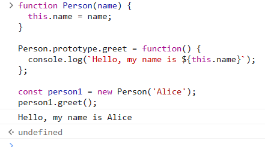
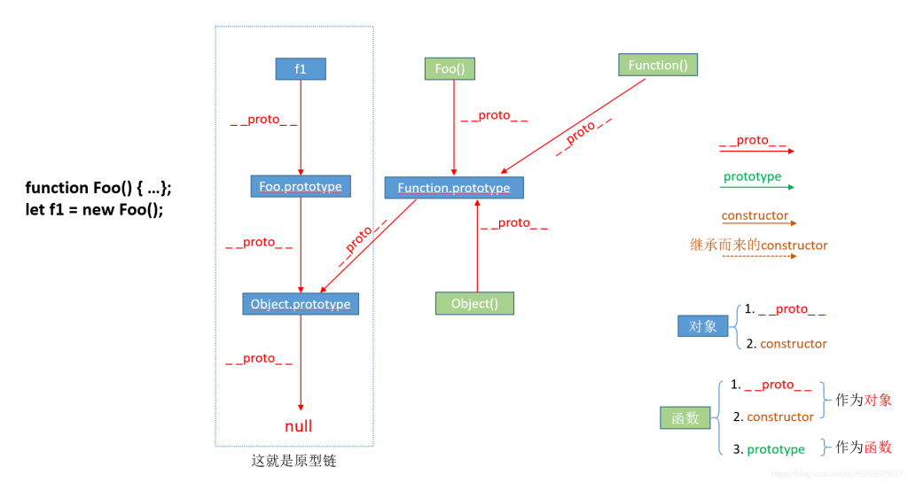
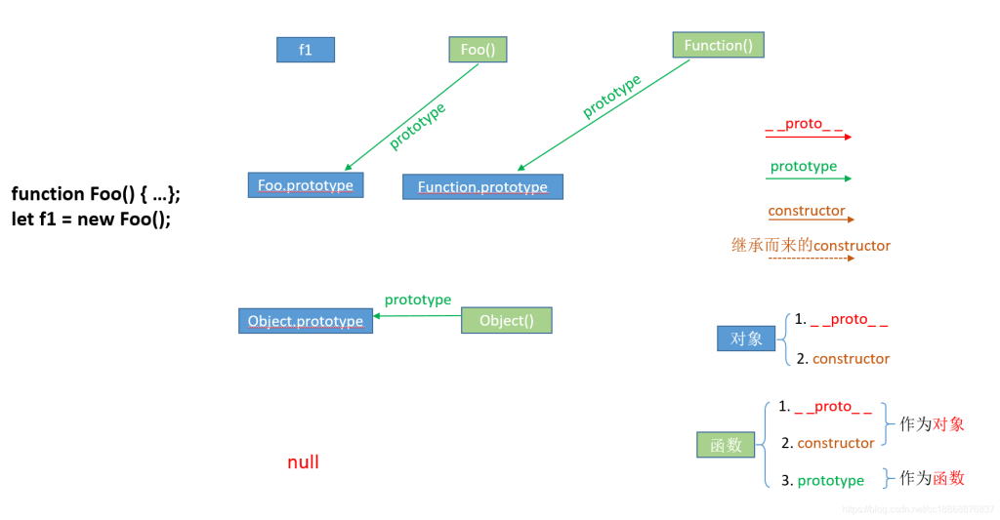
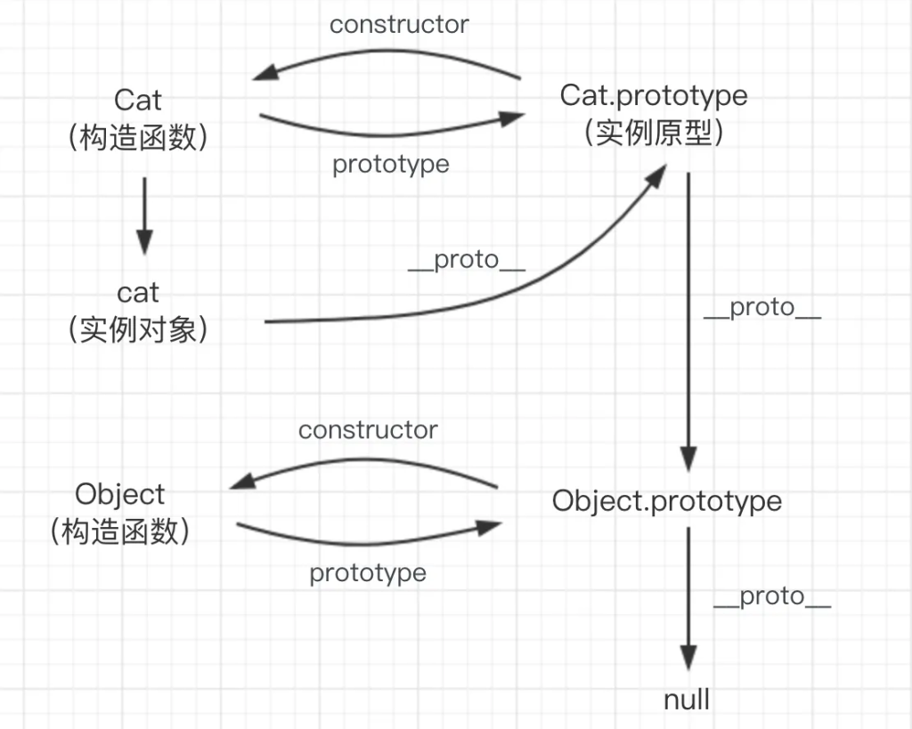
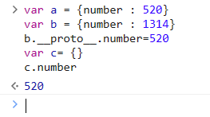
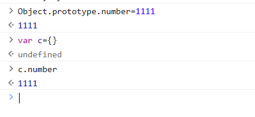
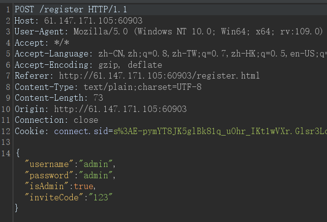
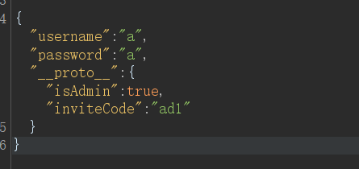

## 继承与原型链

在JavaScript中只有一种结构：对象（连函数也是一种对象）。

每个对象都有一个_**私有属性**_，指向另一个名为“原型”（prototype）的对象。

原型对象也有自己的一个原型，一层一层的直到一个对象的原型为_**NULL**_，Null处于原型链的顶端，或者说原型链的最后一环。

### 继承属性

JavaScript 对象有一个指向一个原型对象的链。

当试图访问一个对象的属性时，它不仅仅在该对象上搜寻，还会搜寻该对象的原型，以及原型的原型，依次层层向上搜索，直到找到一个名字匹配的属性或到达原型链的末尾。

## \_\_proto\_\_和prototype

在`JavaScript`中，每个对象都有一个名为`__proto__`的内置属性，它指向该对象的原型，类似于指针概念。

同时，每个函数也都有一个名为 `prototype`（原型）的属性，它是一个对象，包含构造函数的原型对象应该具有的属性和方法。

下面是一段代码举例

```
function Person(name) {
  this.name = name;
}//一个带参构造函数，传入name并赋值

Person.prototype.greet = function() {
  console.log(`Hello, my name is ${this.name}`);//将prototype上的greet设置为一个打招呼的函数
};

const person1 = new Person('Alice');
person1.greet(); // 输出 "Hello, my name is Alice"
```

当创建了person1的时候，person1里并没有greet，他会沿着原型链搜索并继承prototype中的greet函数。

看看这段代码的执行情况



从这里就可以看出，`prototype`是类`Person`的一个属性，所有用类`Person`进行实例化的对象，都会拥有`prototype`的**全部内容**。

总结：

```
1、prototype是一个类的属性，所有类对象在实例化的时候将会拥有prototype中的属性和方法
2、一个对象的__proto__属性，指向这个对象所在的类的prototype属性
```

我在网上找了两张图

这一张是关于\_\_proto\_\_



可以看到 f1 的\_\_proto\_\_指向了Foo.prototype，因为f1是从Foo这个函数里new的，所以他的原型是foo

Foo()的\_\_proto\_\_指向了Function.prototype，因为他是一个函数，所以指向的函数的原型

下面这张图是关于prototype的



关于prototype，它是**函数所独有的**，它是从**一个函数指向一个对象**，它的含义是**函数的原型对象**

\_\_proto\_\_和prototype的关系可以用下图表示



## 原型链污染

先举个例子

```
var a = {number : 520}
var b = {number : 1314}
b.__proto__.number=520 
var c= {}
c.number
```

这段代码的执行情况如下



这段代码中的 C 我是没有赋值的，但是执行出来是520

原因是，b的proto其实指向的就是object的prototype

在这里将object类里所有对象的number属性的值都设置为了520

效果就如同下面这张图



但是这时输出b的值就是1314，因为在b自己的属性中能够找到number属性

系统只有在找不到的时候才会沿着原型链搜索，

下面来实战演练一下

### CatCTF 2022 wife

源码如下：

```
app.post('/register', (req, res) => {
    let user = JSON.parse(req.body)
    if (!user.username || !user.password) {
        return res.json({ msg: 'empty username or password', err: true })
    }
    if (users.filter(u => u.username == user.username).length) {
        return res.json({ msg: 'username already exists', err: true })
    }
    if (user.isAdmin && user.inviteCode != INVITE_CODE) {
        user.isAdmin = false
        return res.json({ msg: 'invalid invite code', err: true })
    }
    let newUser = Object.assign({}, baseUser, user)
    users.push(newUser)
    res.json({ msg: 'user created successfully', err: false })
})
```

这里可以利用的点就是object.assign这个函数

`Object.assign()` 方法用于将所有可枚举属性的值从一个或多个源对象复制到目标对象。它将返回目标对象。

Object.assign(target, source1，source2，source3.....)

该函数从source1到sourceN中将属性添加或覆盖到target中

```
const object1 = {
  a: 1,
  b: 2,
  c: 3
};
const object2 = Object.assign({c: 4, d: 5}, object1);
console.log(object2.c, object2.d);
// expected output: 3 5相当于是括号内所有变量的集合体组成的object2
```

很明显这道题是要获得admin权限，但是源码里设置了isAdmin为false，就要进行原型链污染

抓个包如下



可以使用proto将所有类的isAdmin设置为true

那么随便注册一个用户的时候都能通过验证



关键就在于

```
"__proto__":{"isAdmin":true}
```

参考链接：

[浅析CTF中的Node.js原型链污染 - FreeBuf网络安全行业门户](https://www.freebuf.com/articles/web/361333.html)

[帮你彻底搞懂JS中的prototype、\_\_proto\_\_与constructor（图解）\_码飞\_CC的博客-CSDN博客](https://blog.csdn.net/cc18868876837/article/details/81211729)

[prototype与\_\_proto\_\_的区别和关系\_prototype和\_\_proto\_\_\_白小白灬的博客-CSDN博客](https://blog.csdn.net/l2345432l/article/details/109639889)
