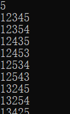
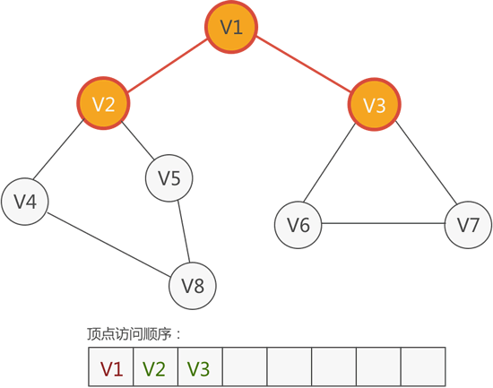
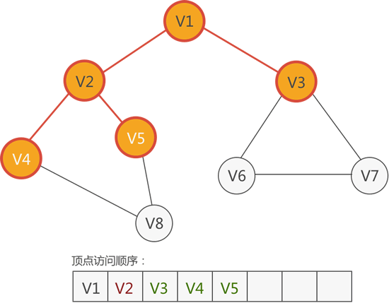
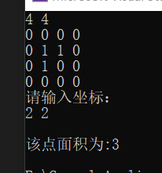

## 前言

在说搜索方式之前

先讲一个简单的问题：**求数的全排列**

比如说，123 的全排列就是：123、132、213、231、312、321

这很简单吧

全排列的个数就是这个数的位数的阶乘，即 123 的全排列的个数是 （ **3！**\=3×2×1）

假如要用 C 语言来写呢？

应该很快就能想到，3个for循环嘛

分别控制位上的数字不重复就行了

那么假如数字更大一点呢？

比如说 **123456789**

一共九位，那么这个数的全排列的个数就是 （ **9！**\= 362880）

实际上这个数字的全排列是能用 9 个for循环写出来

不过那样看着是十分臃肿麻烦的

下面就通过学习一下**深度搜索**，来给这样的问题寻找一下新的思路吧

## 深度优先搜索

_**简单的说就是一条路走到底，碰壁再退回找其他路**_

先用 123 的全排列来举个例子

先开一个数组嘛，int num\[10\]（方便理解，这里就不用0下标了）

**先从第一个格子（num\[1\]）开始：**能放入的数字有三个,分别为1，2，3

**走到第二个格子：**能放入的剩下两个，如果前面放了1，那么现在能放2，3

**走到第三个格子：**能放的只剩下一个了

**最后走到第四个格子：**哦？现在手里没数字了，那就说明一个排列组合已经形成

这个时候你要形成一个新的排列组合，**最简单的方式**是什么呢？

没错，拿起离你最近的数字，**往后面退**，看是否有能交换顺序的数字

（这也应该是高中数学求排列组合的一种基本方式了

有了这个思想，我们尝试将其转化为代码实现👇

```
#include<stdio.h>	
int num[10];//各个位上的数字，默认为零
int hand[10];//手中的牌,下标对应数字，值0就是有，1就是没有
int n;
void func(int count)//cnt表示站在第几个盒子面前
{
	if (count == n + 1)//假如走到最后一位的外面去了，那么说明排列完毕
	{
		for (int i = 1; i <=n; i++)
		{
			printf("%d", num[i]);
		}
		printf("\n");
		return; 
	}

	for (int i = 1; i <= n; i++)
	{
		if (hand[i] == 0)//手上有这张牌，就放进去
		{
			num[count] = i;
			hand[i] = 1;

			//接着进入下一个盒子
			func(count + 1);//递归
			hand[i] = 0;//func在return之后将格子里的数字要拿出来，这步很重要
		}
		
	}
	return;
}
int main()
{
	scanf_s("%d", &n);
	func(1);
	return 0;
}
```

假如我们输入一个5，

那么运行结果就是这样的👇



具体来看看代码吧，（假如要用for循环的话，估计你还没敲到一半，我已经敲完了👌

这段代码的核心就在于**递归**（自己调用自己

好了（这一句话隔着上一句话已经十多分钟了，一直在组织语言如何更准确的表达整个过程😂

5 位数不太好表达，这里还是用 3 位数 123 来分析一下原理

**123 是如何重新排列为 132的？以及递归在这个过程中起到的作用：**

假如我们要求的是 123 的全排列，使用上面的代码，进行逐层分析

首先有至少4个格子叭

我们从第一个格子开始，有一个从 1 到 3 的 3 次循环，选取手中有的牌并且放入格子，然后立马进入第二个格子，这时（第一个格子的循环是仍然存在的，只是停留在了 1 ）

到了第二个格子，又是一个从 1 到 3 的 3 次循环，重复上面的操作，然后进入第三个格子

进入了第三个格子，还是有一个 3 次循环，如果是第一次形成排列（123）

，那么循环从 1 到 3 ，在3的时候刚好结束，然后走到了第四个格子，完成一次排列

**关键点来了，由于这是一个递归过程，完成排列后手里会收回相应格子使用过的牌**

此时，第三个格子的循环已经结束，但是第二个格子的循环还没结束呢

第一个排列的时候，第二个格子的循环刚好走到 2 是吧，接下来就是第三次循环（2是被收回了的），由于第三个格子刚好收回了数字 3，那么第二个格子就放进去 3 ，根据代码，能放进去就会移动到下一个格子，并且开启新的循环选择，第三个格子刚好选到 2 ，那么就形成了新的排列（132）

可能会有疑问，开启第三个格子的新循环时，为什么没有选择到 1 ？

答：仔细观察代码，在循环中，拿回手牌的时间在后一个格子执行完毕之后，第二个格子开始只进行了第二次循环选择了2，剩了一次循环，第二个格子选择完 2 后由于循环并没有结束，所以并没有return回到第一个格子那里，也就是第二个格子的func函数没有执行完毕，因此第一个格子中的 1 是不会被收回的。

（深吸一口气）😫


其实这个代码的核心行也不过 20 行，却饱含深度优先搜索的基本模型

**本质上还是依赖循环，只不过减少了许多不必要的遍历**

**理解的关键就在于：当下应该怎样做？以及深度优先这个词的概念**

一个基本的深度优先搜索的基本模型👇

```
void dfs(int step)
{
	//判断边界
		
	for (int i = 1; i <= n; i++)//尝试每一种可能 
	{

		//继续下一步
		dfs(step + 1);

	}

	//返回
	
}
```

说点题外的，**递归**这个东西可能理解起来会有点抽象

这里简单的举个例子，用于理解递归逻辑

```
#include<stdio.h>	
int n;
void func(int x)
{
	if (x < n)
	{
		int t;
		scanf_s("%d", &t);
		func(x + 1);
		printf("%d", t);
	}
		return;
}
int main()
{

	scanf_s("%d", &n);
	func(0);
	
	return 0;
}
```

上面这段代码，输入一个数字的长度，然后输入相应位数，然后倒序打印

只不过用了递归的思想

就这个例子而言，scanf输入，func递归调用，printf打印，这三步是最关键的

先进入func，录入一个数字之后进入下一个位置，此时printf的函数就被搁置，然后继续录入……

可以看作这样一个过程：**从左到右每一位都执行了func函数，但是都没有执行完毕，只有最后一位录入后，才从最后开始倒着往前结束之前的函数**

用代码来看大致是这样👇

```
        scanf_s("%d", t1);
	{
		scanf_s("%d", t2);
		{
			scanf_s("%d", t3);
			printf("%d", t3);
		}
		printf("%d", t2);
	}
	printf("%d", t1);
```

可以看到虽然 t1 是最早录入的，但是确实最晚打印的，123便倒序为321

## 走迷宫

学习搜索，就离不开迷宫

简单的来说迷宫就是一个二维数组，用数值来区分障碍和道路

上面已经学习了深度优先的搜索方式

这里就简单的实践一下

**题目：**生成一个迷宫，保证迷宫有解，设立起点坐标和目标坐标，一步走一格，求起点到目标的_**最短路径**_

先想想吧，离不开基本模型

直接上代码👇

```
#include<stdio.h>
int a[51][51];
int mark[51][51];
int n, m;//n为行，m为列
int startx, starty, endx, endy;
int min = 999999999;
void func(int x, int y, int step)
{
	int next[4][2] = { {0,1},//向右
		{1,0},//向下走
		{0,-1},//向左走
		{-1,0}//向右走
	};
	int tx, ty, k;
	if (x == endx && y == endy)
	{
		if (step < min)
		{
			min = step;
		}
		return;
	}
	for (int k = 0; k <=3; k++)//模拟上下左右 四种走法
	{
		tx = x + next[k][0];
		ty = y + next[k][1];
		//还要判断是否越界
		if (tx <1 || tx >n || ty <1 || ty > m)
			continue;//越界就不考虑这一种走法了
		if (a[tx][ty] == 0 && mark[tx][ty] == 0)//判断没走过的空地
		{
			mark[tx][ty] = 1;//标记为走过
			func(tx, ty, step + 1);
			mark[tx][ty] = 0;//这两步似曾相识吧
		}
	}
	return;

}
int main()
{

	scanf_s("%d %d", &n, &m);
	for (int i = 1; i <=n; i++)
	{
		for (int j = 1; j <=m; j++)
		{
			int t;
			scanf_s("%d", &t);
			a[i][j] = t;
		}
	}//录入迷宫，0为空地，1为障碍物
	
	scanf_s("%d %d %d %d", &startx, &starty, &endx, &endy);//录入起点和终点
	mark[startx][starty] = 1;
	func(startx, starty, 0);
	printf("%d", min);
	return 0;
}
```

**小结：**深度优先搜索以深度为优先的原则进行遍历，因此会尽可能深入到图的某一分支，直到**无路可走**才回退。这使得深度优先搜索在寻找路径、判断连通性、找连通分量等问题上具有广泛应用。

需要注意的是，深度优先搜索可能陷入**无限循环**，因此在实现时需要考虑避免重复访问节点的情况，例如通过使用一个标记数组来记录节点的访问状态，也就是上面的mark数组起到的作用。

## 广度优先搜索

还是接着用迷宫这个模型来学习

深度优先搜索如其名，一条路走到尽头才回来

那么广度优先的话，肯定就不会一条路走到“死”啦

遇到选择时，会尝试每一种决策

可以想象为，原地转一圈看哪里可以走（写入计划里），按照计划顺序往外走一步，再转一圈后记下这时周围的情况（放到后面的计划里），然后退到上一步，看上一步的计划是否走完，如果没走完就继续上一步剩余的计划，**重要的是**，每走到一新位置，都要原地转一圈，将能走的写入计划，执行计划要按照先后顺序进行

举个例子（先不管坐标的问题，只是理解概念），我在起点先转一圈，发现能走 右边 和 下边，那么我就在计划里写上 right1，down1，之后执行计划向右走一步，发现能走的只有下边，便在计划后边加上 down2 ，那么现在计划就成了 【right1，down1，down2 】，第一个计划就这样完成，因为我们要优先尝试一个点的所有方式，所以这时候要退回到刚刚那个点，去完成刚那个点的剩余计划，于是进行down1计划

网上找了两张图，可以试着理解👇





如果我这里讲的不清楚的话，那就来看看代码的思路叭

广度优先肯定和深度优先是不一样的哦

由于广度优先追求的是一个广度，那么递归思想带来的“一冲到底”肯定就不能使用了

不过在之前的文章中，学习了队列的相关知识

看看上面我所说的《计划》这个词，是否能和队列联系起来呢？

上代码👇：

```
#include<stdio.h>	
struct note //结构体实现队列
{
	int x;
	int y;
	int s;
};
struct note queue[2501];
int head=1, tail=1;
int map[51][51];
int mark[51][51];//用于标记哪些路是走过的
int step = 0;
int main()
{
	int next[4][2] = {
		{0,1},
		{1,0},
		{0,-1},
		{-1,0}
	};//方向数组
	int n, m,flag=0;
	scanf_s("%d %d", &n, &m);//录入行、列
	for(int i=1;i<=n;i++)
	{
		for (int j = 1; j <= m; j++)
		{
			int t;
			scanf_s("%d", &t);
			map[i][j] = t;
		}
	}//录入地图
	int startx, starty, endx, endy;
	scanf_s("%d %d %d %d", &startx, &starty, &endx, &endy);
	mark[startx][starty] = 1;//先标记起点坐标
	queue[tail].x = startx;
	queue[tail].y = starty;
	queue[tail].s = 0;
	tail++;
	
	while (head < tail)
	{
		for (int i = 0; i < 4; i++)//尝试四个方向
		{
			int tx = queue[head].x + next[i][0];
			int ty = queue[head].y + next[i][1];

			if (tx<1 || tx>n || ty<1 || ty>m)//判断是否越界
				continue;
			//如果不越界就加长队列
			
			if (map[tx][ty] == 0 && mark[tx][ty] == 0)//没有障碍物，也没有走过的格子
			{
				mark[tx][ty] = 1;
				queue[tail].x = tx;
				queue[tail].y = ty;
				queue[tail].s = queue[head].s + 1;
				tail++;
			}

			if (tx == endx && ty == endy)
			{
				flag = 1;//只是一个标志变量，减少不必要的循环
				break;
			}
		}
		if (flag == 1)
			break;//说明已经找到了
		head++;//没有找到的话就后移head，继续重复这个过程
	}

	printf("%d", queue[tail - 1].s);
	
	return 0;
}
```

如果队列能够看懂的话，那这段代码应该没什么难度，只是初想可能想不到用队列来解决

**小结：**广度优先搜索从起始节点开始，逐层向外扩展，先遍历距离起始节点较近的节点，然后再访问离起始节点更远的节点。

**与深度优先的不同点：**广度优先搜索遍历过程中不会陷入无限循环，因为每个节点只被访问一次，并且按照距离起始节点的远近顺序进行访问。

## 海岛面积

**题目：**海岛面积

简言之，给一个地图录入海拔，0是海拔为0（就是海洋的意思），大于 0 就是相对应的海拔

给出一个海岛上的坐标，求这个海岛的面积

结合上面的广度优先搜索方式，做这道题就会十分简单了

上代码👇：

```
#include<stdio.h>	
struct note 
{
	int x;
	int y;
};
struct note queue[2501];
int head=1, tail=1;
int map[51][51];
int mark[51][51];//用于标记哪些路是走过的
int step = 0;
int max = 1;
int main()
{
	int next[4][2] = {
		{0,1},
		{1,0},
		{0,-1},
		{-1,0}
	};//方向数组
	int n, m,flag=0;
	scanf_s("%d %d", &n, &m);//录入行、列
	for(int i=1;i<=n;i++)
	{
		for (int j = 1; j <= m; j++)
		{
			int t;
			scanf_s("%d", &t);
			map[i][j] = t;
		}
	}//录入地图
	int startx, starty;
	printf("请输入坐标：\n");
	scanf_s("%d %d", &startx, &starty);
	mark[startx][starty] = 1;//先标记起点坐标
	queue[tail].x = startx;
	queue[tail].y = starty;
	tail++;
	
	while (head < tail)
	{
		for (int i = 0; i < 4; i++)//尝试四个方向
		{
			int tx = queue[head].x + next[i][0];
			int ty = queue[head].y + next[i][1];

			if (tx<1 || tx>n || ty<1 || ty>m)//判断是否越界
				continue;
			//如果不越界就加长队列
			
			if (map[tx][ty] != 0 && mark[tx][ty] == 0)//不能是海洋，而且没走过的
			{

				queue[tail].x = tx;
				queue[tail].y = ty;		
				mark[tx][ty] = 1;//标记这个点
				tail++;
				max++;
			}
		}
		head++;//没有找到的话就后移head，继续重复这个过程
	}

	printf("\n该点面积为:%d\n", max);
	
	return 0;
}
```

可以看出基本的模型吧

程序的执行结果👇



当然，利用深度优先也可以做出这道题

这里就不写代码了，有兴趣自己试试吧（困😩


