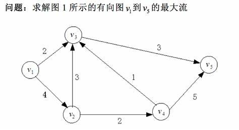
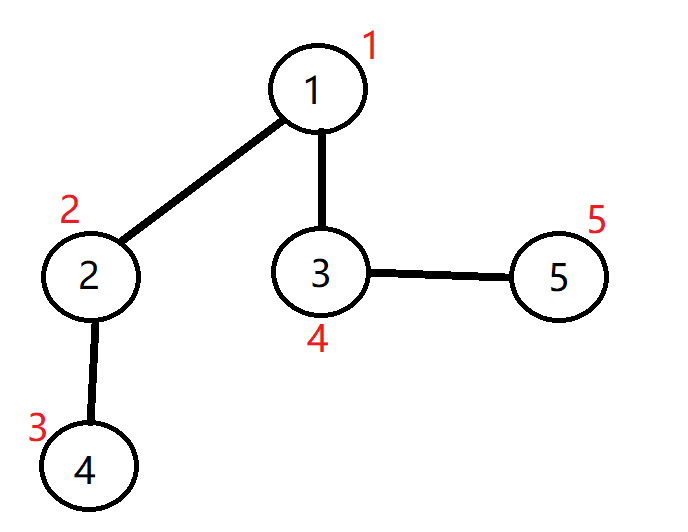
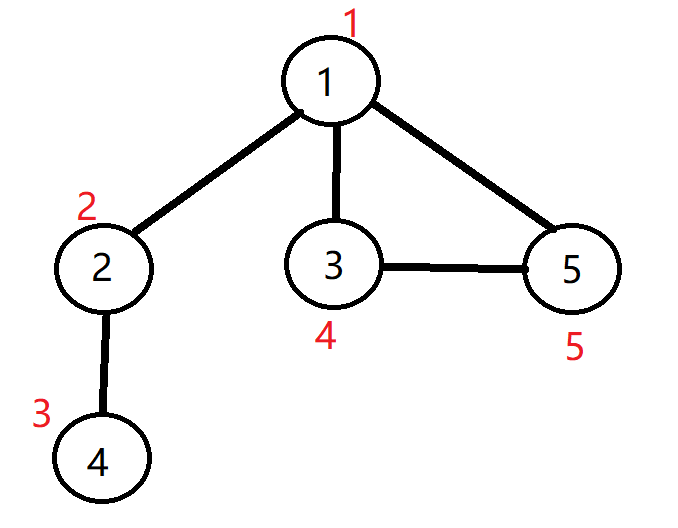
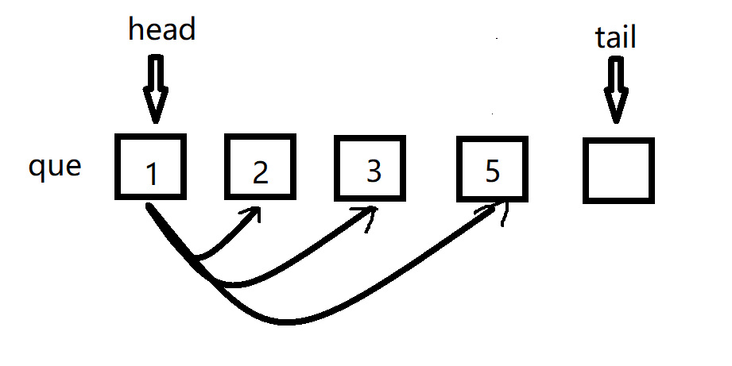
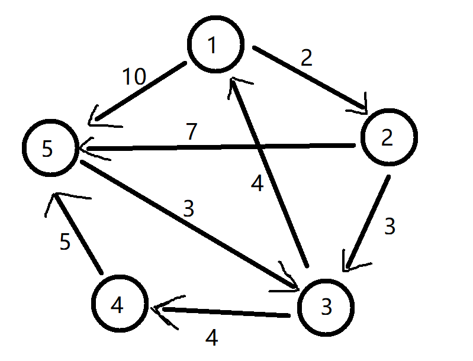
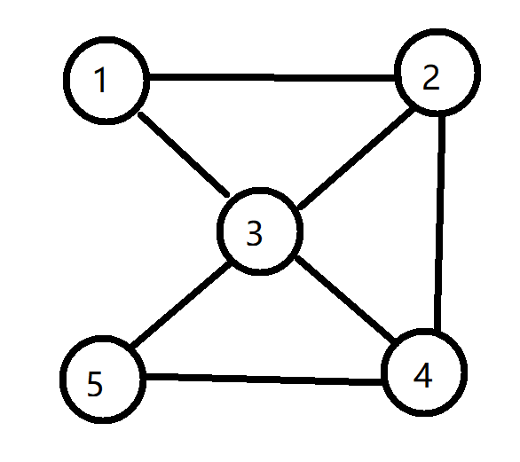

## 深度和广度优先是什么？

之前学习过深度和广度优先搜索

实际上深度和广度都是针对图的遍历而言的

什么是图？

请看下图，这是一个简单的有向图👇



下面是一个简单的无向图👇



简单的说，图就是由**顶点**和**边**组成的，在学离散数学的时候也涉及到了图论的相关知识

那么使用**深度优先搜索**来遍历上面这个无向图，得到的顺序就是相应的图中**红字（时间戳**

下面就这个无向图再来理解一下

### 深度优先的具体过程

首先以一个为走过的顶点作为**起始点**（1号，沿着起始点去访问其他为走过的顶点，先发现顶点 2，那么再以顶点 2，为起始点再去访问顶点 2 能到达的其他顶点，这样就来到了顶点 4。到了顶点 4，发现没有其他顶点可以到达，于是顶点位置就**逐一后退**，又退到了最开始的顶点 1，然后从顶点 3 开始尝试遍历。直到所有的顶点走过了，遍历就结束。

在写代码之前，要先解决一下如何储存图的问题

最常用的方式是用一个二维数组储存图的**邻接矩阵**（具体请自行百度

在邻接矩阵中，例如 a\[i\]\[j\]=1 则说明从顶点 i 到顶点 j 有一条边，为0则表示无边不可达

由于这里用的无向图，那么邻接矩阵是关于对角线对称的

下面是基于深度优先思想对图遍历的代码👇

```
#include<stdio.h>	
int a[51][51];
int book[51];//用于标记
int sum = 0;
int n, m;
void dfs(int cur)
{
	int i;
	printf("%d ", cur);//打印遍历点的编号
	sum++;
	if (sum == n)
		return;
	for (int i = 1; i <= n; i++)
	{
		if (a[cur][i] == 1 && book[i] != 1)
		{
			book[i] = 1;
			dfs(i);
		}
	}
	return;
}
int main()
{
	scanf_s("%d %d", &n, &m);
	for (int i = 1; i <= n; i++)
	{
		for (int j = 1; j <= n; j++)
		{
			if (i == j)
				a[i][j] = 0;//无向图，没有自回点
			else
			a[i][j] = 999999;
		}
	}
	
	for (int i = 1; i <= n; i++)
	{
		int x, y;
		scanf_s("%d %d", &x, &y);
		a[x][y] = 1;
		a[y][x] = 1;

	}
	book[1] = 1;
	dfs(1);
	return 0;
}
```

可以输入一下数据进行验证：

```
5 5
1 2
1 3
1 5
2 4
3 5

运行结果为：1 2 4 3 5
```

用图来表示就是这样



### 广度优先的具体过程

使用广度优先搜索方式来遍历的过程：

首先以一个未访问过的点作为起点，比如顶点 1，将 1 号放入队列，然后将于 1 号相邻且为访问过的点依次放入队列中，如下图👇



接下来再将顶点 2 相邻且未被访问过的顶点 4放入队列，到此所有点都被访问了

当然，这里只记录顶点的访问顺序，如果要运用到实际问题，还得加上一些数据（这里不展开，前面文章写过了

代码实现如下👇

```
#include<stdio.h>	
int n, m;
int a[51][51];
int book[51]={0};
int que[10000], head, tail;
int main()
{
	scanf_s("%d %d", &n, &m);

	for (int i = 1; i <= n; i++)
	{
		for (int j = 1; j <= n; j++)
		{
			if (i == j)
				a[i][j] = 0;
			else
				a[i][j] = 999999;
		}
	}//初始化一下图

	for (int i = 1; i <= m; i++)
	{
		int x, y;
		scanf_s("%d %d", &x, &y);
		a[x][y] = 1;
		a[y][x] = 1;
	}

	head = 1, tail = 1;
	que[tail] = 1;
	tail++;//队列初始化
	book[1] = 1;

	while (head < tail&& tail <=n)
	{
		int cur = que[head];
		for (int i = 1; i <= n; i++)
		{
			if (a[cur][i] == 1 && book[i] == 0)
			{		
				que[tail] = i;
				tail++;
				book[i] = 1;

		

			}
			if (tail > n)
			{
				break;
			}
		}
		head++;
	}
	
	for (int i = 1; i <tail; i++)
	{
		printf("%d ", que[i]);
	}
}
```

数据验证：

```
5 5
1 2
1 3
1 5
2 4
3 5

运行结果：1 2 3 5 4
```

## 城市地图-图的深度优先遍历

直接来例子，下面是一个有向图

记录了城市的路线以及距离



要求从顶点 1 到顶点 5 的最短距离

这个由于路线比较少，看几眼就能出来，但实际上真实的地图会更复杂

那么在这里使用**深度优先搜索**方式来找出**最短路径**

代码👇

```
#include<stdio.h>	
int a[51][51];
int book[51];
int n, m;
int min = 99999999999;
void dfs(int cur,int dis)
{
	if (dis > min)
		return;
	if (cur == n)
	{
		if (dis < min)
			min = dis;
		return;
	}

	for (int i = 1; i <=n; i++)
	{
		if (a[cur][i] != 99999999 && book[i] == 0)
		{
			book[i] = 1;
			dfs(i,a[cur][i]+dis);
			book[i] = 0;
		}
	}
	return;
}
int main()
{
	scanf_s("%d %d", &n, &m);

	for (int i = 1; i <=n; i++)
	{
		for (int j = 1; j <= n; j++)
		{
			if (i == j)
				a[i][j] = 0;
			else
				a[i][j] = 99999999;
		}
	}//初始化图

	for (int i = 1; i <= m; i++)
	{
		int x, y,d;
		scanf_s("%d %d %d", &x, &y,&d);
		a[x][y] = d;//有向图的写法
	}

	dfs(1,0);
	printf("%d ", min);
	return 0;
	
}
```

由于是有向图，那么邻接矩阵肯定就不是对称的了

可以将数组下标作为两点，值作为距离

## 最少转机-图的广度优先遍历

这是一个无向图



假如要从顶点 1 飞到顶点 5，要求最少转机次数的路线

由于不涉及到边的长度，只是涉及到边的个数

那么尝试使用广度优先搜索方式来解决这个问题

代码👇

```
#include<stdio.h>	
int n, m;
int a[51][51];
int head, tail;
int book[51];
struct note
{
	int x;//编号
	int times;//次数
};
struct note que[100001];
int main()
{
	int flag = 0;
	int start, end;
	scanf_s("%d %d %d %d", &n, &m,&start,&end);
	for (int i = 1; i <= n; i++)
	{
		for (int j = 1; j <= n; j++)
		{
			if (i == j)
				a[i][j] = 0;
			else
				a[i][j] = 999999;
		}
	}//初始化数组

	for (int i = 1; i <= m; i++)
	{
		int x, y;
		scanf_s("%d %d", &x, &y);
		a[x][y] = 1;
		a[y][x] = 1;
	}
	
	head = 1, tail = 1;
	que[tail].x = start;
	book[start] = 1;
	tail++;
	
	while (head < tail)
	{
		for (int i = 1; i <= n; i++)
		{
			if (a[que[head].x][i] == 1 && book[i] == 0)
			{
				que[tail].x = i;
				que[tail].times = que[head].times + 1;
				tail++;
				book[i] = 1;
			}

			if (que[tail - 1].x == 5)
			{
				flag = 1;
				break;
			}
		}
		if (flag ==1)
			break;
		head++;
	}
	printf("%d ", que[tail - 1].times);
	return 0;
}
```

数据测试👇

```
5 7 1 5
1 2
1 3
2 3
2 4
3 4
3 5
4 5

运行结果：2
```

当然也可以使用深度优先搜索解决这个问题，但是在这里用广度优先搜索会更快

**广度优先搜索更适用于所有边的权值相同的情况**

**总结：**这篇文章主要还是围绕深度与广度两种搜索方式，结合图论的相关知识，来解决一些实际运用的问题

不过还是存在一些**小疑问**：如何记录最短路径或者最少转机这种的路线？如果开数组的话，由于路线的未知性，可能会造成数组会整的很大（个人猜想）

_**keep moving**_


