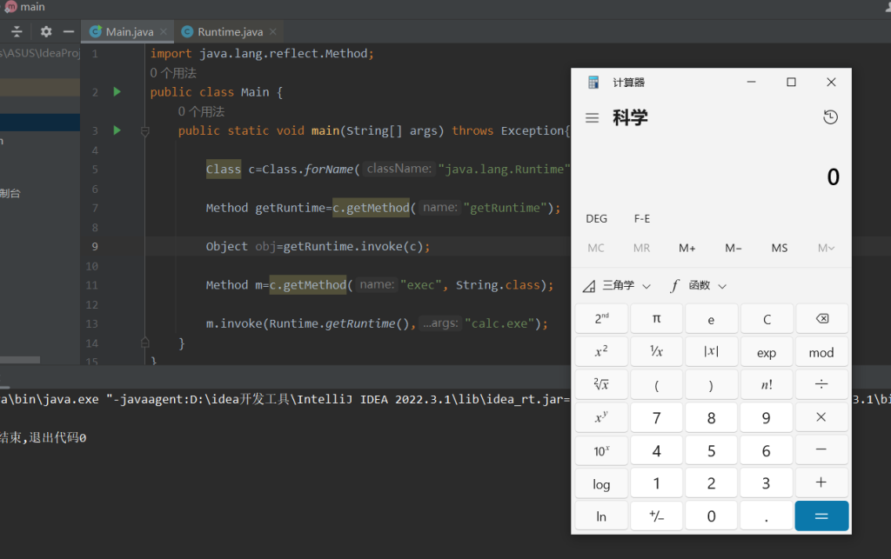
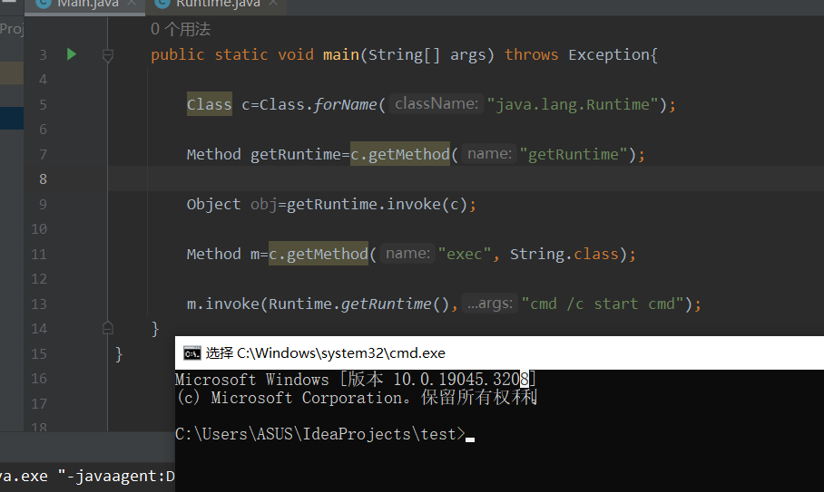
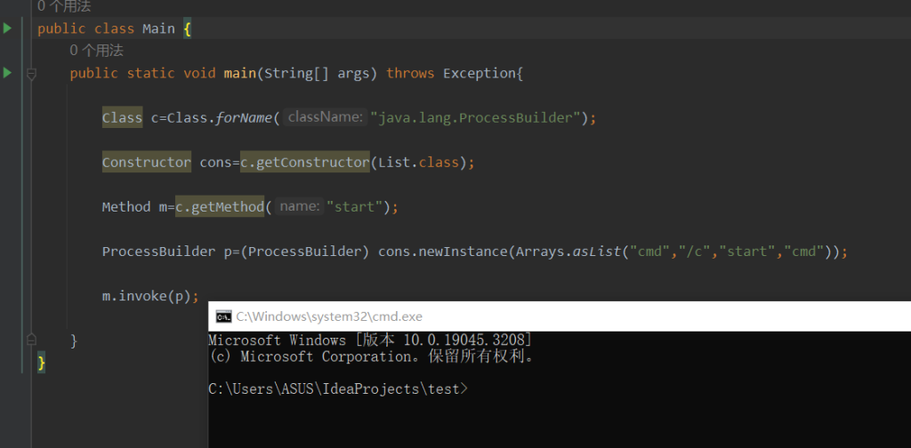
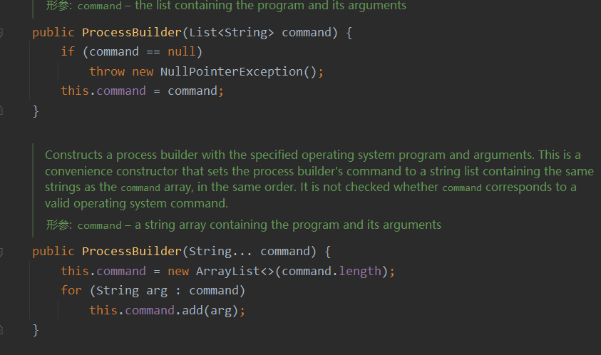

## 什么是反射？

在Java中，反射是指程序在**运行时**动态地获取**类信息**、**构造对象**、**调用方法**和**访问属性**的能力。

换句话说，反射使得程序可以在运行时检查和操作任意一个类的成员变量、方法和构造方法，而不需要在编译时就确定下来。

这里就简单学习一下如何通过**反射**达到执行命令

先看一行简单的代码：

```
Runtime.getRuntime().exec(command); //command是需要运行的命令
```

在 Java 中，`java.lang.Runtime` 是一个表示**运行时环境**的类，它提供了与Java虚拟机的运行时交互的方法。

Runtime则是`java.lang.Runtime`的一个**单例**模式，通过调用Runtime.getRuntime()，可以获取到当前**运行环境**的实例，再通过exec函数进行**执行命令**

**什么是单例？**：可以理解为过一条河只需要最开始建造一座桥就够了，而不是每次过桥都去建造一座桥

而JVM 和运行时环境之间只有一条连接，因此Runtime是单例的

修改一下代码，放入idea中运行一下：

```
Runtime.getRuntime().exec("calc.exe");
```

就能弹出电脑自带的计算器，当然也可以弹其他的cmd、powershell等等

那么在Java中，较为重要的方法：

- 获取类的方法： forName

- 实例化类对象的方法： newInstance //调用默认的无参构造器

- 获取函数的方法： getMethod

- 执行函数的方法： invoke

获取类的方法：这里的类是指java.lang.Class的对象，而非某个实例

obj.getClass() 如果前后存在某个类的实例obj，那么可以通过该实例调用函数来获得实例的类

而 Class.forName 与通过实例获取类不同的是，只需知道这个类的名字就可以，而且方便的是，通过forName获取非系统类并不需要通过import

## 基本思路

**那么如何通过反射来获得Runtime类呢？**

结合文章开头的那一行代码，可以发现使用Runtime类来进行命令执行的基本思路：

首先肯定要获取到Runtime类的实例，这样才能调用getRuntime

然后调用类里的getRuntime函数来获取当前运行环境的实例

最后调用exec，进行命令执行

基本代码👇

```
import java.lang.reflect.Method;
public class Main {
    public static void main(String[] args) throws Exception{

        Class c=Class.forName("java.lang.Runtime");

        Method getRuntime=c.getMethod("getRuntime");

        Object obj=getRuntime.invoke(c);

        Method m=c.getMethod("exec", String.class);

        m.invoke(obj,"calc.exe");
    }
}

```

简单地看看这段代码吧，为了方便看，把每一步都分开了

首先通过Class.forName拿到Runtime类，但是这时c并不是一个Runtime类的实例

然后我们要获取到getRuntime函数，这里用了getMethod方式**通过函数名称就能获得函数**，因为c的属性并不是Runtime，即使method为公有静态也无法通过c来获取

然后就到了 obj 这一步，为什么会有这一步？原因就在于Runtime是**单例**的，其构造方法是私有的，无法通过外部来进行构造，只能通过c来使用getRuntime函数来返回一个Runtime类，使得obj变为Runtime

相当于 Object obj -> Runtime obj

可以本地调试一下👇


此时obj的属性就是Runtime，也就是说成功获取了一个Runtime类的实例

然后再通过这个Runtime类来调用exec函数即可进行命令执行

弹个计算器👇



当然也可以弹个cmd👇



**关于 invoke 函数的使用**

- invoke(Object obj, Object... ，args) 是method 类中的方法，这个方法是一个native方法

- obj: 调用类的实例对象

- args:调用发方法的参数，是可变长度的

- 通过 method.invoke(obj , args ) 可以实现method 方法的调用，并通过args 参数传参

有点类似于倒装的形式哈，以为主体调用对象

## **两个问题**

- 如果一个类没有无参构造，也没有**单例**模式的静态方法，如何通过反射实例该类？

- 如果一个方法是私有的，能否执行？

对于一个问题，需要用到一个新的反射方法 getConstructor，从名字就能看出来，get constructor，拿到构造器，然后使用ProcessBuilder这个类来进行命令执行，因为这个类没有无参构造，也不是单例  

_#ProcessBuilder类：_用于创建和管理子进程的类，提供了一种方便的方式来执行外部命令或启动其他应用程序，这个类中常用的方法：

- `start()`：启动子进程并返回一个 `Process` 对象。

- `command(String... command)`：设置要执行的命令或应用程序。

代码如下👇

```
import java.lang.reflect.Constructor;
import java.lang.reflect.Method;
import java.util.Arrays;
import java.util.List;

public class Main {
    public static void main(String[] args) throws Exception{

        Class c=Class.forName("java.lang.ProcessBuilder");

        Constructor cons=c.getConstructor(List.class);

        Method m=c.getMethod("start");

        ProcessBuilder p=(ProcessBuilder) cons.newInstance(Arrays.asList("calc.exe"));

        m.invoke(p);
        
    }
}

```

首先通过forName获取到ProcessBuilder这个类

然后通过getConstructor获取到他的构造函数，并将构造函数的参数指定为列表形式

然后要获得Process类的启动函数start

最后使用获取到的constructor来实例化ProcessBuilder，进而start执行命令



来看看ProcessBuilder自带的构造函数👇



除了List形式传入参数，还有一个直接传入字符串形式

就第二种形式而言，括号内的参数是 String . . . 这种形式，其实就相当于 String\[ \]

想要通过传入字符串的话，代码就要这样修改👇

```
import java.lang.reflect.Constructor;
import java.lang.reflect.Method;
import java.util.Arrays;
import java.util.List;

public class Main {
    public static void main(String[] args) throws Exception{

        Class c=Class.forName("java.lang.ProcessBuilder");

        Constructor cons=c.getConstructor(String[].class);

        Method m=c.getMethod("start");

        ProcessBuilder p=(ProcessBuilder) cons.newInstance((Object) new String[]{"cmd","/c","start","cmd"});

        m.invoke(p);

    }
}

```

有点差异的就是在newInstance里面

new的String\[ \]其实是一个字符串数组

而newInstance有两种重载模式，如果有参数的话这个参数必须是对象

所以在代码中要进行**类型转换**

**_那么第二个问题，如何调用私有方法？_**

这个问题就涉及到了 **getDeclared系列**的反射

getDeclared与getMethod、getConstructor的区别：

- getMethod只能获得公有方法，包括自身和继承而来的方法

- getDeclaredMethod系列的话，从名字就能看出，能获得**声明**过的方法，但仅限于本类，不包括继承

使用方法的话都大差不差

上面说过，Runtime这个类的构造方法是私有的，在上面只能通过getRuntime函数来返回一个Runtime类

那么如果使用getDeclared，代码👇

```
import java.lang.reflect.Constructor;

public class Main {
    public static void main(String[] args) throws Exception{

        Class clazz = Class.forName("java.lang.Runtime");
        
        Constructor m = clazz.getDeclaredConstructor();
        
        m.setAccessible(true);
        
        clazz.getMethod("exec", String.class).invoke(m.newInstance(), "calc.exe");

    }
}

```

首先肯定要获得Runtime类

然后通过getDeclaredConstructor来获取Runtim类的无参构造

这里使用了一个setAccessbile的方法，以为Runtime的构造是私有的，需要重新设置他的作用域，否则是不能调用的

然后就能直接通过constructor来newinstance，效果和通过类来newinstance是一样的

不过这段代码在我电脑上跑不起来，可能是jdk版本的原因，在setAccessible这里报了错误，不过代码应该是没有问题的

_**学习参考：**_

**《Java安全漫谈》-反射篇**
