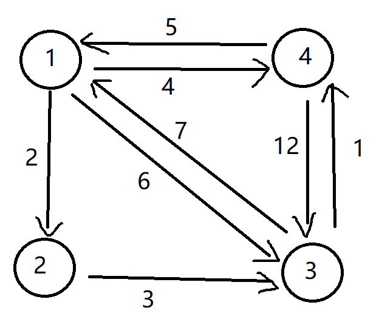
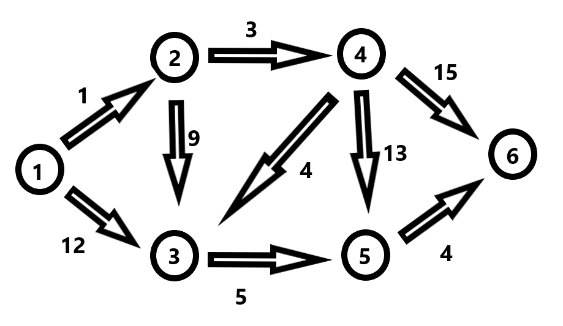
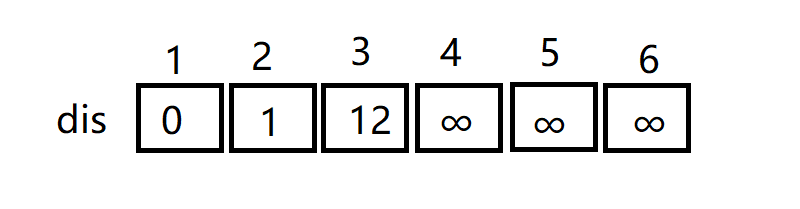
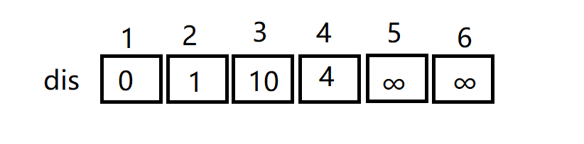
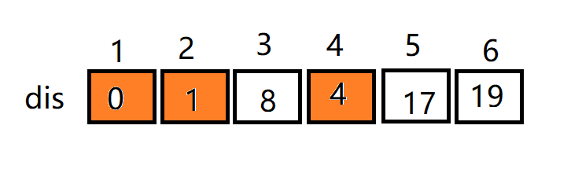
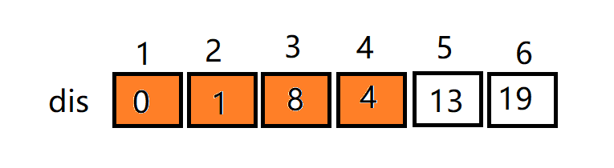
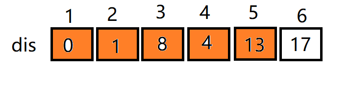
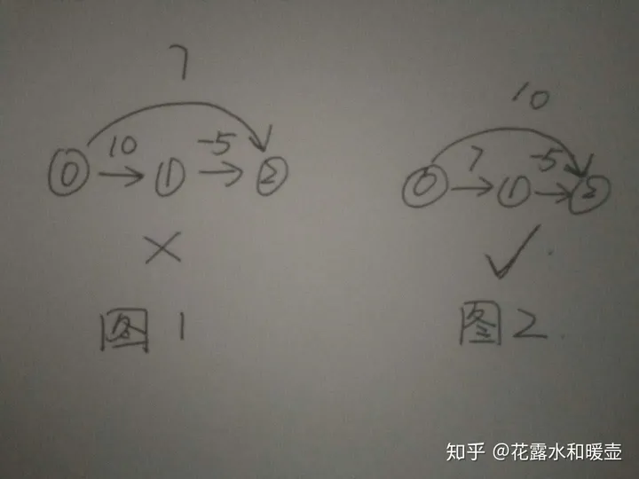
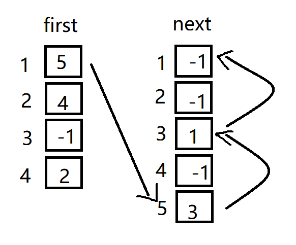
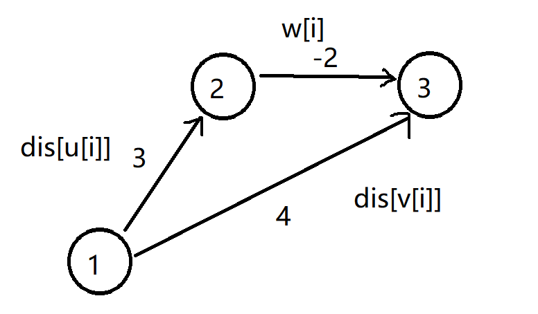

在之前的文章写过两种搜索方式

深度优先搜索 and 广度优先搜索

然后用这两种搜索方式来解决了图的一些问题

这里学习几种新的算法

## Floyd-Warshall

简单了解一下👇

**介绍：**Floyd-Warshall算法是有Floyd于1962年提出，其可以计算有向图中**任意**两点之间的**最短路径**，此算法利用**动态规划**的思想将计算的时间复杂度降低为 O(v^3) 【在这里我就简称 FW算法 了😋

动态规划是后面的问题了，先了解一下这个算法的逻辑就好

先来一个有向图👇



根据以往的经验，要求两个点的距离变短，只能引入第三个点

比如 a→b 引入顶点k，则变为 a→k→b

**比较引入前后的距离大小，来判断这个点是否引入有效，有效则更新最短路径**

请结合上图，顶点 1 到顶点 3，引入顶点 2 则得到最短路径

不过有的时候可能要引入的不止一个点，而是两个点，三个点……

比如说图上的顶点 4 到顶点 3，要引入顶点 1 、顶点 2 ，才能得到最短路径

写代码时，同样也要录入图和边

以下标代表顶点，值代表边长

基于这种引入点的思想，写出一个代码模型👇

```
for (int i = 1; i <= n; i++)
	{
		for (int j = 1; j <= n; j++)
		{
			if (a[i][j] > a[i][1] + a[1][j])
				a[i][j] = a[i][1] + a[1][j];
		}
	}
```

从代码中可以看出，我们以顶点 1 为引入点，来获得其余点的最短距离

当然，如果要获得全部点的最短距离，那就得把所有点都引入一遍

整体代码如下👇

```
#include<stdio.h>	
int n, m;
int a[51][51];
int main()
{
	scanf_s("%d %d", &n, &m);
	for (int i = 1; i <= n; i++)
	{
		for (int j = 1; j <= n; j++)
		{
			if (i == j)
				a[i][j] = 0;
			else
				a[i][j] = 99999999;//假设无穷远
		}
	}
	for (int i = 1; i <= m; i++)
	{
		int x, y, dis;
		scanf_s("%d %d %d", &x, &y, &dis);
		a[x][y] = dis;//有向图这样写
	}

	//FW算法核心代码就这三个循环嵌套
	for (int k = 1; k <= n; k++)
	{
		for (int i = 1; i <= n; i++)
		{
			for (int j = 1; j <= n; j++)
			{
				if (a[i][j] > a[i][k] + a[k][j])
					a[i][j] = a[i][k] + a[k][j];
			}
		}
	}

	for (int i = 1; i <= n; i++)
	{
		for (int j = 1; j <= n; j++)
		{
			if (i != j)
			{

				printf("%d 到 %d 的最短距离是 %d\n", i, j, a[i][j]);
			}
		}
	}
	return 0;
}
```

ok，来具体剖析一下代码

引入一个点的时候好理解吧

那么引入多个点的时候，如何来理解代码呢？


拿上面那个图的顶点 4，到顶点 3，来举例子

很明显顶点 4 到顶点 3的直线距离为 12，要引入顶点 1和2，这应该看两眼就能得出的结论

但是计算机不会看，只能执行代码

首先，顶点 4 到顶点 1的最短距离是能求的吧，用FW算法能得出距离是5

然后顶点 4 到顶点 2的最短距离也是能求的（引入点 1），得出是7

那么要求顶点 4到顶点 3的时候，就尝试以另外几个点为跳板引入

其实最后实际上求得的是从顶点 4 到顶点 3，以顶点 2 为引入点获得的的**最短距离**

其他的点以此类推，核心代码就是三个**嵌套的for循环**，最外层为**引入点（跳板）**，内部为比较

## **Dijkstra**

名字奇奇怪怪的。。。

这部分学习一个**指定**一个点到**其余各点**的**最短路径**，也叫做“**单源最短路径**”

例如求下图的 1 号顶点到其余各点的最短路径👇



和上面的FW算法一样，还是用二维数组储存点和边的关系

不过要另外开一个一维数组，来储存**指定点**和**目标点**的距离

这里以顶点 1为指定点，求到其他个点的最短距离

那么开一个数组，先进行**模糊储存**



目前dis数组中的数据都是**估计值**

dis\[2\]=1，则说明从顶点 1 到顶点 2 的**模糊距离**为1（是直接判断的两点之间的距离，并没有经过第三点），两点无法直达则默认为**无限远**

那么现在，dis\[2\]就成为了一个**确切值**，因为随意引入一个新点，距离都会大于两点**直达**

能够发现，dis\[3\]=12，而dis\[2\]+a\[2\]\[3\]=1+9=10<12，那么说明从点1到点3能够通过点2作为跳板，缩短距离（专业术语叫“松弛”）

那么以顶点 2 为跳板**松弛**过后，dis数组为：



因为刚刚已经利用顶点 2 做了一次跳板，那么就不能再利用顶点2了，要尝试以其他点为跳板进行**松弛**

上面忘了说，选跳板也是有顺序的，应该**先近后远**的顺序（以离目标点最近的开始

这样来看，下面就要以顶点4为跳板进行松弛

可以看到 dis\[3\]=10 < dis\[4\]+a\[4\]\[3\]=8

那么 dis\[3\]的值更新为了8，又因为顶点4又对顶点5、6有出边，因此顶点5、6也更新了估计值

为了区分**确切值**和**估计值**，用了颜色区分，橙色代表确切值👇



**_何时为确切？何时为估计？：_**

由于跳板的选择顺序是**由近及远**的，那么跳板的**直达距离**肯定是两点之间最短的

具体请以最开始的那个dis数组图为例子，顶点 1能直达的点只有顶点2、3、4，其中到顶点 2的距离又是最短的（短于点1到点3、4的直达距离），那么这时就**有可能**经过顶点 2，使得从点1到其他点的路径**缩短**

因为点1到点2的直达距离是最短的，就不可能通过其他点做跳板缩短距离咯（三角形的两边大于第三边😛）那么这时到点 2 的距离就成为了确切值，其他没有做过跳板的仍然为估计值

为何不**由远及近**选取跳板？ 答：少做无用功

**过程简言之：**每次找离源点**最近**的一个点，然后以点为跳板扩散，作为跳板的点一定是与目标点两点之间直达最近的

那么下面按照距离，以顶点 3为跳板，得到下图👇



再以顶点 5为跳板，得到下图👇



那么最后到要使用顶点 6 为跳板，不过因为在单向图中，顶点 6，并没有出边，代入算法后他自身就是**确切值**

**小总结：**Dijkstra算法是单源的（从一固定点到其余点），那么在储存图的时候要进行**模糊处理**，能直达的储存直达距离，不能直达的就模糊处理为**正无穷远**，并在源点能直达的点中按照**由近及远**的顺序选取跳板，利用跳板来尝试缩短源点到其余点的距离。**跳板是除开源点，每一个点都要做一遍的。**

Ok，算法的思路就讲到这里，下面是代码实现👇：

```
#include<stdio.h>	
int a[51][51];
int n, m;
int dis[51];
int book[51];
int main()
{
	int inf = 99999999;//设置inf为正无穷大
	scanf_s("%d %d", &n, &m);
	for (int i = 1; i <= n; i++)
	{
		for (int j = 1; j <= n; j++)
		{
			if (i == j)
				a[i][j] = 0;
			else
				a[i][j] = inf;//模糊处理为无限远，即不可到达
		}
	}//初始化图

	for (int i = 1; i <= m; i++)
	{
		int x, y, d;
		scanf_s("%d %d %d", &x, &y, &d);
		a[x][y] = d;//单向图写法
	}

	for (int i = 1; i <= n; i++)
	{
		dis[i] = a[1][i];//顶点1到个点的距离用数组储存起来
	}

	book[1] = 1;
	int turning=1;//这里的数值无所谓，反正下面选取跳板时会更新

	//下面为Dijkstra核心算法
	for (int i = 1; i <= n-1; i++)//注意是到n-1，即除了源点，其余点都要做一次跳板
	{
		int  min = inf;

		for (int j = 1; j <= n; j++)
		{
			if (book[j] == 0 && dis[j] < min)
			{
				min = dis[j];
				turning = j;
			}
		}//每次找到离顶点1最近的那个点，即turning，下面要尝试以turning为跳板引入

		book[turning] = 1;
		for (int i = 1; i <= n; i++)
		{
			if (a[turning][i] < inf)//假设turning到点i直线可达
			{
				if (dis[i] > dis[turning] + a[turning][i])
				{
					dis[i] = dis[turning] + a[turning][i];
				}
			}
		}

	}

	
	for (int i = 1; i <= n; i++)
	{
		printf("%d ", dis[i]);
	}

	
	
	return 0;

}
```

可以输入数据进行验证：

```
6 9
1 2 1
1 3 12
2 3 9
2 4 3
3 5 5
4 3 4
4 5 13
4 6 15
5 6 4

运行结果：0 1 8 4 13 17
```

**缺点：**Dijkstra算法是不能解决带有**负权边**的图的

原因看下面的图👇：



如果是图1 的情况，首先顶点 0，到顶点1、2能直达有距离，且点0→点2的距离是最短的，那么根据算法，点0→2这条线就应该是确切的，点2又没有出边，那么点2就做不了跳板被忽略，就该轮到点1做跳板，但是引入点1后，又会使得原本是确切值的点0→2 改变，这就与算法逻辑矛盾，这仅是三个点，点多了就会出现更多错误

在时间复杂度上，可以使用三个一维数组实现**邻接表**来代替二维的邻接矩阵，这样会使运行速度快一些

邻接表的实现方式👇：

```
        int n, m, i;
	int u[6], v[6], w[6];//两点及其距离

	int first[5], next[5];//first要大于n的最大值，next要大于m的最大值

	scanf_s("%d %d", &n, &m);

	for (int i = 1; i <= n; i++)
		first[i] = -1;//设置成无法引用的下标

	for (int i = 1; i <= m; i++)//对每一条边进行录入
	{
		scanf_s("%d %d %d", &u[i], &v[i], &w[i]);
		next[i] = first[u[i]];
		first[u[i]] = i;//这两步至关重要
	}
```

以邻接表方式储存，后储存的边会在先储存的边上面，**即更先访问到后储存的点和边**

first\[u\[i\]\]保存顶点为u\[i\]的第一条边（最新的那条），next\[i\]用于储存第一条边后面的边

以这样的方式访问👇，比如说找到1号顶点的第一条边（其实是最后输入的），剩下的边都可以在next数组里找到

```
	for (int i = 1; i <= n; i++) 
	{
		k = first[1];
		while (k != -1)
		{
			printf("%d %d %d", u[i], v[i], w[i]);
			k = next[k];
		}
	}
```

假如输入以下数据验证：

```
4 5
1 4 9
4 3 8
1 2 5
2 4 6
1 3 7
```

那么找到顶点1的第一条边之后，剩余的边都可以在next数组里找到



邻接表有点抽象哈，再琢磨琢磨这个东西吧😩

## Bellman-Ford

这是一个无论是思想还是代码实现，都堪称**完美**的最短路径算法！😬

能解决Dijkstra算法由于代码逻辑造成的**负权边问题**！

不过仍然是**单源**

核心代码只有四行👇：

```
	for (int k = 1; k <= n - 1; k++)
		for (int i = 1; i <= m; i++)
			if (dis[v[i]] > dis[u[i]] + w[i])
				dis[v[i]] = dis[u[i]] + w[i];
```

思想还是要借助**_跳板_**

不过这里算法更注重的是**边**，而不是点

开三个数组为U、V、W，分别储存起点、终点、边长

核心代码可以理解为根据 **三角形的两边之和大于第三边** ，来缩短距离



对于核心代码循环中的 K，我的理解还是作为**跳板**（资料上解释的是：n个点之间最多有n-1条单向边，要进行n-1次循环来对每条边进行**松弛**），因为一定要三个点才能形成三角形嘛

每实施一次**松弛**操作，都会有一些顶点求得其最短路径，变为**确切值**，最坏的情况就是进行了n-1次松弛过后才使所有点完成**松弛**

具体代码如下👇：

```
#include<stdio.h>	
int dis[10];
int u[10];
int v[10];
int w[10];
int n, m;
int inf = 99999999;
int main()
{
	scanf_s("%d %d", &n, &m);
	for (int i = 1; i <= m; i++)
	{
		scanf_s("%d %d %d", &u[i], &v[i], &w[i]);//储存两点以及距离
	}
	
	for (int i = 1; i <= n; i++)
		dis[i] = inf;//初步设置为无限远
	dis[1] = 0;
	
	for (int i = 1; i <= n - 1; i++)
	{
		for (int j = 1; j <= m; j++)
		{
			if (dis[v[j]] > dis[u[j]] + w[j])
				dis[v[j]] = dis[u[j]] + w[j];
		}
	}

	for (int i = 1; i <= n; i++)
	{
		printf("%d ", dis[i]);
	}
	return 0;

}
```

可以输入数据验证：

```
5 5 
2 3 2
1 2 -3
1 5 5
4 5 2
3 4 3

运行结果：0 -3 -1 2 4
```

这种算法虽然精简，时间复杂度却是要比Dijkstra要高的（省力不省时罢），不过也是可以进行优化

上面说到，最坏的情况就是对n-1条边进行松弛，那么也可能没有那么多边

可以简单地在循环中插入一个check变量，查看是否进行过松弛，如果没有，就直接结束算法，避免多余的循环

要检测一个图是否含有**负权回路**，那么只需要在所有边**完全松弛**过后，再遍历一次dis数组，查看是否存在“**_三角形的斜边大于另外两边之和_**”的情况

例如👇：

```
	for (int i = 1; i <= n - 1; i++)
	{
		for (int j = 1; j <= m; j++)
		{
			if (dis[v[j]] > dis[u[j]] + w[j])
			{
				dis[v[j]] = dis[u[j]] + w[j];
			}
		}
	}

	for (int i = 1; i <= m; i++)
	{
		if (dis[v[i]] > dis[u[i]] + w[i])
			printf("含有负权回路");
	}
```

**思考一下：**上面说过，在进行松弛的过程中，会有一些边变为**确切值**，这些确切值是不会改变的，但是在后续松弛的过程中还是会对已确定的边进行判断，那么这里就会浪费时间。**那么是否可以考虑每次仅对估计值变化的顶点的出边进行松弛操作呢？**

## Bellman-Ford的队列优化

在上一部分简述BF算法的时候留下了一个思考

在这里展开说明一下

看标题名字就知道，和**队列**知识离不开

**优化后的效果大致如下：**

每次选取队列的首顶点u，对u点的所有出边进行**松弛**操作，例如有一条u→v的边，如果这条边使得源点到v点的距离能缩短，且v点不在队列中，就将v点加入队尾。将u点的所有出边进行**松弛**过后，就将u点出列，对队列中后面的点继续进行同样操作。

下面是代码实现，尝试用邻接表来储存图👇：

```
#include<stdio.h>	
int dis[6];
int u[8],v[8],w[8];//根据实际情况设置，要比m大1
int first[6], next[8];//first是储存点的，next是储存边的，first要比n大1，next要比m大1
int book[6];//用于标记

int que[1001];
int head = 1, tail = 1;//设置队列

int inf = 99999999;
int main()
{
	int n, m;
	scanf_s("%d %d", &n, &m);
	for (int i = 1; i <= n; i++)
	{
		dis[i] = inf;
	}
	dis[1] = 0;

	for (int i = 1; i <= n; i++)
		first[i] = -1;
	for (int i = 1; i <= n; i++)
		book[i] = 0;

	for (int i = 1; i <= m; i++)
	{
		scanf_s("%d %d %d", &u[i], &v[i], &w[i]);
		//邻接表
		next[i] = first[u[i]];
		first[u[i]] = i;
	}

	que[tail] = 1;
	tail++;
	book[1] = 1;

	while (head < tail)
	{
		int k = first[que[head]];//注意k是顶点为que[head]的第一条边

		while (k != -1)//先对一个点的所有出边进行松弛
		{
			if (dis[v[k]] > dis[u[k]] + w[k])
			{
				dis[v[k]] = dis[u[k]] + w[k];//更新距离

				if (book[v[k]] == 0)//0表示边的编号不在队列中，把v[k]顶点入队
				{
					que[tail] = v[k];
					tail++;
					book[v[k]] = 1;
				}

			}

			k = next[k];
		}

		book[que[head]] = 0;//边出队，并重置为0，因为其他点可能会用到
		head++;

	}
	
	for (int i = 1; i <= n; i++)
	{
		printf("%d ", dis[i]);
	}

	return 0;
}
```

关键就在于要有一个数组来判断重复，即上面的book

因为同一个顶点在队列中多次出现是毫无意义的，那样就相当于Bellman-Ford没优化了。。。

**总结一下：**队列优化过后的BF算法，其实和广度优先搜索方式十分类似，差异就是优化过后的点出列后可能会再次入列，这是广度优先不具备的。

**如何判断是否有负环**：如果一个点入列的次数超过n次，那么肯定存在负环，因为经过负权边总能使得距离变短

最短路径的问题就先学习到这里，后面有机会再学习一下其他的算法😩


