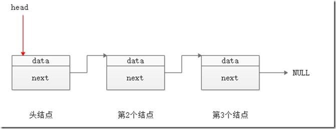

## 队列

队列的概念：只允许在一端进行插入数据操作，在另一端进行删除数据操作的**特殊线性表**

队列的两端：

- 队尾：进行插入操作的一端称为**队尾**

- 队头：进行删除操作的一端称为**队头**

先举一个例子：

给出一段序列： 6 3 1 7 5 8 9 2 4

对这段序列进行以下操作：删除第一个数字，将第二个数字移到末尾，删除第三个数字，将第四个数字移到末尾……以此类推，直到剩下最后一个数字，并且将其删除，最后按照删除的顺序将被被删除的数字连成一段新序列，求这段序列？

那么要解决这个问题，数组肯定是离不开的

和队列的概念联系起来，一端要插入，一端要删除，那么这个数组就要开大一点

```
int a[101]={6,3,1,7,5,8,9,2,4};
```

并且我们需要两个变量来记录**队首**和**队尾**（可以理解为指针吧

```
head=0;
tail=10;
```

序列中只有九个数字，但是tail设置成 9 是为了节约时间

那么队列的操作具体如何进行的呢？

就这道题而言，先将第一个队首输出队，head后移指向新的队首，第二个队首会被移到末端，并且head和tail都同时后移

基本的代码思路如下：

```
#include<stdio.h>	
int main()
{
	int a[101] = { 6,3,1,7,5,8,9,2,4 };
	int head = 0;
	int tail = 9;
	while (head < tail)
	{
		printf("%d ", a[head]);
		head++;

		a[tail] = a[head];
		tail++;
		head++;

	}
	return 0;
}
```

当然代码也可以改进为用**结构体**

就像这种方式稍微包装一下：

```
struct queue
{
   int data[1000];
   int head;
   int tail; 
}
```

## 栈

栈可以理解为一个只有一端开口的竖直乒乓球筒，想要拿到最下面的球，你先把上面的球一个个拿出来

换而言之，栈的特点就是：**先进后出**，最先放进去的球要最后才能拿出来

同样举个例子：

要判断一段字符串是否回文，应该怎样设计？

- “abcba” 是回文，"abba" 是回文，"abca" 就不是回文

那么常见的思路就是创建一个一维数组，并从两边向中间靠近比较

基本思路：

```
#include<stdio.h>	
#include<string.h>	
int main()
{
	char s[100];
	scanf_s("%s", s, 100);
	int len = strlen(s);
	int mid = len / 2;
	for (int i = 0; i < len; i++)
	{
		if (s[i] != s[len - i - 1])
		{
			printf("No");
			return 0;
		}
	}
	printf("Yes");
	return 0;
}
```

当然，这段代码没有涉及到栈的利用，只是简单的首尾向中间靠拢比较字符而已

假如我们要利用栈的思想去解决这道题的话

代码得这样写👇

```
#include<stdio.h>	
#include<string.h>	
int main()
{
	char a[101], s[101];
	scanf_s("%s", a, 101);
	int len = strlen(a);
	int mid = len / 2 ;
	int top = 0;
	int next=mid;
	for (int i = 0; i < mid; i++)
	{
		s[++top] = a[i];
		
	}//将前面一半的字符串放入栈中
	if (len % 2 != 0)
		next = mid + 1;//奇偶对另外一段的起始下标有影响的
	for (int i = next; i < len; i++)
	{
		if (a[i] != s[top])
			break;
		top--;
	}
	if (top == 0)
		printf("Yes");
	else
		printf("No");

	return 0;
}
```

这个例子比较简单

那么来看看洛谷上的题吧

## 有效的括号

题目：**有效的括号**

给定一个只包括 `'('`，`')'`，`'{'`，`'}'`，`'['`，`']'` 的字符串 `s` ，判断字符串是否有效。

- 左括号必须用相同类型的右括号闭合。

- 左括号必须以正确的顺序闭合。

- 每个右括号都有一个对应的相同类型的左括号。

- `1 <= s.length <= 104`

示例：

"( \[ { } ( ) \] )" 是能匹配成功的，而“( \[ ) \]”是不能匹配成功的

先捋一下思路

结合条件的第二点和示例可以看出，括号的闭合是就近原则的，意思是左括号会和最近的右括号进行匹配，如果类型不同则字符串为无效

那么根据这个思路可以写出这样的代码👇：

```
#include<stdio.h>	
#include<string.h>	
char s[10001];
char a[10002];
char pairs(char c);//返回对应括号的函数
int main()
{
	scanf_s("%s", s, 10001);
	int len = strlen(s);
	int top = 0;
	if (len % 2 == 1)
	{
		printf("No");
		return 0;
	}//括号都是一对一对的，长度肯定是偶数
	for (int i = 0; i < len; i++)
	{
		if (s[i] == '(' || s[i] == '[' || s[i] == '{')
		{
			a[top] = s[i];//将左括号放入栈顶
			top++;
		}
		else if(s[i] == ')' || s[i] == ']' || s[i] == '}')//右括号的情况
		{
			char c = pairs(s[i]);
			if (a[top-1] == c)
			{
				top--;//就近匹配，如果成功就退栈
			}
		}
		else//有非括号字符
		{
			printf("输入有误");
			return 0;
		}
	}
	if (top == 0)//查看栈是否全部退出，即是否有括号剩余没有匹配的
	{
		printf("Yes");
	}
	else
	{
		printf("No");
	}
}
char pairs(char c)
{
	if (c == ')')
		return '(';
	if (c == ']')
		return '[';
	if (c == '}')
		return '{';
	return 0;
}
```

除了栈思想，这道题还有另外一个思路

可以尝试使用字符串替换的方式

Python和PHP都有对应的replace函数

这里用python来写一些另外的思路，也算是投机取巧罢

```
def check(s):
    while '()' in s or '[]' in s or '{}' in s :
        s=s.replace('()','')
        s=s.replace('[]','')
        s=s.replace('{}','')
    return s==''

if __name__=="__main__":
    s=input()
    print(check(s))
```

## 纸牌游戏

这里就简单的描述一下游戏规则

两个人分别为 A 和 B

两人手里分别有 6 张牌，这里约定牌面大小为 1~9

由 A 先出一张， B 再出一张，这样的顺序进行出牌

如果某人打出的牌与桌上某张牌大小一样，那么即可获得两张牌及其中间打出的牌，并放到自己手牌的末尾

当任意一人手牌出完时，对手获胜

先简单的思考一下吧

解决这个题需要用到上面的知识，即队列和栈

直接上代码👇：

```
#include<stdio.h>	
#include<string.h>	
struct queue
{
	int data[1000];
	int head ;
	int tail;
};
struct stack 
{
	int data[10];
	int top;
};
int main()
{
	int t;
	int number[10];//用桶来记录桌上的牌和牌数
	memset(number,0,sizeof(number));//先初始化为0
	struct queue a, b;//两个队列
	struct stack s;//栈
	a.head = 0, a.tail = 0, b.tail = 0, b.head = 0;//初始化队列
	s.top = 0;
	for (int i = 0; i < 6; i++)
	{
		scanf_s("%d", &a.data[a.tail]);
		a.tail++;
	}//录入a的手牌
	for (int i = 0; i < 6; i++)
	{
		scanf_s("%d", &b.data[b.tail]);
		b.tail++;
	}//录入b的手牌
	while (a.tail > a.head && b.tail > b.head)
	{
			t = a.data[a.head];//先取出a的手牌
		if (number[t] == 0)//判断桌上是否有相同的牌，这里是没有
		{
			a.head++;	
			s.top++;
			s.data[s.top] = t;//将a的牌入栈
			number[t]=1;
		}
		else//假如a出牌后，能够进行吃牌
		{
			a.head++;
			a.data[a.tail] = t;
			a.tail++;
			while (s.data[s.top] != t)
			{
				a.data[a.tail] = s.data[s.top];
				number[s.data[s.top]]=0;//将栈顶的数标记为0，因为要退栈了
				a.tail++;
				s.top--;
			}//这个循环的作用是依次退出相应的牌，并补到手牌末端
			a.data[a.tail] = s.data[s.top];
			number[s.data[s.top]] = 0;
			a.tail++;
			s.top--;//由于上面这个while到最后一个数字就停了，这里在另外加一段代码，使得吃牌完毕
		}

		if (a.head == a.tail)//这时a的手牌已经打完了，
			break;
		//下面到b出牌了，基本思路和上面的差不多，cv一下，将a改成b就可以了
		t = b.data[b.head];
		if (number[t] == 0)
		{
			b.head++;	
			s.top++;
			s.data[s.top] = t;	
			number[t] = 1;
		}
		else//b能吃牌的情况
		{
			b.head++;
			b.data[b.tail] = t;
			b.tail++;
			while (s.data[s.top] != t)
			{
				number[s.data[s.top]] = 0;
				b.data[b.tail] = s.data[s.top];
				b.tail++;
				s.top--;
			}
			number[s.data[s.top]] = 0;
			b.data[b.tail] = s.data[s.top];
			s.top--;
			b.tail++;
		}
	}//至此出牌阶段的代码就这样
	//下面是判断输赢的阶段了
	if (b.head == b.tail)//a win
	{
		printf("a win\na的手牌是\n");
		for (int i = a.head; i < a.tail; i++)
		{
			printf("%d ", a.data[i]);
		}
		if (s.top != 0)//如果桌上有牌，便输出牌桌上的牌
		{
			printf("\n桌上的牌为：\n");
			for (int i = 1; i <= s.top; i++)
			{
				printf("%d ", s.data[i]);
			}
		}
		else
		{
			printf("\n桌上没有牌了\n");
		}
	}
	else
	{
		printf("b win\na的手牌是\n");
		for (int i = b.head; i < b.tail; i++)
		{
			printf("%d ", b.data[i]);
		}
		if (s.top != 0)//如果桌上有牌，便输出牌桌上的牌
		{
			printf("\n桌上的牌为：\n");
			for (int i = 1; i <= s.top; i++)
			{
				printf("%d ", s.data[i]);
			}
		}
		else
		{
			printf("\n桌上没有牌了\n");
		}
	}
	return 0;
}
```

基本的思路是比较清晰的，代码的重复片段也比较多，只是看起来长

这里要小注意的是输出的时候栈的top是否为空，先加再进栈和先进栈再加会有一点小区别，可能会导致数组空值

在数组里面也要注意空值的问题

## 链表

其实上学期已经接触过链表了

但是大多数做题环境几乎没有用到使用链表的情况

这里还是就着书再复习一遍

我对于链表的理解：**由结构体首尾相连形成的链状动态数组**

**“动态”**：当我们申请数组的时候，一旦给出数组的具体大小便不能再进行更改，比如说 **int a\[100\]**，这个整型数组只能装100个int，不能越界。其实链表并不是以数组方式进行储存的，只是方便理解，链表可以通过malloc函数申请新的空间并将空间与链条尾部进行连接，这样来延长链的长度，即达到动态数组的效果

**链表的优点：**有多少占多少，不浪费空间，相较于使用数组储存未知量的数据要开得很大的情况，链表能节约很大空间

**链表的元结构**（或者最小单位）：由一个数据量和一个指针组成，形成一个结构体，一个结构体的指针指向下一个结构体的数据量，以此形成链条

具体结构可以参考下图👇



先简单的来写一个链表的使用吧

```
#include<stdio.h>	
#include<stdlib.h>
struct pNode {
	int a;
	struct pNode* next;
};
int main()
{
	int n = 5;//输入5个数字
	struct pNode *head=NULL,*p,*q,*t;
	p = head;
	q = head;
	for (int i = 0; i < n; i++)
	{
		int num;
		scanf_s("%d", &num);
		p = (struct pNode*)malloc(sizeof(struct pNode));//申请一个结构体大小的空间
		p->a = num;
		p->next= NULL;	
		if (head == NULL)//第一次创建节点的情况下
		{
			head = p;
		}
		else
		{
			q->next=p;
		}
		q = p;
	
	}
	t = head;
	while (t != NULL)
	{
		printf("%d ", t->a);
		t = t->next;
	}
	return 0;
}
```

那么想想如何插入数据、删除数据？

很明显

假如我们要插入数据，只需要端开插入位置的指针，并且重新申请空间，最后“缝合”起来

如果要删除数据，则更为简单，只需要将指针绕过不需要的数据，让上一个结构体的指针指向删除结构体的下一个结构体就行啦

那么来写一写插入数据的代码吧

```
#include<stdio.h>	
#include<stdlib.h>
struct pNode {
	int a;
	struct pNode* next;
};
int main()
{
	int n = 5;//输入5个数字
	struct pNode *head=NULL,*p,*q,*t;
	p = head;
	q = head;
	for (int i = 0; i < n; i++)
	{
		int num;
		scanf_s("%d", &num);
		p = (struct pNode*)malloc(sizeof(struct pNode));//申请一个结构体大小的空间
		p->a = num;
		p->next= NULL;	
		if (head == NULL)//第一次创建节点的情况下
		{
			head = p;
		}
		else
		{
			q->next=p;
		}
		q = p;
	
	}
	t = head;
	int insert;
	scanf_s("%d", &insert);//输入待插入的数字
	while (t != NULL)
	{
		int num = t->a;
		if (t->next->a > insert||t->next==NULL)
		{
			p= (struct pNode*)malloc(sizeof(struct pNode));
			p->a = insert;
			p->next = t->next;
			t->next = p;
			break;
		}
		t = t->next;
	}
	t = head;
	while (t != NULL)
	{
		printf("%d ", t->a);
		t = t->next;

	}
	return 0;
}
```

假如输入 1 10 20 60 100 ，insert输入为 50

那么输出就会在 20和60 中间插入一个50，完成插入数据操作

删除数据的话就讲一下思路罢，不想写代码了😫

用两个结构体指针，一前一后（或者一左一右），向右移动（默认链表向右延申嘛），当右指针遇到要删除的数据之后，左指针停住不动，右指针跳跃到下一个结构体，然后让左指针的结构体指向右指针的结构体，实现删除操作

自言自语：代码可能写得还是有点冗余，待改进，语言表述可能还需要加强😄


