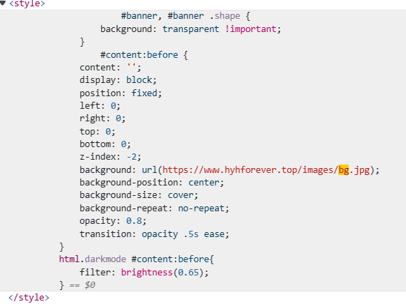
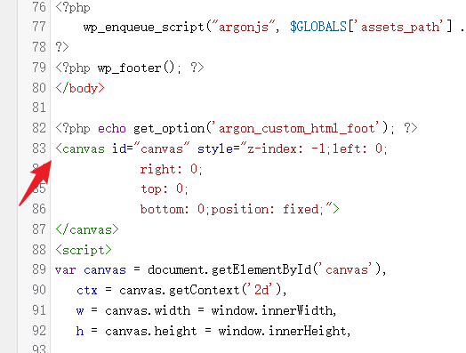

本站使用的星空背景特效是用html5 canvas绘制而成



在Argon主题设置背景图片的代码里可以看到，背景图层的z-index是-2

这里只需要添加一个canvas画布，把z-index抬高一点，即可覆盖

打开wordpress控制台→主题文件编辑器→footer.php，找到如图所示位置



添加代码如下所示

```
<?php echo get_option('argon_custom_html_foot'); ?>
//从下面开始
<canvas id="canvas" style="z-index: -1;left: 0;
			right: 0;
			top: 0;
			bottom: 0;position: fixed;">
</canvas>
<script>
        var canvas = document.getElementById('canvas'),
            ctx = canvas.getContext('2d'),
            w = canvas.width = window.innerWidth,
            h = canvas.height = window.innerHeight,

            hue = 217,
            stars = [],
            count = 0,
            maxStars = 800; // 调整星星数量

        var canvas2 = document.createElement('canvas'),
            ctx2 = canvas2.getContext('2d');
        canvas2.width = 100;
        canvas2.height = 100;
        var half = canvas2.width / 2,
            gradient2 = ctx2.createRadialGradient(half, half, 0, half, half, half);
        gradient2.addColorStop(0.025, '#CCC');
        gradient2.addColorStop(0.1, 'hsl(' + hue + ', 61%, 33%)');
        gradient2.addColorStop(0.25, 'hsl(' + hue + ', 64%, 6%)');
        gradient2.addColorStop(1, 'transparent');

        ctx2.fillStyle = gradient2;
        ctx2.beginPath();
        ctx2.arc(half, half, half, 0, Math.PI * 2);
        ctx2.fill();

        function random(min, max) {
            if (arguments.length < 2) {
                max = min;
                min = 0;
            }
            if (min > max) {
                var hold = max;
                max = min;
                min = hold;
            }
            return Math.floor(Math.random() * (max - min + 1)) + min;
        }

        function maxOrbit(x, y) {
            var max = Math.max(x, y),
                diameter = Math.round(Math.sqrt(max * max + max * max));
            return diameter / 2;
        }

        var Star = function() {
            this.orbitRadius = random(maxOrbit(w, h));
            this.radius = random(60, this.orbitRadius) / 8;
            this.orbitX = w / 2;
            this.orbitY = h / 2;
            this.timePassed = random(0, maxStars);
            this.speed = random(this.orbitRadius) / 300000;
            this.alpha = random(2, 10) / 10;

            count++;
            stars[count] = this;
        }

        Star.prototype.draw = function() {
            var x = Math.sin(this.timePassed) * this.orbitRadius + this.orbitX,
                y = Math.cos(this.timePassed) * this.orbitRadius + this.orbitY,
                twinkle = random(10);

            if (twinkle === 1 && this.alpha > 0) {
                this.alpha -= 0.05;
            } else if (twinkle === 2 && this.alpha < 1) {
                this.alpha += 0.05;
            }

            ctx.globalAlpha = this.alpha;
            ctx.drawImage(canvas2, x - this.radius / 2, y - this.radius / 2, this.radius, this.radius);
            this.timePassed += this.speed;
        }

        for (var i = 0; i < maxStars; i++) {
            new Star();
        }

        function animation() {
            ctx.globalCompositeOperation = 'source-over';
            ctx.globalAlpha = 0.5; // 尾巴效果
            ctx.fillStyle = 'hsla(' + hue + ', 64%, 6%, 2)';
            ctx.fillRect(0, 0, w, h);

            ctx.globalCompositeOperation = 'lighter';
            for (var i = 1, l = stars.length; i < l; i++) {
                stars[i].draw();
            };

            window.requestAnimationFrame(animation);
        }

        animation();

        window.addEventListener('resize', () => {
            w = canvas.width = window.innerWidth;
            h = canvas.height = window.innerHeight;
            stars = [];
            count = 0;
            for (var i = 0; i < maxStars; i++) {
                new Star();
            }
        });
    </script>//到这里结束
</html>
```

因为这是h5的特性，一般来说只要不是老旧的浏览器，都能正常显示出canvas

会造成很小性能损失
