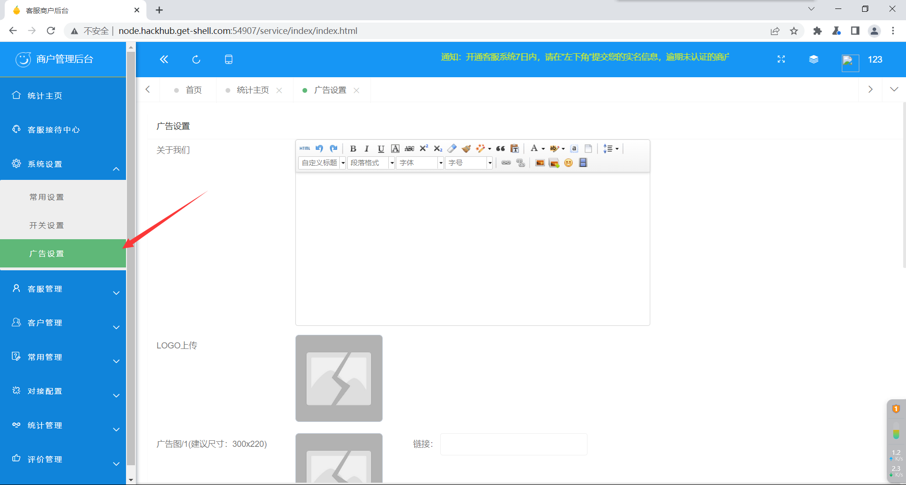
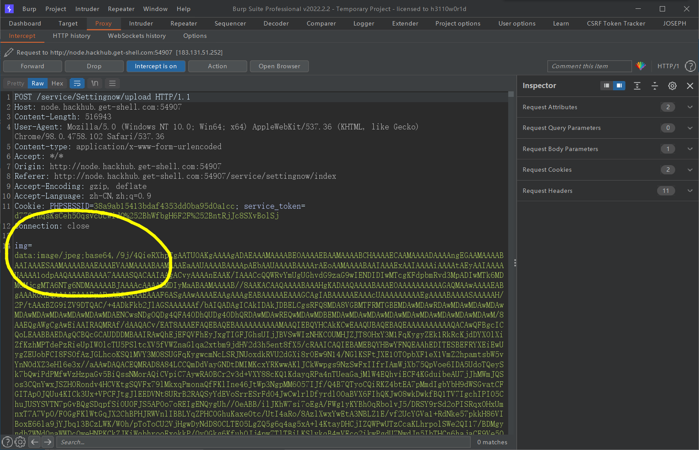
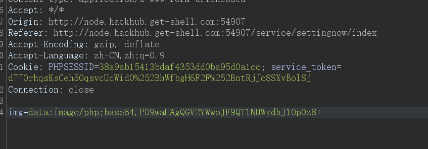
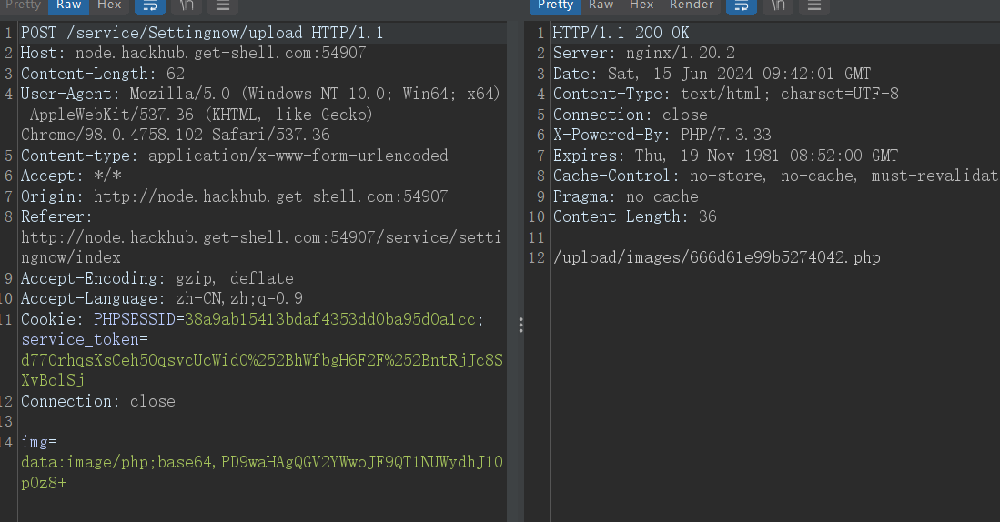

环境：[极核::CTF (get-shell.com)](https://hackhub.get-shell.com/)

进入平台主页，点击免费使用，注册账号，登入后台

在左侧的广告设置一栏中，存在图片上传的点

这里可以先随意上传一个图片（要先打开burp suite的拦截，在点击上传

可以看到拦截下来的包是这样的，图片是内容进行了base64加解密处理

把一句话木马进行base64加密，并且替换掉原来base64后面的一长串，修改文件类型为php

转到repeater，发包，得到回显路径

直接用蚁剑连接，拿到shell
