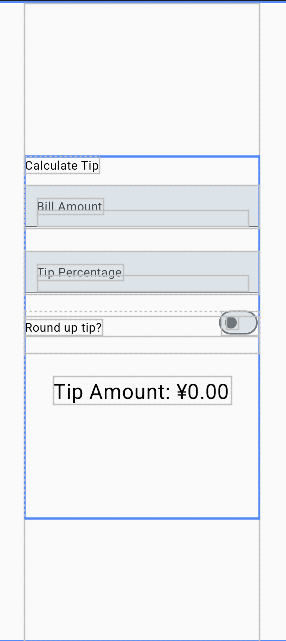

## 前言

在上一篇摇骰子的文章里，在局部使用了**remember multableStateof**用于将变量存于内存之中，以便于状态变换。这篇文章的主要内容是设计一个简单的小费计算器，并且可以自定义选项。

## 视图结构



整体来说是一个Column柱形结构，在中间给出**向上取整**的选项，根据Bill Amount和Percentage的实时变化，下面的Tip Amount也会跟着变

## 解决方案

要实现Tip Amout的实时更新，那么就需要把变量设置为最顶级域，并且传入内存

```
@Composable
fun TipTimeLayout(modifier: Modifier=Modifier)
{
    var roundUp by remember { mutableStateOf(false) }
    var amountInput by remember { mutableStateOf("") }
    var tipInput by remember { mutableStateOf("") }
}
```

对原始的TextField进行重新封装，这里的onValueChange是一个lambda表达式，指的是接受一个字符串，后面会将其传给Value显示

```
@Composable
fun EditNumberField(value:String,
                    onValueChange:(String)->Unit,
    modifier: Modifier = Modifier,
                    id:Int,
                    keyboardOptions: KeyboardOptions,
                    ) {
    TextField(
        value = value,
        onValueChange = onValueChange,
        modifier = modifier,
        label = { Text(text = stringResource(id = id))},
        keyboardOptions = keyboardOptions
    )
}
```

Tip计算函数会根据传入的routUp布尔值进行**选择性**向上取整

```
private fun calculateTip(amount: Double, tipPercent: Double=15.0,roundUp: Boolean):String{
    var tip = tipPercent / 100 * amount
    if (roundUp) {
        tip = kotlin.math.ceil(tip)
    }
    return NumberFormat.getCurrencyInstance().format(tip)
}
```

**Keyboard监听事件**，是TextField的一个属性，指的是选择文本域后执行的键盘事件，比如下面选择文本域后，会弹出数字键盘，并且点击右下角的Enter（或者←）会跳到下一个文本域。

```
keyboardOptions = KeyboardOptions.Default.copy(
                keyboardType = KeyboardType.Number,
                imeAction = ImeAction.Next
            )
```

**横屏适配**，也是Modifier中的一个属性：verticalScroll（垂直滚动），如果不加上这个属性，在横屏的情况下Tip Amount会由于屏幕限制无法显示，如果加上滑动效果会更好些。

```
....    
Column(modifier= modifier
        .statusBarsPadding()
        .fillMaxSize()
        .padding(horizontal = 40.dp)
        .verticalScroll(
            rememberScrollState()
        )
        .safeContentPadding(),

        horizontalAlignment = Alignment.CenterHorizontally,
        verticalArrangement = Arrangement.Center)
```

### 整体代码

```
import...
class MainActivity : ComponentActivity() {
    override fun onCreate(savedInstanceState: Bundle?) {
        super.onCreate(savedInstanceState)
        enableEdgeToEdge()
        setContent {
            MyApplicationTheme {
                 Surface(modifier = Modifier
                     .fillMaxSize(),
                     color = MaterialTheme.colorScheme.background) {
                     TipTimeLayout()
                 }
            }
        }
    }
}

@Composable
fun TipTimeLayout(modifier: Modifier=Modifier)
{
    var roundUp by remember { mutableStateOf(false) }
    var amountInput by remember { mutableStateOf("") }
    var tipInput by remember { mutableStateOf("") }
    val amount = amountInput.toDoubleOrNull()?:0.0
    val percent = tipInput.toDoubleOrNull()?:0.0
    val tip = calculateTip(amount, tipPercent = percent,roundUp)

    Column(modifier= modifier
        .statusBarsPadding()
        .fillMaxSize()
        .padding(horizontal = 40.dp)
        .verticalScroll(
            rememberScrollState()
        )
        .safeContentPadding(),

        horizontalAlignment = Alignment.CenterHorizontally,
        verticalArrangement = Arrangement.Center) {

        Text(text = stringResource(id = R.string.calculate_tip),
            modifier= Modifier
                .align(Alignment.Start)
                .padding(bottom = 16.dp, top = 40.dp)
            )

        EditNumberField(value = amountInput,
            onValueChange = {  amountInput = it },
            modifier= Modifier
                .padding(bottom = 32.dp)
                .fillMaxSize(),
            id = R.string.bill_amount,
            keyboardOptions = KeyboardOptions.Default.copy(
                keyboardType = KeyboardType.Number,
                imeAction = ImeAction.Next
            ))

        EditNumberField(value = tipInput,
            onValueChange = {  tipInput = it },
            modifier= Modifier
                .padding(bottom = 32.dp)
                .fillMaxSize(),
            id = R.string.how_was_the_service,
            keyboardOptions = KeyboardOptions.Default.copy(
                keyboardType = KeyboardType.Number,
                imeAction = ImeAction.Done
            ),
        )

        RoundTheTipRow( roundUp = roundUp,
            onRoundUpChanged = { roundUp = it },
            modifier = Modifier.padding(bottom = 32.dp),
        )

        Text(text = stringResource(id = R.string.tip_amount,tip),
            fontSize = MaterialTheme.typography.headlineMedium.fontSize, )

        Spacer(modifier = Modifier.height(150.dp))

    }
}
@Composable
fun RoundTheTipRow(roundUp: Boolean,
                   onRoundUpChanged: (Boolean) -> Unit
                   ,modifier: Modifier = Modifier,
                   ) {
    Row(modifier= modifier
        .fillMaxSize()
        .size(48.dp),
        horizontalArrangement = Arrangement.Center,
        verticalAlignment = Alignment.CenterVertically
    ) {
        Text(text = stringResource(R.string.round_up_tip),
            modifier=Modifier.padding(bottom = 20.dp),
            )
        Switch(
            checked = roundUp,
            onCheckedChange = onRoundUpChanged,
            modifier = modifier
                .fillMaxWidth()
                .wrapContentWidth(Alignment.End)
        )
    }
}

@Composable
fun     EditNumberField(value:String,
                    onValueChange:(String)->Unit,
    modifier: Modifier = Modifier,
                    id:Int,
                    keyboardOptions: KeyboardOptions,
                    ) {
    TextField(
        value = value,
        onValueChange = onValueChange,
        modifier = modifier,
        label = { Text(text = stringResource(id = id))},
        keyboardOptions = keyboardOptions
    )
}

private fun calculateTip(amount: Double, tipPercent: Double=15.0,roundUp: Boolean):String{
    var tip = tipPercent / 100 * amount
    if (roundUp) {
        tip = kotlin.math.ceil(tip)
    }
    return NumberFormat.getCurrencyInstance().format(tip)
}
```
