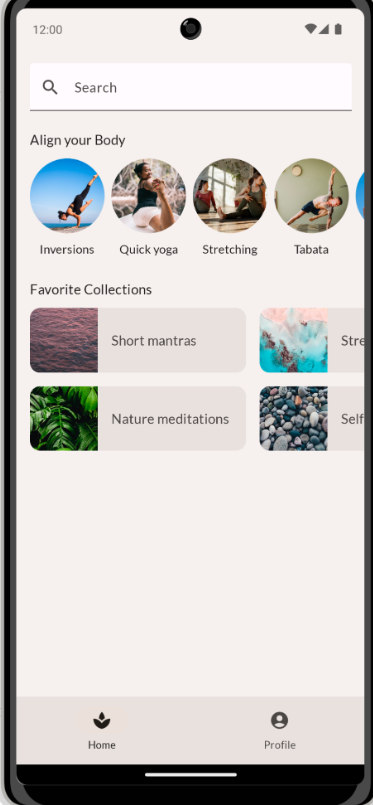
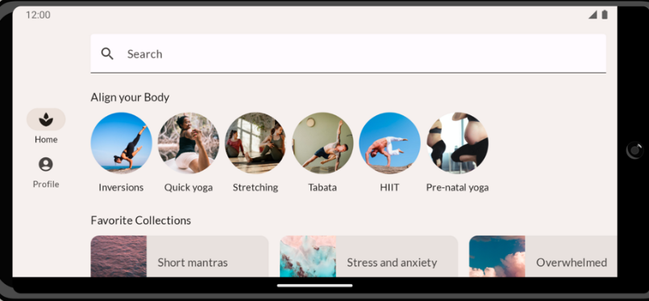
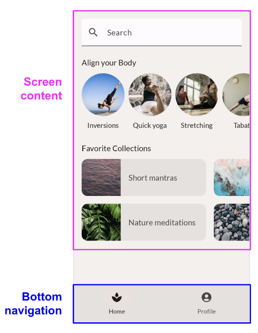
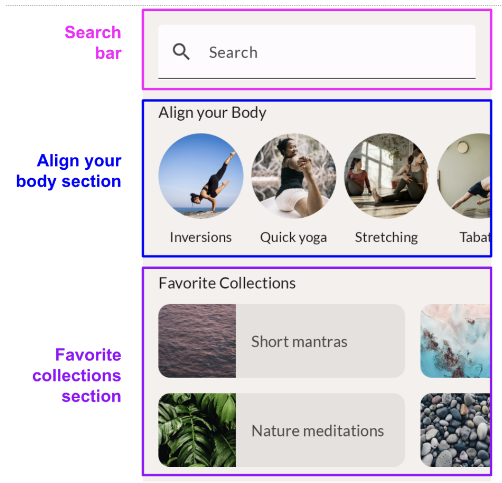
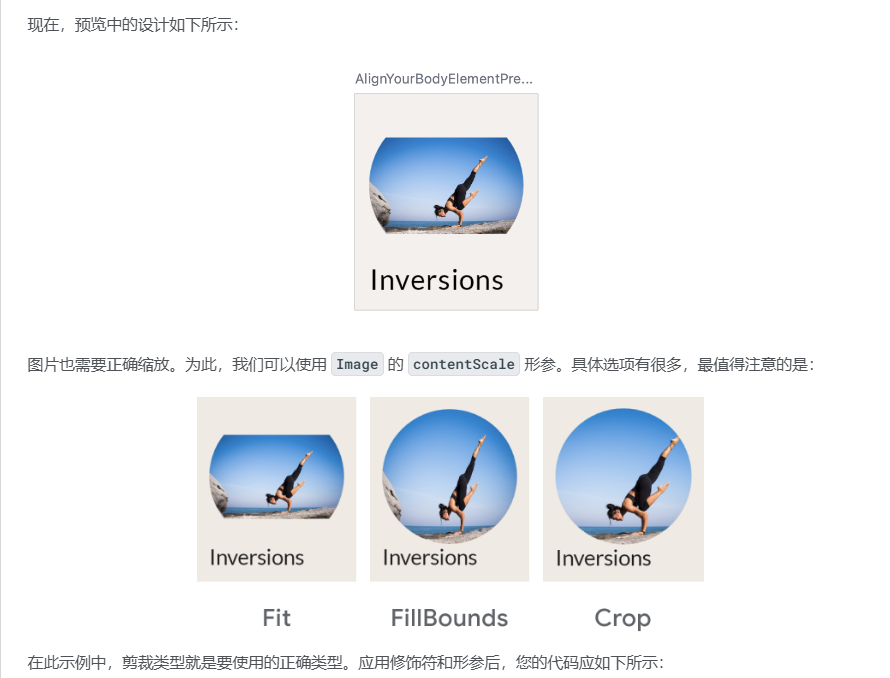
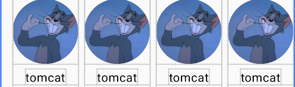
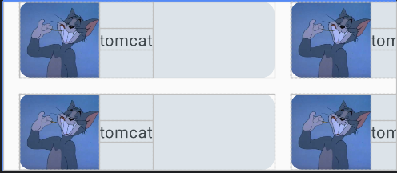
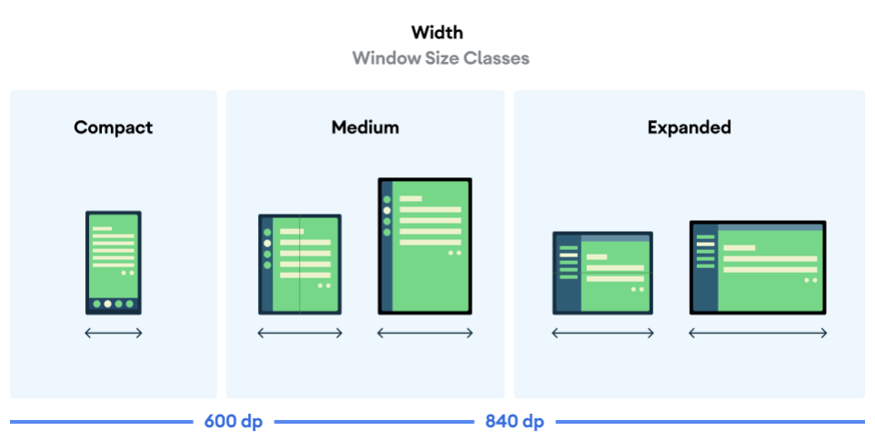
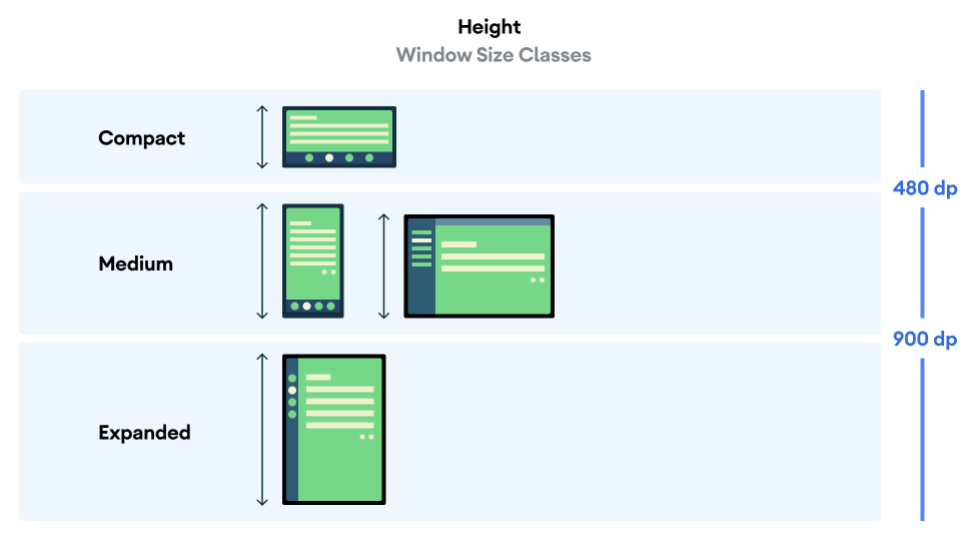

## 目标

构建一个健康应用，这款应用包含两个版块，一个列出了**收藏合集**，另一个列出了**各种体育锻炼**。具体如下图所示，包括竖屏和横屏的适配





## 主要内容

- 借助修饰符扩充可组合项

- 通过 Column 和 LazyRow 等标准布局组件定位可组合子项

- 通过对齐方式和排列方式更改可组合子项在父项中的位置

- 借助 **Scaffold** 和 **Bottom Navigation** 等 Material 可组合项创建详细布局

- 使用**槽位 API** 构建灵活的可组合项

- 为不同的屏幕配置构建布局

## 结构分析



总体来说可以将应用分为**内容**和**导航栏**两个部分

在内容部分又可以分**为搜索栏、收藏栏以及运动收集网格**



### 搜索栏

```
@Composable
fun SearchBar(modifier: Modifier=Modifier)
{
    TextField(value = "",
        onValueChange = {},
        modifier= modifier
            .fillMaxWidth()
            .heightIn(min = 56.dp),
        leadingIcon = {
            Icon(painter = painterResource(id = R.drawable.search), contentDescription = null )
        },
        colors = TextFieldDefaults.colors(
            unfocusedLabelColor = MaterialTheme.colorScheme.surface,
            focusedContainerColor = MaterialTheme.colorScheme.surface,
        ),
        placeholder = {
            Text(text = stringResource(R.string.search))
        }
    )
}
```

图标是在[Browse Fonts - Google Fonts](https://fonts.google.com/)这里下载的。总体代码还是比较简单的，这里先不涉及具体的文本处理。

### **收藏栏**

首先要分析每个元素的具体结构。


可以看到，要对图片进行裁剪，并且在图片下面要对齐相应的文字。

使用modifier的clip对图片进行裁剪，并且可能会出现裁剪之后有残缺，又用了ContentScale对图片进行适当缩放来填满clip的形状



```
@Composable
fun AlignYourBodyElement(
    modifier: Modifier=Modifier,
    @DrawableRes drawable:Int,
    @StringRes text:Int
)
{
    Column(
        horizontalAlignment = Alignment.CenterHorizontally,
        modifier = modifier
    ) {
        Image(painter = painterResource(id = drawable),
            contentDescription =null ,
            modifier= Modifier
                .size(88.dp)
                .clip(CircleShape),
            contentScale = ContentScale.Crop

        )
        Text(text = stringResource(id = text),
            modifier=Modifier.paddingFromBaseline(top = 24.dp, bottom = 8.dp)
        )
    }
}
```

这里涉及到了**@DrawableRes**和**@StringRes**两个修饰符，显式规定了传入参数的类型可以被当作resource处理。类似于 **R.string.username** 这样的资源引用方式，实际上在程序中是以**Int**数字类型进行传递的（可以调试查看）。添加注解后，编译器会**提前检查资源**是否合法存在，防止错误的资源类型传递。

剩下的就是将每个元素进行**横向排列**  



```
@Composable
fun AlignYourBodyRow(modifier: Modifier=Modifier)
{
    val alignYourBodyData=
        listOf(
            AlignYourBodyData(R.drawable.tomcat,R.string.username),
            AlignYourBodyData(R.drawable.tomcat,R.string.username),
            AlignYourBodyData(R.drawable.tomcat,R.string.username),
            AlignYourBodyData(R.drawable.tomcat,R.string.username),
            AlignYourBodyData(R.drawable.tomcat,R.string.username),
    )

    LazyRow(
        modifier=modifier,
        horizontalArrangement = Arrangement.spacedBy(8.dp),
        contentPadding = PaddingValues(horizontal = 16.dp)
    ){
        items(alignYourBodyData){
            item-> AlignYourBodyElement(drawable = item.drawable, text = item.text)
        }
    }

}
```

这里使用到了**LazyRow（懒加载）**而不是**Row**，原因就在于，**LazyRow** 只会渲染当前视图中的内容，有助于提高应用的性能。

### **运动收集网格**



```
data class FavoriteCollectionsData(
    @DrawableRes val drawable: Int,
    @StringRes val text: Int
)
@Composable
fun FavoriteCollectionsGrid(modifier: Modifier=Modifier)
{
    val favoriteCollectionsData= listOf(
        FavoriteCollectionsData(R.drawable.tomcat,R.string.username),
        FavoriteCollectionsData(R.drawable.tomcat,R.string.username),
        FavoriteCollectionsData(R.drawable.tomcat,R.string.username),
        FavoriteCollectionsData(R.drawable.tomcat,R.string.username),
        FavoriteCollectionsData(R.drawable.tomcat,R.string.username),
        FavoriteCollectionsData(R.drawable.tomcat,R.string.username),
    )

    LazyHorizontalGrid(
        rows = GridCells.Fixed(2),
        modifier=modifier.height(168.dp),
        contentPadding = PaddingValues(horizontal = 16.dp),
        horizontalArrangement = Arrangement.spacedBy(16.dp),
        verticalArrangement = Arrangement.spacedBy(16.dp)
    ) {
        items(favoriteCollectionsData){
            item-> FavoriteCollectionCard(drawable = item.drawable, text = item.text, modifier = Modifier.height(80.dp))
        }
    }
}
```

**LazyHorizontalGrid**同样是**懒加载**的组件，指定了行数row之后会自动排列，然后使用items进行子元素生成

### 内容插槽

```
@Composable
fun HomeSection(
    @StringRes title: Int,
    modifier: Modifier = Modifier,
    content: @Composable () -> Unit
) {
    Column(modifier=modifier) {
        Text(
            text = stringResource(title),
            style = MaterialTheme.typography.titleMedium,
            modifier = Modifier
                .paddingFromBaseline(top = 40.dp, bottom = 16.dp)
                .padding(horizontal = 16.dp),
        )
        content()
    }
}
```

将内容传入**HomeSection**插槽来使用，增强代码的结构性。具体如下，并且要使用verticalScroll添加可滑动效果

```
//主体代码
@Composable
fun HomeScreen(modifier: Modifier = Modifier) {
    Column(
        modifier= modifier
            .fillMaxHeight()
            .background(color = Color(0xFFdbccb9))
            .verticalScroll(
                rememberScrollState()
            )
            .padding(bottom = 20.dp)
    ) {
        Spacer(modifier = Modifier.height(16.dp))
        SearchBar(Modifier.padding(horizontal = 16.dp))
        HomeSection(title = R.string.username) {
            AlignYourBodyRow()
        }

        HomeSection(title = R.string.username) {
            FavoriteCollectionsGrid()
        }

    }
}
```

### 导航栏

由于涉及到**横屏**和**竖屏**两种情况，导航栏得做两个

```kotlin
//竖屏
NavigationBar(
        modifier = modifier,
    ){
        NavigationBarItem(
            icon = {
                Icon(
                    imageVector = Icons.Default.Home,
                    contentDescription = stringResource(id = R.string.username)
                )
            },
            label = {
                Text(
                    text = stringResource(id = R.string.home)
                )
            },
            selected = true,
            onClick = {}
        )
        NavigationBarItem(
            icon = {
                Icon(
                    imageVector = Icons.Default.AccountCircle,
                    contentDescription = null
                )
            },
            label = {
                Text(
                    text = stringResource(id = R.string.profile)
                )
            },
            selected = false,
            onClick = {}
        )
    }
```

Jetpack Compose十分贴心，内置了底部导航栏的组件，可以直接使用。

```kotlin
//横屏
@Composable
private fun SootheNavigationRail(modifier: Modifier=Modifier)
{
    NavigationRail(
        modifier=modifier.padding(top = 8.dp, bottom = 8.dp),
        containerColor = MaterialTheme.colorScheme.background,
    ) {

        Column(
            modifier=modifier.fillMaxHeight(),
            verticalArrangement = Arrangement.Center,
            horizontalAlignment = Alignment.CenterHorizontally
        ) {
            NavigationRailItem(selected = false, onClick = { /*TODO*/ }, icon = {
                Icon(imageVector = Icons.Default.Home, contentDescription = null )
            },
                label = {
                    Text(text = stringResource(id = R.string.home))
                },

                )

            Spacer(modifier = Modifier.height(8.dp))

            NavigationRailItem(selected = false, onClick = { /*TODO*/ }, icon = {
                Icon(imageVector = Icons.Default.AccountCircle, contentDescription = null)
            },
                label = {
                    Text(text = stringResource(id = R.string.profile))
                }
            )

        }
    }
}
```

### 判断设备状态

官方的引用方式：[窗口大小类别  |  Jetpack Compose  |  Android Developers (google.cn)](https://developer.android.google.cn/develop/ui/compose/layouts/adaptive/window-size-classes?hl=zh-cn)

```kotlin
@OptIn(ExperimentalMaterial3AdaptiveApi::class)
@Composable
fun MyApp(
    windowSizeClass: WindowSizeClass = currentWindowAdaptiveInfo().windowSizeClass
) {
    // Perform logic on the size class to decide whether to show the top app bar.
    val showTopAppBar = windowSizeClass.windowHeightSizeClass != WindowHeightSizeClass.COMPACT

    // MyScreen knows nothing about window sizes, and performs logic based on a Boolean flag.
    MyScreen(
        showTopAppBar = showTopAppBar,
        /* ... */
    )
}
```





随意选择即可，我这里使用的是**高度判断**，并且只关心了**手机设备**

```kotlin
@Composable
fun MyApp(
    windowSizeClass: WindowSizeClass = currentWindowAdaptiveInfo().windowSizeClass
) {
    // Perform logic on the size class to decide whether to show the top app bar.
    when(windowSizeClass.windowHeightSizeClass)
    {
        WindowHeightSizeClass.MEDIUM,WindowHeightSizeClass.EXPANDED->{
            Scaffold(
                bottomBar = {
                    SootheBottomNavigation()
                }
            ) {
                padding ->  HomeScreen(Modifier.padding(padding))
            }
        }

        WindowHeightSizeClass.COMPACT->{
            Row {
                SootheNavigationRail()
                HomeScreen()
            }
        }
        
    }
}
```

如果是常规的竖屏情况下，可以使用**Scaffold**组件来进行快速创建包含各种导航栏的界面。

在横屏状态下，导航栏和主体内容应该是成**横向排列**的

### 总体代码

```kotlin
class MainActivity : ComponentActivity() {

    override fun onCreate(savedInstanceState: Bundle?) {
        super.onCreate(savedInstanceState)
        enableEdgeToEdge()
        setContent {
            MyApplicationTheme {
                     MyApp()
            }
        }
    }
}
data class AlignYourBodyData(
    @DrawableRes val drawable:Int,
    @StringRes val text:Int
)

data class FavoriteCollectionsData(
    @DrawableRes val drawable: Int,
    @StringRes val text: Int
)
@Composable
fun FavoriteCollectionsGrid(modifier: Modifier=Modifier)
{
    val favoriteCollectionsData= listOf(
        FavoriteCollectionsData(R.drawable.tomcat,R.string.username),
        FavoriteCollectionsData(R.drawable.tomcat,R.string.username),
        FavoriteCollectionsData(R.drawable.tomcat,R.string.username),
        FavoriteCollectionsData(R.drawable.tomcat,R.string.username),
        FavoriteCollectionsData(R.drawable.tomcat,R.string.username),
        FavoriteCollectionsData(R.drawable.tomcat,R.string.username),
    )

    LazyHorizontalGrid(
        rows = GridCells.Fixed(2),
        modifier=modifier.height(168.dp),
        contentPadding = PaddingValues(horizontal = 16.dp),
        horizontalArrangement = Arrangement.spacedBy(16.dp),
        verticalArrangement = Arrangement.spacedBy(16.dp)
    ) {
        items(favoriteCollectionsData){
            item-> FavoriteCollectionCard(drawable = item.drawable, text = item.text, modifier = Modifier.height(80.dp))
        }
    }
}

@Composable
fun AlignYourBodyRow(modifier: Modifier=Modifier)
{
    val alignYourBodyData=
        listOf(
            AlignYourBodyData(R.drawable.tomcat,R.string.username),
            AlignYourBodyData(R.drawable.tomcat,R.string.username),
            AlignYourBodyData(R.drawable.tomcat,R.string.username),
            AlignYourBodyData(R.drawable.tomcat,R.string.username),
            AlignYourBodyData(R.drawable.tomcat,R.string.username),
    )

    LazyRow(
        modifier=modifier,
        horizontalArrangement = Arrangement.spacedBy(8.dp),
        contentPadding = PaddingValues(horizontal = 16.dp)
    ){
        items(alignYourBodyData){
            item-> AlignYourBodyElement(drawable = item.drawable, text = item.text)
        }
    }

}

@Composable
fun AlignYourBodyElement(
    modifier: Modifier=Modifier,
    @DrawableRes drawable:Int,
    @StringRes text:Int
)
{
    Column(
        horizontalAlignment = Alignment.CenterHorizontally,
        modifier = modifier
    ) {
        Image(painter = painterResource(id = drawable),
            contentDescription =null ,
            modifier= Modifier
                .size(88.dp)
                .clip(CircleShape),
            contentScale = ContentScale.Crop

        )
        Text(text = stringResource(id = text),
            modifier=Modifier.paddingFromBaseline(top = 24.dp, bottom = 8.dp)
        )
    }
}

@Composable
fun SearchBar(modifier: Modifier=Modifier)
{
    TextField(value = "",
        onValueChange = {},
        modifier= modifier
            .fillMaxWidth()
            .heightIn(min = 56.dp),
        leadingIcon = {
            Icon(painter = painterResource(id = R.drawable.search), contentDescription = null )
        },
        colors = TextFieldDefaults.colors(
            unfocusedLabelColor = MaterialTheme.colorScheme.surface,
            focusedContainerColor = MaterialTheme.colorScheme.surface,
        ),
        placeholder = {
            Text(text = stringResource(R.string.search))
        }
    )
}

@Composable
fun FavoriteCollectionCard(
    modifier: Modifier=Modifier,
    @DrawableRes drawable: Int,
    @StringRes text:Int
)
{
    Surface(
        shape = MaterialTheme.shapes.medium,
        modifier = modifier,
        color = MaterialTheme.colorScheme.surfaceVariant
    ) {
        Row (
            verticalAlignment = Alignment.CenterVertically,
            modifier=modifier.width(255.dp)
        ){
            Image(painter = painterResource(id = drawable),
                contentDescription =null,
                modifier=Modifier.size(80.dp),
                contentScale = ContentScale.Crop
            )
            Text(text = stringResource(id = text))

        }
    }
}
@Composable
fun HomeSection(
    @StringRes title: Int,
    modifier: Modifier = Modifier,
    content: @Composable () -> Unit
) {
    Column(modifier=modifier) {
        Text(
            text = stringResource(title),
            style = MaterialTheme.typography.titleMedium,
            modifier = Modifier
                .paddingFromBaseline(top = 40.dp, bottom = 16.dp)
                .padding(horizontal = 16.dp),
        )
        content()
    }
}
@Composable
fun HomeScreen(modifier: Modifier = Modifier) {
    Column(
        modifier= modifier
            .fillMaxHeight()
            .background(color = Color(0xFFdbccb9))
            .verticalScroll(
                rememberScrollState()
            )
            .padding(bottom = 20.dp)
    ) {
        Spacer(modifier = Modifier.height(16.dp))
        SearchBar(Modifier.padding(horizontal = 16.dp))
        HomeSection(title = R.string.username) {
            AlignYourBodyRow()
        }

        HomeSection(title = R.string.username) {
            FavoriteCollectionsGrid()
        }

    }
}

@Composable
private fun SootheBottomNavigation(modifier: Modifier=Modifier){
    NavigationBar(
        modifier = modifier,
    ){
        NavigationBarItem(
            icon = {
                Icon(
                    imageVector = Icons.Default.Home,
                    contentDescription = stringResource(id = R.string.username)
                )
            },
            label = {
                Text(
                    text = stringResource(id = R.string.home)
                )
            },
            selected = true,
            onClick = {}
        )
        NavigationBarItem(
            icon = {
                Icon(
                    imageVector = Icons.Default.AccountCircle,
                    contentDescription = null
                )
            },
            label = {
                Text(
                    text = stringResource(id = R.string.profile)
                )
            },
            selected = false,
            onClick = {}
        )
    }
}

@Composable
private fun SootheNavigationRail(modifier: Modifier=Modifier)
{
    NavigationRail(
        modifier=modifier.padding(top = 8.dp, bottom = 8.dp),
        containerColor = MaterialTheme.colorScheme.background,
    ) {

        Column(
            modifier=modifier.fillMaxHeight(),
            verticalArrangement = Arrangement.Center,
            horizontalAlignment = Alignment.CenterHorizontally
        ) {
            NavigationRailItem(selected = false, onClick = { /*TODO*/ }, icon = {
                Icon(imageVector = Icons.Default.Home, contentDescription = null )
            },
                label = {
                    Text(text = stringResource(id = R.string.home))
                },

                )

            Spacer(modifier = Modifier.height(8.dp))

            NavigationRailItem(selected = false, onClick = { /*TODO*/ }, icon = {
                Icon(imageVector = Icons.Default.AccountCircle, contentDescription = null)
            },
                label = {
                    Text(text = stringResource(id = R.string.profile))
                }
            )

        }
    }
}

@Composable
fun MyApp(
    windowSizeClass: WindowSizeClass = currentWindowAdaptiveInfo().windowSizeClass
) {
    
    when(windowSizeClass.windowHeightSizeClass)
    {
        WindowHeightSizeClass.MEDIUM,WindowHeightSizeClass.EXPANDED->{
            Scaffold(
                bottomBar = {
                    SootheBottomNavigation()
                }
            ) {
                padding ->  HomeScreen(Modifier.padding(padding))
            }
        }

        WindowHeightSizeClass.COMPACT->{
            Row {
                SootheNavigationRail()
                HomeScreen()
            }
        }
        
    }
}
@Preview(showBackground = true)
@Composable
fun MyPreview() {
    MyApplicationTheme {
        MyApp()
    }
}
```
