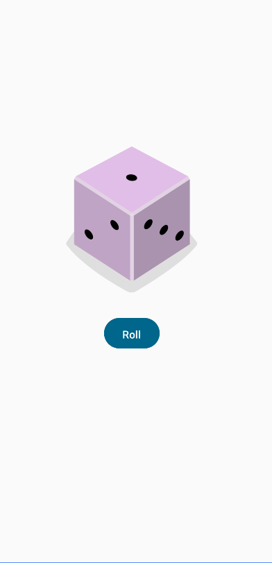

## 前言

最近在学习**Android app**开发，用的是Kotlin语言，然而B站上面的视频质量并不是很高，大多数都是对编程无基础人员的基本语法教学。相比之下，我觉得Android官方的**Developer**开发者课程是很不错的。此文章就是根据Android Developer中的**创建交互式Dice Roller**（摇骰子）部分进行学习记录，使用的是**Jetpack compose**的ui开发框架。

### 环境

**API版本：31**（官方使用的是26，不过并没有什么影响）

## 关键点

### Modifier

在Jetpack Compose框架中，每一个可组合函数都会有个自带的Modifier，用于修改其样式。具体来说就类似于html中的div容器，在此框架中每个函数都会自带一个容器，容器也是可以**继承**的，也就是说子对象可以使用父对象的容器特征。

例如在下面这个代码示例中，整体视窗大小是被指定为Modifier的fillMaxSize，也就是填充到最大尺寸（填充全屏）。不仅如此还可指定padding填充、背景颜色、以及填充权重等。。。

```
class MainActivity : ComponentActivity() {
    override fun onCreate(savedInstanceState: Bundle?) {
        super.onCreate(savedInstanceState)
        enableEdgeToEdge()
        setContent {
            MyApplicationTheme {
                 Surface(modifier = Modifier
                     .fillMaxSize(),
                     color = MaterialTheme.colorScheme.background) {
                     DiceWithButtonAndImage(modifier = Modifier
                         .fillMaxSize())
                 }
            }
        }
    }
}
```

### Compose

在函数上方添加**@Compose**注解，可以将函数声明为**可组合**函数。声明后，就有点类似于html的盒子模型，可以进行组合嵌套。

```
@Composable
fun DiceWithButtonAndImage(modifier: Modifier) {
    Column(modifier=modifier,
        horizontalAlignment = Alignment.CenterHorizontally,
        verticalArrangement = Arrangement.Center) {

        Image(
            painter = painterResource(R.drawable.dic1),
            contentDescription = result.toString()
        )
        Button(onClick = {

        }) {
            Text(stringResource(R.string.roll),
                modifier=Modifier.height(16.dp))
        }

    }
}
```

在上面这段代码中，可以看到整体是一个column竖柱形的**“容器”**，其中放置了一个图片和一个按钮。对于排列函数来说，可以指定其**水平或垂直的Style**

## 解决方案

### 逻辑梳理

在未点击按钮之前，应该先展示一张骰子的图片（可以随机也可以固定），这里就用固定的方式来展示。

那么在Button点击之后，希望得到的效果就是，界面上的Image被替换。

但是如果直接使用变量覆盖的方式是无法实现的，因为在Button点击之前页面是已经加载好了的，点击后再修改Image的source是没有效果的。

### 基于内存管理

默认情况下，可组合函数是无状态的，这意味着它们不存储值，并且可随时被系统重组，从而导致值被重置。不过，Compose 提供了一种避免这种情况的便捷方式。可组合函数可以使用 **`remember`** 可组合函数将对象存储在内存中。

**那么将骰子的值使用remember进行内存存储就行了**

### 代码

```
import....

class MainActivity : ComponentActivity() {
    override fun onCreate(savedInstanceState: Bundle?) {
        super.onCreate(savedInstanceState)
        enableEdgeToEdge()
        setContent {
            MyApplicationTheme {
                 Surface(modifier = Modifier
                     .fillMaxSize(),
                     color = MaterialTheme.colorScheme.background) {
                     DiceWithButtonAndImage(modifier = Modifier
                         .fillMaxSize())
                 }
            }
        }
    }
}

@Composable
fun DiceWithButtonAndImage(modifier: Modifier) {
    Column(modifier=modifier,
        horizontalAlignment = Alignment.CenterHorizontally,
        verticalArrangement = Arrangement.Center) {
        var result by remember { mutableStateOf(1) }
        val imageResource = when (result) {
            1 -> R.drawable.dice_1
            2 -> R.drawable.dice_2
            3 -> R.drawable.dice_3
            4 -> R.drawable.dice_4
            5 -> R.drawable.dice_5
            else -> R.drawable.dice_6
        }
        Image(
            painter = painterResource(imageResource),
            contentDescription = result.toString()
        )
        Button(onClick = {
            result = (1..6).random()
            Log.i("HYH", result.toString())
        }) {
            Text(stringResource(R.string.roll),
                modifier=Modifier.height(16.dp))
        }

    }
}
```

界面效果


