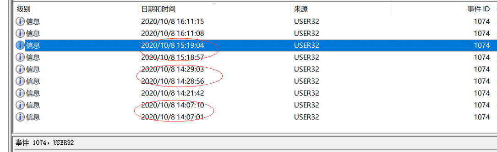

## 关于evtx

`evtx`文件是微软采用的一种全新的日志文件格式。在此之前的格式是 `evt` 。`evtx`由`Windows`事件查看器创建，包含Windows记录的事件列表，以专有的二进制XML格式保存。

在本文的附件中，存在三个日志，分别是**安全、日志、应用程序**

不要直接运行！！用windows自带的事件查看器打开

## 开始分析

### #步骤1（安全日志

1.将黑客成功登录系统所使用的IP地址

查找与登录相关的事件ID，如 **4624 (成功登录)**、**4625 (登录失败)**。

查看详细信息得到黑客IP

### #步骤2（安全日志

2.黑客成功登录系统后修改了登录用户的用户名

查询事件为ID **4738（修改用户属性）**

可以看到原本的administrator被修改成了Administartro。

那么修改后的用户名就是**Administartro**

### #步骤三（安全日志

3.黑客成功登录系统后成功访问了一个关键位置的文件

查询事件ID 4663（对象访问）

访问文件名为SCHEMA.DAT，似乎是一个数据库文件。。。

### #步骤四（应用程序日志

4.黑客成功登录系统后重启过几次数据库服务，最后一次重启数据库服务后数据库服务的进程ID号

设置筛选器为MySQL

随便查看一个发现有starting的字符串存在

按照时间倒序，查找starting字符串，在最近的一段发现ID是**1052**，不过这并不是答案，因为说的是重启，那么一定要有人为的normal shutdown日志才对

正确的进程是ID 8820

之前的人为关闭

### #步骤五（系统日志

5.黑客成功登录系统后修改了登录用户的用户名并对系统执行了多次重启操作，黑客使用修改后的用户重启系统的次数

查询事件ID为 **1074 （系统计划启动）**

虽然有六条日志，但是从详细信息和时间来看，实际上是两两分组的，重启的次数一共有**三次**
