## _前言_

靶机来自[Vulnerable By Design ~ VulnHub](https://www.vulnhub.com/)

下载链接：https://download.vulnhub.com/matrix-breakout/matrix-breakout-2-morpheus.ova

网络连接方式采用桥接（直接复制物理机网络），便于操作。

注意！！！！！

本文内容并非符合预期，而是利用了内核漏洞。因此请不要在意内容。

## 存活主机探测

虚拟机开启后如图所示，需要登录。

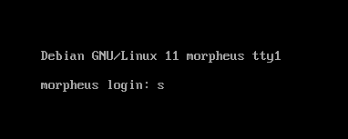

```
#kali
nmap  -O 192.168.101.0/24
```

使用nmap对局域网存活主机进行扫描，发现该机器上80端口是开启状态，可以直接通过浏览器访问

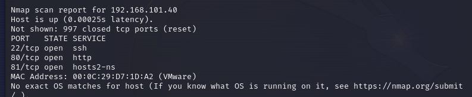

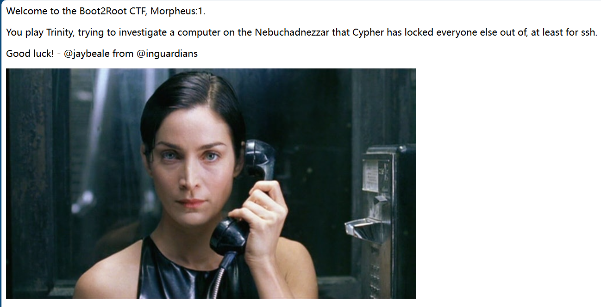

```
欢迎来到 Boot2Root CTF，Morpheus：1。
你玩 Trinity，试图调查 Cypher 将其他人都拒之门外的 Nebuchadnezzar，至少对于 ssh 来说是这样。

祝你好运！ - @inguardians @jaybeale
```

接下来查看81端口，需要身份认证。

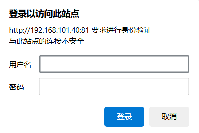

简单的爆破之后无果，尝试寻找其他的解决方式。

## 目录扫描

用御剑工具扫描之后，扫不出东西来。不过kali自带的字典也可以用。

```
#kali
gobuster dir -u http://192.168.101.40 -x php,jsp,txt,asp -w /usr/share/wordlists/dirbuster/directory-list-2.3-medium.txt 

#如果没有gobuster ，可以使用apt install gobuster
```

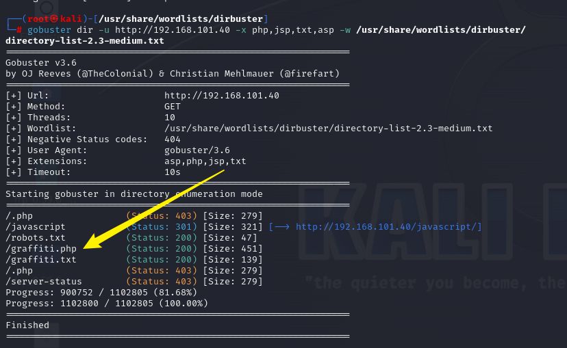

访问graffiti.php，出现可以交互的地方。

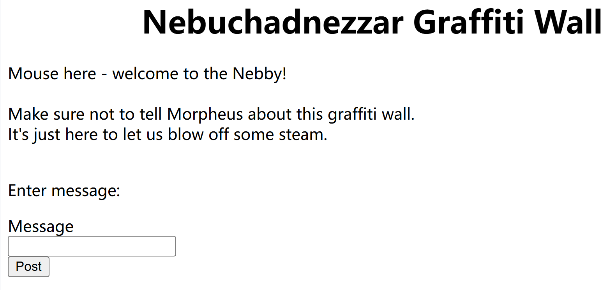

## 进行攻击

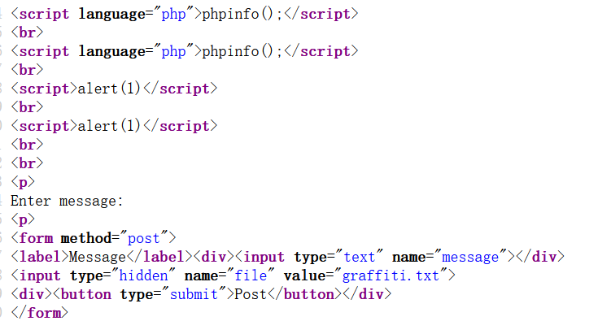

测试之后，任意字符串在提交之后会保存在当前页面，而且是一个存储型的XSS漏洞。

并且抓包之后可以看到，信息和导入文件名都是可控的。

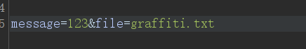

那么就尝试写入一句话木马，并且导入到一个php文件中。

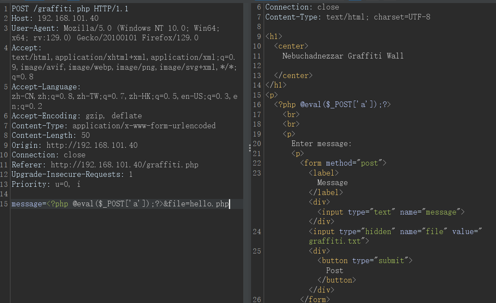

用蚁剑链接成功，并且发现一个提示，在当前目录下存在一个隐藏的png图片。

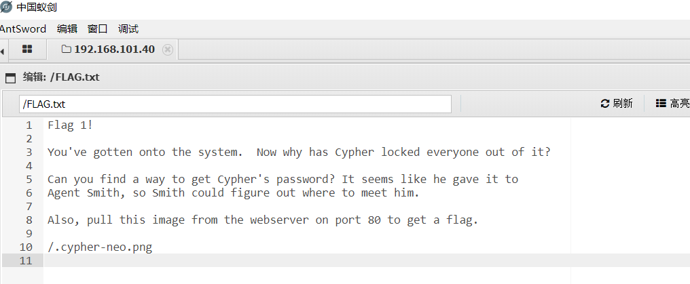

```
#kali
wget http://192.168.101.40/.cypher-neo.png
```

下载到kali里面，尝试使用binwalk或者foremost

```
#kali
binwalk -e .cypher-neo.png --run-as=root
```


成功分离出东西。经过HXD查看，并没有什么有价值的东西。

这里了解到一个可以进行提权的脚本：**Linpeas**

```
wget https://github.com/carlospolop/PEASS-ng/releases/latest/download/linpeas.sh
```

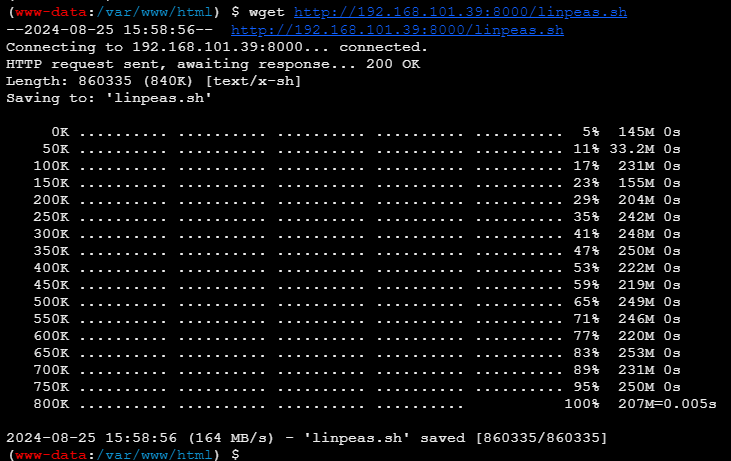

在kali上开端口，然后在靶机上将其下载过来。

```
chmod +x linpeas.sh
./linpeas.sh
```

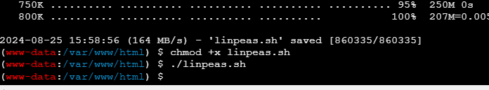

这里执行完后，并不会出现任何东西。wp说的要反弹shell之后才能正常显示。

进入网站：[反弹shell命令在线生成器|🔰雨苁🔰 (ddosi.org)](https://www.ddosi.org/shell/)


回到之前那个可以上传木马的地方，把这个木马上传之后，再访问。同时kali端要nc监听100端口

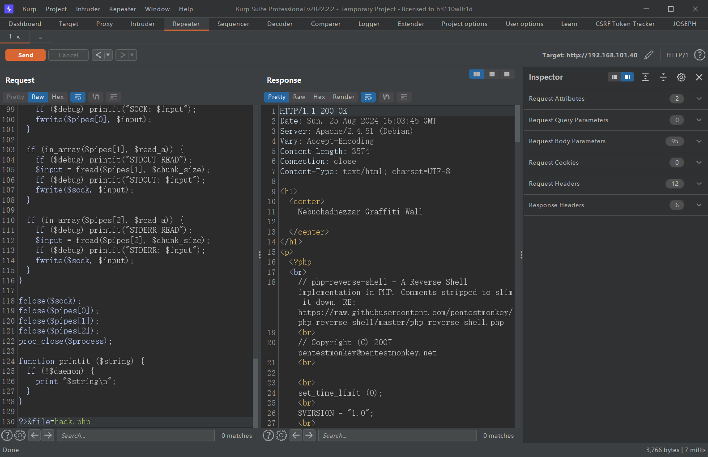

kali成功获得shell。

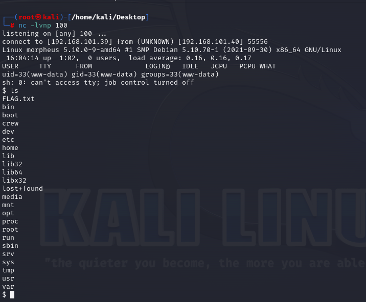

这里枚举出来许多漏洞，这里使用的是2022-0847脏管道漏洞。

相关链接：[CVE-2022-0847 Linux 脏管漏洞分析与利用 - FreeBuf网络安全行业门户](https://www.freebuf.com/vuls/331378.html)

攻击者可以利用该漏洞实现低权限用户提升至 root 权限。

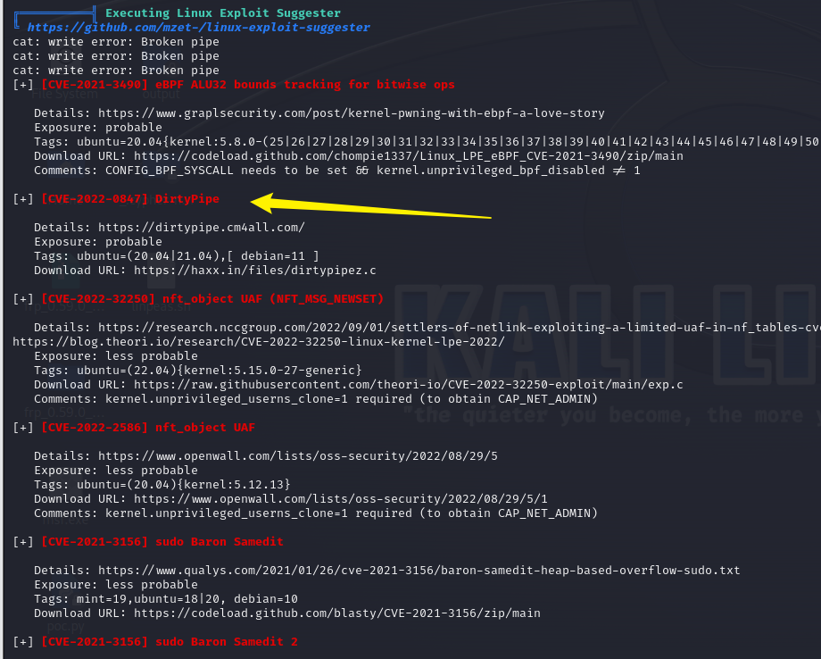

把poc进行git clone 下来，再传给靶机执行。


```
chmod +x Dirty-Pipe.sh
bash Dirty-Pipe.sh
```

可以看到权限已经提升到了root

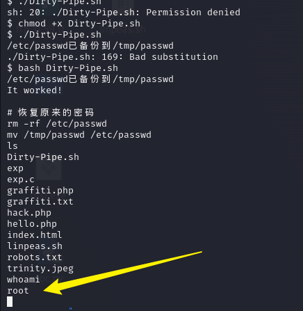

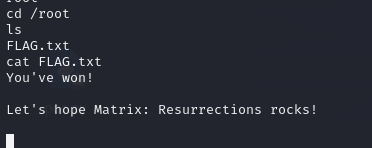

至此结束
