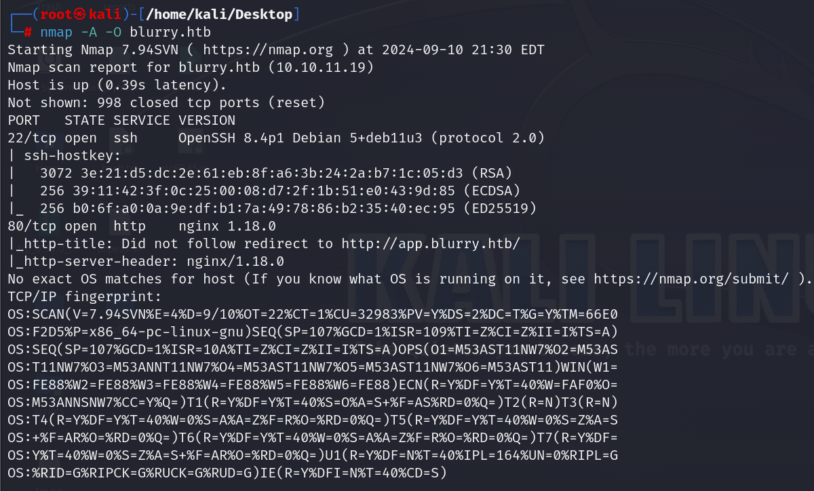
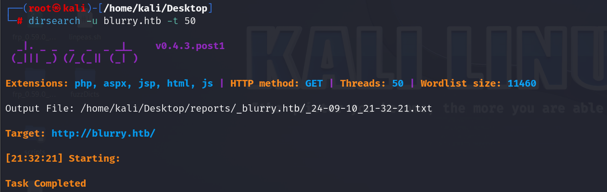
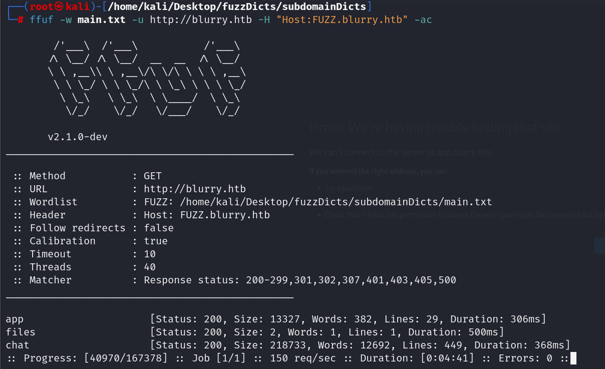
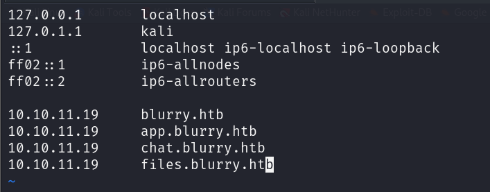
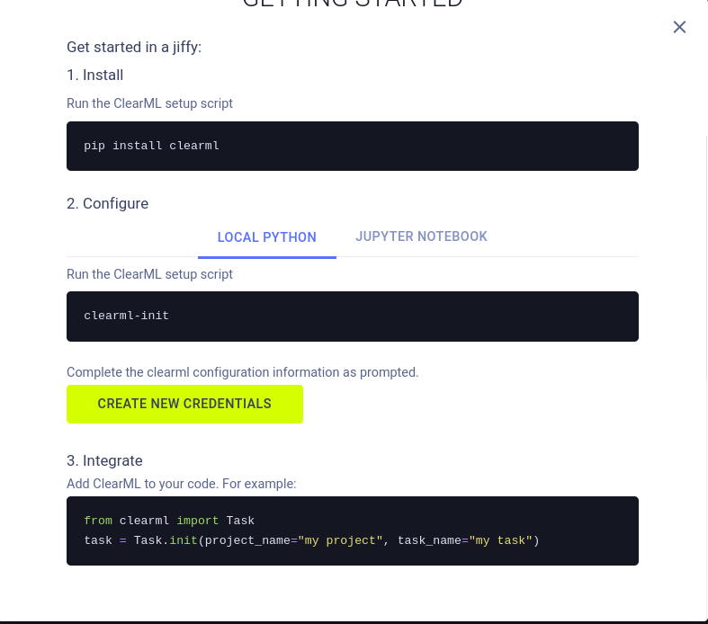
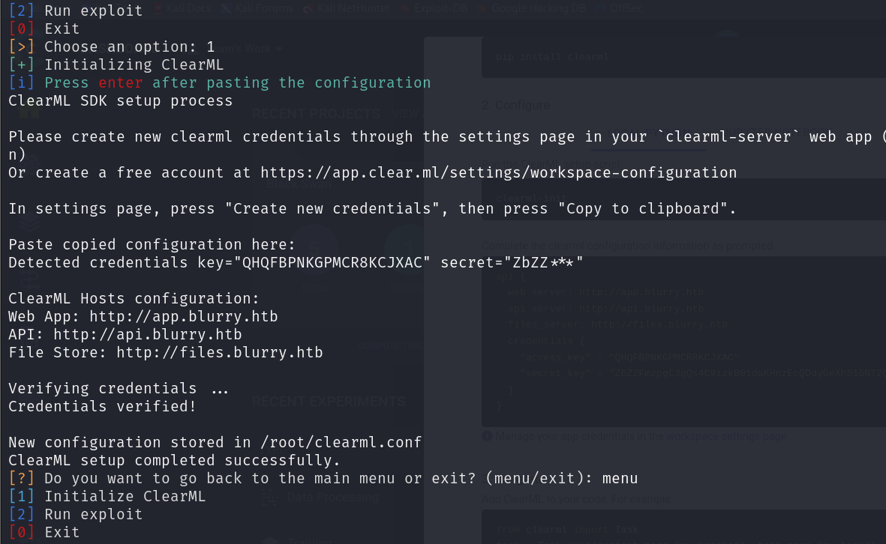
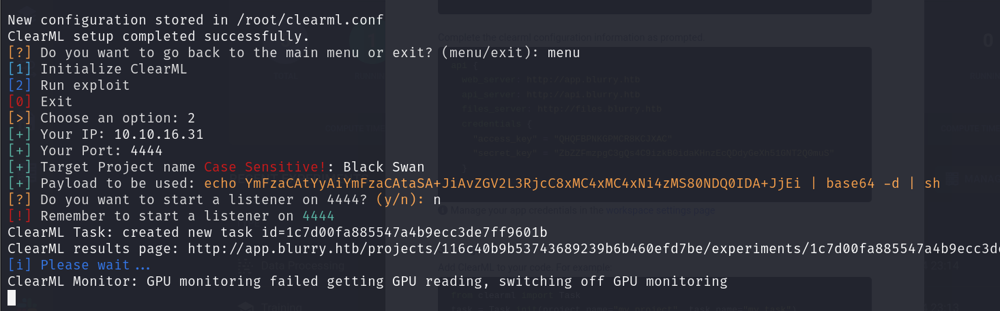
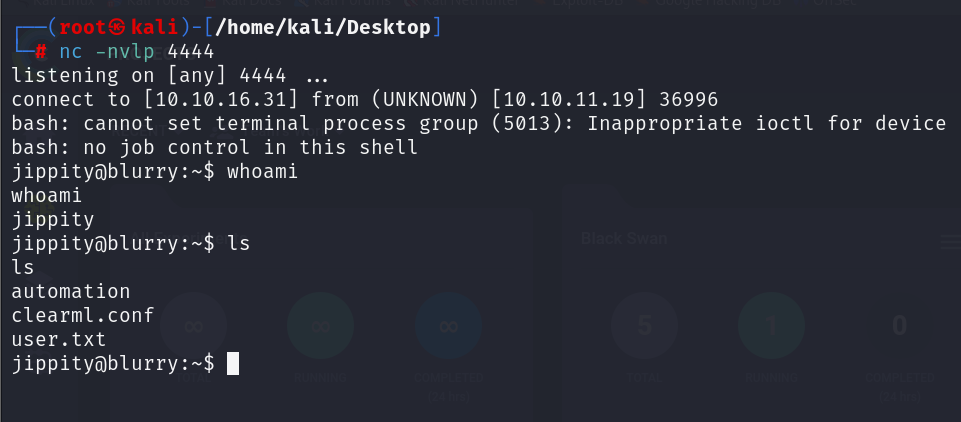
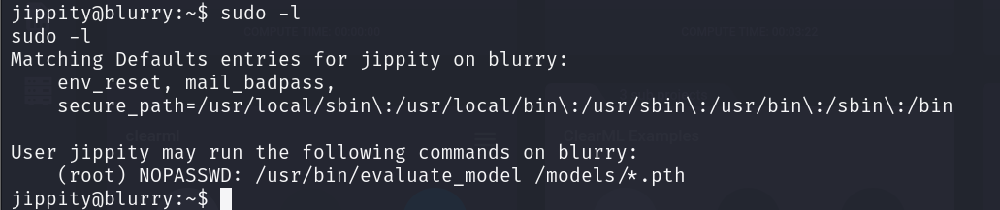
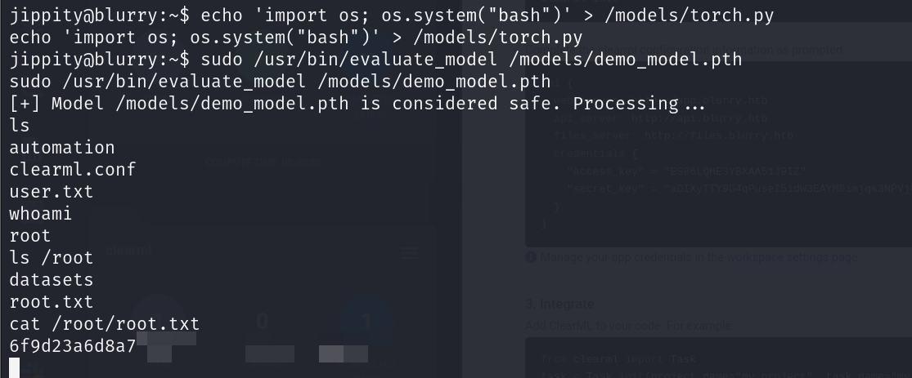

## Box Info

| OS | Linux |
| --- | --- |
| Difficulty | Medium |

## Basic Scan

### Nmap

```
nmap -A -O blurry.htb
```



开放端口：`22`、`80`

Web Server：`nginx 1.18.0`

### Dirsearch



### Subdomain Fuzzing



子域名：`app`、`files`、`chat`



app.blurry.htb👇


chat.blurry.htb👇


files.blurry.htb👇


## CVE-2024-24590

Github：[xffsec/CVE-2024-24590-ClearML-RCE-Exploit (github.com)](https://github.com/xffsec/CVE-2024-24590-ClearML-RCE-Exploit)

首先要在本地初始化`Clearml`



照着顺序，记得在`/etc/hosts`下添加api子域名

复制凭证




project里面有一个`Black Swan`来作为目标



nc监听获得shell



## Privilege Escalation



发现具有特殊权限的文件

可以使用`evaluate_model`去执行models下的pth后缀文件

这个思路非常牛b：[Blurry HTB Writeup (taipanbyte.ru)](https://blog.taipanbyte.ru/hackthebox/Blurry-HTB-Writeup#root-flag)

因为在`evaluate_model`里调用了`/models/evaluate_model.py`

```
cat /usr/bin/evaluate_model
#!/bin/bash
# Evaluate a given model against our proprietary dataset.
# Security checks against model file included.

if [ "$#" -ne 1 ]; then
    /usr/bin/echo "Usage: $0 <path_to_model.pth>"
    exit 1
fi

MODEL_FILE="$1"
TEMP_DIR="/opt/temp"
PYTHON_SCRIPT="/models/evaluate_model.py"  

/usr/bin/mkdir -p "$TEMP_DIR"

file_type=$(/usr/bin/file --brief "$MODEL_FILE")

# Extract based on file type
if [[ "$file_type" == *"POSIX tar archive"* ]]; then
    # POSIX tar archive (older PyTorch format)
    /usr/bin/tar -xf "$MODEL_FILE" -C "$TEMP_DIR"
elif [[ "$file_type" == *"Zip archive data"* ]]; then
    # Zip archive (newer PyTorch format)
    /usr/bin/unzip -q "$MODEL_FILE" -d "$TEMP_DIR"
else
    /usr/bin/echo "[!] Unknown or unsupported file format for $MODEL_FILE"
    exit 2
fi

/usr/bin/find "$TEMP_DIR" -type f \( -name "*.pkl" -o -name "pickle" \) -print0 | while IFS= read -r -d $'\0' extracted_pkl; do
    fickling_output=$(/usr/local/bin/fickling -s --json-output /dev/fd/1 "$extracted_pkl")

    if /usr/bin/echo "$fickling_output" | /usr/bin/jq -e 'select(.severity == "OVERTLY_MALICIOUS")' >/dev/null; then
        /usr/bin/echo "[!] Model $MODEL_FILE contains OVERTLY_MALICIOUS components and will be deleted."
        /bin/rm "$MODEL_FILE"
        break
    fi
done

/usr/bin/find "$TEMP_DIR" -type f -exec /bin/rm {} +
/bin/rm -rf "$TEMP_DIR"

if [ -f "$MODEL_FILE" ]; then
    /usr/bin/echo "[+] Model $MODEL_FILE is considered safe. Processing..."
    /usr/bin/python3 "$PYTHON_SCRIPT" "$MODEL_FILE"
fi
```

而在`/models/evaluate_model.py`的代码是这样的

```
cat /models/e*
import torch
import torch.nn as nn
from torchvision import transforms
from torchvision.datasets import CIFAR10
from torch.utils.data import DataLoader, Subset
import numpy as np
import sys

class CustomCNN(nn.Module):
    def __init__(self):
        super(CustomCNN, self).__init__()
        self.conv1 = nn.Conv2d(in_channels=3, out_channels=16, kernel_size=3, padding=1)
        self.conv2 = nn.Conv2d(in_channels=16, out_channels=32, kernel_size=3, padding=1)
        self.pool = nn.MaxPool2d(kernel_size=2, stride=2, padding=0)
        self.fc1 = nn.Linear(in_features=32 * 8 * 8, out_features=128)
        self.fc2 = nn.Linear(in_features=128, out_features=10)
        self.relu = nn.ReLU()

    def forward(self, x):
        x = self.pool(self.relu(self.conv1(x)))
        x = self.pool(self.relu(self.conv2(x)))
        x = x.view(-1, 32 * 8 * 8)
        x = self.relu(self.fc1(x))
        x = self.fc2(x)
        return x

def load_model(model_path):
    model = CustomCNN()
    
    state_dict = torch.load(model_path)
    model.load_state_dict(state_dict)
    
    model.eval()  
    return model

def prepare_dataloader(batch_size=32):
    transform = transforms.Compose([
        transforms.RandomHorizontalFlip(),
        transforms.RandomCrop(32, padding=4),
        transforms.ToTensor(),
        transforms.Normalize(mean=[0.4914, 0.4822, 0.4465], std=[0.2023, 0.1994, 0.2010]),
    ])
    
    dataset = CIFAR10(root='/root/datasets/', train=False, download=False, transform=transform)
    subset = Subset(dataset, indices=np.random.choice(len(dataset), 64, replace=False))
    dataloader = DataLoader(subset, batch_size=batch_size, shuffle=False)
    return dataloader

def evaluate_model(model, dataloader):
    correct = 0
    total = 0
    with torch.no_grad():  
        for images, labels in dataloader:
            outputs = model(images)
            _, predicted = torch.max(outputs.data, 1)
            total += labels.size(0)
            correct += (predicted == labels).sum().item()
    
    accuracy = 100 * correct / total
    print(f'[+] Accuracy of the model on the test dataset: {accuracy:.2f}%')

def main(model_path):
    model = load_model(model_path)
    print("[+] Loaded Model.")
    dataloader = prepare_dataloader()
    print("[+] Dataloader ready. Evaluating model...")
    evaluate_model(model, dataloader)

if __name__ == "__main__":
    if len(sys.argv) < 2:
        print("Usage: python script.py <path_to_model.pth>")
    else:
        model_path = sys.argv[1]  # Path to the .pth file
        main(model_path)
```

可以看到`evaluate_model.py`中导入了几个包

默认情况下，Python 在导入模块时会先检查当前工作目录或脚本所在目录下是否有同名文件或模块

如果 `torch.py` 存在并且在导入时优先被加载，就会执行其中的代码。由于你在 `torch.py` 中直接调用了 `os.system("bash")`，导致直接启动了一个 Bash Shell



## Summary

虽然网上有其他的wp，但是这个提升权限的思路应该是最简单的

利用文件覆盖导入执行，应该算是python语言的特性问题

说实话，这种思路真的一般想不到
