## Box Info

| OS | Linux |
| --- | --- |
| Difficulty | Easy |

## Basic Scan

### Nmap

```
nmap -A -O sightless.htb
```

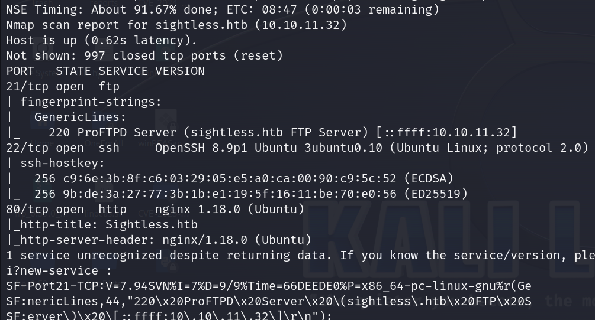

开放端口：`21`、`22`、`80`

Web服务器：`nginx 1.18.0`

FTP服务器：`ProFTPD`

### Dirsearch

```
dirsearch -u sightless.htb -t 50
```

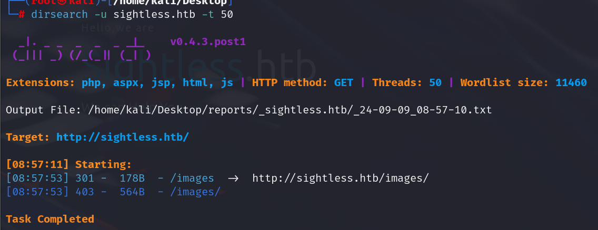

### Gobuster

```
gobuster dir -u http://sightless.htb/ -w /usr/share/wordlists/dirbuster/directory-list-2.3-medium.txt -t 50
```

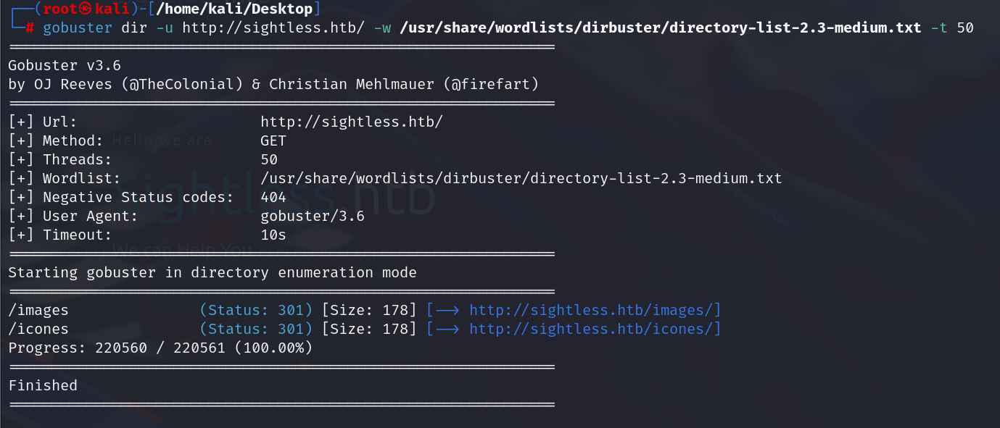

## CVE-2022-0944

在网页中发现一个`sqlpad`子域名，似乎可以进行sql操作，但是靶机的3306端口是关闭的

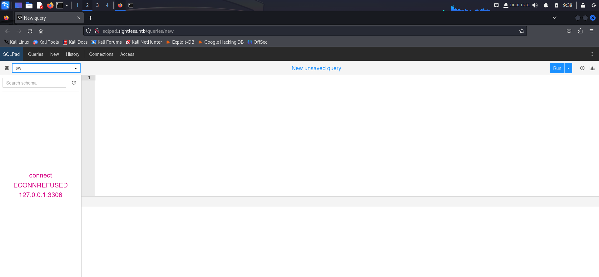

在右上角点击发现SQLpad的相关信息：`6.10.0`

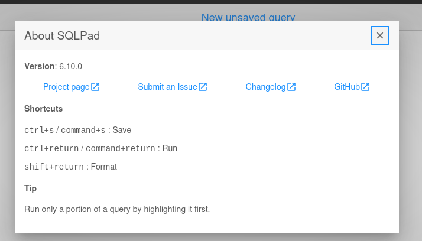

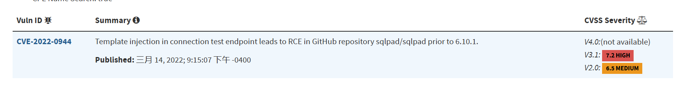

Github：[worm-403/scripts (github.com)](https://github.com/worm-403/scripts)

只需要指定攻击机的IP和端口即可

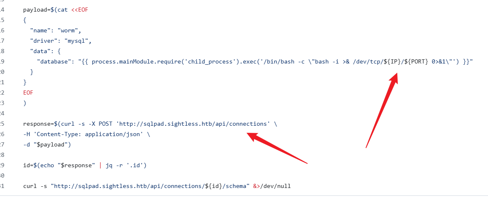

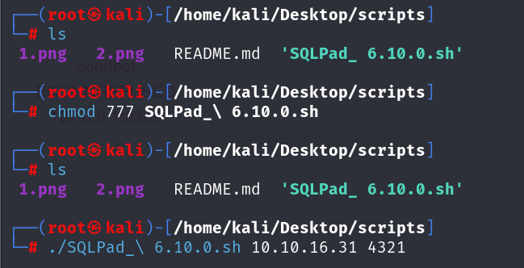

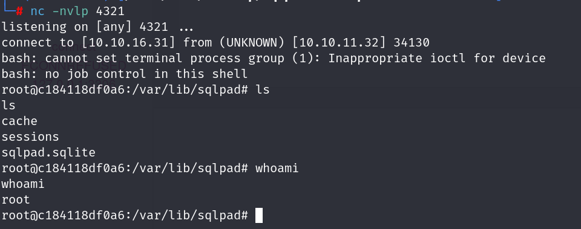

在root用户下并没有找到东西

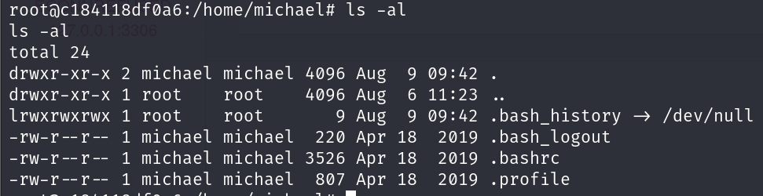

在`/etc/shadow`，中发现michael的密码hash

使用`hashcat`爆破

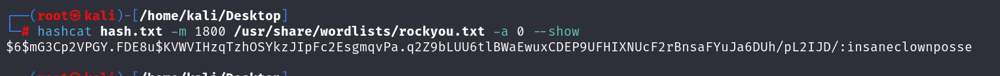

登录michael的账号获得`user.txt`

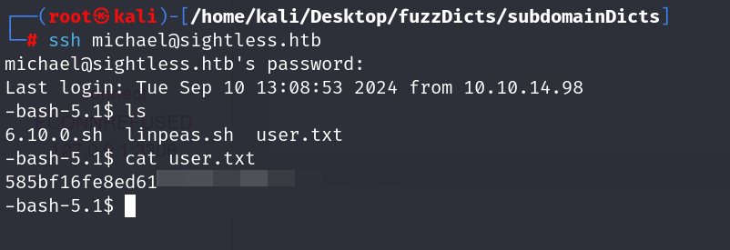

现在的问题是，反弹获得的shell虽然是root权限，但是一部分指令是无法执行的

## Privilege Escalation

上传`linpeas`，发现bash似乎可以用来提权

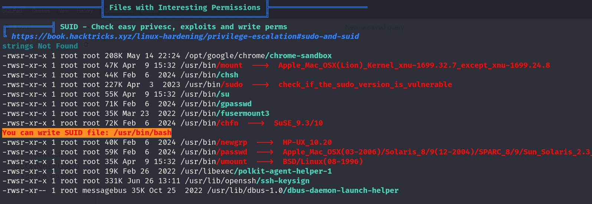

相关文章：[Linux提权————利用SUID提权\_bash提权-CSDN博客](https://blog.csdn.net/Fly_hps/article/details/80428173)

这些命令都有root权限

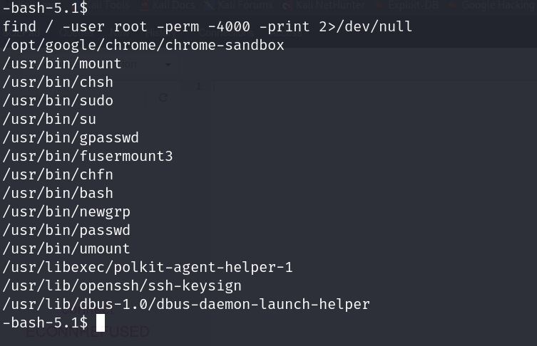

使用bash开启新的shell进程，即可看到权限是root

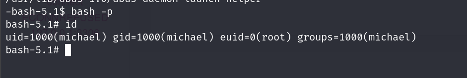

获取到root.txt

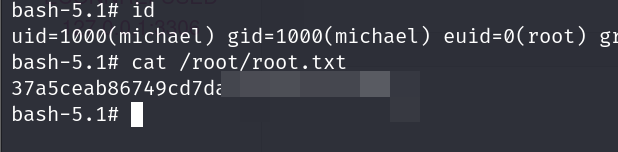

## Summary

总体来说比较简单

涉及到一点Linux提权
