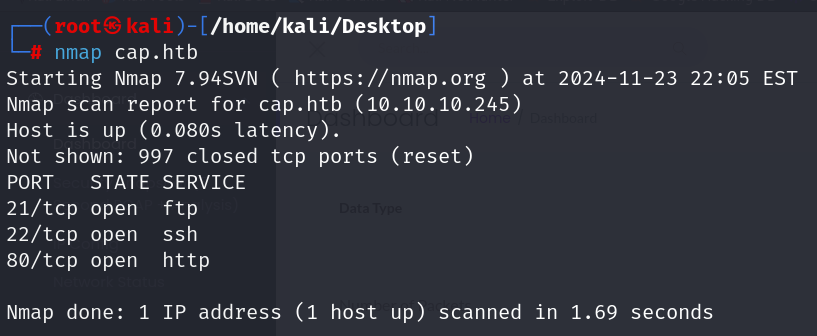
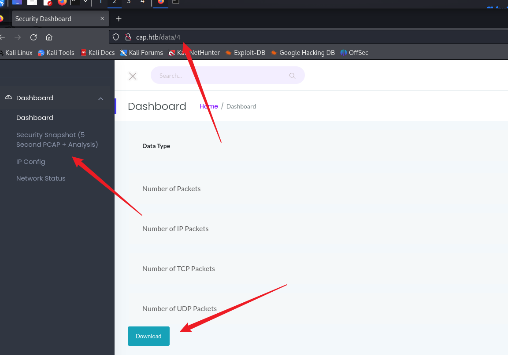
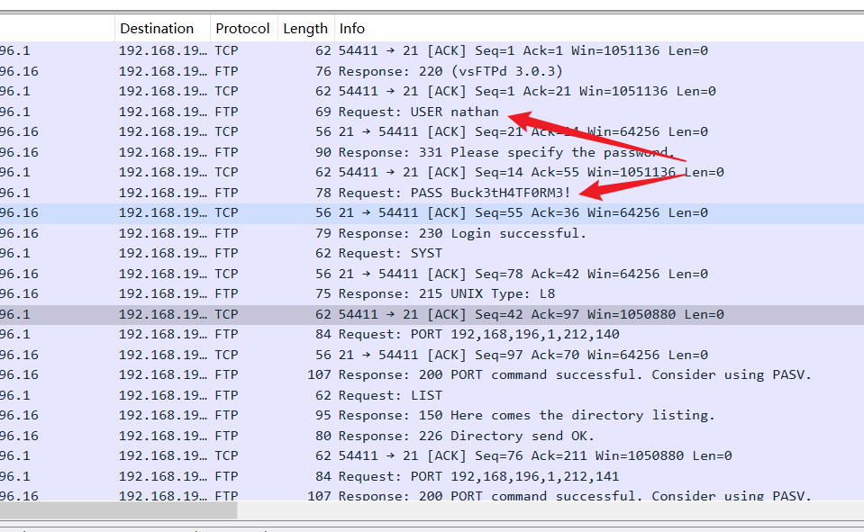
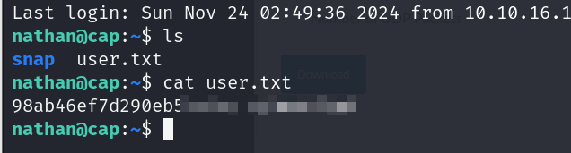
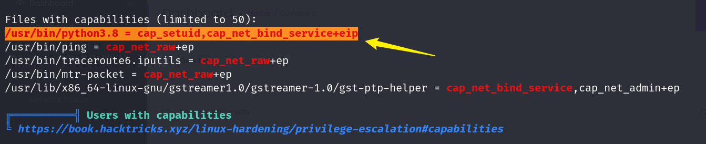
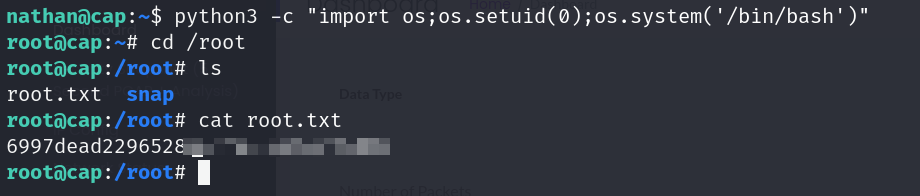

## Box Info

| OS | Linux |
| --- | --- |
| Difficulty | Easy |

## User.txt



进入网页，点击`Security Snapshot`，可以看到url进入到了`/data/4`，下面存在download路由，将其下载下来，并没有任何东西



尝试遍历`/data`目录下的数字，在`/data/0`发现不同的文件

使用`wireshark`进行查看，发现在`FTP`协议中存在账户信息明文泄露



```
user: nathan
pass: Buck3tH4TF0RM3!
```

可以使用ssh直接登录，获取到user.txt



## Root.txt

上传`linpeas.sh`



在`Files with capabilities`，中发现`python3.8`这个文件中可以使用`setuid`来进行切换用户

那么可以将uid设置为0（root的uid通常为0），然后去执行bash

```
python3 -c "import os;os.setuid(0);os.system('/bin/bash')"
```



## Summary

这个Cap机器确实简单哈，好久没打HTB的靶机了，前段时间又在打CTF，最新的靶机感觉难度又比较高。
