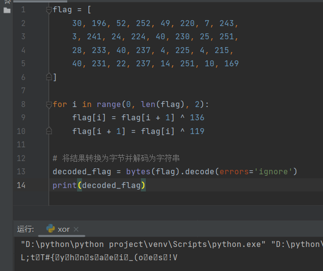
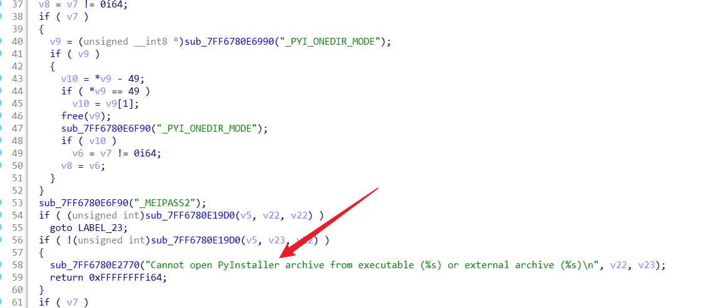

## 世界上最棒的程序员

Shift+F12，在全局字符串中查找到flag


## ez\_XOR

使用32位IDA打开，F5查看伪代码


可以看到存在字符串输入后进行异或，异或是可逆性的

跟进查看XOR函数的内容，很明显是每个字符和9进行异或


```
s='E`}J]OrQF[V8zV:hzpV}fVF[t'
for i in s:
    print(chr(ord(i)^9),end='')
#LitCTF{XOR_1s_3asy_to_OR}
```

## enbase64

F5查看伪代码


可以看到输入字符串长度是33，然后进入Base64加密，最后再进行check


由于Source不是标准的Base64表，这个可以在Base64函数里看到有个Basechange，对表做了修改


可以让AI跑一个脚本，注意了这里有一位是没有赋值的，也就是v3\[33\]


```
v3 = [
    16, 34, 56, 7, 46, 2, 10, 44, 20, 41,
    59, 31, 51, 60, 61, 26, 5, 40, 21, 38,
    4, 54, 52, 47, 3, 11, 58, 48, 32, 15,
    49, 14, 37, 0, 55, 53, 24, 35, 18, 25,
    33, 43, 50, 39, 12, 19, 13, 42, 9, 17,
    28, 30, 23, 36, 1, 22, 57, 63, 8, 27,
    6, 62, 45, 29
]

source = "ABCDEFGHIJKLMNOPQRSTUVWXYZabcdefghijklmnopqrstuvwxyz0123456789+/"
for i in range(48):
    # 创建一个临时列表，用于存储置换后的字符
    temp = [''] * 64
    # 遍历索引数组，按照索引交换字符
    for j in range(64):
        temp[j] = source[v3[j]]
    # 将临时列表赋值给原始字符串
    source = ''.join(temp)  # 直接将列表转换为字符串
print(source)
#gJ1BRjQie/FIWhEslq7GxbnL26M4+HXUtcpmVTKaydOP38of5v90ZSwrkYzCAuND
```

进入赛播厨师，换表就能得到flag


## snake

附件给的是一个pyc文件，不能用IDA来进行反编译

- [pycdc配置和使用-CSDN博客](https://blog.csdn.net/m0_73644864/article/details/135038499)


- [Python 什么是Bad Magic Number错误|极客笔记 (deepinout.com)](https://deepinout.com/python/python-qa/282_python_whats_the_bad_magic_number_error.html)

在Python中，每个.pyc文件（即Python字节码文件）都包含一个魔术数字（Magic Number）来识别版本兼容性。当我们尝试加载一个.pyc文件时，Python会检查文件中的魔术数字是否与当前[  
解释器](https://deepinout.com/python/python-qa/282_python_whats_the_bad_magic_number_error.html#)版本匹配。如果不匹配，就会引发Bad Magic Number错误。

查看文件头发现什么都没有


结合文件名的37，猜测python版本应该是3.7

- [Python逆向全版本MagicNumber表\_python3.11.4 magicnumber-CSDN博客](https://blog.csdn.net/OrientalGlass/article/details/134612786)

反编译后可以看到，分数超过1000就有flag


直接复制他的代码会乱码，指定编码也没用



细看他的赋值逻辑是有问题的，后值在使用前值的时候，前值是已经被修改过的，这样就会导致不准确

```
flag = [
    30, 196, 52, 252, 49, 220, 7, 243,
    3, 241, 24, 224, 40, 230, 25, 251,
    28, 233, 40, 237, 4, 225, 4, 215,
    40, 231, 22, 237, 14, 251, 10, 169
]

for i in range(0, len(flag), 2):
    temp=flag[i]
    flag[i] = flag[i + 1] ^ 136
    flag[i + 1] = temp ^ 119

# 将结果转换为字节并解码为字符串
decoded_flag = bytes(flag).decode(errors='ignore')
print(decoded_flag)

#LitCTF{python_snake_is_so_easy!}
```

## 程序和人有一个能跑就行了


这个`sub_4015A0`函数可以让AI进行分析，符合RC4加密的特征

在底部代码里存在逻辑错误，无论是否比较成功，都会输出`U are right?`


可以打个断点看看过程


使用windows的debugger


这里是一些IDA的使用技巧


多次步过之后发现一段字节，可能是密文


```
.text:00475BBA mov     byte ptr [esp+83h], 8Dh
.text:00475BC2 mov     byte ptr [esp+84h], 6Ch ; 'l'
.text:00475BCA mov     byte ptr [esp+85h], 85h
.text:00475BD2 mov     byte ptr [esp+86h], 76h ; 'v'
.text:00475BDA mov     byte ptr [esp+87h], 32h ; '2'
.text:00475BE2 mov     byte ptr [esp+88h], 72h ; 'r'
.text:00475BEA mov     byte ptr [esp+89h], 0B7h
.text:00475BF2 mov     byte ptr [esp+8Ah], 43h ; 'C'
.text:00475BFA mov     byte ptr [esp+8Bh], 85h
.text:00475C02 mov     byte ptr [esp+8Ch], 7Bh ; '{'
.text:00475C0A mov     byte ptr [esp+8Dh], 85h
.text:00475C12 mov     byte ptr [esp+8Eh], 0DEh
.text:00475C1A mov     byte ptr [esp+8Fh], 0C1h
.text:00475C22 mov     byte ptr [esp+90h], 0FBh
.text:00475C2A mov     byte ptr [esp+91h], 2Eh ; '.'
.text:00475C32 mov     byte ptr [esp+92h], 64h ; 'd'
.text:00475C3A mov     byte ptr [esp+93h], 7
.text:00475C42 mov     byte ptr [esp+94h], 0C8h
.text:00475C4A mov     byte ptr [esp+95h], 5Fh ; '_'
.text:00475C52 mov     byte ptr [esp+96h], 9Ah
.text:00475C5A mov     byte ptr [esp+97h], 35h ; '5'
.text:00475C62 mov     byte ptr [esp+98h], 18h
.text:00475C6A mov     byte ptr [esp+99h], 0ADh
.text:00475C72 mov     byte ptr [esp+9Ah], 0B5h
.text:00475C7A mov     byte ptr [esp+9Bh], 15h
.text:00475C82 mov     byte ptr [esp+9Ch], 92h
.text:00475C8A mov     byte ptr [esp+9Dh], 0BEh
.text:00475C92 mov     byte ptr [esp+9Eh], 1Bh
.text:00475C9A mov     byte ptr [esp+9Fh], 88h
.text:00475CA2 call    memcmp
```

然后让AI跑一个脚本即可

```
from Crypto.Cipher import ARC4
# 密钥和密文
key = b'litctf'
ciphertext = bytes([0x8D, 0x6C, 0x85, 0x76, 0x32, 0x72, 0xB7, 0x43, 0x85, 0x7B,
                    0x85, 0xDE, 0xC1, 0xFB, 0x2E, 0x64, 0x07, 0xC8, 0x5F,
                    0x9A, 0x35, 0x18, 0xAD, 0xB5, 0x15, 0x92, 0xBE, 0x1B, 0x88])
# 创建RC4解密器
cipher = ARC4.new(key)
# 解密
plaintext = cipher.decrypt(ciphertext)
# 输出结果
print(plaintext.decode('utf-8', errors='ignore'))

#LitCTF{welcome_to_the_litctf}
```

## debase64

题目是和Base64相关的

首先注意到v15的长度必须是20


`sub_401520`这个函数的功能类似于对v13进行解密，然后结果存到v4中


最后对比v4的内容是否正确，这里可以看到比较的步长是2，而那几个数字可以使用十六进制表示，从而分成两个部分

对v6打个断点进行调试


可以注意到18ED才是6381，所以十六进制的两个字节需要置换


```
import base64
data=[0x46, 0xed, 0x18, 0x96, 0x56, 0x9E, 0xd2, 0x72, 0xb2, 0xb3, 0x80, 0x70]
bytes_encoded = bytes(data)
decoded_bytes = base64.b64encode(bytes_encoded).decode('utf-8')
print(decoded_bytes)

#Ru0Yllae0nKys4Bw
```

但是加密结果需要每四个字节进行逆序，看别人的文章似乎是伪代码中的Base64加密过程并不标准，也或许是因为程序的大端序存储。

根据题目描述进行MD5爆破，得到flag

```
from hashlib import md5
import string

s = "Y0uReallyKn0wB4s"
for i in string.printable:
    test = s + i + "==="
    if md5(test.encode()).hexdigest() == "5a3ebb487ad0046e52db00570339aace":
        print(test)
        break
#NSSCTF{Y0uReallyKn0wB4s3===}
```

## For Aiur

使用64位IDA进行反编译，能够看出似乎是由pyinstaller进行打包的EXE文件



反编译工具

- [extremecoders-re/pyinstxtractor: PyInstaller Extractor (github.com)](https://github.com/extremecoders-re/pyinstxtractor)


对`Probee.pyc`进行反编译，从ch中引入了check函数


这里有个注意点，需要使用python3.8版本，不然会找不到这个ch文件

```
enc = [
    98, 77, 94, 91, 92, 107, 125, 66, 87, 70,
    113, 92, 83, 70, 85, 81, 19, 21, 109, 99,
    87, 107, 127, 65, 65, 64, 109, 87, 93, 90,
    65, 64, 64, 65, 81, 3, 109, 85, 86, 80,
    91, 64, 91, 91, 92, 0, 94, 107, 66, 77,
    94, 91, 92, 71
]

def check(num):
    flag = 'LitCTF{'
    if num % 2 == 0 and num % 4 == 0 and num % 6 == 0 and num % 8 == 0 and num % 12 == 0 and num % 13 == 11:
        k = str(num)
        for i in range(len(enc)):
            flag += chr(ord(k[i % len(k)]) ^ enc[i])
        flag += '}'
    print(flag)
    
check(24)
#LitCTF{Pylon_OverCharge!!_We_Must_construc7_addition4l_pylons}
```
