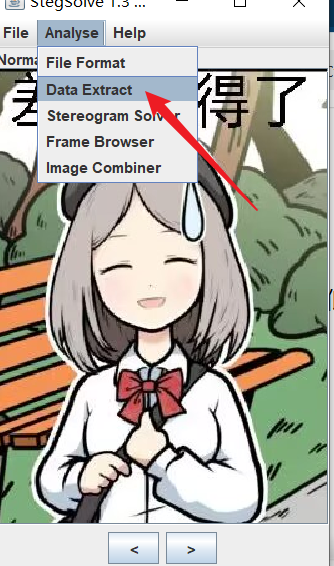
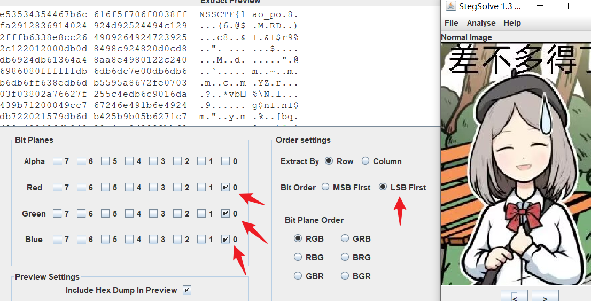
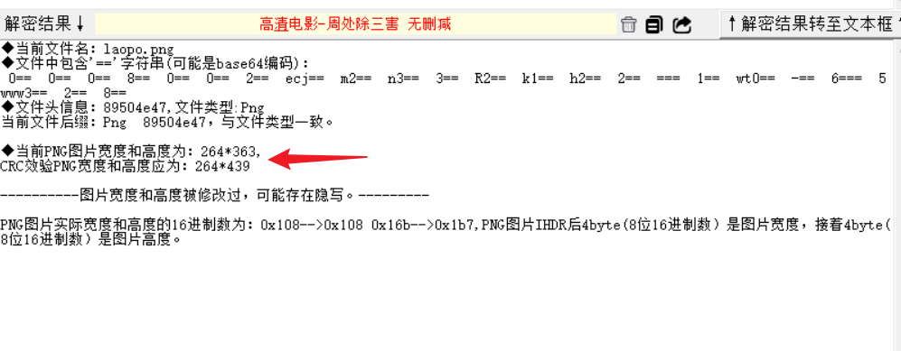
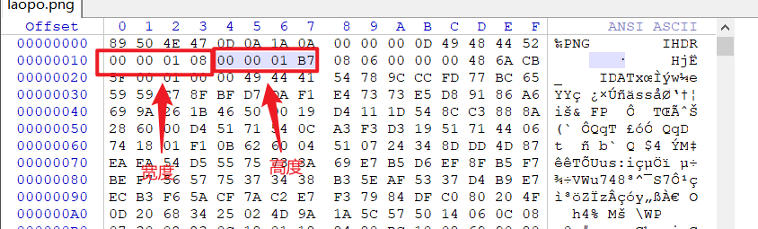
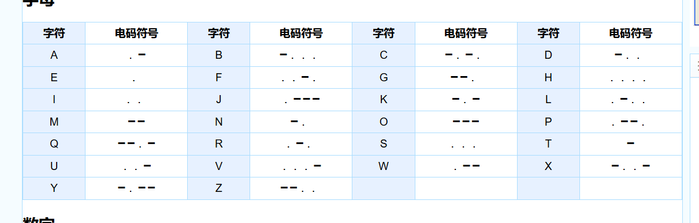
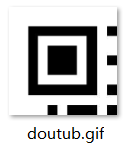
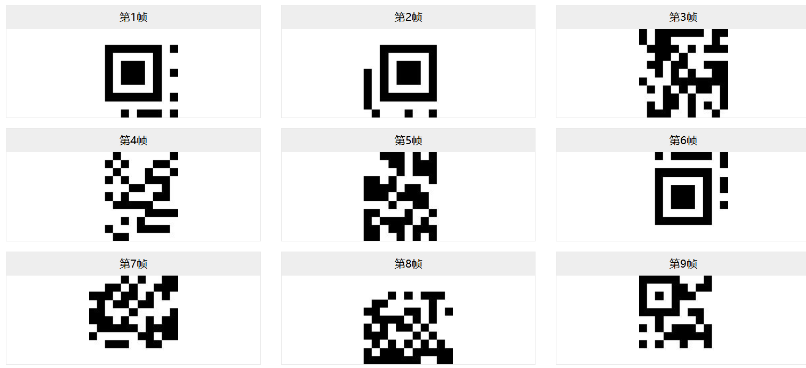
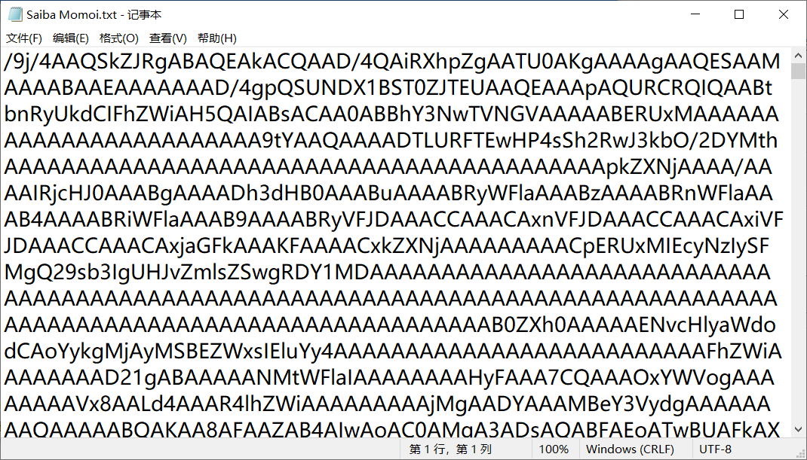
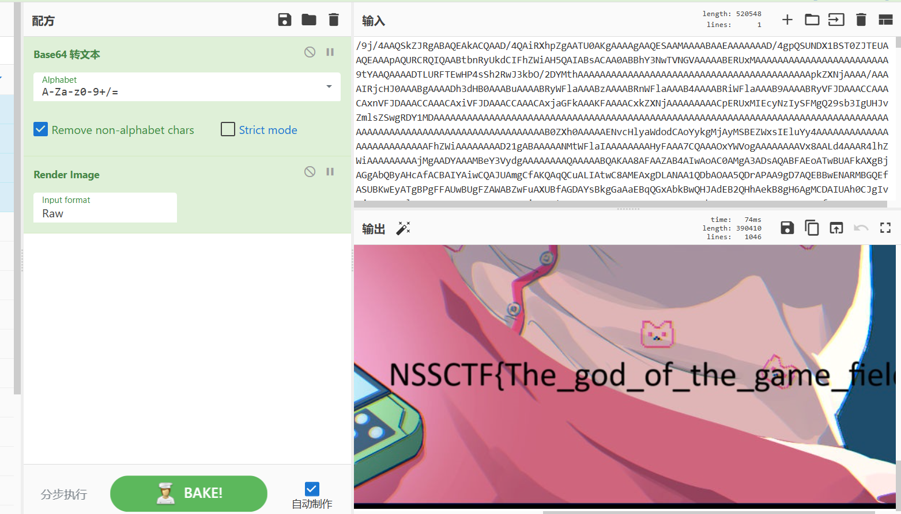

## 少年的ctf奇遇

考点：LSB隐写、图片宽高修改

```
题目描述：你说了图片里的一句话，老婆露出了这个表情。
```


### LSB隐写原理

LSB即为**最低有效位**，图片中的图像像素一般是由RGB三原色（红绿蓝）组成

每一种颜色占用8位，取值范围为0x00~0xFF，即有256种颜色，一共包含了256的3次方的颜色

而人的眼睛能够区分的颜色是有限的，LSB隐写就是修改RGB颜色分量的最低二进制位也就是最低有效位

### StegSolve

这里使用的是StegSolve工具，载入图片选用**数据提取分析**





```
得到部分flag：NSSCTF{lao_po
```

### 宽高调整

这里使用**随波逐流**工具



可以看到高度和编码里的不一致，需要调整

打开winhex或者010editor都行，我这里用的是winhex

如图修改高度为`01B7`，也就是439



保存之后再打开图片

```
后半段：_s0_cute!}
```


## 一段有规律的声音

答案格式为一串能连成话的简单英语主谓宾句子请所有字母全部大写,空格用\_代替后包裹NSSCTF{}(提示：不止一种解法)

一个音频里全是重复性的两种声音，不难想象到是摩斯密码的长短性

```
・・・—・・— — —・・・—・—・— — — — — ・・—
```

提示说能组成一句简单的英语主谓宾句子



经过尝试得到明文

```
・・/・—・・/— — —/・・・—/・/—・— — /— — —/ ・・—/
I LOVE YOU
```

## ez-QR

从题目来看是一道二维码的题目

给的附件是一个GIF动图，会循环展示这个二维码的每个部分



- [在线GIF图片帧拆分工具 - UU在线工具 (uutool.cn)](https://uutool.cn/gif2img/)

将其拆分得到九个部分



弄一个画布进去拼接就好了，根据边角的空隙来判断

- [在线画图软件\_免费画图工具 - Canva可画](https://www.canva.cn/draw/)


```
flag：NSSCTF{123fgh789okm}
```

## 怎么全是01，我flag呢

我flag呢？我不到啊，滴滴答滴哒哒哒（提示：想想文件的本质是什么）

```
111111111111000011100111111111111100000111111001111111111111100000000011000000111001100001110011000110011001100000000011100000000011000000111001100001110011000110011001100000000011100111111011001100000110000111000011111000000001101111110011100111111011001100000110000111000011111000000001101111110011100111111011000011111000011001111100110111111001101111110011100111111011000011111000011001111100110111111001101111110011100111111011001100111000011001001111111111111001101111110011100111111011001100111000011001001111111111111001101111110011100000000011001100100001111001111111000000000001100000000011111111111111001100100110011001001100110110011001111111111111111111111111001100100110011001001100110110011001111111111111000000000000000011000111100000111100001000000000000000000000000000000000000011000111100000111100001000000000000000000000011000011011001100011000000110110011001110011110011100110000011000011011001100011000000110110011001110011110011100110000011000011100001111011111100111001100110001100110010000110000011000011100001111011111100111001100110001100110010000110000111000011011110000011111100000110000000111100000000000110000100001100000000000000001100110111100111111100110010000000000100001100000000000000001100110111100111111100110010000000000000001100111001100111001100111001111111110000001111111110011000001100111001100111001100111001111111110000001111111110011011001100000111100111110011000000011000001111110000000110011011001100000111100111110011000000011000001111110000000110011100000011111001100011110000000110011000001100000001100111100100000011111001100011110000000110011000001100000001100111100111000000000110011100111111001000011111110000110011111000011111000000000110011100111111001000011111110000110011111000011100000011111001111100000000000111100001110000111111111000000111110000100110000111000011111001100110001111000010000110000111110000100110000111000011111001100110001111000010000110000000111100011110000111000000111110000001001100000010000110000000111100011110000111000000111110000001001100000010000110000111001111000110000000001111001001100111000011110001100001100111001111000110000000001111001001100111000011110001100001100011000011011110011111110011110000011001110011001101100111111011000011011110011111110011110000011001110011001101100111111111001111000001111100001111110111111110111100110010000111111000111111111111100011110000001001100110111111110010000111100000111111111111100011110000001001100110111111110010000111100000110011100001100111111111000110000001111100110001111000000000110011100001100111111111000110000001111100110001111000000111110011111110011011001100000001111111000011111111111001100111110011111110011011001100000001111111000011111111111001100000000000000001111000001111001110000001110011000001100110000000000000000001111000001111001110000001110011000001100110000111111111111000011011000011111110000001000011001101100110000111111111111000011011000011111110000001000011001101100110000100000000011000000000000011000001111111000011000001100001100100111111011001100111000000110000011110000011111111111111111100111111011001100111000000110000011110000011111111111111111100111111011000011100111111110111111000001111111100000111100100111111011000011100111111110111111000001111111100000111100100111111011000011111111111111000011001001100111101111110000100111111011000011111111111111000011001001100111101111110000100000000011001100100000011111000011111001111000011100000000100000000011001100100000011111000011111001111000011100000000111111111111000000000111100001000000111111111000010000000011111111111111000000000111100001000000111111111000010000000011
```

因为只有01，并且要改变文件格式，这里还是考虑转换成二维码的形式

字符串的长度总共是`3600`，可以将宽高设置为60×60

```
from PIL import Image

WIDTH = 60
HEIGHT = 60   
pic = Image.new("RGB", (WIDTH, HEIGHT))
str = "111111111111000011100111111111111100000111111001111111111111100000000011000000111001100001110011000110011001100000000011100000000011000000111001100001110011000110011001100000000011100111111011001100000110000111000011111000000001101111110011100111111011001100000110000111000011111000000001101111110011100111111011000011111000011001111100110111111001101111110011100111111011000011111000011001111100110111111001101111110011100111111011001100111000011001001111111111111001101111110011100111111011001100111000011001001111111111111001101111110011100000000011001100100001111001111111000000000001100000000011111111111111001100100110011001001100110110011001111111111111111111111111001100100110011001001100110110011001111111111111000000000000000011000111100000111100001000000000000000000000000000000000000011000111100000111100001000000000000000000000011000011011001100011000000110110011001110011110011100110000011000011011001100011000000110110011001110011110011100110000011000011100001111011111100111001100110001100110010000110000011000011100001111011111100111001100110001100110010000110000111000011011110000011111100000110000000111100000000000110000100001100000000000000001100110111100111111100110010000000000100001100000000000000001100110111100111111100110010000000000000001100111001100111001100111001111111110000001111111110011000001100111001100111001100111001111111110000001111111110011011001100000111100111110011000000011000001111110000000110011011001100000111100111110011000000011000001111110000000110011100000011111001100011110000000110011000001100000001100111100100000011111001100011110000000110011000001100000001100111100111000000000110011100111111001000011111110000110011111000011111000000000110011100111111001000011111110000110011111000011100000011111001111100000000000111100001110000111111111000000111110000100110000111000011111001100110001111000010000110000111110000100110000111000011111001100110001111000010000110000000111100011110000111000000111110000001001100000010000110000000111100011110000111000000111110000001001100000010000110000111001111000110000000001111001001100111000011110001100001100111001111000110000000001111001001100111000011110001100001100011000011011110011111110011110000011001110011001101100111111011000011011110011111110011110000011001110011001101100111111111001111000001111100001111110111111110111100110010000111111000111111111111100011110000001001100110111111110010000111100000111111111111100011110000001001100110111111110010000111100000110011100001100111111111000110000001111100110001111000000000110011100001100111111111000110000001111100110001111000000111110011111110011011001100000001111111000011111111111001100111110011111110011011001100000001111111000011111111111001100000000000000001111000001111001110000001110011000001100110000000000000000001111000001111001110000001110011000001100110000111111111111000011011000011111110000001000011001101100110000111111111111000011011000011111110000001000011001101100110000100000000011000000000000011000001111111000011000001100001100100111111011001100111000000110000011110000011111111111111111100111111011001100111000000110000011110000011111111111111111100111111011000011100111111110111111000001111111100000111100100111111011000011100111111110111111000001111111100000111100100111111011000011111111111111000011001001100111101111110000100111111011000011111111111111000011001001100111101111110000100000000011001100100000011111000011111001111000011100000000100000000011001100100000011111000011111001111000011100000000111111111111000000000111100001000000111111111000010000000011111111111111000000000111100001000000111111111000010000000011"
i = 0

for y in range(0, HEIGHT):
    for x in range(0, WIDTH):
        if (str[i] == '1'):
            pic.putpixel((x, y), (0, 0, 0))
        else:
            pic.putpixel((x, y), (255, 255, 255))
        i += 1

pic.save("flag.png")
```


```
NSSCTF{a51f0b9fb5fd47ca14332fa1acab352e}
```

## 从千年真理部到游戏开发部day1

什么游戏叫base啊？我要玩游戏o(╥﹏╥)o，怎么玩游戏还要了解base编码，好难啊，苦呀西~


看似是Base64加密，解密出来就是一段歌词，没有密码的痕迹

搜索的到Base64编码也有隐写

- [\[MISC\]Base64隐写-CSDN博客](https://blog.csdn.net/Sanctuary1307/article/details/113836907)

```
# base64隐写
import base64

def get_diff(s1, s2):
    base64chars = 'ABCDEFGHIJKLMNOPQRSTUVWXYZabcdefghijklmnopqrstuvwxyz0123456789+/'
    res = 0
    for i in range(len(s2)):
        if s1[i] != s2[i]:
            return abs(base64chars.index(s1[i]) - base64chars.index(s2[i]))
    return res

def b64_stego_decode():
    file = open("game.txt", "rb")
    x = ''  # x即bin_str
    lines = file.readlines()
    for line in lines:
        l = str(line, encoding="utf-8")
        stego = l.replace('\n', '')
        # print(stego)
        realtext = base64.b64decode(l)
        # print(realtext)
        realtext = str(base64.b64encode(realtext), encoding="utf-8")
        # print(realtext)
        diff = get_diff(stego, realtext)  # diff为隐写字串与实际字串的二进制差值
        n = stego.count('=')
        if diff:
            x += bin(diff)[2:].zfill(n * 2)
        else:
            x += '0' * n * 2

    i = 0
    flag = ''
    while i < len(x):
        if int(x[i:i + 8], 2):
            flag += chr(int(x[i:i + 8], 2))
        i += 8
    print(flag)

if __name__ == '__main__':
    b64_stego_decode()

#game,G@mee
```

使用密码：`game,G@mee`



比较明显的图片特征，拿到赛博厨师里面



```
NSSCTF{The_god_of_the_game_field}
```
